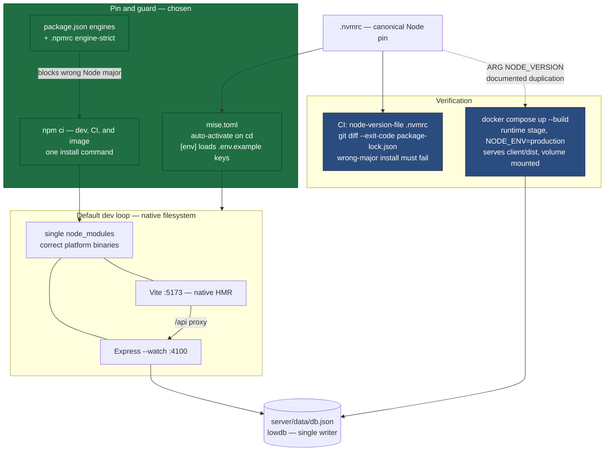

# ADR-0004: Pin-and-Guard the Developer Environment on the Host, Not in a Container

## Context and Problem Statement

The Outfitter's onboarding story is `npm install` followed by `npm run dev` — two commands that implicitly assume the developer's machine already has the right Node major, a clean lockfile-consistent `node_modules`, and the handful of environment variables the app reads (`PORT`, `NODE_ENV`, `CORS_ORIGIN`, `VITE_API_URL`) either unset or set correctly. Nothing in the repo enforces any of that. `.nvmrc` pins Node 20, CI hardcodes `node-version: "20"`, and both `Dockerfile` stages pin `node:20-alpine` — but nothing reads `.nvmrc` automatically, no `engines` field exists in any of the three `package.json` files, and the machine this ADR was authored on resolves `node` to v24.13.1. The README tells developers to run `npm install` while CI and the production image run `npm ci`, so a developer's local install can silently mutate `package-lock.json` in a way that surfaces only as a CI failure on someone else's pull request.

The obvious industry-standard answer is to containerize development. That answer is load-bearing when the environment has dependencies that are hard to install and pin per-machine — a database, a cache, a native compilation toolchain, a service emulator. This app has none: its entire runtime dependency set is `express`, `cors`, `express-rate-limit`, `cross-env`, and `lowdb`, and lowdb is a JSON file on disk rather than a service.

What is the smallest mechanism that makes the developer environment reproducible and self-enforcing, given that the reproducibility gap here is confined to the Node toolchain and the lockfile?

## Decision Drivers

* **Reproducibility across machines.** Node major, npm version, and the installed dependency tree should be a property of the repo, not of whatever the contributor's shell happens to resolve — today they are not.
* **Enforcement, not documentation.** `.nvmrc` already records the right answer and is already being ignored. A second advisory file solves nothing; the mechanism has to fail loudly on the wrong toolchain.
* **Lockfile integrity.** Dev must not use a different install command (`npm install`) than CI and the production image (`npm ci`), or lockfile drift becomes a CI-only failure mode.
* **Single source of truth for the version pin.** The Node major is currently written in four places (`.nvmrc`, `.github/workflows/ci.yml`, and twice in `Dockerfile`). Adding a fifth without consolidating makes drift more likely, not less.
* **Preserve the HMR loop.** ADR-0003's justification for Vite is instant feedback on an interactive builder UI. Any environment change that makes filesystem watching slower or less reliable directly attacks the reason that tool was chosen.
* **Preserve editor tooling.** ESLint, the TypeScript language service, test runners, and "go to definition" into dependencies all resolve against a host `node_modules`. Any solution that moves the dependency tree off the host either breaks them or forces a second tree.
* **Low ongoing maintenance and a low contribution floor.** This is a small fan-made project with no dedicated tooling owner. The environment definition must not become a second codebase, and it should not raise the bar for a drive-by contributor.
* **Zero system-level dependencies today.** No database, no cache, no queue, no native compilation, no OS-level tools. This is the specific condition under which containerized development pays the least.
* **Platform-specific binaries exist in the tree.** Vite pulls in `esbuild` and Rollup, both shipping per-platform native binaries. Any solution that shares one `node_modules` across differing libc/arch boundaries will break in a way whose error message does not name the cause.

## Considered Options

* Status quo — `npm install` + `npm run dev`, with `.nvmrc` as advisory documentation
* **Pin and guard on the host** — version manager (`mise`) + `engines` + `engine-strict` + `npm ci` + `.env.example`
* Docker Compose dev profile — a `dev` service in `docker-compose.yml` backed by a new `dev` stage in the `Dockerfile`
* Dev Container (`.devcontainer/devcontainer.json`)
* Nix flake + direnv

## Decision Outcome

Chosen option: **"Pin and guard on the host"**, because the reproducibility gap this project actually has is confined to the Node toolchain and the lockfile, and that gap can be closed with configuration files and a CI assertion — without a container runtime, without a second dependency tree, and without degrading the HMR loop ADR-0003 exists to protect.

The rejected alternative deserves an explicit reason rather than a shrug, because containerized dev is the reflexive answer. **A Docker Compose dev profile would not deliver the dev/prod parity that appears to justify it.** The dev service would still run Vite on 5173 proxying to Express on 4100 — the same split topology as today, merely inside a container. Same-origin serving, `NODE_ENV=production`, and serving from `client/dist` would still never execute. Meanwhile the *actual* production topology is already testable today: `docker compose up --build` builds the `runtime` stage, sets `NODE_ENV=production`, and mounts the volume. So the dev profile's real purchase is a pinned libc and system OpenSSL for an application with no native dependencies — bought at the price of bind-mount HMR, a shadowed second `node_modules`, and a Docker prerequisite.

Concretely, this decision means:

1. **Add `mise.toml`** at the repo root pinning `node = "20"` and `npm`, auto-activating on `cd` via the shell hook. `mise` reads the existing `.nvmrc`, so the two stay consistent; keep `.nvmrc` as the fallback for contributors on `nvm` and as the input to CI (item 5).
2. **Add `engines: { "node": ">=20 <21" }`** to the root `package.json`, and `engine-strict=true` to a repo-root `.npmrc`. The `engines` field alone only *warns*; `engine-strict` is what turns a wrong Node major into a failed install. See the caveat in Consequences.
3. **Change the README's install instruction from `npm install` to `npm ci`**, matching CI and the production image. Document `npm install` as the deliberate act it is — for changing dependencies, not for setting up.
4. **Add a lockfile-integrity CI step**: `git diff --exit-code package-lock.json` after `npm ci`, so drift fails on the PR that caused it.
5. **Single-source the version pin.** Change CI's `actions/setup-node` from `node-version: "20"` to `node-version-file: .nvmrc`, and introduce `ARG NODE_VERSION=20` in the `Dockerfile` so its two `FROM node:${NODE_VERSION}-alpine` lines share one value. `.nvmrc` becomes the canonical pin; the `Dockerfile` `ARG` remains a documented duplication because a `Dockerfile` cannot read `.nvmrc` without build-time plumbing that is not worth it here.
6. **Add `.env.example`** enumerating `PORT`, `NODE_ENV`, `CORS_ORIGIN`, and `VITE_API_URL` with their defaults and their effect, and reference it from `mise.toml`'s `[env]` section so activation loads them.
7. **Keep the production Compose path as the parity check.** Document `docker compose up --build` in the README as the way to verify same-origin serving, `NODE_ENV=production` behavior, and volume-backed `server/data` before deploying. This is the mechanism that covers topology parity — no dev container required.
8. **Keep npm scripts as the task interface.** `mise` handles toolchain and env; it does not become a second task runner. `npm run dev`, `npm run build`, and `npm test` stay the documented commands so the repo remains usable without `mise` installed.

### Consequences

* Good, because the Node-major mismatch becomes a loud install-time error instead of a silent divergence — which is the concrete failure already present on the authoring machine (v24.13.1 against a pinned 20).
* Good, because it closes the lockfile-drift path directly: dev and CI run the same install command, and CI asserts the lockfile is unchanged afterward.
* Good, because HMR, filesystem watching, and editor tooling are entirely unaffected — everything stays on the native filesystem with one `node_modules`.
* Good, because it reduces the Node pin from four hardcoded locations to one canonical file plus one documented `Dockerfile` duplication.
* Good, because it *lowers* the contribution floor rather than raising it: a contributor with a correct Node 20 needs no new tooling at all, and one without gets an actionable error naming the required version.
* Good, because it adds no new runtime, daemon, or parallel environment definition to maintain.
* Bad, because it pins the Node ecosystem and nothing below it. libc, system OpenSSL, and any future native dependency remain host-determined — the gap a container would have closed.
* Bad, because `mise` is a recommendation the repo cannot enforce. `engine-strict` catches the wrong Node *after* the contributor already has one; `mise` is what makes getting the right one automatic, and a contributor who skips it gets an error rather than a fix.
* Bad, because `engine-strict=true` enforces `engines` for every package in the tree, not just the root. A dependency with a sloppy or overly narrow `engines` field can cause a spurious install failure. If that occurs, replace it with a targeted `preinstall` script that checks `process.versions.node` against the root `engines` range and exits non-zero — same enforcement, narrower blast radius.
* Bad, because dev still does not exercise same-origin serving, `NODE_ENV=production`, or the `server/data` volume in the normal loop. Item 7 makes that check available and documented, but it remains an opt-in step a developer must remember rather than something the default workflow enforces.
* Neutral, because nothing here forecloses containerized development later. The `Dockerfile` and `docker-compose.yml` remain; adding a `dev` stage and a profile-guarded service is an additive change if the trip-wire in More Information is ever hit.

### Confirmation

* CI asserts `npm ci` leaves `package-lock.json` unmodified (`git diff --exit-code package-lock.json`), catching the drift the README's `npm install` currently permits.
* CI resolves its Node version from `.nvmrc` via `node-version-file`, so a change to the canonical pin propagates to CI automatically and a divergence between them becomes impossible rather than merely unlikely.
* A CI step runs `npm ci` on a deliberately wrong Node major and asserts a non-zero exit, proving the `engine-strict` guard actually fires rather than warning into a log nobody reads.
* The existing `docker build` / production Compose path stays in CI, so the deployment artifact continues to be verified independently of the dev environment.
* The README's "Getting started" section documents `mise` activation, `npm ci`, `.env.example`, and the `docker compose up --build` parity check as distinct, clearly-labelled steps.
* `/sdd:check` on `package.json`, `.npmrc`, `mise.toml`, and `.github/workflows/ci.yml` traces back to this ADR via governing comments.

## Pros and Cons of the Options

### Status quo — `npm install` + `npm run dev`

`.nvmrc` documents Node 20; nothing enforces it. The README says `npm install`; CI and both image stages say `npm ci`.

* Good, because it has zero setup cost and the fastest possible HMR — native filesystem, native watching.
* Good, because it imposes no tooling prerequisites on contributors beyond Node itself.
* Neutral, because for a solo maintainer on a stable machine the drift risk is latent rather than active.
* Bad, because the Node pin is advisory only — the authoring machine already resolves `node` to v24.13.1 while every pinned artifact says 20.
* Bad, because `npm install` in dev versus `npm ci` in CI permits lockfile drift that surfaces on someone else's pull request.
* Bad, because no `.env.example` exists, so the four environment variables the app reads are discoverable only by grepping source.
* Bad, because the Node major is hardcoded in four places with no mechanism keeping them in sync.

### Pin and guard on the host

`mise.toml` + root `engines` + `engine-strict` + `npm ci` + `.env.example` + a lockfile CI assertion. No new runtime. See "Decision Outcome" for the concrete shape.

* Good, because it is precisely scoped to the gap that exists: toolchain version and lockfile integrity.
* Good, because it is enforcement rather than documentation — the failure mode is a non-zero exit, not a file someone was supposed to read.
* Good, because it preserves native HMR speed and native editor tooling exactly as they are today, protecting ADR-0003's rationale.
* Good, because `mise` covers toolchain pinning, shell auto-activation, and env-var loading in one tool, so three of the implementation items collapse into one config file.
* Good, because it is cheap to adopt and cheap to reverse — a handful of config files and two CI steps.
* Neutral, because it still relies on the contributor installing `mise` (or another version manager) to act on the pin automatically; the guard reports the problem but cannot fix it.
* Bad, because it pins the Node major and npm but nothing below them — libc, system OpenSSL, and future native dependencies remain host-determined.
* Bad, because it does nothing on its own for dev/prod topology parity; that is delegated to an opt-in `docker compose up --build` step rather than being enforced by the default loop.

### Docker Compose dev profile

A `dev` stage in the existing `Dockerfile` plus a profile-guarded `dev` service in `docker-compose.yml`, bind-mounting source while shadowing `node_modules` with container-owned volumes.

* Good, because the entire toolchain — Node, npm, libc, and the installed tree — is pinned by the image rather than by the host, closing the one gap the chosen option leaves open.
* Good, because it reuses the `Dockerfile`, `docker-compose.yml`, and `.dockerignore` the project already maintains, so there is one container story rather than two.
* Good, because it brings the `server/data` volume into the dev loop, surfacing lowdb's persistence and single-writer constraints during development rather than after deploy.
* Good, because it is editor-agnostic and CI-verifiable — the dev image is just another build target.
* Neutral, because Docker is a prerequisite most contributors to a project that already ships a `Dockerfile` will already have.
* **Bad, because it does not actually deliver dev/prod topology parity.** The dev service still runs Vite on 5173 proxying to Express on 4100; same-origin serving, `NODE_ENV=production`, and `client/dist` remain unexercised. The parity it appears to buy is already available through the *existing* production Compose path.
* Bad, because Compose's central value — replacing a page of "install and configure these daemons" instructions with one command — does not apply to a single-service file whose one service runs a dependency-free Node app.
* Bad, because bind-mount HMR is slower and less reliable than native watching, and materially so on macOS and Windows where Docker runs a VM. Polling trades that reliability problem for idle CPU.
* Bad, because host editor tooling resolves against a host `node_modules` that this design deliberately keeps out of the container, so contributors maintain two dependency trees.
* Bad, because the `node_modules` volume-shadowing requirement is subtle, and getting it wrong produces an `esbuild` platform-binary error that does not name its cause.

### Dev Container (`.devcontainer/devcontainer.json`)

Wrap a dev image in a devcontainer spec that also pins editor extensions and settings, usable by VS Code and GitHub Codespaces.

* Good, because it pins the *editor* toolchain — linter, formatter, extension versions — in addition to the runtime.
* Good, because it resolves the two-dependency-trees problem: the editor runs inside the container, so there is one tree.
* Good, because Codespaces support means a contributor can get a working environment with no local install at all.
* Neutral, because it is a layer on top of a container dev image, not a competitor to one — it inherits both the strengths and the parity limitation of the option above.
* Bad, because it couples the supported workflow to the VS Code family; contributors on other editors get the costs without the benefits that justify them.
* Bad, because it is a third environment definition to keep in sync with the `Dockerfile` and `docker-compose.yml`.

### Nix flake + direnv

A `flake.nix` providing a hermetic dev shell, with `direnv` auto-activating it on `cd`.

* Good, because it offers the strongest reproducibility guarantee of any option — the full dependency closure, not just the Node major, is content-addressed and pinned.
* Good, because activation is automatic and near-instant, with no filesystem-watching or virtualization penalty; HMR stays native-speed.
* Good, because it composes cleanly with future non-Node system dependencies, should any appear.
* Neutral, because it occupies the same slot as the chosen option — host toolchain pinning — and differs mainly in rigor and cost.
* Bad, because the learning curve is by far the steepest of the options, and for a small fan project the cost lands entirely on a maintainer who would have to learn and maintain it.
* Bad, because npm dependencies still resolve through npm regardless, so hermeticity stops at the Node ecosystem boundary — exactly where `esbuild`'s platform binaries live.
* Bad, because it would introduce a wholly new tooling class sharing nothing with the container assets already in the tree.

## Architecture Diagram

## More Information

* **Revisit trigger.** This decision is contingent on the app having no system-level dependencies. The specific, already-documented condition that would flip it: lowdb is a single-writer, single-instance store requiring a mounted volume (README "Deployment", issue #16). The day that constraint stops being acceptable and `server/data/db.json` becomes Postgres, a Compose dev profile becomes the right answer — and at that point the `dev` service would sit alongside a `db` service, which is the shape Compose exists for. The same applies to any future native-compilation dependency or OS-level tool. Until then, containerizing dev pays the cost without the payoff.
* **Relates to [ADR-0003](ADR-0003-client-build-tool.md)** (Client Build Tool and Dev Server). ADR-0003 selects the tool that runs inside this environment; ADR-0004 defines how that environment is pinned. The "preserve native HMR" driver here is downstream of ADR-0003's rationale — if ADR-0003 ever resolves away from Vite toward a tool with different watching characteristics, the weight of that driver changes. The rest of this decision is tool-agnostic.
* **Explicitly out of scope.** This ADR does not adopt a third "production-like" dev mode that builds the client and serves it from Express on a single origin. That would close the last parity gap but eliminate HMR. Item 7's existing Compose path covers the same ground as an on-demand check.
* **Enforcement caveat worth carrying into implementation.** `engine-strict=true` is repo-wide and applies to every package's `engines` field, not just the root's. If a dependency with a narrow or malformed range causes a spurious failure, swap to a `preinstall` guard checking `process.versions.node` against the root range. Record whichever mechanism ends up in place with a governing comment, so a future reader does not "clean up" the guard that is doing the work.
* **Superseded framing.** An earlier draft of this ADR selected the Docker Compose dev profile. It was reversed before acceptance on the grounds recorded in the Decision Outcome — chiefly that the dev profile does not deliver the topology parity that appeared to justify it, and that the existing production Compose path already covers that need.
