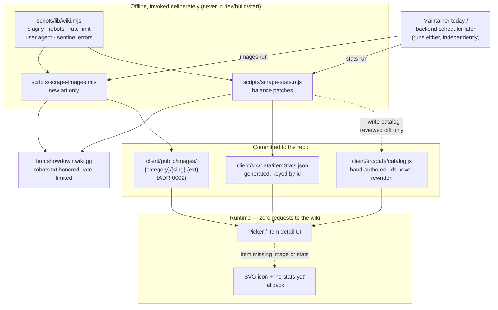

# ADR-0005: Scrape Item Stats and Descriptions from huntshowdown.wiki.gg into a Generated, Committed Data File

## Context and Problem Statement

ADR-0002 established that huntshowdown.wiki.gg is a legitimate source for this fan tool's item art, and that the right way to consume it is a bounded, human-invoked, offline scrape whose output is self-hosted (`scripts/scrape-images.mjs` → `client/public/images/{category}/{slug}.{ext}`). That decision covered images and nothing else.

The catalog itself (`client/src/data/catalog.js`) still carries only what the budget math needs: an id, a name, a cost, a size/UP value, an ammo class, and a group. A user picking between the Sparks LRR and the Mosin-Nagant M1891 sees two names and two prices — not damage, not effective range, not rate of fire, not which ammo variants the weapon actually accepts, not what a Concertina Bomb does. Every one of those facts is already on the wiki page the scrape script visits to grab the image.

Should The Outfitter also scrape structured stat data, prose descriptions, and per-weapon ammo compatibility from those same pages — and if so, where does that data live, who wins when it disagrees with the hand-authored catalog, and does the stat scrape belong inside the existing image script or beside it?

The last question is not cosmetic, and it is best understood by looking past the immediate work to where this is headed.

**The long-term shape.** Every wiki page this project cares about carries a revision history. The intended end state is a backend that periodically reads those histories, diffs them against what it has already ingested, and refreshes only what actually changed — a new weapon page appears, so fetch its image; a tool's stat block was edited, so re-parse that one item's data; nothing changed, so make no fetches at all beyond the history check itself. The unit of work is not "run the scrape," it is "this item changed in this way, fetch exactly that."

**What this ADR covers.** None of that machinery exists yet, and this decision does not build it. What exists is a catalog with no stat data at all, and the immediate job is the bootstrap pass that seeds it. But the bootstrap should not foreclose the end state, and the two payloads changing on genuinely independent schedules — a balance patch rewrites damage and cost across dozens of items while every image stays byte-identical; a DLC drop adds one image and little else — is precisely the property the incremental design depends on. A scraper that can only do both at once cannot be driven by a per-item, per-payload change feed.

## Decision Drivers

* Images and stats change on independent schedules — balance patches churn stats without touching art, new items add art — so whatever runs these should be able to run one without the other
* The intended future is a backend driven by the wiki's own revision histories, refreshing only the specific items and payloads that changed; that design requires per-item, per-payload granularity in the fetchers it drives
* This ADR's work is the bootstrap that seeds an empty catalog, so it should leave behind whatever the incremental design will need as its starting baseline rather than forcing a full re-scrape later
* A loadout planner that shows only name and price forces the user to keep the wiki open in another tab — stats are the difference between "a budget calculator" and "a planning tool"
* Ammo compatibility is currently modeled as a coarse `ammoClass` pointing at a shared `AMMO` pool; real weapons diverge from their class (special/scarce variants, weapon-specific bolts), and that divergence is exactly what the wiki records per weapon
* ADR-0002's constraints still bind: no runtime dependency on the wiki, nothing in `npm run dev`/`build`/`start` may touch huntshowdown.wiki.gg, robots.txt is respected, and requests are rate-limited
* Hand-authored catalog values go stale — the comment above `TRAITS` documents a manual re-verification pass against the wiki through Update 2.8.1, which is precisely the toil an automated scrape should absorb
* Saved loadouts, share URLs, and `loadoutCodec.js` all reference items by `id`; whatever this decision does, it cannot let a scrape mutate an id
* This is a hobby project with no CI — the mechanism has to be reviewable by one person reading a `git diff`

## Considered Options

* Generated JSON data file, committed to the repo, produced by a separate `scripts/scrape-stats.mjs`
* Merge scraped stats directly into `catalog.js` as expanded item records
* Server-side stat store behind an Express API, fetched by the client at runtime
* Runtime fetch of stats from huntshowdown.wiki.gg on page load
* Hand-author stats in `catalog.js` and do not scrape them at all (status quo, extended)

Orthogonally, for the scraper's shape:

* A separate `scripts/scrape-stats.mjs` sharing a common wiki-client module with `scrape-images.mjs`
* Extend `scripts/scrape-images.mjs` so one pass over each page yields both payloads

## Decision Outcome

Chosen option: **"Generated JSON data file, committed to the repo, produced by a separate `scripts/scrape-stats.mjs`"**, because it extends ADR-0002's already-settled ethics and reliability posture to a second kind of payload without re-opening any of it — the scrape stays bounded, robots-respecting, rate-limited, self-hosted, and version-controlled, and the running app makes exactly as many requests to the wiki as it does today (zero) — while keeping the two payloads independently runnable, which is what the eventual backend scheduler needs.

Five sub-decisions follow from it:

**Data home.** The scrape writes `client/src/data/itemStats.json`, a single generated file keyed by catalog `id`. It is committed, imported at build time, and marked as generated in a header comment (or sidecar note, since JSON has no comments) so no one hand-edits it. `catalog.js` stays hand-authored and human-readable; the generated blob stays adjacent rather than interleaved.

**Script shape: two scripts, one shared wiki client.** `scripts/scrape-images.mjs` keeps its current job. A new `scripts/scrape-stats.mjs` owns infobox parsing and `itemStats.json`. Both import a shared `scripts/lib/wiki.mjs` holding the pieces that must not diverge — `slugify()`, robots.txt fetching and evaluation, the rate limiter, the user agent, the sentinel error classes, and `collectCatalogItems()`. This costs a second page fetch per item whenever both run against the same item, and buys the independent cadence the backend scheduler needs: a balance patch triggers a stats-only run, a new DLC item triggers an images-only run, and neither wastes requests on a payload that didn't change.

Extracting the shared module is a prerequisite, not a follow-up. `slugify()` is a hard contract with the on-disk image path (`client/public/images/{category}/{slug}.{ext}`) and with `ItemThumb`'s URL derivation; if two scripts each carry their own copy, they will drift, and the failure mode is images silently not resolving.

**Record provenance during the bootstrap, even though nothing reads it yet.** Every scrape records, per item and per payload, the source page's revision identifier and the timestamp it was ingested. For stats this rides in `itemStats.json`; for images it needs a small sidecar (e.g. `client/public/images/.provenance.json`) since a PNG has nowhere to put it. Nothing in this ADR's scope consumes those values.

The reason to pay for them now is that the incremental design's first question will be "what has changed since I last looked?", and that question is unanswerable without a baseline. A bootstrap that discards revision ids forces the first incremental run to either re-scrape the entire catalog to establish one, or to treat every item as changed. Capturing an identifier the response already contains is nearly free; reconstructing it later is a full re-scrape. This is the one place this ADR spends effort on the future rather than the present, and it is deliberate.

**Precedence: the wiki is authoritative.** Where a scraped field and a hand-authored catalog field describe the same fact — cost, ammo class, UP value, group — the scraped value wins and is written through to `catalog.js` by the stats scrape. The wiki tracks live patch data; the hand-maintained table demonstrably drifts (the `TRAITS` comment above documents a stale 1.x/2.0-era table that survived until someone manually re-verified it). Automating that reconciliation is the point. Note that this makes `scrape-stats.mjs` the only script that ever writes `catalog.js`; `scrape-images.mjs` remains write-only to `client/public/images/`.

**One bounded exception: `id` is never wiki-derived.** Ids are the wire format for saved loadouts, localStorage, and share URLs; `catalog.js` already documents that they are stable and never reused. A scrape may add a new item or update an existing item's fields, but it must never rewrite or re-slug an existing `id`. An item whose wiki page has been renamed keeps its old id and gains a new display name.

I'll flag one real risk with the wiki-authoritative choice, since it is the one place this decision buys convenience with safety: an HTML change on the wiki that causes the parser to extract a wrong-but-well-formed number silently corrupts budget math, and the failure is invisible in the UI (a Winfield that costs $3 instead of $76 just looks like a bargain). The confirmation section below specifies the guardrails that make this survivable — write-through must be reviewable and bounded, not silent. If those guardrails prove insufficient in practice, the fallback is the "flag conflicts, resolve manually" posture rejected below, which can be adopted later without re-scraping anything.

### Consequences

* Good, because item pages gain real decision-relevant content — damage, effective range, rate of fire, reload speed, per-weapon ammo variants, and prose descriptions — turning the picker from a price list into a comparison tool
* Good, because images and stats can be refreshed independently, which is the granularity the revision-history-driven backend will need — it can act on "this item's stat block was edited" without re-checking art that provably didn't change
* Good, because the bootstrap leaves behind per-item revision provenance, so the first incremental run has a real baseline to diff against instead of having to re-scrape everything to establish one
* Good, because the app's runtime behavior is unchanged — still no network requests to the wiki, still no dependency on the wiki being up
* Good, because catalog drift becomes a scrape-and-review cycle instead of a manual re-verification pass against the wiki
* Good, because generated data lives in its own file, so `git diff` cleanly separates "the wiki changed" from "a human changed the catalog"
* Good, because the brittle new work (infobox parsing) lands in a new file rather than destabilizing the image scrape, which works today — a stats parser regression cannot break image sourcing
* Bad, because the wiki-authoritative rule means a parser regression can overwrite correct hand-authored costs with wrong ones, and wrong costs corrupt the budget math the whole app is built around
* Bad, because running both scripts over the same item fetches its page twice — though this is a bootstrap cost, not a steady-state one: once the revision-driven backend lands, both-payloads-for-one-item is the rare case rather than the normal run
* Bad, because two scripts sharing a wiki client is more moving parts than one script, and the shared module has to be extracted before the second script is written rather than after
* Bad, because provenance capture is work with no present-day payoff — if the incremental design is abandoned, it was wasted effort and dead fields in a committed file
* Bad, because parsing a MediaWiki infobox into typed fields is a materially more brittle job than finding an image — infobox markup varies by item type and changes across wiki edits
* Bad, because stat data will go stale between scrape runs, and unlike a missing image (which falls back to an SVG icon) a stale stat has no visible fallback — it just quietly reads wrong
* Bad, because committing a generated JSON blob adds repo churn on every scrape run
* Neutral, because the per-weapon ammo compatibility data may not cleanly replace the existing `ammoClass` → `AMMO` pool model; the first implementation can populate stats without restructuring ammo, and revisit that model separately
* Neutral, because item descriptions are Crytek's prose; the same fan-content reasoning from ADR-0002 that covers the art covers the text, and the existing attribution in the footer already names both Crytek and the wiki

### Confirmation

* Neither `scripts/scrape-images.mjs` nor `scripts/scrape-stats.mjs` is referenced by `npm run build`, `npm run dev`, `npm start`, or any future CI config — the ADR-0002 invariant is re-verified for both, not assumed
* A grep for `huntshowdown.wiki.gg` in `client/src/` returns only attribution text and comments, never a fetch or ``
* `slugify()`, robots handling, the rate limiter, the user agent, and the sentinel error classes are defined exactly once, in `scripts/lib/wiki.mjs`, and both scripts import them — a grep for a second `function slugify` under `scripts/` returns nothing
* Each script runs to completion on its own with the other absent or failing; a stats run makes no image requests and an image run writes no stat data
* `client/src/data/itemStats.json` exists, is keyed by catalog `id`, and every key resolves to a real item in `WEAPONS`/`TOOLS`/`TRAITS`/`CONS`
* Every scraped record carries a source revision identifier and an ingestion timestamp — spot-check that a scraped item's recorded revision matches what the wiki's history page reports for that page, so the value is a real baseline and not a placeholder
* A test asserts that no scrape run mutates an existing `id`: given a fixture where the wiki page name has changed, the resulting catalog entry keeps its original id
* Write-through to `catalog.js` happens only in `scrape-stats.mjs` and is guarded: it prints a per-field diff of every hand-authored value it intends to overwrite and requires an explicit flag (e.g. `--write-catalog`) to apply it, so the default run is additive and any cost change lands as a reviewable `git diff` hunk rather than a silent edit
* Range assertions on parsed numerics (cost > 0, size ∈ 1..3, UP within the game's range) fail the item rather than writing an implausible value
* Per-item parse failures follow the existing SPEC-0001 "Error Handling Standards" pattern — recorded in the run summary with item, URL, and reason, never silently swallowed, never aborting the run
* The UI degrades cleanly for items with no scraped stats yet, the same way `ItemThumb` falls back to an SVG icon when no image exists

## Pros and Cons of the Options

### Generated JSON data file, committed to the repo (chosen)

`scripts/scrape-stats.mjs` writes `client/src/data/itemStats.json`. The client imports it at build time; the file is reviewed as a normal diff.

* Good, because it inherits ADR-0002's ethics and reliability posture wholesale — no new argument about scraping needs to be made
* Good, because generated content is physically separated from hand-authored content, so review and blame stay meaningful
* Good, because build-time import means zero runtime cost and zero new failure modes in the request path
* Good, because it is trivially inspectable — a human can open the file and see exactly what the scrape believes
* Neutral, because it grows the client bundle by the size of the stat table (small: hundreds of items, tens of fields)
* Bad, because updating stats requires a scrape, a commit, and a redeploy — there's no way to correct a wrong number without shipping
* Bad, because a generated file in version control produces noisy diffs on every run

### Merge scraped stats directly into `catalog.js`

One item record per item, with hand-authored and scraped fields side by side in the same structure.

* Good, because there is exactly one place to look up anything about an item — no join, no second import
* Good, because it eliminates the risk of `itemStats.json` and `catalog.js` disagreeing about which items exist
* Bad, because it destroys the reviewability that motivated the chosen option: a scrape run rewrites the same file humans hand-edit, and `git blame` stops distinguishing the two
* Bad, because `catalog.js` is currently a readable, commented, tuple-based file that a person maintains; mechanically rewriting it means either generating those comments or losing them
* Bad, because a parser bug can now corrupt the ids and structure the wire format depends on, not just the stat fields

### Server-side stat store behind an Express API

Stats live in the server (JSON file or DB), exposed over an endpoint the client fetches at runtime.

* Good, because stats can be corrected without rebuilding or redeploying the client
* Good, because it scales to genuinely large or frequently-changing data, and could later back other features
* Neutral, because the repo already has a `server/` directory, so this isn't net-new infrastructure
* Bad, because it adds a runtime network dependency and a loading state to a page that currently renders fully from static data
* Bad, because it introduces API surface, error handling, and caching concerns for data that changes a few times a year at most
* Bad, because it's a substantial complexity increase for a hobby project with no CI and one maintainer

### Runtime fetch from huntshowdown.wiki.gg

The client requests stats from the wiki as the user browses.

* Good, because data is always current with zero maintenance
* Bad, because it directly contradicts ADR-0002, which rejected runtime dependence on the wiki for exactly these reasons — it puts load on a third party's infrastructure proportional to this app's traffic, and makes the app's correctness contingent on their uptime
* Bad, because CORS, rate limits, and HTML parsing in the browser make it fragile in practice
* Bad, because it turns every page view into a scrape, which is the behavior ADR-0002's "bounded, infrequent, low-impact" framing was written to avoid

### Hand-author stats in `catalog.js`, no scrape

Extend the existing tuples with stat fields, maintained by hand as the game patches.

* Good, because it requires no new machinery and no new parsing brittleness
* Good, because a human vets every number, so implausible values never ship
* Neutral, because it's the natural extension of how the catalog is maintained today
* Bad, because the maintenance burden is real and demonstrated — the `TRAITS` comment records a full manual re-verification pass against the wiki, and that's for one field across one category
* Bad, because it doesn't scale to the field count this decision wants (damage, range, rate of fire, reload, muzzle velocity, per-item ammo variants, descriptions) across four categories
* Bad, because it guarantees drift: the data goes stale between the patch shipping and someone finding time to re-verify

## Pros and Cons of the Scraper Shape

### Separate `scripts/scrape-stats.mjs` with a shared wiki client (chosen)

Two entry points, one `scripts/lib/wiki.mjs` holding fetch/robots/rate-limit/slugify/errors.

* Good, because the two payloads can be refreshed independently — which is the whole point, given that the backend will eventually decide what to fetch by diffing wiki revision histories
* Good, because it matches the granularity the change feed produces: revision histories report *which page changed*, and a per-item, per-payload fetcher can act on that directly, where a combined script would inflate every single-item edit into a both-payloads fetch
* Good, because over a year of real usage this makes *fewer* total requests, not more — the doubling only applies to a full both-payloads refresh, which after the bootstrap is the exception rather than the pattern
* Good, because failure is isolated: an infobox parser that breaks on a wiki markup change doesn't take image sourcing down with it, and either script can be re-run alone after a fix
* Good, because each script stays small enough to reason about, and `scrape-images.mjs` (working today, with its own test file) doesn't get rewritten
* Neutral, because it forces the shared wiki client to be extracted now — real refactoring work up front, but it's work that pays for itself the moment there's a second consumer
* Bad, because a full refresh of both payloads fetches every item page twice
* Bad, because two scripts means two places to keep aligned on category flags, output conventions, and run-summary format

### Extend `scripts/scrape-images.mjs` to emit both

One pass per item page yields the image and the stats together.

* Good, because it halves request volume on a full refresh — one page fetch serves both payloads
* Good, because there's one script, one run summary, one set of flags, and no shared-module extraction needed
* Neutral, because the parsing code has to exist either way; this only changes which file it lives in
* Bad, because it couples the two cadences at exactly the layer the revision-driven design needs them decoupled: a change feed saying "this tool's stat block was edited" could only be serviced by a run that also re-checks that item's art
* Bad, because it makes the working image scrape carry the risk of the brittle new parser — a stats regression becomes an image-sourcing outage
* Bad, because the single script accumulates two responsibilities and grows toward the point where `--only-images` / `--only-stats` flags reimplement the separation badly

## Architecture Diagram

## More Information

* Extends **ADR-0002** (Source Weapon/Equipment Images from huntshowdown.wiki.gg via a One-Time, Self-Hosted Scrape) — this decision reuses ADR-0002's scrape mechanism, ethics posture, and self-hosting rule for a second payload type. ADR-0002 remains accepted and in force.
* **ADR-0001** (superseded by ADR-0002) is the earlier decision to avoid wiki-sourced assets entirely; it is listed for history only.
* **SPEC-0001** "Ethical, Self-Hosted Image Sourcing" and "Error Handling Standards" constrain the existing scrape script; the stat-scraping extension must satisfy both — see `docs/openspec/specs/equipment-iconography/`.
* [**Weapon catalog vs. huntshowdown.wiki.gg — reconciliation audit**](../audits/weapon-catalog-wiki-audit.md) is the evidence base for the amendment below, and the closest thing this decision has to an implementation spec for `scrape-stats.mjs`. It carries the per-weapon mapping of catalog rows to wiki paths, the seed URL list for the crawler queue, the twelve structural properties of the wiki's page organization the parser has to survive, and the coverage delta (146 wiki pages against 39 catalog rows). Its numeric values are deliberately marked `[VERIFY]` — direct HTTP access to the wiki was blocked when it was written, so it is authoritative on *page structure and identity* and explicitly not on stat values, which are the scraper's job to fetch rather than a human's to transcribe.
* [**Equipment catalog vs. huntshowdown.wiki.gg — reconciliation audit**](../audits/equipment-catalog-wiki-audit.md) is the companion covering everything the weapon audit skipped: `TOOLS`, `CONS`, `TRAITS`, the `AMMO` pools, the four group taxonomies, and the loadout rules encoded in `calc.js`/`loadoutSlice.js`. It is the evidence base for the second amendment below, carries a scrape-target list designed to concatenate with the weapon audit's into one crawler queue, and adds fourteen structural properties of the wiki that are specific to these categories. Same evidence discipline: authoritative on page identity and structure, explicitly `[VERIFY]` on stat values, since wiki egress was still blocked when it was written.
* Existing implementation touchpoints: `scripts/scrape-images.mjs` (fetch, robots, rate limit, slugify, sentinel errors — the pieces to extract into `scripts/lib/wiki.mjs`), `scripts/scrape-images.test.mjs` (must keep passing across the extraction), `client/src/data/catalog.js` (item tuples, `AMMO`/`AMMO_LABEL` pools, id stability contract), `client/src/components/ItemThumb/ItemThumb.jsx` (fallback chain to imitate for missing stats).
* Implementation order this implies: extract `scripts/lib/wiki.mjs` and re-point `scrape-images.mjs` at it (behavior-preserving, existing tests green) *before* writing `scrape-stats.mjs`. Writing the second script first guarantees a duplicated `slugify()`.
* Out of scope, and left for at least one future ADR: the revision-history-driven incremental refresh sketched in the context above. Open questions it will have to settle include how change detection reads the wiki's histories (MediaWiki exposes revision and recent-changes data through an API, which is a different and much lighter client than the HTML page fetch used here — `scripts/lib/wiki.mjs` should not assume HTML scraping is the only access mode); where the ingested-revision watermark is persisted once the backend owns it rather than the repo; how a scrape run triggered by a server reaches the committed data this ADR chose as the data home, which may reopen the "server-side stat store" option rejected below; and what cadence and failure/retry behavior the scheduler needs. This decision deliberately does not prejudge any of those — it only ensures the fetchers have the per-item, per-payload granularity that design will need, and leaves behind the revision baseline it will start from.
* Deferred, deliberately: whether per-weapon ammo compatibility from the wiki should replace the coarse `ammoClass` → `AMMO` pool model. The `AMMO.special` pool is a hand-curated divergence from the wiki (Dolch/Nitro variants excluded because they're Scarce and unpurchasable since Update 2.8) — a case where the hand-authored table encodes a judgment the wiki does not. That tension deserves its own decision rather than being settled implicitly by this one.

---

## Amendment (2026-08-10): findings from the weapon-catalog wiki audit

A reconciliation audit of all 39 `WEAPONS` rows against the live arsenal
([`docs/audits/weapon-catalog-wiki-audit.md`](../audits/weapon-catalog-wiki-audit.md))
surfaced facts about the wiki's page organization
and about this repo's own coupling that the decision above did not account for. **None of them
change the decision** — generated JSON, separate scripts, shared wiki client, wiki-authoritative,
ids never rewritten all stand. They constrain how `scrape-stats.mjs` must be built, and they
correct one sub-decision that is unsafe as written.

These findings landed alongside the shared-wiki-client extraction this ADR called for, which
merged separately as PR #115. `WIKI_TITLE_OVERRIDES`, `KNOWN_CATALOG_DUPLICATES`,
`resolveWikiPath()` and `collectCatalogItems()` therefore now live in **`scripts/lib/wiki.mjs`**,
not in `scrape-images.mjs`; the extraction moved them verbatim, bug included, so the corrections
below were applied in their new home.

Two findings were acted on immediately, because they were live defects rather than future risks:

* The override table mapped the catalog's `winfield-m1873` to `null` as a "duplicate", on the
  belief that a separate `Ranger 73` row covered it. **No such row exists.** The wiki renamed
  Winfield M1873 → Ranger 73 in Update 2.0, so the only catalog entry for a live weapon was
  being skipped by every run. Now mapped to `Weapons/Ranger_73`, taking weapon coverage from
  37 of 39 rows to 38 (the remaining skip is the genuine duplicate).
* `WIKI_TITLE_OVERRIDES` and `KNOWN_CATALOG_DUPLICATES` are now **keyed by catalog `id`, not by
  display name** — see "The name write-through hazard" below. `resolveWikiPath()` takes
  `(category, id, name)` accordingly: the id selects the override, the name only feeds the
  default namespaced path.

### The name write-through hazard

The "Precedence: the wiki is authoritative" sub-decision says a scraped display name is written
through to `catalog.js`. That rule interacts badly with two name-derived contracts elsewhere in
the repo, and the interaction is silent in both directions.

**1. The wiki-path override table (fixed).** It was keyed by display name. The first successful
name write-through would have stopped every key matching, and resolution would have fallen back
to `Weapons/{new name}` — which is *usually* correct for a plain rename, and wrong exactly where
it matters. `"Nagant Officer Carbine"` → `"Officer Carbine"` falls back to
`Weapons/Officer_Carbine`; the real page is `Weapons/Officer/Carbine`. A mostly-working fallback
is the worst possible failure mode, because the run summary still reports success for 37 of 39
items. Keying on `id` — the one field this ADR guarantees is never rewritten — makes the table
survive its own success. A test now asserts every override key is slug-shaped.

**2. The on-disk image path (NOT fixed — a constraint on `--write-catalog`).** ADR-0002's asset
contract is `client/public/images/{category}/{slug}.{ext}` where `slug = slugify(displayName)`,
and `ItemThumb.jsx` derives the URL it requests the same way. **A display-name write-through
therefore renames the image path the app asks for, while the file on disk keeps its old name.**
Renaming `"Caldwell Pax"` → `"Pax"` makes the UI request `/images/weapons/pax.png` against a disk
holding `caldwell-pax.png`; the `` chain then falls through to the SVG icon and the
art disappears with no error anywhere. Fourteen of the catalog's weapon rows carry stale
pre-`1896` names, so a single unguarded `--write-catalog` run drops fourteen weapon images at
once.

Therefore: **`scrape-stats.mjs` MUST NOT apply a display-name change without also renaming the
corresponding image assets in the same commit**, and its `--write-catalog` diff must list name
changes separately from numeric ones, since only the name changes carry this side effect. The
cleaner long-term fix — deriving the image slug from `id` rather than from the display name —
would decouple the two permanently, but it re-opens ADR-0002's asset-path contract and would
rename 37 committed files, so it belongs in its own decision rather than being smuggled in here.

### The ammo-class write-through hazard

Surfaced in review of the audit's `frontier-73c` fix, and it is the same shape as the name
hazard above: a field this ADR makes scraper-writable is also a field something else silently
depends on.

"Precedence: the wiki is authoritative" names `ammoClass` explicitly as a write-through field.
But a weapon's selected ammo is persisted as a **bare index** into `AMMO[ammoClass]` —
`loadoutCodec.js` stores `w.a` as a number and `calc.js` reads it back as
`AMMO[WEAPONS[w.i][4]][w.a][1]`. The index is resolved against whatever ammo class the catalog
carries *now*, so changing a weapon's `ammoClass` re-points every saved selection for that
weapon at a different row of a different table.

Nothing catches it. `AMMO.compact` and `AMMO.medium` are both length 5, so no bounds check
trips; `fromV1` only checks `Number.isInteger`. The one-time cost of the `frontier-73c`
correction in this PR is exactly this, and index 1 is the worst case — Spitzer ($60) becomes
High Velocity ($13), a $47 error in a budget calculator, with the ammo's *name* changing too.

That instance is accepted rather than migrated: it needs a `FORMAT_VERSION` bump to fix
properly, and the affected set is loadouts that both use that one weapon and picked a
non-default ammo. **The general case is not acceptable**, because the scraper will be applying
`ammoClass` changes in bulk and unattended. Therefore: `scrape-stats.mjs` MUST treat an
`ammoClass` change as a breaking data migration, not a field update — it needs a
`FORMAT_VERSION` bump with a migration that drops or remaps affected ammo selections, on the
same reasoning that made `w.a`-by-index acceptable only while ammo classes were hand-frozen.
The durable fix is to persist the ammo *id* rather than its index, which removes the coupling
entirely; that is a wire-format decision and belongs in its own ADR.

Two of this ADR's write-through fields have now turned out to carry hidden coupling — display
name to the image path, ammo class to the saved-ammo index. That is a pattern, not two
coincidences: "the wiki wins" is safe for fields nothing else keys on, and the guardrails this
ADR specifies (reviewable diff, range assertions, explicit `--write-catalog`) check whether a
value is *plausible*, never whether changing it invalidates something downstream. Before adding
any further field to the write-through set, check what else reads it positionally.

### The wiki's page organization, as the parser will meet it

Recorded because each one is a way a reasonable parser gets a well-formed wrong answer, which is
precisely the risk the original decision flagged and could not yet characterize.

* **Everything is namespaced**: `/wiki/Weapons/{Title}`, never `/wiki/{Title}`.
* **Variants are subpages** — `/wiki/Weapons/{Family}/{Variant}` — but **compound variants
  collapse into one segment**: `Sparks/Pistol_Silencer`, `Centennial/Shorty_Silencer`,
  `Officer/Carbine_Deadeye`, `Uppercut/Precision_Deadeye`. There is no
  `Sparks/Pistol/Silencer`. Paths are at most three segments; the parent is always segment two.
* **Family structure cannot be inferred from the URL, or from the name.** `Mosin_Obrez` is a
  top-level family page with its own children (`Extended`, `Mace`, `Match`, `Sharpeye`) despite
  being a Mosin; `Frontier_73C` and `Vandal_73C` are peers of `Ranger_73`, not its children.
  Read family membership from the page's weapon-tree section, or accept a hand-maintained map.
* **Weapon-tree unlock rows are not pages.** Ammo unlocks ("Pax High Velocity Ammo", "Centennial
  Dumdum Ammo") and unlock ordering ("7th unlock in the LeMat Mark II family") live in a table on
  the family page. They are the per-weapon ammo-compatibility data the "Neutral" note above
  anticipated — scrape them into `itemStats.json` as a per-weapon list; do not mistake them for
  variant pages, and do not derive catalog rows from them.
* **Not every weapon page is a buyable item.** The Maxim (Update 2.8) is a *world weapon*: no
  cost, no slot size, cannot be bought or carried. The range assertions this ADR specifies
  (`cost > 0`, size in range) would reject it as a parse failure when it is really a category.
  Classify and skip world weapons explicitly, or the run summary fills with false errors after
  every event patch.
* **Stats are infobox fields; description and background are body prose.** Two extractors, not
  one. "Recommended traits" sections are wiki-editorial rather than game data and should not be
  persisted as if they were.
* **Hyphen versus underscore is not derivable.** `Mosin-Nagant` (hyphen, part of the name) but
  `Mosin_Obrez` (underscore, a space); `Bornheim_No._3` carries a literal period. Titles must
  come from the category listing, never be reconstructed from a display name.
* **Discovery belongs to `/wiki/Category:Weapons`, not the sitemap.** The sitemap lags live edits
  by months, which makes it least reliable for exactly the case that matters most — a
  newly-added weapon. Keep using it for bulk verification of paths already known.

### Coverage: `itemStats.json` keyed by catalog id covers a quarter of the arsenal

`Category:Weapons` reports **146 pages**; the catalog has **39 weapon rows**. Every weapon
variant in the game is absent, along with a dozen-plus base weapons (Ranger 73, Vandal 73C,
Terminus, Marathon, New Army, Officer, 1865 Carbine, Mosin Obrez, Bomb Launcher, Machete, and
others). The confirmation criterion "every key in `itemStats.json` resolves to a real item in
`WEAPONS`/`TOOLS`/`TRAITS`/`CONS`" is still correct, but it is a one-way check: it proves nothing
about the ~107 pages with no catalog row to key on, and it will pass at full green while three
quarters of the arsenal is missing.

The blocker is schema, not scraping. The weapon tuple `[id, name, size, cost, ammoClass, group]`
has nowhere to record `variantOf`, and `group` is an app-side UI taxonomy with no wiki
equivalent, so it cannot be scraped for a new row at all. Sequence accordingly: variant schema →
family/parent map → bulk import. Importing first would triple the picker's length with no way to
collapse families, and would need `group` invented by hand for every new row anyway.

### Retiring a duplicate row is blocked by the wire format

The audit recommended deleting `winfield-m1873c` (a duplicate of `frontier-73c`). **That is not
safe as a plain deletion**, and the audit has been corrected. `loadoutCodec.js`'s legacy
pre-versioning decoder resolves weapons by raw array position, so removing a row shifts every
later weapon and silently remaps old saved loadouts to the wrong items — the failure the
`catalog.js` "appended, never inserted" rule exists to prevent. Retiring a weapon row needs the
same treatment the Choke/Stalker Beetle tool slots got: an explicit legacy-index carve-out.
Until then the duplicate stays, and the scraper skips it via `KNOWN_CATALOG_DUPLICATES`.

Note this also means the id → wiki-path map is **not injective**: two catalog rows
(`winfield-m1873c`, `frontier-73c`) describe one wiki page. A stats run will happily write two
keys with identical scraped content, and the existing confirmation check will pass.

### Additional confirmation criteria

* Every key in `WIKI_TITLE_OVERRIDES` and `KNOWN_CATALOG_DUPLICATES` is a catalog `id`, asserted
  by test — not a display name
* Renaming an item's display name does not change the wiki path it resolves to, asserted by test
* No catalog entry silently resolves to `null`: every `null` override names a real duplicate in
  `KNOWN_CATALOG_DUPLICATES`, and that explanation is checked against the catalog rather than
  taken on trust (this is what let the `Ranger 73` mistake survive)
* A `--write-catalog` run that changes any display name either renames the matching image assets
  or refuses to apply the name change, and reports name changes separately from numeric ones
* A `--write-catalog` run that changes any `ammoClass` is gated behind a `FORMAT_VERSION` bump
  and a migration for saved ammo selections, rather than applying as an ordinary field update
* World weapons are classified and skipped, not reported as parse failures
* The run summary states coverage against `Category:Weapons` (pages seen vs. catalog rows), so a
  green run over 39 of 146 pages cannot read as complete

---

## Amendment (2026-08-10): findings from the equipment-catalog wiki audit

A companion reconciliation audit of `TOOLS`, `CONS`, `TRAITS`, the `AMMO` pools, the four group
taxonomies, and the loadout rules encoded in `calc.js`/`loadoutSlice.js`
([`docs/audits/equipment-catalog-wiki-audit.md`](../audits/equipment-catalog-wiki-audit.md))
covers everything the weapon audit skipped. As with that one, **none of it changes the decision.**
It adds constraints on `scrape-stats.mjs`, and it corrects one claim the previous amendment
inherited from the weapon audit.

### The retirement blocker is gone — the previous amendment's "Retiring a duplicate row is blocked by the wire format" is superseded

That section says a plain deletion is unsafe because "`loadoutCodec.js`'s legacy pre-versioning
decoder resolves weapons by raw array position". **That is no longer true.** `loadoutCodec.js` now
pins the pre-versioning catalog order in four frozen tables (`LEGACY_WEAPON_IDS` and siblings,
issue #68, commit `9fbcba2`); `fromLegacy()` resolves an index to a **stable id** through them and
only then locates that id's current position. A mid-array deletion cannot shift what a legacy record
resolves to, and `loadoutCodec.test.js` asserts every non-null legacy entry still resolves, so
retiring a row fails a test until someone records what the legacy slot should do. Issue #67 retired
the duplicate `Choke Bomb` consumable on exactly that basis — a merged mid-array deletion.

Retiring `winfield-m1873c` is therefore **unblocked**, needing one deliberate decision
(`LEGACY_WEAPON_IDS[16]` → `frontier-73c` or `null`) rather than new machinery. The consequence for
this ADR stands unchanged in the meantime: while both rows exist the id → wiki-path map is not
injective, and `KNOWN_CATALOG_DUPLICATES` is what keeps the scraper from writing two keys with
identical content.

### Coverage is worse outside weapons than the weapon audit implied — except for tools

| Category | Wiki pages | Catalog rows | Assessment |
|---|---|---|---|
| Tools | 23 (`Category:Tools`) | 22 | **Complete.** 2 of the 23 are tombstones (Electric Lamp, removed in 2.0; Multitool, never shipped); the Katana is filed under `Weapons`. Reconciles exactly. |
| Consumables | 54 (`Category:Consumables`) | 30 | ~13 are Tarot Cards (Scarce, deliberately out of scope); **~11 pages remain unaccounted for** and must be enumerated by a crawl. |
| Traits | 58 (`Category:Purchasable_Traits`) | 32 | **26 purchasable traits missing — 45% of the roster.** The wider `Category:Traits` reports 85, the balance being Scarce (14) and Event (18) traits that are correctly out of scope. |

The confirmation criterion "every key in `itemStats.json` resolves to a real item" remains a one-way
check, and the trait gap is the sharpest illustration yet: it will pass at full green over 32 of 58
purchasable traits. The run summary must state coverage against `Category:Purchasable_Traits` and
`Category:Consumables`, not only `Category:Weapons`.

**Unlike the weapon gap, this one is not schema-blocked.** All 26 missing traits fit the existing
`[id, name, up, group]` tuple; only `group` must be hand-assigned. Trait import can proceed ahead of
the variant schema work.

### Category listings contain removed items — a generalization of the world-weapon rule

The previous amendment recorded that "not every weapon page is a buyable item" (the Maxim). The
equipment audit shows the problem is broader and lives in *discovery*, not just parsing: **9% of
`Category:Tools` is tombstones.** `Tools/Electric_Lamp` documents an item removed in Update 2.0 —
one this repo deliberately deleted, holding a `null` legacy slot for it — and `Tools/Multitool`
documents a prototype that never shipped. Both are ordinary category members with ordinary pages.

Therefore: **a discovery diff must classify each unmatched page before proposing it as missing.**
A crawler that diffs a category index against the catalog and treats the remainder as "items to
add" will propose re-adding items this repo removed on purpose. Expect tombstones in every category,
including a meaningful share of the ~11 unresolved consumable pages.

### `AMMO` has no source page and must not be scraped

The weapon audit marked the `AMMO` table "verify all". The equipment audit establishes **why it
could not be verified, and the answer is structural.** The wiki does not publish a per-class ammo
price table: `/wiki/Ammo` is prose about ammo *behaviour*, and `Category:Dumdum_Ammo` and its
siblings are titled "All Dumdum Ammo **Weapons**" — indexes of weapons, not of ammo variants. The
wiki models a custom-ammo variant as a **per-weapon unlock with a per-weapon price**, in the
weapon-tree table the previous amendment already identified as page sections rather than pages.

So the app's shared per-class pool is an app-side abstraction with no wiki equivalent, in the same
sense `group` is. **`scrape-stats.mjs` MUST NOT attempt to populate `AMMO`.** It should collect
per-weapon ammo prices into `itemStats.json` as the deferred `availableAmmo` list, which
additionally provides the first real test of the pool model's unstated assumption — that every
weapon in a class charges the same price for the same variant.

**A gap in the previous amendment's ammo hazard:** it gates `ammoClass` changes behind a
`FORMAT_VERSION` bump because ammo selection persists as a bare index into `AMMO[ammoClass]`. But
**inserting, removing, or reordering a variant within a pool has exactly the same effect** on every
saved selection, and nothing currently says so. Same gate, same reason.

### `group` is unscrapable in all four categories, and the wiki's taxonomies cannot supply it

The wiki uses one unified, **multi-valued** subcategory scheme across Tools and Consumables
(Throwable, Placeable, Rending, Healing, Noise, Explosive, Fire, Poison, Vision, Light) and two
orthogonal schemes for traits (Regular/Burn/Scarce/Event by acquisition; Offensive/Defensive/
Movement/Supportive/Solo/Catalyst by function). None is a single-valued UI category. The audit's
verdict is that all four app taxonomies are defensible simplifications and should be kept, so the
existing rule generalizes: **the scraper must not derive `group` for any category**, and a new row's
`group` is hand-assigned.

### A new class of silent rules bug: a data field that is a rules input

`CONS[i][3]` (`type`) is not cosmetic — `calc.js`'s `catCount()` counts by it and
`loadoutSlice.js` enforces the game's 4-per-category cap on the result. The audit found the app
models 2 of the game's 4 cap categories (`Shot`, `Throwable`; the game also has `Placeable` and
`Tarot Card`) and misfiles three rows: `ammo-box` and `tool-box` are Placeables typed as Throwable,
and `medical-pack` is a Placeable typed as `Shot` because the wiki files it under **both**
`Category:Healing_Consumables` (an *effect* category) and `Category:Placeable_Consumables` (the
*cap* category).

This is the failure mode that matters for a scraper: **assigning `type` from "the item's wiki
subcategory" produces a well-formed value that is right about half the time, and the error surfaces
as permitted-loadout drift rather than as a parse failure.** It will never appear in a run summary.
Therefore: `type` may only be derived from the mechanical subcategories (Throwable / Placeable /
Shot / Tarot Card); the thematic ones (Healing, Rending, Fire, Poison, Noise, Vision, Light) are
`group` signals at most and must never populate `type`.

**One genuinely good piece of news, recorded because the previous amendment asked for exactly this
check.** It closed by warning that two write-through fields had turned out to carry hidden coupling
and that any further field should be checked for what reads it positionally. `type` was checked:
it is **never persisted** (`toData()` stores `["C", id]`) and never feeds a slug, so it can be
corrected freely with no `FORMAT_VERSION` bump and no migration. A documented negative result, so
the check is not repeated from scratch.

### Acquisition class decides catalog membership, and nothing records it

Tarot Cards (~13 consumable pages), 14 Scarce traits, and 18 Event traits are excluded from the
catalog because they cannot be bought — with Hunt Dollars or with Upgrade Points. This is the same
judgment already encoded by hand in `AMMO.special: []`. It is correct and it is nowhere
machine-readable, so every roster diff re-litigates it (issue #37 has now done so twice, the second
time on a premise — "limited-time event item" — that Update 2.8.1 has falsified; Tarot Cards are
permanent, and Scarce is the durable reason).

Therefore: **scrape the acquisition classification** (Regular / Burn / Scarce / Event for traits;
purchasable-vs-Scarce for consumables) into `itemStats.json`, even though it is not a catalog field.
It is what makes "should this item have a row?" checkable instead of arguable.

### Game rules that live in code, not data

Verified against the wiki, and recorded here because a change to any of them is a rules-engine
change with tests, not a catalog edit — a distinction this ADR's write-through machinery cannot make
and must not be extended to cover:

* **Confirmed correct:** the 8-slot equipment ceiling (`calc.js` `slotMax`), the one-per-Tool rule
  (`loadoutSlice.js:45` — the wiki's Tools page states "each Tool has to be a different one"
  alongside 2.8's free-placement rule, resolving issue #41), and the 10-UP default trait budget.
* **Correct logic, wrong inputs:** the 4-per-consumable-category cap, per the `type` finding above.
* **Missing:** the game's **15-trait maximum** is not enforced anywhere. `addTrait` checks only for
  duplicates, and the UP budget is opt-in and defaults off, so the app currently permits all 32
  traits — and would permit all 58 after the roster import above.

### Additional confirmation criteria

* `scrape-stats.mjs` never writes `AMMO`; per-weapon ammo prices land in `itemStats.json` only
* A `--write-catalog` run that reorders, inserts into, or removes from an `AMMO` pool is gated
  behind a `FORMAT_VERSION` bump and a saved-selection migration, on the same terms as `ammoClass`
* `CONS.type` is only ever assigned from a mechanical cap category, never from a thematic effect
  category, asserted by a fixture where the item belongs to both (the Medical Pack)
* No scrape derives `group` for any of the four categories
* Discovery output classifies every unmatched category member as live / removed / never-shipped
  before proposing it as a missing item; the Electric Lamp and Multitool are skipped with a recorded
  reason, the way world weapons are
* Every scraped trait record carries its acquisition class (Regular / Burn / Scarce / Event), and
  every scraped consumable records whether it is purchasable with Hunt Dollars
* The run summary states coverage against `Category:Purchasable_Traits` and `Category:Consumables`
  as well as `Category:Weapons`
* A page fetch returning HTTP 200 is not treated as confirming the display name — the canonical
  title is read from the page, since MediaWiki serves renamed pages through redirects and this
  wiki's redirect coverage is inconsistent (`Tools/Alert_Trip_Mine` does *not* redirect to
  `Tools/Alert_Trip_Mines`, which is why that override exists)

## Amendment (2026-08-11): the size range in the confirmation criteria is wrong

**Superseded:** "Range assertions on parsed numerics (cost > 0, **size ∈ 1..3**, UP within the game's range) fail the item rather than writing an implausible value."

**Amended to:** weapon slot sizes run **1 to 5**.

**Why:** measured, not argued. Both sources reach 5, counted separately because they do not currently agree on this column:

* **`client/src/data/catalog.js`** (hand-authored, 39 weapons): sizes distribute `{1:6, 2:10, 3:12, 4:9, 5:2}` — **11 at size 4 or 5**.
* **`client/src/data/itemStats.json`** (scraped, 39 weapons carrying a `Size`): `{1:9, 2:6, 3:7, 4:14, 5:3}` — **17 at size 4 or 5**.

5 is the entire weapon budget `calc.js`'s `capMax()` grants (a size-5 weapon fills it), so a range assertion written to `1..3` would have refused more than a quarter of the hand-authored arsenal — and nearly half the scraped one — on a *correct* parse, turning the guardrail into the defect it exists to prevent.

The gap between 11 and 17 is neither noise nor an argument against the correction: it is the size half of the 74-field wiki-vs-catalog delta that issue #195 exists to apply, and applying it moves the catalog's own count to 17. Either count refutes `1..3` on its own.

The error is this ADR's, not the implementation's: SPEC-0007 inherited `1..3` verbatim from the criterion above and has been corrected in the same pass.

**What did not change:** the assertion's purpose or its posture. A value outside the measured range still fails its field and is reported rather than written, and the failure is per-field — one refused value does not discard the item's other fields.

**Blast radius:**

* **SPEC-0007's** "Catalog Write-Through Is Bounded, Reviewable, and Opt-In" carries the corrected range plus the measurement behind it, so the next reader does not re-derive `1..3` from this ADR.
* **`scripts/scrape-stats.mjs`** implements the measured range in `RANGE_RULES`, with the same note.
* **No data is affected.** The wrong range was never implemented — this amendment corrects the specification ahead of the code rather than behind it.
