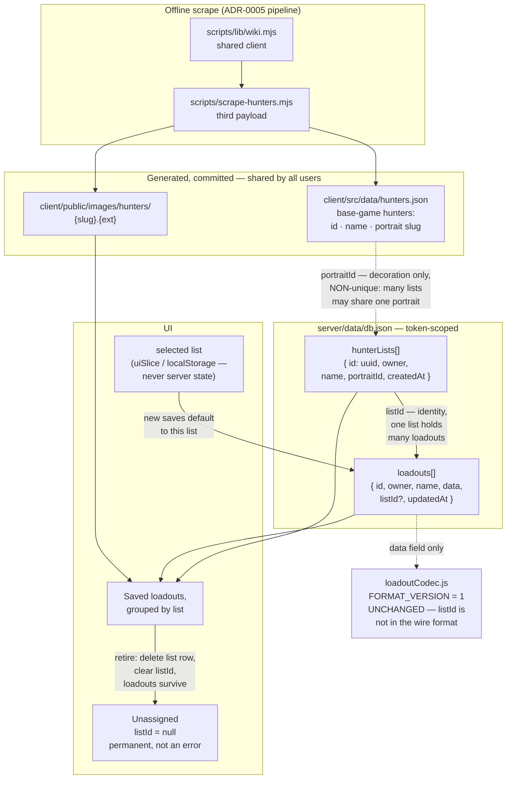

# ADR-0006: Organize Saved Loadouts into User-Named Lists Illustrated with Hunter Portraits

## Context and Problem Statement

Saved loadouts today are a flat list. A record is `{ id, owner, name, data, updatedAt }` in `server/data/db.json`, scoped to a client-issued token (issue #17), and `SavedLoadoutsPanel` renders every one of them in a single undifferentiated column. Once a user has more than a handful, the only organizing tool is the name field — people end up prefixing names by hand ("Rat — long ammo", "Rat — shotgun") to fake the grouping they actually want.

The request is to group saves under hunters: pick a hunter, file as many loadouts under it as you like, with a catch-all for anything unfiled and a "retire" action to remove a group.

**A hunter here is a list, not a simulation.** Nothing about in-game hunter mechanics — permadeath, procedural generation, recruitment cost, carried traits — is being modeled. The reason to involve hunters at all is that a folder with a face and a name is a better organizing affordance than a bare text label.

That framing raises the question this ADR turns on. If the portrait is what makes a group feel like a hunter, does the *hunter* have to be the group's identity? Binding them one-to-one caps a user at as many lists as there are hunters and makes "shotgun experiments" inexpressible. So: how are lists identified, where do the portraits come from, and what happens to a list's loadouts when it's retired?

## Decision Drivers

* A flat list stops scaling at roughly a dozen saves, and name-prefixing is the workaround users are already forced into
* Users want lists their own way — "shotgun experiments", "duo runs with Dave" — so the set of expressible groupings must not be limited to the set of hunters that exist
* But bare text lists are drab and drift ("Rat", "the rat", "Rat 2"); a portrait gives a list a strong visual identity at a glance and a sensible default name
* Loadouts are the thing worth keeping — any grouping mechanism that risks destroying them in the course of managing groups has failed at its one job
* Retiring a list is routine list-keeping, not a destructive act; it should feel as cheap as it is
* The existing save stack has a hard-won ownership boundary (issue #17): records are token-scoped, there is deliberately no shared anonymous bucket, and `db.js` explicitly rejects well-known sentinel owner values as forgeable. Anything added here must not weaken that
* `loadoutCodec.js` is at `FORMAT_VERSION = 1` with a documented migration path; bumping the wire format is possible but not free, and share URLs are already long
* Hunter portraits are substantially heavier assets than item icons — this is the first feature that would ship real photographic weight to the client
* The user-facing ask is modest; the sourcing choice attaches a scrape and an asset pipeline to it, so the two halves should be separable if the second one stalls

## Considered Options

For how a list is identified:

* User-named list records, each illustrated with a portrait chosen from a scraped pool — portraits reusable across lists
* Roster hunters *are* the lists, one list per hunter, bound one-to-one
* User-named list records with no portraits at all
* No list entity — groups derived from `DISTINCT` group reference over the user's loadouts

For where the grouping is stored:

* A token-scoped list collection plus a nullable foreign key on each loadout record
* A plain group-name string on each loadout record
* Client-only grouping in `localStorage`, never reaching the server

## Decision Outcome

Chosen option: **user-named list records, each illustrated with a hunter portrait chosen from a scraped pool, with portraits freely reusable across lists and loadouts filed via a nullable `listId`**, because it decouples the two things that were tangled together — *identity*, which needs to be user-defined and unbounded, and *imagery*, which is better drawn from a fixed pool the user doesn't have to supply. The result expresses "shotgun experiments" and "my Rat builds" equally well, and neither is a special case.

Eight sub-decisions follow.

**The portrait library is generated, committed catalog data.** A new scrape payload writes `client/src/data/hunters.json` — id, display name, portrait slug — with portraits under `client/public/images/hunters/{slug}.{ext}`. Same shape as ADR-0005's `itemStats.json`: generated, committed, imported at build time, never hand-edited, carrying the revision provenance ADR-0005 requires. It is a third consumer of `scripts/lib/wiki.mjs`, which ADR-0005 already requires be extracted.

**The library is scoped to the base-game hunters, not the paid Legendary DLC skins.** This keeps the asset payload substantially smaller, avoids leading the UI with cosmetics most users don't own, and gives every user the same pool. The scope is a starting point, not a ceiling — nothing in the data model distinguishes a base hunter from a DLC one, so widening it later is a scrape-config change and a re-run, not a schema change.

**`hunterLists` is the group entity, and it is user-owned.** Records are `{ id, owner, name, portraitId, createdAt }` in `db.json`, token-scoped exactly like `loadouts`. `id` is a generated UUID — *not* a portrait id — because the list's identity is the user's, not the catalog's.

**Portraits are decoration, and `portraitId` is deliberately non-unique.** Any number of lists may share a portrait. This is the point of the whole restructure: the count of lists a user can have is bounded by nothing, and two lists wearing the same face is a legitimate, unremarkable state. There is no unique constraint on `(owner, portraitId)`, and adding one later would break the feature rather than tighten it.

**A new list defaults its name to its portrait's hunter name, and is immediately editable.** This preserves the fast path — pick a hunter, start saving, never think about naming — while leaving the name free text. It also blunts the drift problem: the default is well-formed, so lists only diverge from the roster's vocabulary when a user deliberately types something else.

**Loadouts reference lists by nullable `listId`.** The field sits on the record envelope, sibling to `name` and `updatedAt` — not inside `data`. Null or absent means the loadout is Unassigned, which is also what every record predating this change means, so there is no migration and no backfill. Unassigned is a permanent, legitimate group, not an error state.

**The wire format is untouched.** `FORMAT_VERSION` stays at 1, `toData()`/`fromData()` are unchanged, and `isValidData()` on the server needs no edit because `listId` never enters the `data` object. Share URLs stay exactly as long as they are today. A shared build is a build; the recipient's lists are their own business.

**Retiring a list removes the list, never the loadouts.** Retire deletes the `hunterLists` row and clears `listId` on every loadout that referenced it, dropping those loadouts into Unassigned. There is no cascade delete anywhere in this feature. The confirm dialog says plainly that the list goes away and the loadouts don't.

### The selected list is client state, not server state

"Pick a hunter, then save loadouts to it" implies an active selection: while a list is selected, saves default to filing under it. That selection lives in `uiSlice` and, if it should survive a reload, in `localStorage` — never in `db.json`.

It's a cursor, not a fact. Persisting it server-side would mean a write on every click, and would make two tabs fight over which list is "current." The durable facts are which lists exist and where each loadout is filed; which one the user happens to be looking at is neither.

### On reusing the ownership model without reusing its reasoning

`db.js` carries a pointed comment about issue #17: a well-known sentinel owner value (`"anon"`, `"unowned"`) is trivially forgeable via a header and recreates the cross-user leak that issue closed. `hunterLists` is subject to that rule in full — token-scoped, no shared bucket, same `callerToken()`, same exclusion of anything not token-shaped.

The Unassigned group is *not* an instance of that pattern, and the ADR says so explicitly to keep a future reader from conflating them. `listId: null` is a grouping key applied *within* an already-token-scoped result set; an unauthenticated caller cannot reach another user's unassigned loadouts any more than their assigned ones, because the owner filter has already run. Sentinel *owners* are a security boundary and are forbidden. Sentinel *group labels* inside an owned set are just UI.

One new integrity rule has no precedent in the current code and is easy to get wrong: `listId` must be validated as *belonging to the calling token*, not merely as well-formed. A user must not be able to file their loadout into another user's list by guessing a UUID. This is a cross-collection ownership check, the first in this codebase.

### Consequences

* Good, because lists are unbounded and arbitrarily named — "shotgun experiments" and "my Rat builds" are the same kind of object, with no special case for either
* Good, because every list still arrives with a face and a sensible default name, so the fast path costs the user no naming effort
* Good, because decoupling portrait from identity means the roster's size never caps how the user organizes; adding hunters to the library adds options, not slots
* Good, because grouping survives renaming a list — `listId` is a stable UUID, so the display name is free to change at any time
* Good, because no existing data migrates: absent `listId` already means Unassigned, so every record written before this change is correct as-is
* Good, because share links and the codec are entirely untouched, so this feature cannot regress sharing
* Good, because the roster rides the pipeline ADR-0005 already justified — no new argument about scraping, no new ethics posture, no new refresh story
* Good, because scoping the library to base-game hunters cuts the asset payload and avoids fronting paid cosmetics
* Good, because the two halves are separable in the order given below, so a stalled portrait scrape doesn't block the grouping feature
* Bad, because two lists sharing a portrait look alike at a glance, so the UI has to lean on the name rather than the image to distinguish them — the cost of allowing reuse
* Bad, because it is more UI than picking a hunter would have been: create, name, pick a portrait, edit later
* Bad, because free-text names can still drift; the portrait-derived default mitigates this but does not prevent it
* Bad, because it introduces the first real asset weight in the app — portraits are photographic and a picker shows many at once
* Bad, because it adds a second collection, a second ownership surface, and a cross-collection ownership check to a server whose ownership model has already produced one security issue
* Bad, because the library grows with the game, so a stale `hunters.json` shows an incomplete portrait pool, and unlike a missing item image there's no fallback that reads as "not scraped yet" rather than "doesn't exist"
* Neutral, because `hunterLists` rows are created only when a user makes a list, so someone who never touches the feature adds no rows and sees only Unassigned
* Neutral, because nothing about in-game hunter mechanics is modeled — no permadeath, no carried traits, no recruitment cost
* Neutral, because list ordering (manual sort, most-recently-used) is unspecified; the initial implementation can order by creation date and revisit

### Confirmation

* `client/src/data/hunters.json` exists, is generated by the scrape, carries revision provenance per ADR-0005, and is not hand-edited — the same generated-file discipline `itemStats.json` is held to
* The hunter scrape imports `scripts/lib/wiki.mjs` rather than carrying its own `slugify()`/robots/rate-limit copies — a grep under `scripts/` finds exactly one definition of each
* `FORMAT_VERSION` is still `1` and `loadoutCodec.test.js` passes unmodified; a diff of `toData()`/`fromData()` against this commit's parent is empty
* `isValidData()` in `server/src/routes/loadouts.js` is unchanged, and `listId` is validated separately on the record envelope
* **A test asserts a loadout cannot be filed into a list owned by a different token** — POST with token A and a `listId` belonging to token B is rejected, not silently accepted. This is the new integrity rule and the one most likely to be missed
* A test asserts two lists owned by the same user may share a `portraitId`, and that both persist independently
* A test asserts a newly created list with zero loadouts persists and reappears on the next fetch — an empty list is a valid state, not a transient one
* A test asserts many loadouts can carry the same `listId`; there is no cap
* A test asserts retiring a list leaves its loadouts present with `listId` cleared — the loadout record count before and after is identical
* An unknown or stale `listId` degrades rather than rejecting on read: a loadout referencing a deleted list renders as Unassigned, mirroring how `fromV1()` drops catalog items that no longer exist
* Every `hunterLists` handler filters by `callerToken()` before doing anything else, and a test asserts token B cannot read, rename, or retire a list owned by token A
* A request with no `x-loadout-token` header creates no durable `hunterLists` row visible to any later request, consistent with the request-scoped anonymous identity in `callerToken()`
* The selected-list cursor appears nowhere in `db.json` — a grep of the server for `selectedList` returns nothing
* Portraits load lazily and fall back cleanly when absent, following the `` chain `ItemThumb` already uses

## Pros and Cons of the Options

### User-named lists with a reusable hunter portrait (chosen)

List identity is a user-owned UUID; the portrait is a non-unique reference into the scraped library.

* Good, because it separates identity from imagery, so neither constrains the other
* Good, because any organizing scheme is expressible, while the default naming keeps the common case effortless
* Good, because the number of lists is unbounded regardless of library size
* Neutral, because it needs a create/name/pick-portrait flow that binding to the roster wouldn't
* Bad, because portrait reuse makes lists visually ambiguous, pushing distinguishing work onto the name
* Bad, because it introduces a cross-collection ownership check with no precedent in this codebase

### Roster hunters as lists, bound one-to-one

Each hunter in the library is exactly one list; picking a hunter adopts it as a group.

* Good, because it's the simplest possible model — no list entity to create, name, or own; the FK points straight at the catalog
* Good, because groups can never be visually ambiguous, since each portrait appears once
* Good, because there is no free-text drift at all
* Bad, because the number of lists a user can have is capped by the size of the library, which is an arbitrary limit with no relationship to how anyone organizes builds
* Bad, because non-hunter groupings ("shotgun experiments") are inexpressible — the user has to press a hunter into service as a proxy
* Bad, because a user wanting two Rat lists for different playstyles simply cannot have them

### User-named lists with no portraits

Plain named groups, no scrape, no imagery.

* Good, because it is by far the smallest change that solves the stated problem
* Good, because it has no dependency on the wiki, no asset weight, and no library staleness
* Neutral, because portraits could be added later without changing the grouping model
* Bad, because it drops the imagery that was explicitly part of the request
* Bad, because untyped names drift with no well-formed default to anchor them

### No list entity — derive groups from loadouts

The group list is `DISTINCT listId` over the user's loadouts; no separate collection.

* Good, because it's the smallest possible server change: one nullable field, no new endpoints or ownership surface
* Good, because there's no referential integrity to maintain and nothing to clean up on retire
* Neutral, because the UI can still join against `hunters.json` to render names and portraits
* Bad, because an empty list cannot exist, so "make a list, then add loadouts to it" has no state to live in between those two steps — the list vanishes until the first save lands
* Bad, because there is nowhere to store the user's chosen name or portrait, which this decision requires
* Bad, because retire has nothing to act on: with no row to delete, removing a list means unassigning every loadout in it, conflating two different intents

### Plain group-name string on each loadout

No new collection; the group is whatever string is on the record.

* Good, because it is the smallest possible server change — one field, no new endpoints
* Good, because there is no referential integrity to maintain and nothing to cascade
* Bad, because renaming a list means rewriting every loadout that mentions it, a multi-record write with no transaction to make it atomic on `lowdb`
* Bad, because there is nowhere to hang a portrait, which this decision requires
* Bad, because grouping by free text invites exactly the drift the user is already working around with name prefixes

### Client-only grouping in localStorage

Grouping never reaches the server.

* Good, because it requires no API work, no new ownership surface, and no server-side validation
* Good, because it ships fastest of any option here
* Bad, because it splits the durability model incoherently: loadouts survive a browser change (server-side, keyed by token) while the grouping that organizes them does not
* Bad, because it would need reconciling later if grouping moves server-side, with no source of truth to prefer

## Architecture Diagram

## More Information

* Extends **ADR-0005** (Scrape Item Stats and Descriptions into a Generated, Committed Data File) — the portrait library is a third payload on the same pipeline, a third consumer of `scripts/lib/wiki.mjs`, and follows the same generated-committed-data and revision-provenance rules. It inherits ADR-0005's open question about how a backend-scheduled scrape reaches committed data.
* Related to **ADR-0002** (Source Weapon/Equipment Images via a One-Time, Self-Hosted Scrape) — portraits are subject to its self-hosting and attribution rules, reached through ADR-0005 rather than built on directly.
* Implementation touchpoints: `server/src/routes/loadouts.js` (ownership filtering, `isValidData`, rate limiters to mirror on new handlers), `server/src/db.js` (boot-time normalization and the issue #17 sentinel-owner reasoning), `client/src/store/savedLoadoutsSlice.js` and `client/src/components/SavedLoadoutsPanel/SavedLoadoutsPanel.jsx` (flat list to replace), `client/src/utils/loadoutCodec.js` (must remain unmodified), `client/src/components/ItemThumb/ItemThumb.jsx` (fallback pattern for portraits).
* **Suggested sequencing**, because the grouping feature and the asset pipeline are separable and the second is the slower half:
  1. Scrape hunter *names only* — no portraits. Small payload, no asset weight, unblocks everything downstream.
  2. Ship `hunterLists`, `listId`, the ownership tests (including the cross-collection check), and grouped UI against a text-only library. The feature is fully usable here; lists just have no faces yet.
  3. Add portrait scraping and lazy-loaded imagery as an enhancement.
* **Scope assumption worth confirming:** "free hunter images" is read here as the base-game hunters rather than paid Legendary DLC skins. If the intent was the full roster including DLC, only the scrape's scope changes — no schema or UI consequence, since nothing in the model distinguishes the two.
* **Superseded direction, recorded for history:** an earlier draft of this decision bound lists one-to-one to roster hunters. It was rejected because that caps a user's list count at the library size and makes non-hunter groupings inexpressible. The "portrait as decoration, identity as user-owned UUID" split is what resolves both.
* Deliberately out of scope, and worth being explicit since the entities share a name with game concepts: this decision models **filing, not hunters**. No permadeath, no carried traits, no recruitment cost, no per-hunter carry-limit validation, no health state. If a future feature wants to model an actual in-game hunter, that is a different entity than the list described here and deserves its own ADR rather than accreting fields onto `hunterLists`.
* Also out of scope: list ordering, nested lists, and sharing a list with another user.
