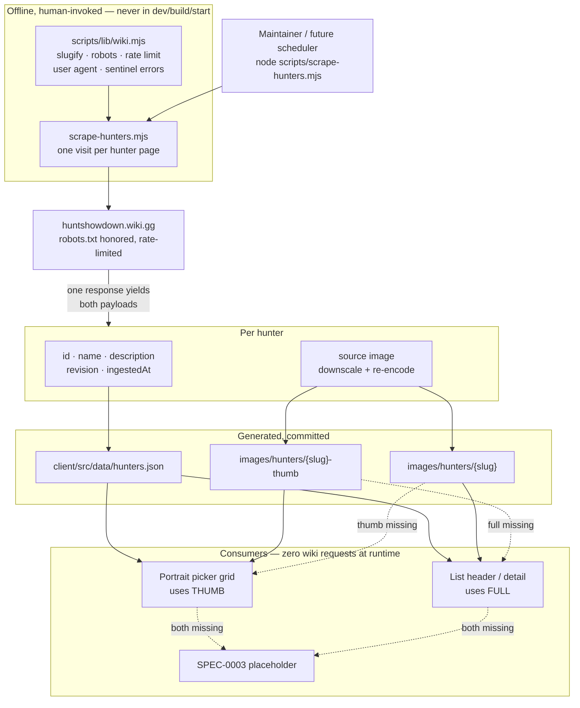

# ADR-0007: Scrape the Full Hunter Roster into a Generated Dataset with Two-Size Portraits

## Context and Problem Statement

ADR-0006 introduced loadout lists illustrated with hunter portraits, and deliberately declined to specify where those hunters come from — it states only the contract it consumes, and hands sourcing to "a separate ADR for hunter data." SPEC-0003 does the same, and its implementation sequencing opens with "scrape hunter names only," a step that has nothing behind it today.

This is that decision. The dataset needs to carry, per hunter, a stable id, a display name, a description, and portrait imagery, covering the full roster on huntshowdown.wiki.gg.

Two things make it more than a mechanical repeat of ADR-0005. First, portraits are the heaviest assets this app has ever shipped — the picker renders many at once, and ADR-0006 recorded asset weight as its single largest downside. Second, ADR-0005 established that each payload gets its own script so payloads can refresh independently, and it is worth asking whether hunters actually work that way before copying the pattern.

## Decision Drivers

* ADR-0006 and SPEC-0003 are blocked on this dataset existing; the sequencing they specify cannot start without it
* Portraits are photographic and numerous — a picker grid showing the full roster is the heaviest view in the application, and the app currently ships almost no image weight
* A hunter entry changes as a unit: the portrait and the description move together, when they move at all. Hunters are added far more often than they are edited
* ADR-0005's constraints bind: offline and human-invoked, robots.txt respected, rate limited, self-hosted output, revision provenance recorded, shared wiki client reused rather than reimplemented
* SPEC-0003 already requires consumers to tolerate a missing portrait asset and an unknown hunter id, so the dataset does not have to be complete or perfectly fresh to be usable
* The roster grows with each release, so this inherits ADR-0005's refresh problem rather than being a one-time import
* Nothing consumes descriptions yet, but re-scraping every hunter page later to add them is strictly more expensive than capturing them on the first pass

## Considered Options

For scraper shape:

* One `scripts/scrape-hunters.mjs` producing both the dataset and the portraits
* Two scripts, mirroring ADR-0005's images/stats split

For portrait processing:

* Two sizes per hunter — a thumbnail and a full-size image
* One downscaled and re-encoded size
* Store whatever the wiki serves, unprocessed

For descriptions:

* Carried in `hunters.json` alongside the rest
* A separate file loaded on demand
* Not scraped until something needs them

## Decision Outcome

Chosen option: **one `scripts/scrape-hunters.mjs` writing `client/src/data/hunters.json` and two portrait sizes per hunter, covering the full wiki roster, with descriptions carried in the same dataset file**, because it captures everything the page has in a single visit, and spends its complexity budget where the actual cost is — the images — rather than on splitting payloads that have no reason to diverge.

Six sub-decisions follow.

**One script, and this is not a departure from ADR-0005.** ADR-0005 split images from stats because item art and item stats change on genuinely independent schedules: a balance patch rewrites damage numbers across dozens of items while every image stays byte-identical. The rule it was really encoding is *fetch at the granularity at which changes actually occur*.

Hunters do not work that way. A hunter's portrait and description are two facts about one entity that change together — when a hunter's wiki entry is edited at all, which is rare — and the dominant change event is a new hunter appearing, which produces both payloads at once. Splitting here would pay a second page fetch for two things that are never separately stale. Applying ADR-0005's actual rule to hunter-shaped facts yields one script, and copying its *split* rather than its *reasoning* would be cargo cult.

**Two portrait sizes per hunter.** *(Superseded 2026-08-10 — see Amendments.)* The scrape emits a thumbnail and a full-size image, downscaled and re-encoded from the wiki original rather than stored as served. The picker grid and list-selector rows use the thumbnail; a list header or hunter detail view uses the full size. This is where the payload actually lives: a grid of full-size portraits rendered at thumbnail dimensions is the single worst thing this feature could do to page weight, and it is exactly what "store as scraped" would produce.

**Size selection falls back across sizes before falling back to a placeholder.** *(Superseded 2026-08-10 — with one asset the ladder is portrait, then placeholder. See Amendments.)* Two assets per hunter means three new failure states — thumb missing, full missing, both missing — and the naive implementation renders nothing when only one is absent. The rule is: request the size appropriate to the context; if it is absent, use the other size; only if both are absent fall through to SPEC-0003's neutral placeholder. A too-large image is a performance problem, a blank grid cell is a broken one, and this ordering prefers the former.

**The dataset is `client/src/data/hunters.json`, generated and committed.** Per hunter: a stable id, display name, description, portrait slug, and the source revision plus ingestion timestamp ADR-0005 requires. Generated, committed, imported at build time, never hand-edited — the same discipline `itemStats.json` is held to. Ids follow the existing slug derivation so they stay stable across scrapes.

**Descriptions ride in the same file.** They are short prose, small next to the portraits, and carrying them now costs one field on a page already being parsed. The alternative — adding them later — means re-visiting every hunter page for data that was in the response the first time. This is the same reasoning ADR-0005 used to justify capturing revision provenance before anything consumed it.

**Scope is the full roster, and the ethics posture is inherited unchanged.** Every hunter the wiki lists, not a subset. The scrape is offline and human-invoked, never wired into `npm run build`, `dev`, `start`, or CI; robots.txt is respected; requests are rate limited; output is self-hosted and served from the app's own origin. Descriptions are Crytek's prose and portraits are Crytek's art — covered by the same fan-content reasoning ADR-0002 established, with the existing footer attribution naming both Crytek and the wiki.

### Consequences

* Good, because it unblocks ADR-0006 and SPEC-0003, whose first implementation step is currently waiting on nothing but this
* Good, because one pass per hunter page is the minimum possible load on the wiki for the payloads being captured
* Good, because the picker grid — the heaviest view — ships thumbnail bytes rather than full-size art scaled down in the browser
* Good, because descriptions are captured before anything needs them, so adding a hunter detail view later requires no re-scrape
* Good, because it inherits ADR-0005's ethics, provenance, and shared-client rules wholesale, so no new argument about scraping needs making
* Bad, because two sizes doubles the asset count and introduces a size-selection rule the UI has to get right in every place a portrait appears
* Bad, because downscaling and re-encoding adds an image-processing dependency to a script that previously had none, which is real tooling surface for a repo with no CI
* Bad, because descriptions are scraped ahead of any consumer — if no detail view ever ships, that is dead weight in the bundle and in the diff
* Bad, because the full roster is heavier than any subset, and there is no per-hunter laziness in a build-time-imported JSON file
* Bad, because one script means a portrait-fetch failure and a description-parse failure share a run; per-item error isolation carries more weight here than it did for a single-payload script
* Neutral, because roster growth inherits ADR-0005's open question about how a backend-scheduled scrape reaches committed data
* Neutral, because exact dimensions, encoder, and format fallbacks are implementation choices deliberately left to the spec rather than fixed here

### Confirmation

* `scripts/scrape-hunters.mjs` imports slug derivation, robots handling, rate limiting, the user agent, and the sentinel error classes from `scripts/lib/wiki.mjs` — a grep under `scripts/` finds exactly one definition of each
* The script is not referenced by `npm run build`, `npm run dev`, `npm start`, or any future CI config — the ADR-0002 invariant is re-verified, not assumed
* A grep for `huntshowdown.wiki.gg` in `client/src/` returns only attribution text and comments, never a fetch or an ``
* `client/src/data/hunters.json` exists, is generated, carries per-entry source revision and ingestion timestamp, and is not hand-edited
* Exactly one portrait asset per hunter with imagery exists on disk, trimmed to the subject, and no `-thumb` variant remains *(amended 2026-08-10 — this criterion previously required both sizes and asserted the thumbnail was materially smaller)*
* A test covers both degradation paths: the portrait renders when present, and falls through to SPEC-0003's neutral placeholder when absent *(amended 2026-08-10 — there were three paths while there were two sizes)*
* SPEC-0003's tolerance requirements still hold against the real dataset: a list referencing a hunter absent from `hunters.json` stays fully usable, and a hunter with no portrait asset renders the placeholder rather than a broken image
* Per-hunter failures follow SPEC-0001's error handling standard — recorded in the run summary with hunter, URL, and reason, never silently swallowed, never aborting the run
* Ids produced by the scrape match the existing slug derivation, so re-running the scrape never re-keys an existing hunter

## Pros and Cons of the Options

### One script producing both payloads (chosen)

`scrape-hunters.mjs` visits each hunter page once and emits the dataset row and both portrait sizes.

* Good, because it matches how hunter data actually changes — as a unit, when the entry changes at all
* Good, because it makes the minimum number of requests for what is being captured
* Good, because there is one run summary, one set of flags, and one place to look when something failed
* Neutral, because it is a fourth consumer of `scripts/lib/wiki.mjs` either way
* Bad, because a failure in one payload lands in the same run as the other, so error isolation has to be per-hunter rather than per-script
* Bad, because it visibly differs from ADR-0005's pattern, which a future reader may mistake for inconsistency unless the reasoning is recorded — hence the sub-decision above

### Two scripts, mirroring ADR-0005

`scrape-hunters.mjs` for the dataset, `scrape-hunter-images.mjs` for portraits.

* Good, because it is superficially consistent with the established pattern, which is easier to explain in one sentence
* Good, because a broken image pipeline could not block a metadata refresh
* Bad, because it pays a second page fetch for payloads that are never independently stale, which is the exact cost ADR-0005's split was designed to avoid incurring needlessly
* Bad, because it doubles the surface — two entry points, two summaries, two sets of flags — for a granularity nothing needs

### Two portrait sizes (chosen)

A thumbnail and a full-size image per hunter, both downscaled and re-encoded.

* Good, because the picker grid is the heaviest view and it gets the smallest asset
* Good, because a list header can show a portrait at a size that actually looks intentional
* Neutral, because both sizes are produced in the same pass from the same source image
* Bad, because it doubles asset count and adds a selection rule to every render site
* Bad, because two assets per hunter means three degradation states instead of one

### One downscaled size

A single re-encoded image per hunter, sized for its largest use.

* Good, because it is meaningfully lighter than storing originals, with no selection rule and one degradation state
* Good, because it halves the asset count against the chosen option
* Neutral, because it still requires the image-processing dependency
* Bad, because a grid of many portraits ships bytes sized for the one place a portrait appears large, which is the majority case paying for the minority one

### Store as scraped

Whatever the wiki serves, written to disk unchanged.

* Good, because the scrape stays simple and needs no image tooling at all
* Good, because it preserves the source exactly, so re-processing later needs no re-fetch
* Bad, because it ships full-resolution art into a grid that renders it small — the worst outcome for the one consequence ADR-0006 flagged as its largest
* Bad, because asset size becomes whatever the wiki happens to serve, with no budget and no predictability

## Architecture Diagram

## More Information

* Extends **ADR-0005** (Scrape Item Stats and Descriptions into a Generated, Committed Data File) — this is a fourth consumer of `scripts/lib/wiki.mjs` and follows the same generated-committed-data, revision-provenance, and offline-invocation rules. It also inherits ADR-0005's open question about how a backend-scheduled scrape reaches committed data.
* Enables **ADR-0006** (Organize Saved Loadouts into User-Named Lists Illustrated with Hunter Portraits), which explicitly defers dataset sourcing to this decision, and **SPEC-0003**, whose sequencing step 1 is "scrape hunter names only."
* Related to **ADR-0002** (Source Weapon/Equipment Images via a One-Time, Self-Hosted Scrape) — portraits and descriptions are subject to its self-hosting and attribution rules, reached through ADR-0005.
* **SPEC-0003's dataset contract has been amended to match this decision.** It previously said the dataset provides "a portrait asset" — singular, which could express neither two sizes nor the cross-size fallback rule. Its "Hunter Dataset Consumption Contract" requirement now names both sizes, the rule that a consumer requests the size appropriate to its context, and the fallback ordering (other size before placeholder).
* **Deliberately left to the spec, not fixed here:** exact thumbnail and full-size dimensions, the image encoder and any format fallback chain, and the byte budget the confirmation criterion asserts against. Those are tuning decisions that want measurement, and pinning them in an ADR would force an ADR revision every time a number moves.
* **Open question worth settling early:** which image-processing library. It is the first such dependency in the repo, it only ever runs in a human-invoked script rather than in the app or the build, and it should be a devDependency for that reason. Worth choosing deliberately rather than by whichever example gets copied first.

## Amendments

Recorded rather than silently rewritten, so the reversal is auditable and the original reasoning survives.

### 2026-08-10 — one trimmed portrait per hunter, not two sizes

**Original:** the scrape emits a thumbnail and a full-size image per hunter, downscaled and re-encoded from the wiki original. The picker grid uses the thumbnail; a list header uses the full size. Two sizes were justified by the payload: "a grid of full-size portraits rendered at thumbnail dimensions is the single worst thing this feature could do to page weight."

**Amended to:** the scrape emits **one** portrait per hunter — the wiki original trimmed to the subject's bounding box and re-encoded at its native trimmed resolution, with no second size and no downscale.

**Why:** the two-size decision assumed the stored image is mostly hunter. Measurement says otherwise. Every wiki original is 384×256 with an alpha channel, and the subject occupies only about 54% of that width — the rest is transparent padding. The pipeline was therefore spending its byte budget, and its resolution, on empty space, then cropping away more of it in CSS.

Trimming that padding changes the arithmetic the original decision rested on:

* The subject is **204–256px tall at native** across all 242 hunters, so a single trimmed asset is large enough for every surface that renders one except the list card (see *Known limit* below). A picker tile needs 192px at 2×: **all 242 clear it in height, and 191 of 242 in width** — the 51 narrowest upscale by at most 1.08× on a square tile, against 1.5× for every hunter today.
* Once trimmed, "full size" and "thumbnail" are 207px and 192px wide — 7% apart. For the narrowest subjects the two encodes are byte-identical, because `withoutEnlargement` produces the same image twice. Two sizes had stopped being two sizes.
* One asset per hunter projects to **~2.39 MB across the roster, below the 2.91 MB two-size padded set it replaces**, while making every picker tile sharp for the first time.

So the amendment is not a trade of weight against quality. It is smaller *and* sharper *and* simpler, because the original weight problem was padding rather than resolution.

**What did not change:** the wiki is still visited once per hunter, output is still generated-committed and self-hosted, AVIF is still the encoding, and the offline human-invoked posture and its robots/rate-limit rules are untouched. The dataset file is unaffected.

**Known limit, accepted:** the 154×220 list card cannot be made sharp by any storage decision. It needs 440px of subject height at 2× and the wiki supplies at most 256 — **0 of 242 hunters clear it.** Fixing that would mean rendering the card art at ≤113px tall, which is a change to SPEC-0003's card design rather than to this pipeline, and was declined as out of scope. The card is upscaled roughly 1.9× and this is a source-resolution ceiling, not a pipeline defect.

**Blast radius:**

* This ADR's title, and the two-size sub-decisions in Decision Outcome, are retained for referential stability and auditability — the title is cited by SPEC-0003, SPEC-0004 and governing comments in the scrape. **This amendment is authoritative wherever it and the decision body disagree.**
* **SPEC-0004** loses "Two Portrait Sizes Per Hunter" and its per-size budgets, gains a trimming requirement and a single-asset budget. Its scenario asserting the thumbnail is *materially smaller in bytes* than the full size is removed rather than reworded — with one asset there is nothing to compare.
* **SPEC-0003's** "Hunter Dataset Consumption Contract" loses the cross-size fallback ordering (request the size appropriate to the context, other size before placeholder). With one asset the ladder has two rungs: the portrait, then the placeholder. The bullet in More Information above describing that contract is superseded by this amendment.
* **This ADR's own Confirmation criteria** are amended in place: the two that asserted both sizes on disk and three degradation paths described a pipeline this amendment removes, and would have been unsatisfiable by a conforming implementation.
* Consuming code no longer selects a size, so the `size` argument threaded through the render sites disappears. That work is owned by **SPEC-0003's** amended consumption contract, which states it as a requirement — this ADR records the consequence, not the obligation.
* **484 assets are already committed**, 242 of them `-thumb` variants that the new pipeline never emits. SPEC-0004 therefore requires the scrape to delete stale variants rather than leaving orphans, since a re-scrape that only overwrites would leave the payload assertions permanently unfalsifiable.
