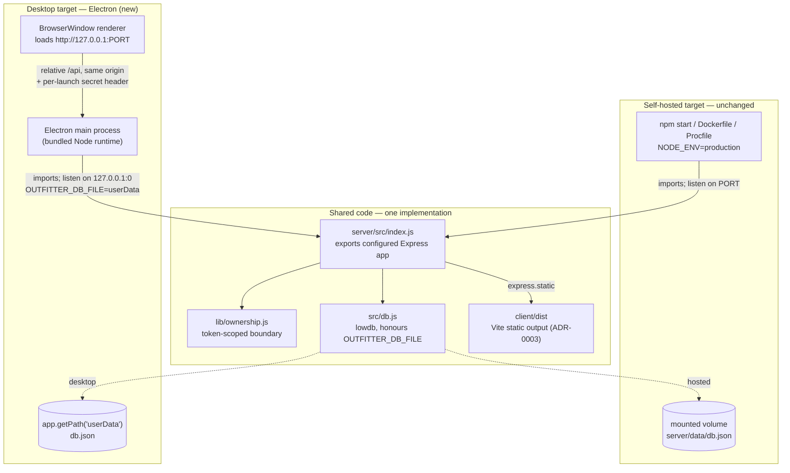
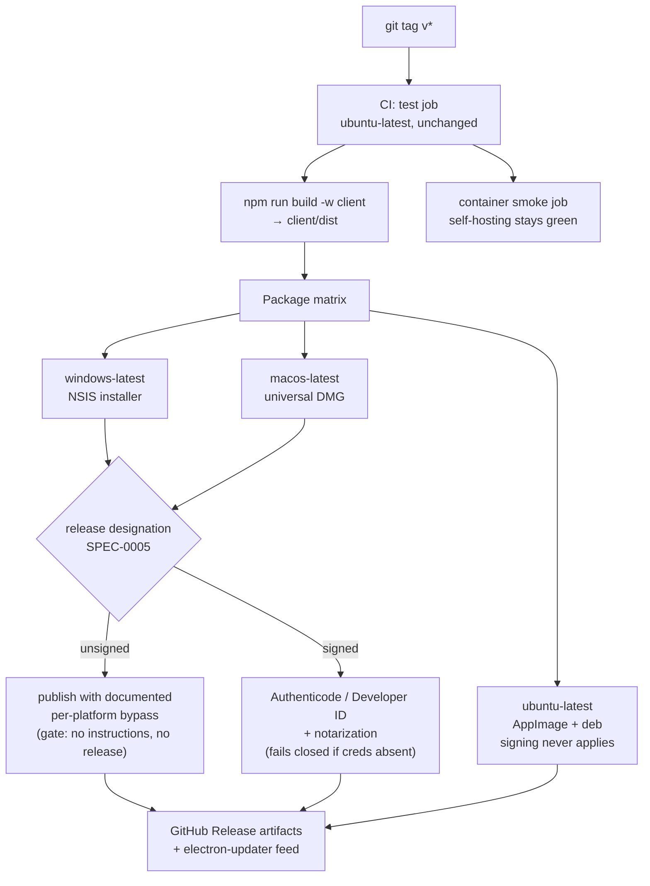

# ADR-0008: Ship a Desktop App by Wrapping the Existing Server in Electron

## Context and Problem Statement

The Outfitter today has exactly one distribution story: self-hosting. A user who
wants their own instance must have Docker, or Node 20 plus a checkout, plus a
persistent volume mounted at `server/data`, plus a free port — the README's
"Deployment" section spends three subsections on constraints that exist only
because lowdb is a single-process, single-writer store. That is a reasonable
ask of an operator and an unreasonable ask of the actual audience: a Hunt:
Showdown player who wants to build loadouts on their own machine.

We want a second, additive distribution target — a double-clickable installer
for Windows, macOS, and Linux — **without** giving up self-hosting and without
forking the codebase into a "web edition" and a "desktop edition" that drift.

The question: **how do we package this app for desktop installation while keeping
one codebase, one server implementation, and one client build serving both the
self-hosted and desktop targets?**

Two facts about the current implementation dominate the answer:

1. **The backend is Node, and it is not incidental.** `server/src/` carries the
   token-scoped ownership boundary that closed issue #17 (`lib/ownership.js`),
   the legacy-record quarantine in `db.js`, and three routers under 63 server
   tests. ADR-0006 calls the cross-token ownership rule "the rule most likely to
   be missed." Any option that reimplements this logic in another language, or
   moves it into the renderer, re-opens a class of bug we have already paid to
   close.

2. **The client is already origin-agnostic and the database path is already
   overridable.** `client/src/api/loadouts.js` defaults its base to the relative
   `/api`, so it works against whatever origin serves it. `server/src/db.js`
   already resolves `process.env.OUTFITTER_DB_FILE` ahead of its default. A
   desktop host that serves the built client and the API from one localhost
   origin, and sets `OUTFITTER_DB_FILE` to a per-user application data
   directory, needs **zero changes** to either file.

## Decision Drivers

* **One codebase, two targets.** A desktop build must consume the same
  `server/src/` and the same `client/dist` that `npm start` and the Dockerfile
  consume. A second implementation of persistence or ownership is a
  non-starter.
* **Preserve the ownership and persistence invariants.** ADR-0006 and ADR-0007
  govern `server/src/`; SPEC-0003's ownership requirements are enforced there
  and tested there. Packaging must not relocate or re-derive them.
* **Zero-prerequisite install.** The target user should not need Node, Docker,
  a terminal, or a mounted volume. Download, install, launch.
* **Three operating systems from one build pipeline.** Windows, macOS, and
  Linux, produced by CI, not by a developer's laptop.
* **Node 20 stays the canonical runtime pin.** SPEC-0002's "Canonical Node
  Version Pin" requirement (ADR-0004) makes `.nvmrc` the single source of truth;
  a desktop runtime that bundles a *different* Node major silently violates the
  environment this code is tested against.
* **Vite's static output stays the client contract.** ADR-0003 chose Vite on the
  strength of plain static output servable by any file server; the desktop host
  must be one more such server, not a reason to add a framework-specific
  adapter.
* **Honest accounting of signing cost.** Unsigned binaries carry real friction on
  two of the three platforms, and the recurring cost of removing it belongs in
  the decision rather than arriving as a surprise afterward. *(Amended
  2026-08-10: this driver originally called unsigned binaries "actively hostile,"
  which read as unshippable. The friction is real but badly asymmetric — none on
  Linux, two clicks on Windows, a System Settings trip on macOS — and SPEC-0005
  now permits unsigned publication where the bypass is documented, gating signing
  on broad promotion rather than on any release.)*

## Considered Options

* **Electron shell hosting the existing Express server on loopback** — the
  Electron main process starts `server/src/index.js` in-process on
  `127.0.0.1:<ephemeral>`, and a `BrowserWindow` loads that origin.
* **Tauri shell with a Node sidecar or a Rust rewrite of the server**
* **Installable PWA — web app manifest plus a service worker, no native packaging**
* **Do nothing — self-hosting only** (the status quo baseline)

## Decision Outcome

Chosen option: **"Electron shell hosting the existing Express server on
loopback"**, because it is the only option that makes the desktop target a
*packaging* concern rather than a *rearchitecture* concern. Electron ships a
Node runtime in its main process, which means `server/src/index.js` — ownership
boundary, lowdb store, routers, and all — runs unmodified as a library inside
the app. The client, which already resolves its API base relatively, is served
from that same loopback origin and is likewise unmodified. The two integration
points the desktop build actually needs are both pre-existing seams:
`OUTFITTER_DB_FILE` for the data path and `PORT` for the listener.

Self-hosting remains a first-class target. `npm start`, the `Dockerfile`,
`docker-compose.yml`, and the `Procfile` are untouched by this decision; the
desktop build is a fourth consumer of the same two workspaces, not a replacement
for the first three.

### Scope of the change

The desktop target is added as a **third workspace** (`desktop/`) alongside
`client/` and `server/`, containing only host code:

* An Electron main entry that imports the server, binds it to `127.0.0.1` on an
  ephemeral port, and points `OUTFITTER_DB_FILE` at
  `app.getPath("userData")/db.json`.
* An `electron-builder` configuration producing NSIS (Windows), DMG (macOS,
  universal), and AppImage + deb (Linux).
* A GitHub Actions release job on a `windows-latest` / `macos-latest` /
  `ubuntu-latest` matrix.

`server/src/index.js` currently calls `app.listen()` at module scope. It needs a
small, target-neutral refactor — export the configured `app` and move the
`listen` call behind an `import.meta.main`-style guard — so the desktop host can
bind it on its own terms. That is the **only** change to existing server code
this decision requires, and it is an improvement to the self-hosted path too
(the server's own test suite currently reaches for supertest against a re-derived
app).

### The loopback listener is authenticated, not merely local

Choosing an in-process HTTP server over Electron IPC is what makes the "run the
existing server unmodified" property possible, and it is also the one place this
decision *weakens* the app's security posture relative to the hosted model. That
trade is accepted here on the condition that the desktop host closes it, so the
mitigation is part of the decision rather than a caveat about it:

* The desktop host **SHALL** bind `127.0.0.1` explicitly, never `0.0.0.0`, on an
  ephemeral port chosen at launch.
* The main process **SHALL** generate a fresh random secret per launch, inject it
  into the renderer, and **SHALL** reject any API request that does not present
  it — before the request reaches any router.
* The desktop build **SHALL NOT** rely on the CORS allowlist for this. The
  hosted server deliberately admits requests carrying no `Origin` header, which
  is correct for `curl` against an operator's instance and wrong for a machine
  where any local process can reach the port.

The reasoning: an unauthenticated loopback listener means installing The
Outfitter silently exposes a read/write API to every other process on the
machine, and to any web page the user visits that scripts `fetch` at
`127.0.0.1`. Electron IPC would avoid this by construction — that is its genuine
advantage over the in-process server, and the reason this obligation is stated
as a decision. We take the HTTP path for the code-sharing property and pay for
it with an explicit authentication requirement, rather than pretending "it's
only on localhost" is a boundary.

An adequate mitigation is a precondition of the first release, not a follow-up.
SPEC-0005 carries the testable form.

### Consequences

* Good, because the ownership boundary, the legacy-record quarantine, and the
  lowdb store are shared *code*, not shared *design* — there is no second
  implementation to keep in sync, and the 63 server tests cover the desktop
  build's backend exactly as they cover the hosted one.
* Good, because lowdb's single-writer, single-instance constraint — a
  deployment *hazard* in the hosted model, requiring the README's warnings about
  replicas and volumes — is simply *true by construction* on the desktop. One
  process, one user, one file in the OS's application-data directory. The
  desktop target is the deployment model lowdb was always best suited to.
* Good, because `OUTFITTER_DB_FILE` gives the desktop app a per-user data
  directory the OS already backs up and already scopes, with no new persistence
  code.
* Good, because the client is served over `http://127.0.0.1:<port>` rather than
  `file://`, so it is a normal same-origin web app: relative `/api` works,
  `localStorage` (which holds the client token) has a real origin to key
  against, and no `file://` CSP or module-loading special cases arise.
* Bad, because installers are large. An Electron app that bundles Chromium and
  Node lands around 80–150 MB per platform, against an app whose own payload is
  a few megabytes of JS and scraped PNGs. This is the price of the runtime, and
  it is the single strongest argument for Tauri.
* Bad, because a loopback HTTP listener is reachable by any other process on the
  machine and by any web page that scripts `fetch` at `127.0.0.1` — an exposure
  the hosted model does not have, since there the operator controls the network
  boundary. This decision therefore carries a standing authentication
  obligation (see "The loopback listener is authenticated, not merely local"
  above, and SPEC-0005 for its testable form). Electron IPC would not carry it;
  we are trading that for the ability to run `server/src/` unmodified, and the
  trade is only sound while the obligation is actually met.
* Bad, because Electron's bundled Node major is set by the Electron version, not
  by `.nvmrc`. SPEC-0002 names `.nvmrc` the canonical pin; the desktop build
  introduces a second runtime version that CI must assert stays on the same
  major, or the guarantee ADR-0004 bought us weakens quietly.
* Bad, because signing and notarization become recurring obligations *if and
  when* the app is broadly promoted: an Apple Developer ID (~$99/year) plus
  notarization for macOS, and cloud signing for Windows. **Amended 2026-08-10:**
  this ADR originally treated unsigned builds as unshippable. That overstated
  the case — unsigned publication is now permitted where the download page
  documents the per-platform bypass, and signing gates broad promotion rather
  than any release (SPEC-0005). Two corrections behind the amendment: Windows
  signing does not reliably remove the SmartScreen warning, because SmartScreen
  keys on reputation and a new OV certificate has none; and signing credentials
  can no longer be a certificate file in CI secrets, since publicly-trusted
  code-signing keys must sit on a hardware token or cloud HSM. The friction is
  also badly asymmetric — none on Linux, two clicks on Windows, a System
  Settings trip on macOS (Sequoia removed the Control-click override) — which
  makes Apple's fee the far higher-value spend.
* Bad, because Electron carries a security-patch treadmill. Chromium CVEs
  arrive on Chromium's cadence, and an unpatched shipped app is the user's
  problem, not a server we can redeploy. This argues for `electron-updater` and
  a release cadence commitment, both of which are new maintenance surface.
* Neutral, because the token-scoped ownership model becomes near-vestigial on
  the desktop — one user, one token in one `localStorage` partition. It costs
  nothing to keep and keeps the code identical across targets, but no desktop
  behavior depends on it.
* Neutral, because CI grows a release job on a three-OS matrix. The existing
  `test` job stays on `ubuntu-latest`; only packaging fans out, and only on
  tagged releases.

### Confirmation

* `desktop/` contains **no** persistence, ownership, or route logic. A
  `grep -rE "lowdb|owner|x-loadout-token" desktop/src` returning application
  logic — rather than the loopback secret plumbing — is the signal this
  decision has drifted into a forked backend.
* `server/src/index.js` exports the configured `app`, and the only `app.listen`
  call is guarded. Both `npm start` and the Electron host reach the server
  through that one export.
* `server/src/db.js` still resolves `OUTFITTER_DB_FILE` first. The desktop build
  sets it; it does not add a second data-path branch.
* The desktop host binds `127.0.0.1` on an ephemeral port and rejects API
  requests lacking the per-launch secret. A test asserts that a request without
  the secret gets a 403 — this is the loopback-exposure mitigation, and it is
  the one new invariant this ADR creates.
* CI asserts that Electron's bundled Node major equals the major in `.nvmrc`,
  failing the release job on divergence (SPEC-0002 "Canonical Node Version Pin").
* `docker compose up --build` still boots and still serves a working instance.
  The existing container smoke job in `.github/workflows/ci.yml` is the guard
  that self-hosting did not regress; it must stay green.
* Release artifacts for all three platforms are produced by CI from a tag. A
  locally-produced installer is a smell. Each release is explicitly designated
  signed or unsigned; an unsigned one carries documented bypass instructions on
  its download page, and a signed one fails rather than silently falling back to
  unsigned output (SPEC-0005, amended 2026-08-10).

## Pros and Cons of the Options

### Electron shell hosting the existing Express server on loopback

The Electron main process is a Node process. It imports `server/src/index.js`,
binds it to loopback, and opens a `BrowserWindow` at that origin. `client/dist`
is served by the same Express static middleware the production path already
uses.

* Good, because the server runs as-is. No sidecar binary, no IPC shim, no
  reimplementation — the desktop backend *is* `server/src/`.
* Good, because both integration seams already exist in the code
  (`OUTFITTER_DB_FILE`, `PORT`) and are already tested.
* Good, because Chromium is the engine everywhere, so the rendering the
  developer tests is the rendering every user gets — no per-OS webview
  divergence to chase.
* Good, because `electron-builder` is a mature, well-trodden path to signed
  NSIS/DMG/AppImage artifacts from a GitHub Actions matrix, and
  `electron-updater` gives auto-update without additional infrastructure beyond
  a release feed.
* Neutral, because the app's own bundle stays small; nearly all of the installer
  size is runtime, which means feature growth does not meaningfully move it.
* Bad, because ~80–150 MB installers for a loadout builder is genuinely
  disproportionate, and memory footprint is a full Chromium's.
* Bad, because it introduces the loopback-exposure problem described above,
  which does not exist in the hosted model where the operator controls the
  network boundary.
* Bad, because it decouples the runtime Node major from `.nvmrc`.
* Bad, because Chromium's CVE cadence becomes a shipping obligation.

### Tauri shell with a Node sidecar or a Rust rewrite of the server

Tauri hosts the web UI in the OS's native webview (WebView2 on Windows, WKWebView
on macOS, WebKitGTK on Linux) with a Rust host process. It has no Node runtime,
so the Express backend must either be shipped as a bundled sidecar binary
(`node --experimental-sea-config`, `pkg`, or similar) or rewritten in Rust.

* Good, because installers are dramatically smaller — single-digit to low
  double-digit megabytes — and idle memory is a fraction of Electron's.
* Good, because the OS webview is patched by the OS, moving the browser-engine
  CVE burden off our release cadence.
* Good, because the Rust host is a genuinely stronger security posture for
  local IPC than a loopback HTTP port.
* Neutral, because the client is a plain Vite SPA and would need no changes to
  render inside a webview.
* Bad, because the sidecar route reintroduces most of Electron's size cost
  anyway — a self-contained Node binary is itself ~50–110 MB — while adding a
  packaging pipeline (per-platform Node SEA builds, sidecar lifecycle
  management, orphan-process cleanup) that Electron simply does not have.
* Bad, because the rewrite route means reimplementing `lib/ownership.js`, the
  legacy-record quarantine, and three routers in Rust. That is precisely the
  code ADR-0006 flags as most likely to be gotten wrong, and it would then exist
  twice, diverging on every future SPEC-0003 change. This is disqualifying
  against the "one codebase" driver.
* Bad, because three different webview engines means three different rendering
  and CSS-support surfaces to test, against an app whose UI we currently verify
  in one.
* Bad, because it adds Rust to a repository whose entire environment story
  (ADR-0004, SPEC-0002) is built on a single pinned Node toolchain. That ADR's
  reasoning rests on the app having no system-level dependencies; a Rust
  toolchain is exactly the condition it names as a revisit trigger.

### Installable PWA — web app manifest plus a service worker

Add a `manifest.webmanifest` and a service worker to the Vite build so browsers
offer "Install this app," producing a windowed, icon-in-dock experience on all
three platforms.

* Good, because it is by far the cheapest option — a manifest, some icons, and a
  service worker, with no new workspace, no packaging pipeline, and no signing
  costs at all.
* Good, because there is nothing to update out-of-band: the installed app is the
  deployed app.
* Good, because it composes with the chosen option rather than competing with
  it; it is worth doing for hosted instances regardless of what we decide here.
* Bad, because it does not answer the actual question. A PWA still requires a
  server to install *from* — the user must already have a hosted instance, which
  is the exact prerequisite we are trying to remove. It improves the experience
  of self-hosting; it does not replace it.
* Bad, because there is no installer, no offline-first data story without moving
  persistence into the browser (which forks the data layer), and no presence in
  the OS's application list on macOS or Linux comparable to a real app.
* Bad, because service-worker caching introduces a stale-asset failure mode that
  the current always-fresh static serve does not have.

### Do nothing — self-hosting only

Keep the Docker/Procfile/`npm start` story as the sole distribution path.

* Good, because it is free, and the existing deployment surface is already
  documented, containerized, and smoke-tested in CI.
* Good, because it avoids every recurring cost this decision otherwise incurs:
  certificates, notarization, Chromium patching, a three-OS release matrix.
* Neutral, because the hosted model genuinely is the right answer for anyone
  who wants a shared instance for a group.
* Bad, because it leaves the primary audience unserved. Requiring Docker or a
  Node toolchain to build Hunt: Showdown loadouts filters the user base down to
  developers, which is not who the app is for.

## Architecture Diagram

Release pipeline — the existing `test` job is unchanged; only packaging fans out,
and only on a tag:

*(Diagram amended 2026-08-10. It previously showed signing as unconditional on
the Windows and macOS legs. Per SPEC-0005 every release is explicitly designated
`signed` or `unsigned`; the first Windows and macOS releases take the `unsigned`
branch, and `signed` is required before broad promotion.)*

## More Information

**Relationship to prior decisions.**

* **ADR-0003 (Client Build Tool and Dev Server)** — that decision's stated
  requirement was plain static output servable by any file server. The Electron
  host is one more such server; this ADR consumes that guarantee and does not
  alter it. A desktop-specific build adapter in `client/vite.config.js` would be
  the signal that this ADR has encroached on ADR-0003.
* **ADR-0004 (Pin-and-Guard the Developer Environment on the Host)** — that ADR
  rests on the app having no system-level dependencies, and names the arrival of
  such a dependency as its revisit trigger. This is the main reason Tauri was
  rejected on architecture rather than on size: adding a Rust toolchain would
  trip that trigger. Electron does not, but it does introduce a second Node
  major (Electron's bundled runtime) that CI must hold to `.nvmrc`'s.
* **ADR-0006 / ADR-0007 and SPEC-0003** — the ownership and roster logic they
  govern is shared code under this decision, not reimplemented. Any future
  option that would duplicate `server/src/` should be measured against this
  paragraph first.

**Deliberately out of scope.** Auto-update policy and cadence, code-signing
certificate procurement, offline behavior for the scraped image assets (they are
already committed and served locally, so this is expected to be a non-issue),
and whether the desktop app should offer to import loadouts from a hosted
instance. Each is a follow-on decision once the packaging shape is settled.

**Specification.** [SPEC-0005: Desktop Distribution](../openspec/specs/desktop-distribution/spec.md)
carries the testable form of everything this ADR decides: the loopback
authentication boundary, the shared-server refactor and the no-forked-backend
rule, the per-user data directory, Node-major parity with `.nvmrc`, the
three-platform signed release pipeline, and the requirement that self-hosting
stay green throughout.
