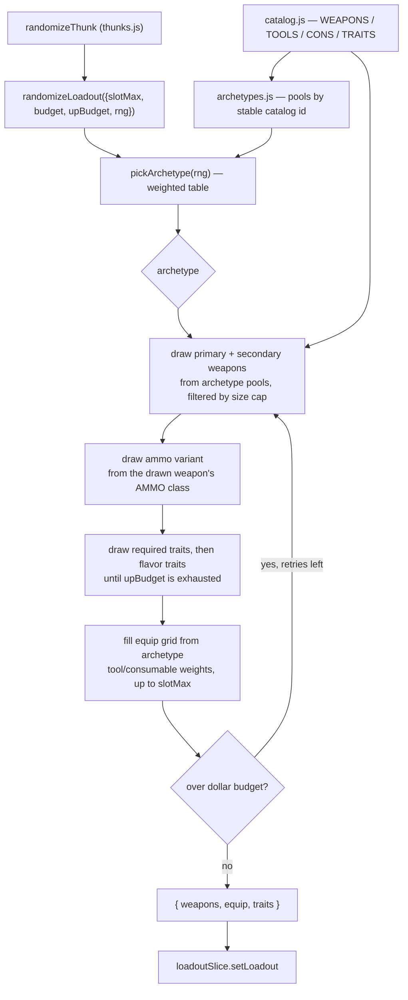

# ADR-0010: Generate Random Loadouts from Weighted Archetypes with an Injectable RNG

## Context and Problem Statement

`client/src/utils/randomize.js` builds a random loadout by sampling each part of the
build independently: three traits drawn uniformly from all 32 entries in `TRAITS`, then
two weapons drawn uniformly from whatever fits the size cap, then tools and consumables
from a 50/50 coin flip. Nothing in that pipeline knows that Fanning is worthless without
a single-action pistol, that Levering does nothing unless a Winfield is in hand, or that
Bolt Thrower is dead weight next to two shotguns — the trait roll happens *before* the
weapon roll and never consults it. The result reads as noise rather than as a build a
player would take into a match.

The same pass is also untestable and only weakly budget-aware: `Math.random()` is called
directly in seven places, so no test can assert anything beyond loose invariants, and the
budget is handled by 80 blind re-rolls that keep the cheapest miss when none land.

How should the randomizer decide what goes with what, and where should that knowledge
live?

## Decision Drivers

* Generated builds must be *coherent* — every trait rolled should have something in the
  build it acts on, and the weapon pair should read as a deliberate combination rather
  than two independent draws
* The affinity knowledge is not in the data today. The scraped dataset from ADR-0005
  carries numeric infobox fields (`Damage`, `Spread`, `AmmoType`, `Size`) and, for traits,
  only `Cost` / `Unlock` / `Category` / `Type` — nothing marks a weapon as single-action
  or lever-action, and nothing states which weapons a trait conditions on
* The generator must be testable. Coherence rules that cannot be asserted in CI will
  regress silently the first time the catalog grows
* Budget and UP caps must degrade predictably. A tight cap should shed the least important
  part of the build, not whichever part the loop happened to reach first
* The output contract is fixed: `{ weapons, equip, traits }` is consumed by
  `loadoutSlice.setLoadout`, `calc.js`, and the share codec, and cannot change shape
* Variety still matters — a randomizer that always returns the same five builds fails just
  as badly as one that returns noise, in the other direction

## Considered Options

* **Archetype templates** — pick a build archetype first, then fill every slot from that
  archetype's weighted pools
* **Affinity tags plus a weighted scorer** — tag catalog entries, keep the current
  single-pass generator, and score or veto candidate pairings as they are drawn
* **Post-hoc repair pass** — keep sampling uniformly, then validate the finished build and
  swap out the parts that do not fit
* **Extend the scrape to derive affinity** — parse trait descriptions and weapon action
  types off the wiki and generate against that derived data

## Decision Outcome

Chosen option: **archetype templates**, because it makes coherence structural rather than
a check applied after the fact. The other three options all generate an incoherent build
first and then try to detect or repair the incoherence — which means the rule set has to
enumerate every bad pairing to be correct. An archetype enumerates *good* builds instead,
which is a much smaller and more stable set to hand-maintain, and it produces something a
player recognizes ("that's a sniper loadout") rather than merely something with no
detectable conflict.

Concretely, `randomizeLoadout` becomes a three-stage pipeline in a new
`client/src/utils/archetypes.js` plus a rewritten `randomize.js`:

1. **Choose an archetype** from a weighted table — e.g. *long-range sniper*, *shotgun
   brawler*, *dual-pistol fanning*, *bow / stealth*, *utility support*, plus a
   `wildcard` archetype that samples the way the current code does, preserving today's
   behaviour as one outcome among several rather than deleting it.
2. **Fill from the archetype's pools.** Each archetype declares a primary-weapon pool, a
   secondary pool, required traits (Fanning is required by *dual-pistol fanning*, not
   optional within it), a flavor-trait pool, and tool/consumable weightings. Pools are
   authored as catalog ids, so a pool naming a retired id fails loudly in a unit test
   rather than silently resolving to the wrong item — the same discipline the catalog's
   id-over-index rule already enforces.
3. **Apply the caps.** Size, budget, and UP caps filter each pool at draw time instead of
   being retried around. Traits are drawn required-first, then flavor, so a tight UP cap
   sheds flavor traits and keeps the ones the archetype exists for. The bounded retry
   loop stays as a backstop for the dollar budget but now re-rolls *within* the chosen
   archetype.

All randomness routes through an injectable `rng` parameter defaulting to `Math.random`.
Tests pass a seeded PRNG, which is what makes any of the above assertable.

### Consequences

* Good, because a trait can no longer appear without the weapon it acts on — the archetype
  that requires Fanning is also the archetype that draws from the single-action pistol pool
* Good, because "is this build coherent?" becomes testable: with a seeded RNG, a test can
  assert that every archetype's required traits are satisfied by the weapons it drew, for
  every archetype, on every run
* Good, because budget degradation is now principled — the archetype declares what matters,
  so a $150 budget yields a cheap *version of a real build* rather than the cheapest of 80
  random misses
* Good, because seeding opens a future "share this roll" affordance at no extra cost, since
  the seed reproduces the build exactly
* Bad, because the archetype table is hand-authored and will drift from the catalog. A new
  weapon added by a game update belongs to no pool until someone puts it in one, so it can
  only be rolled by the `wildcard` archetype
* Bad, because variety narrows. Uniform sampling can produce any build in the space;
  archetypes can only produce builds someone anticipated. The `wildcard` archetype and
  generous flavor pools are the mitigation, and the weighting is a tuning knob if the
  output starts feeling repetitive
* Bad, because this is a rewrite of `randomize.js` rather than an extension, and
  `randomize.test.js`'s existing invariants (First Aid Kit starter tool, no duplicate
  tools, four-copy consumable cap) have to be carried forward deliberately rather than
  inherited
* Neutral, because the `{ weapons, equip, traits }` payload is unchanged, so the store,
  the codec, and every saved loadout are untouched

### Confirmation

* A coverage test asserts every archetype pool entry resolves to a live catalog id — this
  is what catches the table drifting behind a catalog change
* A seeded-RNG test iterates every archetype across a fixed set of seeds and asserts each
  build satisfies its own required-trait/weapon contract
* The existing invariants in `randomize.test.js` are kept and must still pass: First Aid
  Kit present by stable id, no duplicate tools, at most four copies of any one consumable,
  `equip.length <= slotMax`
* Budget tests assert that with `budgetOn` and a low budget the result is at or under
  budget when the archetype can reach it, and that with a tight `upBudget` the required
  traits survive and the flavor traits are the ones dropped
* No call site outside `randomize.js` changes — `thunks.js:11` still passes the same five
  options and dispatches the same payload

## Pros and Cons of the Options

### Archetype templates

Pick the build's identity first, then fill it in. Coherence comes from the structure of
the generator, not from a rule that runs afterward.

* Good, because bad pairings are unrepresentable rather than detected — there is no code
  path that puts Fanning next to two shotguns
* Good, because the authored artifact is a list of good builds, which is small, readable,
  and something a Hunt player can review and correct without reading the generator
* Good, because it gives the budget and UP caps a priority ordering to degrade along
* Neutral, because it needs a `wildcard` archetype to keep the long tail of the build space
  reachable — without one, the randomizer becomes a build picker
* Bad, because the table is hand-maintained and grows with the catalog
* Bad, because it is the largest change of the four

### Affinity tags plus a weighted scorer

Add tags to catalog tuples (`single-action`, `lever-action`, `bow`; traits declare a
required tag) and keep the current single-pass generator, vetoing or down-weighting
candidates as they are drawn.

* Good, because it preserves today's sampling breadth — every build stays reachable, just
  with a different probability
* Good, because the tags are reusable beyond the randomizer, e.g. for picker filters
* Neutral, because it still requires hand-authored data, just spread across the catalog
  rather than collected in one table
* Bad, because it only fixes pairings someone thought to tag. It suppresses *known* bad
  combinations and says nothing about whether what remains is a build worth taking
* Bad, because the trait roll currently precedes the weapon roll, so making tags actually
  bind requires reordering the pipeline anyway — much of the rewrite cost without the
  coherence payoff
* Bad, because catalog tuples are positional (`[id, name, size, cost, ammoClass, group]`)
  and adding a tag slot touches every consumer that destructures them

### Post-hoc repair pass

Generate as today, then validate the finished build and replace the parts that do not fit.

* Good, because it is by far the smallest diff and leaves the existing generator intact
* Good, because the validator is independently useful — it could warn on a hand-built
  loadout too
* Bad, because repair is the hardest of the three to get right: swapping a trait out
  changes the UP total, which can invalidate the UP cap, which can force another swap
* Bad, because it inherits the uniform distribution's problem. Removing conflicts from
  noise leaves conflict-free noise
* Bad, because a repair that fires often is indistinguishable from a generator that is
  wrong, and it is hard to tell which from the output

### Extend the scrape to derive affinity

Teach `scripts/scrape-stats.mjs` to parse trait descriptions ("single action pistols
only") and weapon action types, then generate against the derived data.

* Good, because the affinity data would track the game automatically across updates,
  which is exactly the drift problem the chosen option has
* Good, because it fits the direction ADR-0005 already set for item data
* Bad, because the data is not there today. The 122 scraped records carry numeric infobox
  fields plus `Category`/`Type` for traits — no action type, no weapon conditions — so
  this is a scraper project before it is a randomizer project
* Bad, because it depends on prose parsing, and ADR-0005 deliberately gates numeric
  write-through behind range assertions precisely because unvalidated extraction is a
  known hazard. "Which weapons does this trait apply to" has no comparable assertion
* Bad, because a parse regression would silently degrade generated builds with no obvious
  signal

## Architecture Diagram

## More Information

* Current implementation: [randomize.js](client/src/utils/randomize.js), called from
  [thunks.js:11](client/src/store/thunks.js:11) behind the "Random loadout" button in
  [ActionsPanel.jsx:49](client/src/components/ActionsPanel/ActionsPanel.jsx:49)
* The three defects this ADR addresses, concretely: traits are drawn at
  [randomize.js:18-27](client/src/utils/randomize.js:18) before weapons are drawn at
  [randomize.js:30-37](client/src/utils/randomize.js:30), so no pairing rule can exist;
  `Math.random()` is called directly seven times, so nothing is seedable; and the budget
  loop at [randomize.js:62-71](client/src/utils/randomize.js:62) re-rolls blindly 80 times
  and keeps the cheapest miss, while the UP cap is a greedy accept/skip at
  [randomize.js:23](client/src/utils/randomize.js:23) with no retry at all
* Related: ADR-0005 supplies the scraped item dataset that a future data-derived affinity
  model would build on, and is the reason the "extend the scrape" option is a live
  possibility rather than a non-starter — just not the near-term one
* Related: ADR-0009 fixes the equipment grid the randomizer fills, and names `randomize.js`
  as one of six consumers of `slotMax`
* The catalog's stable-id discipline (see the header comment in
  [catalog.js](client/src/data/catalog.js)) is why archetype pools are authored as ids
  rather than indices — a reordered catalog must not silently remap an archetype's pool
