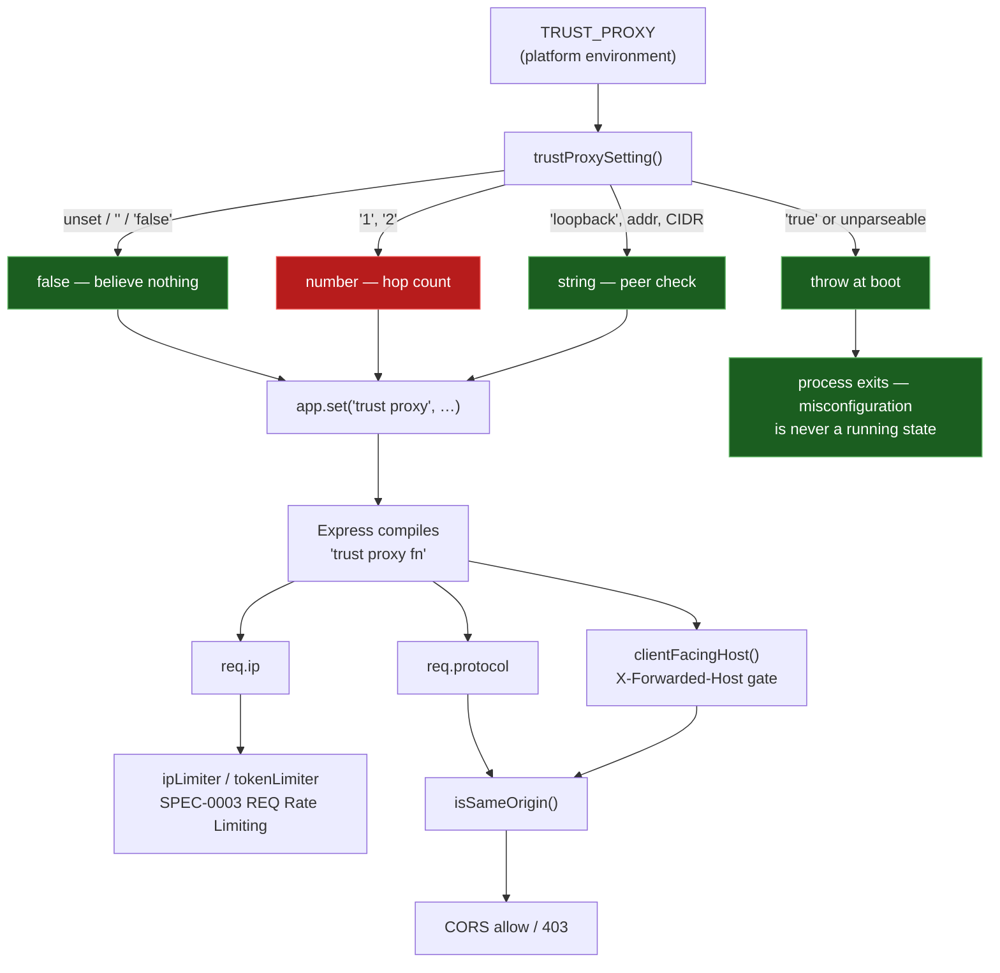

# ADR-0011: Configure the Deployment Trust Boundary Rather Than Hardcoding It

## Context and Problem Statement

Several security properties this application already claims — per-IP rate limiting, the same-origin check, the CSRF story that rests on it — are all computed from one question: **which peers is this server willing to believe when they tell it who a request came from?**

Express answers that question with a single setting, `trust proxy`, and derives `req.ip`, `req.protocol`, and `req.hostname` from it. The application had that setting hardcoded to `1`. That reads as "one proxy hop", but Express compiles a *number* to a positional predicate:

```js
// express@4, lib/utils.js
if (typeof val === 'number') {
  return function (a, i) { return i < val };   // `a` — the address — is never read
}
```

`0 < 1` is unconditionally true, so every `X-Forwarded-*` header was believed from whoever opened the socket. That is correct behaviour behind a real proxy and meaningless without one — and this repo documents three deployment topologies, two of which have nothing in front of the process (`docker-compose.yml` publishes the container port straight to the host; the `Procfile` VM runs bare). On those, any client varying `X-Forwarded-For` per request landed in a fresh rate-limit bucket every time, defeating both limiters entirely (issue #199).

The narrow bug is easy to fix. The question worth an ADR is the general one: **the correct value depends on the deployment, which the source code cannot know.** So where does that knowledge live, and what happens when it is absent or wrong?

## Decision Drivers

* The trust boundary is a property of the **topology**, not of the application. The same image is correct behind nginx and incorrect published to a host, with no code difference between them.
* **Failure must be legible.** This setting has no runtime symptom of its own — it silently changes the meaning of `req.ip`, and a limiter keyed on a spoofable value still returns `200`. A wrong value looks exactly like a right one until someone abuses it.
* **The default must be safe on the topology that gets it wrong.** A self-hosted operator running `docker compose up` is the least likely to think about forwarded headers and the most likely to be directly exposed.
* This setting is **load-bearing in two directions at once** — it governs rate limiting *and*, through `req.protocol`, the same-origin check. A value chosen for one can break the other.
* The project has one maintainer and no staging environment. Anything that can only be caught by observing production will not be caught.

## Considered Options

* **Hardcode a hop count** (the status quo: `app.set("trust proxy", 1)`)
* **Configure it via an environment variable, defaulting to trusting nothing** (`TRUST_PROXY`)
* **Detect the topology at runtime** — infer from the presence of forwarded headers or the peer address
* **Hand-roll a trust gate** independent of Express's setting

## Decision Outcome

Chosen option: **"Configure it via an environment variable, defaulting to trusting nothing"**, because the trust boundary is deployment knowledge and an environment variable is where deployment knowledge already lives in this project — and because it is the only option whose *absent* case is safe.

The resolution rules are the substance of the decision, not an implementation detail:

| `TRUST_PROXY` | Resolves to | Rationale |
|---|---|---|
| unset, `""`, `"false"` | `false` | Believe nothing. The safe default. |
| `"1"`, `"2"` | `1`, `2` | Hop count. Express needs a *number*; the bare string throws in `proxy-addr`. |
| `loopback`, an address, a CIDR, a list | passed through | Compiles to a predicate that inspects the **peer**. |
| `"true"` | **throws at boot** | See below. |
| anything unparseable | **throws at boot** | Express's own behaviour, deliberately left alone. |

Two rules carry most of the weight:

**The default is `false`, not "guess".** A deploy that says nothing about its topology gets the setting that is safe when nothing is in front. Saying yes is an explicit act.

**`"true"` is refused on purpose, and it is the interesting case.** Express's boolean `true` compiles to a predicate returning true for every peer at every hop — strictly *more* permissive than the `1` this decision removes. It is also the most guessable input for a variable named `TRUST_PROXY`, so the friendly-looking value is the dangerous one. `express-rate-limit` recognises the same value as `ERR_ERL_PERMISSIVE_TRUST_PROXY` ("allows anyone to trivially bypass IP-based rate limiting") but only logs it. Left unconverted, it falls through to `proxy-addr` and stops the process with `invalid IP address: true`. **Naming the proxy is how an operator says yes**; there is deliberately no way to say "trust everyone" by accident.

Operators are steered toward naming the proxy over a hop count, because an address or CIDR compiles to a check on the peer that actually connected — so a direct client is refused whatever it claims, and the setting stays correct even if the process becomes reachable by a second path.

### Consequences

* Good, because the same image is correct on every documented topology, configured rather than patched.
* Good, because the unsafe states are unreachable by accident: the default trusts nothing, and the two ways to ask for over-trust (`true`, a typo) both stop the process at boot instead of degrading quietly.
* Good, because naming the proxy makes `clientFacingHost()`'s existing trust gate correct as written, with no change to that function — the gate was always right, it was being handed a predicate that lied.
* Bad, because **it moves a correctness-critical value outside the repository**, where no test can reach it. This is the real cost and it is not hypothetical: on a platform that terminates TLS, leaving `TRUST_PROXY` unset makes `req.protocol` resolve to `http` while the browser sends an `https` Origin, so `isSameOrigin()` fails and the API answers **403 to every write from its own client**. Reads keep working — a same-origin `GET` carries no `Origin` header — so it presents as "the app loads but nothing saves" rather than as an outage.
* Bad, because it adds a deploy-ordering constraint a person has to hold: the platform's environment must carry `TRUST_PROXY` **before** the code that reads it ships.
* Neutral, because the failure is now at least *loud where it can be* — a malformed value stops the process rather than running wrong. The specifically quiet case is the one where the variable is simply absent, which is indistinguishable from a deliberate direct-exposure deploy.

### Confirmation

Compliance is confirmed at three levels, and the third is the one that matters:

1. **Unit** — `server/src/lib/trustProxy.test.js` asserts every resolution rule against **Express's own compiled predicate** rather than against the function's return value, because the return value is only correct insofar as Express agrees with it. `"true"` is asserted to throw, alongside what accepting it would have meant (`compiled(true)("203.0.113.9", 0) === true`).
2. **Integration** — `server/src/index.test.js` boots two live instances, one told a proxy is in front and one told nothing. The direct instance ignores a spoofed `X-Forwarded-Host` and exhausts a *single* rate-limit bucket across writes carrying a rotating `X-Forwarded-For`; the proxied instance still gives each forwarded client its own bucket. Both assertions fail against the old hardcoded `1`, which is what makes them regression tests rather than descriptions.
3. **Deployment** — **not confirmable by CI, by construction.** The value lives in the platform's environment config. The check is manual: a write to the deployed API must return a validation error rather than `403`.

```bash
curl -si https://<host>/api/loadouts -X POST \
  -H 'Origin: https://<host>' -H 'Content-Type: application/json' -d '{}' | head -1
# 400 → trust boundary configured correctly (request reached validation)
# 403 → TRUST_PROXY is missing
```

## Pros and Cons of the Options

### Hardcode a hop count (status quo)

`app.set("trust proxy", 1)` in the source.

* Good, because there is nothing to configure and nothing to get wrong at deploy time.
* Good, because it is correct on the one topology it was written for (a managed platform that always terminates in front).
* Neutral, because it *looks* like a considered decision — "one hop" reads as deliberate, which is why it survived review.
* Bad, because a number compiles to a positional predicate that never inspects the peer, so it is not "one hop" at all — it is "believe hop 0", which is "believe the client" when no proxy exists.
* Bad, because it is wrong on two of the three topologies this repo documents, and wrong in the direction that disables a security control.
* Bad, because the same image cannot be correct everywhere, so the alternative is per-deployment source patches.

### Configure via an environment variable, defaulting to trusting nothing (chosen)

`TRUST_PROXY`, resolved by `server/src/lib/trustProxy.js`.

* Good, because deployment knowledge lives with the deployment, alongside `PORT`, `NODE_ENV`, and `CORS_ORIGIN` — an established seam, not a new mechanism.
* Good, because the default is safe on the topology most likely to overlook it.
* Good, because naming the proxy yields a peer-inspecting predicate, which is a *stronger* guarantee than a hop count rather than a differently-shaped one.
* Good, because misconfiguration fails at boot rather than at some later moment of abuse.
* Bad, because a correctness-critical value now lives outside the repo and outside CI's reach.
* Bad, because it introduces a deploy-ordering constraint that documentation can describe but not enforce.

### Detect the topology at runtime

Infer trust from the presence of `X-Forwarded-*` headers, or from whether the peer looks like a private address.

* Good, because it needs no configuration and cannot be forgotten.
* Bad, because **it is the bug**. The headers are exactly what an untrusted client controls; deciding whether to trust them by looking at them is circular.
* Bad, because peer-address heuristics fail in both directions — a legitimate proxy on a public address is refused, and an attacker inside the same private network is believed.
* Bad, because it would be silently wrong rather than loudly wrong, which is the property this decision is most trying to avoid.

### Hand-roll a trust gate

Keep `trust proxy` at its default and implement a separate notion of which peers to believe, used by `clientFacingHost()` and the limiters.

* Good, because the trust rule would be explicit in application code and directly testable.
* Neutral, because for the same-origin check alone this is nearly viable — `clientFacingHost()` already does the host half by hand, for documented reasons.
* Bad, because `req.ip` and `req.protocol` are computed by Express from *its* setting. A second gate would not change them, so the limiters and the protocol comparison would still be wrong — the hand-rolled gate would cover one call site while the framework kept its own answer.
* Bad, because it means two notions of "which peers do we believe" that must agree forever, and the existing comment in `index.js` explicitly chose Express's own predicate over a second hand-rolled one for exactly this reason.

## Architecture Diagram



`NUM` is marked as the risk path rather than an error: a hop count is correct behind a platform that always terminates in front, and meaningless anywhere the process is also reachable directly. It is the one accepted value whose correctness depends on a promise the server cannot verify.

## More Information

**Origin.** Filed as issue #199 during a security review of `796ca9e`, implemented in PR #204, hardened in review — the `"true"` refusal and the deploy-ordering documentation came out of that review rather than the original patch.

**Relationship to SPEC-0003.** SPEC-0003 REQ "Rate Limiting" requires a per-IP floor "so that rotating a client-controlled token cannot bypass limiting entirely". That requirement is only satisfiable if `req.ip` is trustworthy, which is what this decision determines — hence the `governs` edge. SPEC-0003's "CSRF Protection" section rests on the same-origin allow-list, which depends on `req.protocol` from the same setting.

**Known spec gap.** SPEC-0003's Security Requirements do not currently record a read budget, the per-owner record cap, or the `409` response added in PR #205, and say nothing about the deployment trust boundary. Recording those is a separate governance change, noted here so the omission is deliberate rather than lost.

**Force multiplier.** Issue #198 (unbounded loadout writes, PR #205) was made materially worse by this bug: an attacker who could mint a fresh rate-limit bucket per request faced no ceiling on accumulation at all. The two fixes are independent but were reviewed together, and #205's new read limiter keys on the same `req.ip` this decision makes trustworthy.

**Not affected: the CORS allow-list, as a browser attack.** Issue #199 recorded this and it is worth preserving so it is not re-investigated. The old bug technically let `isSameOrigin()` be satisfied by a spoofed `X-Forwarded-Host`, but that is not reachable from a browser — `X-Forwarded-Host` is a non-simple header, so it forces a preflight, and the preflight carries `Access-Control-Request-Headers` rather than the header itself. The OPTIONS request fails the origin check and the real request never happens. A non-browser client can spoof it freely but has no use for CORS. The rate-limit consequence was always the one that mattered.

**Deferred.** Issue #213 tracks a fixed-window flake in the rate-limit exhaustion test that confirms this decision.

**Implementation.** `server/src/lib/trustProxy.js`, wired at `server/src/index.js`. Operator-facing documentation in `.env.example` and README § "Reverse proxies and `TRUST_PROXY`".
