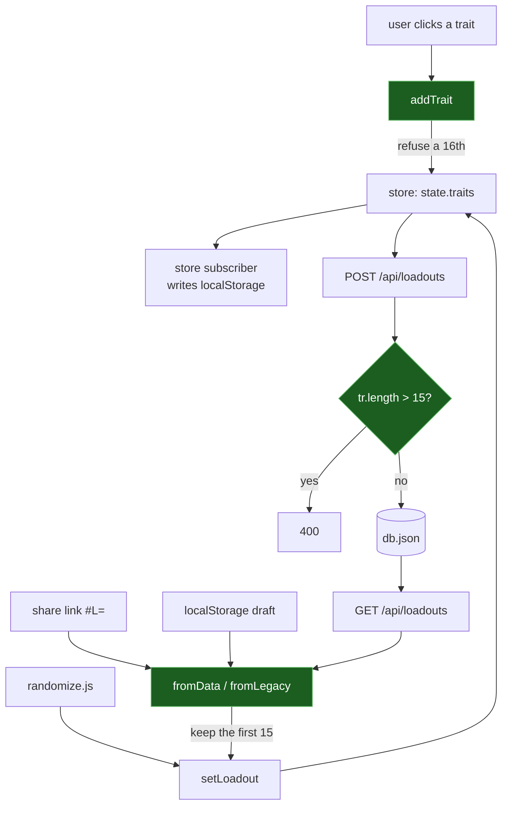

# ADR-0012: Cap a Loadout at Fifteen Traits, Bounded at Every Path That Writes One

## Context and Problem Statement

*Hunt: Showdown* lets a hunter carry at most **fifteen traits**. The builder enforces no trait count at all: `addTrait` rejects duplicates and nothing else (`loadoutSlice.js:59`), and the only thing resembling a ceiling — the upgrade-point budget — is opt-in and **off by default** (`uiSlice.js:28`). In the shipped configuration a user can add every trait in the catalog. That is 32 today and becomes 58 when the roster import in #157 lands.

The builder's other three rules are enforced and were verified correct against the wiki in the same audit pass: the eight-slot equipment ceiling, one-per-Tool, and the ten-UP default budget. This is the only rule the engine states nowhere.

So: **should the application enforce a rule the game enforces, and if so, what happens to the loadouts already saved that break it?** The second half is the harder one, and it is not hypothetical — the wire format accepts up to forty traits (`loadouts.js:70`), so an over-cap loadout is a savable, shareable record today.

## Decision Drivers

* **Fifteen does not vary.** This is the distinction that decides the shape of the answer. The UP budget is opt-in *because* it varies with hunter level, so the app cannot know a player's real ceiling. Fifteen is fixed for every hunter, which removes the reason the other ceiling is a toggle.
* **The roster is about to double.** #157 takes traits from 32 to 58. An unenforced cap gets easier to cross precisely as the catalog grows.
* **A value is only bounded if every path that writes it is bounded.** Traits reach the store from two places — the interactive `addTrait`, and decode (share link, `localStorage`, server payload) which assigns wholesale through `setLoadout`. Bounding one is not bounding the value. This repo has already learned that: PR #203 had to bound a decoded ammo index in **both** decoders because the legacy one carried a bound the current one had lost.
* **An approved spec currently says the opposite.** SPEC-0003 renders traits as a fifteen-cell grid and explicitly records fifteen as *"a fact about the game, not an invariant this application enforces"*, then specifies what a preview does when a loadout exceeds it. This decision retires that premise, and the spec has to move with it.
* **The honest severity is low.** Unlike the ammo index, an over-cap trait list crashes nothing — unknown ids are already filtered at decode and no read site indexes past an array end. The argument here is that the builder should not produce loadouts the game rejects, not that it is unsafe today.

## Considered Options

* **Enforce fifteen at every write path, clamp at decode** — reducer refuses a sixteenth, server validator refuses a sixteenth, both decoders keep the first fifteen
* **Enforce in the reducer only** — a client-side rule, leaving the wire bound at forty
* **Gate it on the upgrade-point toggle** — treat fifteen the way the UP budget is treated, opt-in
* **Do not enforce; keep rendering the overflow** — the status quo, and what SPEC-0003 currently specifies

## Decision Outcome

Chosen option: **"Enforce fifteen at every write path, clamp at decode"**, because a ceiling honoured by one of three writers is not a ceiling, and because clamping is the only handling of existing data that neither loses a record nor keeps the app knowingly producing states it calls invalid.

Concretely:

| Path | Behaviour |
|---|---|
| `addTrait` (`loadoutSlice.js:59`) | Refuses a sixteenth **unconditionally** — not gated on `upBudgetOn` |
| Server validator (`loadouts.js:70`) | `tr.length > 15` is a `400`, tightening the existing bound of 40 |
| `fromData` (`loadoutCodec.js:87`) | Keeps the first fifteen surviving ids |
| `fromLegacy` (`loadoutCodec.js:212`) | The same, after its positional→stable id translation |
| `randomize.js` | Draws within the bound (it draws three today, so this is a guard, not a change) |

**Clamping is chosen over refusing, and the reason is the same one PR #203 acted on.** A decoded loadout is persisted to `localStorage` by the store subscriber *before* it is rendered. A decode path that throws on an over-cap list would write the bad state and then fail on it — the exact shape of issue #201. Clamping keeps the record loadable and makes it self-correcting: a stored twenty-trait loadout decodes to fifteen, and the next save writes fifteen back. No migration script, and the tightened server bound does not strand it, because existing records are never re-validated on read (`GET` and `PATCH` do not call `isValidData` — confirmed in the PR #205 review).

**The cap is unconditional.** Gating it on `upBudgetOn` would be copying a mechanism without its reason: that toggle exists because the UP budget depends on a hunter level the app cannot know. Nothing about fifteen depends on anything.

### Consequences

* Good, because the builder stops producing loadouts the game would reject, which is what the other three rules already guarantee.
* Good, because the bound holds regardless of how a loadout arrives — typed, shared, restored, or randomly generated.
* Good, because over-cap records self-heal on next save rather than needing a migration.
* Bad, because **it retires a specified behaviour.** SPEC-0003's preview requirement handles the over-fifteen case and says the grid must state the remainder as a count. Once nothing can exceed fifteen, that clause describes an unreachable state. SPEC-0003 needs an amendment in the same change; leaving it is exactly the drift this project has spent the week closing.
* Bad, because clamping silently drops traits from an old share link. Bounded in practice — the live store's largest loadout holds five, and the encoder has never produced more than the user clicked — but a hand-edited code that used to decode to twenty now decodes to fifteen with no notice. Refusing outright would be louder and worse: a link that worked becomes an error with nothing recoverable.
* Neutral, because the *severity* is low. This is a correctness-of-model change, not a defect fix, and should not be described as one when it is planned.

### Confirmation

Five checks, one per write path plus the composition:

1. **Reducer** — `addTrait` refuses a sixteenth with `upBudgetOn` false, which is the configuration the rule has to hold in.
2. **Both decoders** — a payload of twenty valid trait ids decodes to fifteen through `fromData` *and* through `fromLegacy`. Asserting only the current decoder is how the ammo bound was lost the first time.
3. **Server** — a write carrying sixteen traits is a `400`; one carrying fifteen succeeds.
4. **Randomizer** — a generated loadout never exceeds fifteen, asserted against the bound rather than against the current draw count of three.
5. **Self-healing, end to end** — a stored twenty-trait record loads, renders fifteen, and re-saves as fifteen without a `400`. This is the one that proves clamping and the tightened server bound compose rather than trapping the record.

## Pros and Cons of the Options

### Enforce at every write path, clamp at decode (chosen)

* Good, because it is the only option under which "a loadout holds at most fifteen traits" is true of the data rather than of one code path.
* Good, because the decode clamp follows a pattern this codebase has already validated under fire (PR #203), rather than inventing one.
* Good, because the server bound and the client bound state the same number, so neither can drift into being the real rule.
* Neutral, because tightening the wire bound from forty to fifteen makes the validator stricter than the format strictly requires — consistent with the exact-bounds rule adopted in #205, where floors without ceilings were the defect.
* Bad, because it is four coordinated edits plus a spec amendment for a rule nothing is currently violating.
* Bad, because the decode clamp is silent, and silence is what makes dropped data hard to report later.

### Enforce in the reducer only

* Good, because it is one edit and closes the path a real user actually takes.
* Good, because it needs no spec amendment if the wire bound stays at forty — SPEC-0003's overflow clause remains true.
* Bad, because a share link, a restored `localStorage` draft, and a direct API write all bypass it. The rule would be advisory in exactly the cases where a loadout came from somewhere untrusted.
* Bad, because it leaves two numbers in the codebase — fifteen in the client, forty on the wire — with neither being the answer to "what is the maximum".

### Gate it on the upgrade-point toggle

* Good, because it reuses an existing affordance and adds no new concept.
* Good, because a user experimenting deliberately can still exceed it, which the chosen option removes.
* Bad, because it misreads why that toggle exists. The UP budget is optional because it depends on hunter level; fifteen depends on nothing, so an opt-in ceiling would be offering to disable a fact.
* Bad, because it leaves the default configuration — the one almost everyone runs — with no cap at all, which is the reported problem.

### Do not enforce; keep rendering the overflow

* Good, because it is already specified, already implemented, and costs nothing.
* Good, because it is honest about the app being a builder rather than a rules referee, and SPEC-0003 argues this position explicitly.
* Neutral, because the overflow rendering is genuinely well-specified — the grid does not grow, scroll, or clip silently, and states the remainder as a count.
* Bad, because the builder's three other rules *are* enforced, so the position is not applied consistently — a user can be stopped from carrying nine tools but not from carrying thirty traits.
* Bad, because it gets worse as the roster grows to 58, and the audit that found it rated the cap's existence MEDIUM-HIGH and the gap HIGH.

## Architecture Diagram

The loop is the point. `db.json` feeds decode, decode feeds the store, and the store feeds the save — so a bound applied at only one of the three green nodes is a bound the next lap around removes.

## More Information

**Origin.** Issue #160, from the [equipment catalog wiki audit](docs/audits/equipment-catalog-wiki-audit.md) §D.3.4. The wiki states the fifteen-trait maximum on both `/wiki/Traits` and `/wiki/Hunters`. The audit rated the cap's existence MEDIUM-HIGH and the app's failure to enforce it HIGH, and flagged two design questions rather than answering them — both are answered above: the cap is unconditional, and `blocked` does not interact with it (`blocked` is equipment-only).

**The SPEC-0003 conflict, stated plainly because it is the part most likely to be missed.** SPEC-0003 REQ "Filed Loadouts Preview Their Contents" reads:

> Fifteen is a fact about the game, **not** an invariant this application enforces … so a loadout holding more than fifteen is an ordinary savable record today. Where a loadout holds more traits than the grid has cells, the preview SHALL fill the fifteen cells and SHALL state the remainder as a count.

That was correct when written and this decision falsifies its premise.

**Amended in the same change, and the open question it left is now answered.** SPEC-0003 carries "A Loadout Holds At Most Fifteen Traits", the struck sentence is marked as such, and the overflow *rendering* is **kept as defence** rather than retired with its premise — enforcement bounds what the app writes, the preview renders what it reads, and those are not the same set. This is the answer PR #203 reached for the equivalent question when it left `WeaponSlot` defensive after bounding the value at decode. SPEC-0003 gained `implements: [ADR-0012]` and this ADR gained the matching `governs` edge.

**Not in scope.** The upgrade-point budget stays opt-in and unchanged; it is a different ceiling for a different reason. The trait roster's contents are ADR-0005's concern, and #157's growth to 58 is the motivation here rather than a dependency.

**Related decisions.** ADR-0009 is the sibling — it models the eight-cell equipment grid, the other place the builder decides what it will permit. ADR-0010's generator draws traits and must respect this bound; #160 names `randomize.js` as an explicit deliverable. ADR-0005 supplies the roster whose growth motivates this, but the relationship is a motivation rather than a structural edge, so it is recorded here rather than in frontmatter.
