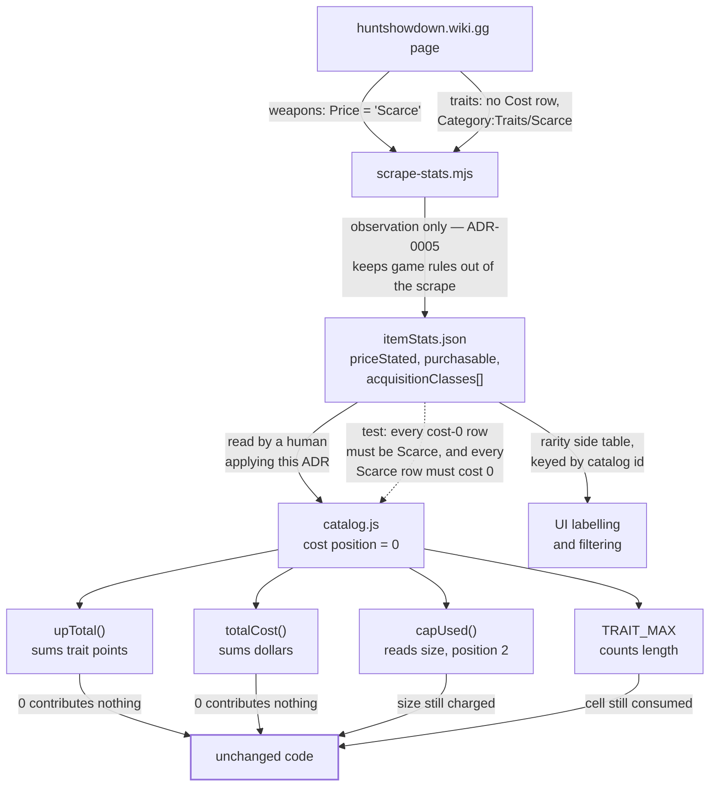

# ADR-0013: Model Scarce Items as Selectable at Zero Cost, and Keep Rarity Out of the Cost Field

## Context and Problem Statement

Scarce weapons, traits and consumables are obtainable only from a match. They can be sold but
never bought, so they have no purchase price — and the wiki says so in two mutually inconsistent
ways: a Scarce *weapon* writes the literal string `"Scarce"` where its price would go, while a
Scarce *trait* carries no cost row at all and declares its rarity only through category membership.
The catalog currently models none of them, which means a build a player can legitimately field
cannot be represented.

If they are selectable, what do they charge? And where does "this cannot be bought" live, given
that ADR-0005 forbids the scrape from encoding game rules and the catalog's rows are positional
tuples that every consumer destructures by index?

## Decision Drivers

* A player who owns a Scarce item can field it; the builder should represent the build they can
  actually take into a match.
* Scarce items have no purchase value, so they must not consume the dollar budget or the
  upgrade-point budget.
* They are still physical picks: a Scarce weapon occupies slots and size, and a Scarce trait
  occupies one of the fifteen trait cells (ADR-0012).
* ADR-0005 draws a hard line at game rules. `"Scarce"` is an observation; `cost = 0` is a rule, and
  the scrape must not be the thing that decides it.
* SPEC-0007 REQ "Budget-Affecting Attributes Are Stored, Never Inferred" — whatever a Scarce item
  charges has to be stored as a value, not computed from the absence of one.
* Catalog rows are positional (`TRAITS` is `[id, name, cost, group]`; `WEAPONS` is
  `[id, name, size, cost, ammoClass, group]`). ADR-0010 already recorded that widening a tuple
  "touches every consumer that destructures them".
* Rarity is a **set**, not a scalar: Relentless and Rampage are both Scarce and Burn, All Ears is
  both Scarce and Event. Whatever holds it has to hold more than one value per item.

## Considered Options

* Store `0` in the existing cost position, and carry rarity in an id-keyed side table
* Widen the positional tuples with a rarity field, and derive cost at the budget functions
* Keep Scarce items out of the catalog entirely (the status quo)
* Add parallel `SCARCE_WEAPONS` / `SCARCE_TRAITS` arrays alongside the existing ones

## Decision Outcome

Chosen option: **store `0` in the existing cost position, and carry rarity in an id-keyed side
table**, because it makes the budget arithmetic correct without touching a single consumer, and it
keeps the two questions — "what does this charge?" and "why is it free?" — in the two places that
already answer them.

Three things fall out for free, and that is the argument:

* `upTotal` and `totalCost` in `client/src/utils/calc.js` already **sum** cost across the picks.
  A zero contributes nothing. Neither function changes.
* Size and slot arithmetic reads different tuple positions entirely — `capUsed` reads
  `WEAPONS[i][2]`, `slotMax` reads `loadout.blocked` — so a Scarce weapon costing nothing still
  costs size, with no code aware of the distinction.
* `TRAIT_MAX` counts array length, not cost. Fifteen Scarce traits is fifteen traits.

Rarity comes from `client/src/data/itemStats.json`, keyed by catalog id, where the scrape already
writes `acquisitionClasses` as an ordered set read from each page's own category membership. Nothing
new is authored by hand except the `0` itself.

**The `0` is authored by a human applying this ADR, never written by the scrape.** The scraper
records what it observed — `priceStated: "Scarce"` for weapons, `priceStated: null` plus
`acquisitionClasses: ["Scarce"]` for traits — and stops there. That boundary is ADR-0005's, and this
decision does not move it.

### Consequences

* Good, because no budget, slot, size or cap function changes. The correct behaviour is what the
  existing arithmetic already does with a zero.
* Good, because positional tuples keep their arity, so no destructuring consumer is touched — the
  cost ADR-0010 warned about is not paid.
* Good, because rarity stays a set. A trait that is both Scarce and Burn is representable, which a
  single `rarity` column on a tuple could not manage.
* Good, because `cost = 0` is stored rather than derived at read time, satisfying SPEC-0007's
  never-infer requirement, and one grep for the cost position still finds every price.
* Bad, because a hand-authored `0` is visually indistinguishable from a missing or un-scraped price.
  A data-entry slip that drops a real cost reads as a legitimate free item, and nothing about the
  value itself objects. This is the decision's real risk and the Confirmation section exists for it.
* Bad, because the app now holds a build that costs `$0` in a game where every purchasable loadout
  costs something, so any UI that reads a low total as "cheap build" is now also reading "build made
  of things you cannot buy". Those are different claims.
* Neutral, because the wiki's own inconsistency survives into our data: the Scarce signal arrives as
  a price string for weapons and as a category for traits. Both are recorded; neither is normalised
  into a synthesised field, because normalising would mean inventing a value for whichever half of
  the wiki did not state one.

### Consequence for ADR-0012

Cost-0 traits consume trait cells but no upgrade points. A loadout of fifteen Scarce traits is
legal, costs zero points, and is accepted.

This is coherent with why the two ceilings differ in the first place, as recorded in `calc.js`: the
fifteen-trait cap is unconditional because nothing about fifteen varies with the hunter, while the
upgrade-point ceiling is opt-in (`ui.upBudgetOn`) because it varies with a hunter level the app
cannot know. A free trait tests exactly that seam — it is bounded by the cap that does not vary and
unbounded by the budget that does. No change to ADR-0012's number or its enforcement at any write
path; the cap already counts the right thing.

### Confirmation

The risk is a `0` that means "we lost the price", so the invariant is asserted rather than trusted:

1. **A catalog test asserts that every cost-0 row is Scarce according to the scrape.** For each
   catalog entry whose cost position is `0`, `itemStats.json` must carry `Scarce` in that id's
   `acquisitionClasses`, or state `priceStated: "Scarce"`. A zero with no Scarce evidence fails the
   suite. This is what makes the free items checkable instead of asserted, and it is why the rarity
   side table is worth having even though no budget function reads it.
2. **The converse is asserted too**: an item the scrape calls Scarce must not carry a non-zero cost,
   so a later re-scrape that reclassifies something surfaces as a failing test rather than as a
   silently wrong price.
3. `npm test` covers both, offline, against the committed dataset — no network access, consistent
   with ADR-0005's posture that the app and its tests never call the wiki.

## Pros and Cons of the Options

### Store `0` in the existing cost position, and carry rarity in an id-keyed side table

Scarce items become ordinary catalog rows whose cost happens to be zero. Rarity lives in
`itemStats.json` under `acquisitionClasses`, which the scrape already populates.

* Good, because every budget, size and cap function is already correct for a zero
* Good, because tuple arity is unchanged, so no consumer is touched
* Good, because rarity remains multi-valued
* Good, because the stored-not-inferred requirement is met by construction
* Neutral, because it splits one concept across two files — cost in `catalog.js`, reason in
  `itemStats.json` — which is only acceptable because a test binds them
* Bad, because `0` is an unremarkable-looking value carrying a load-bearing meaning

### Widen the positional tuples with a rarity field, and derive cost at the budget functions

Add a rarity slot to `TRAITS`, `WEAPONS`, `TOOLS` and `CONS`, then have `upTotal` and `totalCost`
skip anything marked Scarce.

* Good, because the reason an item is free sits directly on the item, where a reader looking at one
  row can see it
* Good, because no `0` can be mistaken for missing data — the rarity field is the authority
* Bad, because it touches every consumer that destructures these tuples positionally, which is the
  specific cost ADR-0010 recorded and declined
* Bad, because it makes cost a derived value, which SPEC-0007 REQ "Budget-Affecting Attributes Are
  Stored, Never Inferred" forbids for exactly this class of field
* Bad, because a single rarity slot cannot hold `Scarce + Burn`, so it needs to be a nested array
  inside a positional tuple — the worst of both shapes

### Keep Scarce items out of the catalog entirely

The status quo. Discovery reports them and the catalog omits them.

* Good, because it is free and already shipped
* Good, because no `$0` build can exist, so no total is ambiguous
* Bad, because a player who owns a Scarce item cannot build the loadout they can actually field,
  which is the app's whole purpose
* Bad, because the omission is currently undocumented, so it reads as an oversight rather than a
  boundary — the complaint #161 was opened about

### Add parallel `SCARCE_WEAPONS` / `SCARCE_TRAITS` arrays

Keep the purchasable rosters untouched and put Scarce items in their own arrays.

* Good, because purchasable rosters stay exactly as they are, so nothing existing can regress
* Bad, because every reader of a roster becomes a reader of two rosters, and any that forgets the
  second silently drops Scarce items — index-based `w.i` references would also collide across the
  two arrays unless a second addressing scheme is invented
* Bad, because the wire format encodes picks as indices into these arrays, so a parallel array is a
  wire-format change (SPEC-0006's `FORMAT_VERSION` gate) for no modelling benefit
* Bad, because rarity is a property of an item, not a partition of the roster: a trait that is both
  Scarce and Burn has no obvious home

## Architecture Diagram

## More Information

* **Extends ADR-0005** (Scrape Item Stats and Descriptions into a Generated, Committed Data File).
  ADR-0005 already called for scraping "the acquisition classification (Regular / Burn / Scarce /
  Event for traits; purchasable-vs-Scarce for consumables)". This decision consumes that
  classification and answers the question ADR-0005 deliberately left alone: what the classification
  means for the budget.
* **Extends ADR-0012** (Cap a Loadout at Fifteen Traits). See "Consequence for ADR-0012" above. The
  cap is unchanged; what changes is that a trait filling a cell may now cost nothing.
* **Scope.** In scope per the roster decision of 2026-08-11: Scarce (14 traits, 4 weapons) and Event
  (18 traits). Out of scope: Tarot Cards, which remain the boundary #161 documents.
* **Burn needs no separate decision, and its count needs stating carefully.** Six pages carry `Burn`
  in their `Type` field, but one of them — Final Gasp, whose `Type` is `"Event , Burn"` — is
  event-gated, so **five Burn traits are permanently available**: Death Cheat, Necromancer, Rampage,
  Relentless and Remedy. Every one of the six is already reachable under the scope above: Death Cheat,
  Rampage, Relentless and Remedy arrive via Scarce, Final Gasp via Event, and Necromancer is the one
  already in the catalog.

  Stated this way because the bare figure invites the wrong reading in both directions. "Six" reads as
  contradicting the five a player would count in game, and the catalog's own distribution — 31
  `Regular` and 1 `Burn` across the 32 traits it models — is a **coverage** number that reads as a
  claim about the game if quoted without that qualifier. It is not: it means five of the six Burn
  traits are missing from the catalog.

  Open question, deliberately not encoded: whether Final Gasp genuinely behaves as a burn trait while
  it is available, or whether `Event , Burn` is a wiki categorisation artifact. If the wiki is wrong
  there, that is a data-quality finding rather than something this decision should bake in.
* **Catalyst is a function, not a rarity, and so is Solo.** SPEC-0007 REQ "Fields the Scraper Must Not
  Derive" places both on the functional axis, and the wiki's data agrees: all five Catalyst traits
  state `Type: "Regular"` and nothing else, where a genuinely two-rarity trait lists both of its
  classes in that field (Relentless is `"Burn , Scarce"`). So Catalyst raises no roster question — its
  five members are already in the catalog as Regular traits, and the Catalyst tag is `group`-adjacent
  information this decision does not touch. An earlier cut of the scrape listed Catalyst on the
  acquisition axis and reported `Regular + Catalyst` as two rarities; that was one rarity plus one
  function, and it is corrected.
* **`Pact` sits on neither axis, by evidence rather than by preference.** `Category:Traits/Pact`
  exists, has zero members, and its category page states no axis — only a display title and a pointer
  back to `Category:Traits`. SPEC-0007 lists it on neither axis either. It is therefore in neither
  list in the scrape, so a Pact trait appearing carries no rarity class, which the Confirmation test
  surfaces as something to explain rather than letting a guessed rarity endorse a zero.
* **Burn does not imply free.** Necromancer is a Burn trait costing 4 points. Only Scarce implies no
  cost. Conflating the two would zero out a trait the player pays for.
* **Discovery cannot yet see these items.** `CATEGORY_INDEX` maps `traits` to
  `Category:Purchasable_Traits`, which the wiki redirects to `Category:Traits/Regular` — so the
  crawl reads 58 Regular traits and is structurally blind to the 14 Scarce and 18 Event ones.
  Implementing this decision requires `runDiscovery` to accept several index pages per catalog
  category. That is a scraper change, tracked separately, and it is why the roster figures here come
  from the MediaWiki category API rather than from a coverage run.
* **Related issues**: #157 (trait roster count — its "32 of 58" denominator is wrong in both
  directions), #161 (Scarce / Tarot Card scope boundary), #163 (unaccounted consumables, resolved as
  14 Tarot Cards plus 10 tombstones), #164 (tombstone classification).
* Rarity classes read by the scrape: `Regular`, `Scarce`, `Burn`, `Event` — exactly the four
  SPEC-0007 names on the acquisition axis. `Offensive`, `Defensive`, `Movement`, `Supportive`, `Solo`
  and `Catalyst` are the functional axis and are excluded by name. `Pact` is on neither, per above.
