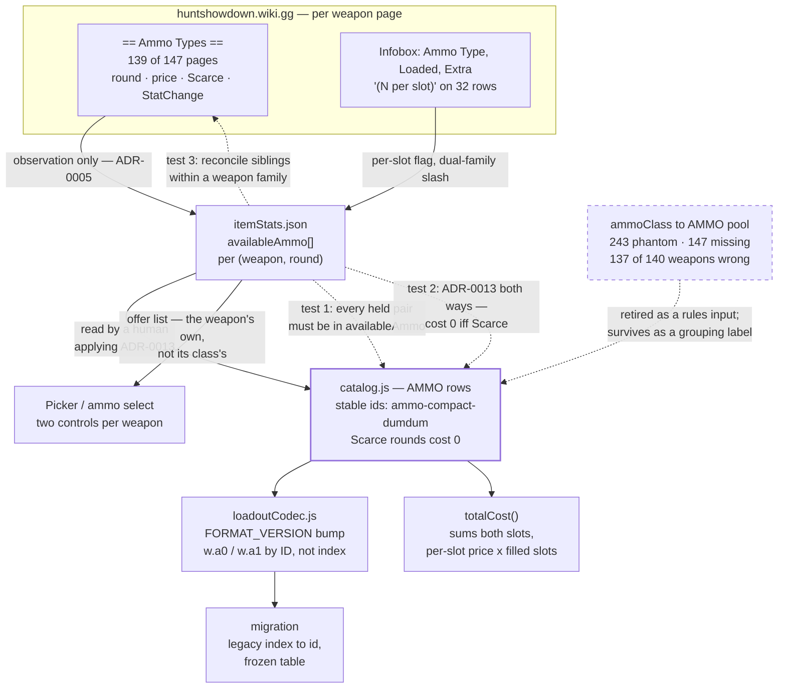

# ADR-0014: Model Ammo as Per-Weapon Rows with Stable IDs and Two Independent Slots

## Context and Problem Statement

`AMMO` is ten shared pools of `[variantName, price]` — 31 rows — and each weapon points at one pool
through a single `ammoClass` string. Three assumptions are baked into that shape: every weapon in a
class is offered every variant in the class, at one price, and holds exactly one round at a time.

All three are false. Diffing all 140 non-melee catalog rows against their own wiki pages
(read 2026-08-12): the app offers **587** (weapon, round) pairs where the wiki lists **491**, of
which **243 are rounds the weapon cannot take** and **147 are rounds it can take but the app cannot
express**. **137 of 140 weapons** are wrong in at least one direction.

So: where does per-weapon ammo compatibility live, what does a round cost when the price is neither
a class property nor derivable, and how does a saved loadout name a round now that a weapon may
carry two of them?

## Decision Drivers

* **Compatibility is stated per weapon and is scrapable.** Every one of the 139 weapon pages that
  takes custom ammo carries an `== Ammo Types ==` section listing each accepted round with its own
  price. The 8 pages without one are the six melee weapons plus Flame Rifle and Shredder. ADR-0005
  already anticipated exactly this as "the deferred `availableAmmo` list".
* **Price is per (weapon, round) and cannot be derived.** Of 46 (ammo class, round) groups priced in
  Hunt Dollars, **13 vary across weapons**. Twelve of the thirteen are exact 2:1 pairs — the per-slot
  convention below — but the base figure is not recoverable from the class, the slot count, or a
  per-weapon multiplier: 1890 Cavalry and Martini-Henry are both Long and both two-slot, yet charge
  60 and 30 for FMJ, each half of its *own* price.
* **A weapon may hold two independently chosen rounds, and the listed price buys one slot.**
  `/wiki/Weapons/Bomb_Lance`: "Lance can now equip **two different custom ammo types**. Extra ammo
  has been halved. Bomb Lance Dragon Breath price decreased to 10 Hunt Dollars **per slot**."
  Corroborated on `/wiki/Weapons/Hunting_Bow` ("Arrows price reduced from 65 to 50 (25 per slot)")
  and by `/wiki/Weapons` § Action Type: "**Single-Shot weapons can split their ammo pool between two
  ammo types**, such as regular and custom, or two types of custom ammo." **32 catalog rows** carry a
  `"(N per slot)"` reserve.
* **Seven rows are dual-*family* and no single `ammoClass` can describe them.** Drilling (+Hatchet,
  Shorty), LeMat (+Carbine, Carbine Marksman) and Haymaker each mix a core-ammo family with the Shell
  family. `Ammo Type` names only one of the two.
* **A saved ammo selection is a bare index into `AMMO[ammoClass]`**, so inserting, removing or
  reordering within a pool silently re-points every stored selection. `catalog.js` records the
  Frontier 73C incident, where a corrected `ammoClass` turned a saved Spitzer (`$60`) into a High
  Velocity (`$13`) with no error. SPEC-0007 REQ gates exactly that: "Any change that inserts into,
  removes from, or reorders an `AMMO` pool SHALL be gated behind a `FORMAT_VERSION` bump and a
  saved-selection migration." Note the gate is about **position**, not value — repricing a row in
  place moves no index and needs no bump, which matters for costing the alternatives below.
* **ADR-0013 is currently violated inside `AMMO`, in both directions.** Five pool rows charge
  22–90 for rounds the wiki marks Scarce on every weapon that lists them, while `AMMO.special` is
  empty and omits Scarce rounds that should be selectable at zero. Any fix here has to settle both.
* **ADR-0005 forbids the scrape from writing `AMMO`** and SPEC-0007 REQ "Fields the Scraper Must Not
  Derive" keeps `ammoClass` hand-authored. Whatever replaces the pools has to respect that boundary
  or move it deliberately.

## Considered Options

* **Ammo as catalog rows with stable ids, a scraped per-weapon `availableAmmo` list, and two slots
  per weapon**
* Keep the shared pools and correct the data in place
* Scrape `availableAmmo` into `itemStats.json` but keep `AMMO` as the pricing table
* Add per-weapon compatibility but keep a single ammo slot

## Decision Outcome

Chosen option: **ammo becomes ordinary catalog rows with stable ids; compatibility and price are
scraped per weapon into `itemStats.json` as `availableAmmo`; and a loadout holds two ammo selections
per weapon.** This is one `FORMAT_VERSION` bump and one migration.

**Naming note added 2026-08-17, per `/sdd:audit`.** `availableAmmo` throughout this ADR names the
*concept* this decision introduced, not the field name that shipped. `itemStats.json` scrapes it as
`ammo.accepted` (the per-round list) and `ammo.reserve` (slot count and per-slot reserve metadata) —
see `client/src/data/itemStats.js`'s `ammoSlotsFor`. SPEC-0010's Open Question 3 records the rename;
this ADR's own text was never annotated with it until now. `availableAmmo` is left as-is everywhere
else below as the decision's own vocabulary — read it as naming the concept, not a live identifier.

Four things follow, and together they are the argument:

* **Stable ids retire the bare-index hazard permanently.** A saved selection becomes
  `ammo-compact-dumdum`, not `2`. The class of bug the Frontier 73C incident demonstrated stops being
  possible rather than being gated behind a review step — which is the same move `catalog.js` already
  made for weapons, tools, consumables and traits, and for the same stated reason.
* **Price lives on the (weapon, round) pair**, because the evidence leaves nowhere else for it. The
  per-slot flag is stored alongside it rather than inferred, per SPEC-0007 REQ "Budget-Affecting
  Attributes Are Stored, Never Inferred".
* **Two slots is the model, not an extension of it.** A weapon with one ammo slot is the degenerate
  case of a weapon with two. Modelling one slot now and two later means paying for a second migration
  over the same records, and the wire-format gate applies to both.
* **`ammoClass` is retired as a rules input.** It survives, if at all, as a display grouping. What a
  weapon can take is read from its own `availableAmmo`, which makes the 243 phantom offers
  unrepresentable rather than merely corrected.

**Scarce ammo enters at cost 0 under ADR-0013, and the `special` pool stops being a special case.**
Dolch 96's Dumdum, Nitro Express's Explosive and Shredder, and the five currently-mispriced rows all
become ordinary rows costing nothing. Bomb Launcher's four Hunt-Dollar charges, Chu Ko Nu's
Incendiary Bolt at 25, and Bomb Lance's four rounds become ordinary priced rows — Bomb Lance in
particular is typed `ammoClass: "none"` today and is offered no ammo control at all.

**The scrape's boundary does not move.** `scrape-stats.mjs` writes what a page states — round name,
stated price, Scarce marker, per-slot flag — into `itemStats.json`. The `0` for a Scarce round is
authored by a human applying ADR-0013, exactly as ADR-0013 specifies for items. This decision
consumes observation; it does not ask the scraper to decide a rule.

### Consequences

* Good, because 243 phantom offers and 147 missing ones become structurally impossible: a weapon's
  offer list is its own data, not its class's.
* Good, because the bare-index hazard is retired rather than gated, and the wire format gains a
  human-readable ammo reference that a share URL can be inspected for.
* Good, because dual-family weapons and per-slot pricing become representable at all, which no
  correction to the pool model achieves.
* Good, because it settles ADR-0013's two violations inside `AMMO` in one place instead of leaving a
  known-wrong price and a known-empty pool in the data.
* Bad, because it is a `FORMAT_VERSION` bump and a migration over every stored loadout, every
  localStorage record and every share URL already in circulation — the most invasive change the
  project has made to its wire format since #68.
* Bad, because the ammo select becomes two controls per weapon on a UI that has room for one, and it
  interacts with the picker-scale work already tracked in #248.
* Bad, because `availableAmmo` makes `itemStats.json` materially larger and adds a second scraped
  shape (per-pair, not per-item) that nothing in the file has today. The 1,268 `{{StatChange}}`
  deltas the same section carries are deliberately **out of scope** here and left for the stat-block
  decision, but they will want to live on the same key.
* Neutral, because `ammoClass` survives as a grouping label with no rules meaning. That is a
  deliberately unglamorous outcome: the field stays, its authority does not.

### Consequence for ADR-0013

ADR-0013 established that a Scarce item is an ordinary row costing zero. It reasoned about weapons,
traits and consumables; ammo was not a catalog entity then, so it could not be considered. This
decision makes ammo one, and the rule applies unchanged — including its Confirmation test, which
becomes checkable for ammo rows for the first time.

Two current data states are wrong under that rule and are corrected here, not deferred: the five
pool rows priced 22–90 that every weapon marks Scarce, and the empty `special` pool whose stated
justification ("none of their custom rounds can be bought with Hunt Dollars") is false for three
weapons.

### Confirmation

The risk is a per-weapon list that drifts from the pages it came from, and a migration that
silently re-points a saved round. Both are asserted:

1. **Every (weapon, round) pair a loadout can hold must appear in that weapon's `availableAmmo`.**
   A pair with no scraped evidence fails the suite. This is what makes the 243 phantom offers
   unrepresentable rather than merely absent today.
2. **ADR-0013's invariant extends to ammo, in both directions**: an ammo row costing 0 must carry
   Scarce evidence for its weapon, and a round the scrape calls Scarce must not carry a non-zero
   cost. This is the test that would have caught the five mispriced rows.
3. **Sibling reconciliation within a weapon family.** A round whose value differs across pages that
   share a reserve shape is flagged. Measured across the 35 multi-page families, exactly one page is
   stale this way — `Mako 1895/Claw` prices Explosive Ammo at 100 where its base page and `Aperture`
   sibling both say Scarce, all three sharing one reserve — so the rule has a live case to catch and
   costs one comparison keyed on the URL's second segment.
4. **The migration is round-tripped.** Every legacy encoding decodes to the same round it named
   before the bump, asserted against a frozen table in the same shape `loadoutCodec.js` already uses
   for `LEGACY_TRAIT_IDS`. A selection that cannot be resolved must decode to "no round chosen"
   rather than to a different round.
5. `npm test` covers all of the above offline against the committed dataset, consistent with
   ADR-0005's posture that the app and its tests never call the wiki.

## Pros and Cons of the Options

### Ammo as catalog rows with stable ids, scraped `availableAmmo`, and two slots

Ammo joins weapons, tools, consumables and traits as an id-addressed catalog entity. Each weapon's
accepted rounds and their prices come from its own page; the loadout holds two selections.

* Good, because compatibility, price and slot count all become properties of the thing that varies
* Good, because stable ids end a whole class of silent data incident
* Good, because it is the only option that can express dual-family weapons and per-slot pricing
* Neutral, because it splits ammo across two files the way ADR-0013 split cost and rarity — rows in
  `catalog.js`, per-weapon evidence in `itemStats.json` — acceptable only because a test binds them
* Bad, because it is the largest wire-format change the project has undertaken
* Bad, because two ammo controls per weapon is a real UI cost on a panel that has room for one

### Keep the shared pools and correct the data in place

Fix the five Scarce prices, the misfiled bolt and arrow rounds, and populate `special`.

* Good, because it is much the smallest change and delivers correct prices for most builds quickly
* Good, because the cheapest and most visible half of it — repricing the five Scarce rows to 0 — moves
  no index and so needs **no** `FORMAT_VERSION` bump at all under SPEC-0007's positional gate. Only
  removing the misfiled bolt and arrow rounds and populating `special` do.
* Bad, because it cannot fix availability at all: a class pool cannot express that one compact weapon
  takes Dumdum and another does not, so 243 phantom offers survive by construction
* Bad, because it cannot represent a second slot, a dual-family weapon, or a per-slot price
* Bad, because it spends the migration without retiring the hazard that makes migrations dangerous —
  the next pool edit is exactly as risky as this one

### Scrape `availableAmmo` but keep `AMMO` as the pricing table

Use the per-weapon list to filter which pool rows a weapon is offered, while prices stay per class.

* Good, because it fixes availability — the larger half of the discrepancy — without touching the
  wire format at all
* Good, because it is incremental: the pools keep working for every weapon whose prices happen to
  agree with its class
* Bad, because prices are wrong for 13 of 46 (class, round) groups and this option has no place to
  put the right one
* Bad, because it leaves two sources of truth for what a weapon can take, and the pool remains the
  one the wire format addresses
* Bad, because bare indexes survive, so the hazard survives

### Per-weapon compatibility with a single ammo slot

Adopt `availableAmmo` and stable ids, but keep one selection per weapon.

* Good, because it captures most of the value for a materially smaller UI change
* Good, because it still retires the bare-index hazard
* Bad, because a build that splits 32 weapons' reserves across two rounds cannot be expressed or
  priced, and those are the weapons whose prices the wiki quotes *per slot* — so the single-slot
  total is wrong by construction for exactly them
* Bad, because adding the second slot later is a second `FORMAT_VERSION` bump and a second migration
  over the same records

## Architecture Diagram

## More Information

* **Extends ADR-0005** (Scrape Item Stats and Descriptions into a Generated, Committed Data File).
  ADR-0005 deferred this decision by name — "whether per-weapon ammo compatibility from the wiki
  should replace the coarse `ammoClass` → `AMMO` pool model … That tension deserves its own decision
  rather than being settled implicitly by this one" — and its second amendment already established
  the shape: "the wiki models a custom-ammo variant as a **per-weapon unlock with a per-weapon
  price**", with `Category:Dumdum_Ammo` and siblings being "indexes **of weapons**, not of ammo
  variants". This decision consumes that finding. ADR-0005's prohibition on the scrape writing `AMMO`
  is unchanged; what changes is that `AMMO`'s rows are now id-addressed and its prices come from a
  per-weapon list rather than from a class.
* **Extends ADR-0013** (Model Scarce Items as Selectable at Zero Cost). See "Consequence for
  ADR-0013" above.
* **The compatibility source is the section, not the categories.** Weapon pages do carry
  `Category:FMJ Ammo`-style membership, and it looks like a cheaper one-call lookup, but it agrees
  with the page's own section on only **138 of 147** pages and the nine failures cluster on the
  bolt and charge weapons: Crossbow, Hand Crossbow and Chu Ko Nu are categorised under the *rifle*
  round name, so a category-keyed scraper would map the Crossbow's Explosive Bolt onto Long
  Explosive Ammo — the exact conflation `/wiki/Ammo` warns about ("they do not share compatible ammo
  types despite sharing a name and description") and that `catalog.js` avoided by hand. Category
  tags are also applied manually and can lag: `Consumables/The Moon` is a live Tarot Card page
  missing `Category:Tarot Cards` entirely. **Parse the section; use categories only to flag those
  nine pages for review.**
* **The per-slot convention, demonstrated rather than inferred.** Within a single weapon family the
  member that loses the two-slot split pays exactly 2× on every round: Martini-Henry/Ironside
  (reserve `15`, single) charges FMJ 60 / HV 70 / Incendiary 70 where its four two-slot siblings
  charge 30 / 35 / 35; Romero 77/Alamo (reserve `12`, single) charges 20 / 10 / 130 where its four
  siblings charge 10 / 5 / 65. Six round-pairs, no exceptions. The multiplier is family-local — it
  predicts the doubling, never the base figure.
* **`"(N per slot)"` is the per-weapon signal for two slots, and the Action Type prose is not.**
  28 of the 32 rows carrying it are Single-Shot by the wiki's own definition (which includes
  crossbows and bomb launchers), but the four Berthier 1892 rows are bolt-action carbines and split
  anyway. Read the field; do not derive the property from the action type.
* **The slash in `Loaded`/`Extra` marks two ammo *families*, not two barrels.** Exactly 7 rows carry
  it and all 7 are dual-family. Nitro Express and the four Rival 78 rows are double-barrel with no
  slash, because both barrels feed one family. The app currently types Drilling to `shotgun` — its
  *secondary* family — while LeMat and Haymaker get their primary one.
* **Out of scope, deliberately.** The 1,268 `{{StatChange|field|from|to}}` deltas in the same
  `== Ammo Types ==` sections — Muzzle Velocity 310, Drop Range 276, Damage 208, Extra Ammo 198,
  Vertical Recoil 164, Spread 101 — are a second stat tier keyed on (weapon, round). They belong to
  the stat-block decision (**ADR-0019**), not this one, but they will want the same key this decision
  creates, which is an argument for creating it well rather than for widening this ADR.
* **Also out of scope**: whether a two-slot total is recorded as `2 × price` or as two independent
  priced selections (a wire-format detail for the spec), and whether the ammo select gains an image
  tier — ammo has 100 icon assets on the wiki and no `client/public/images/ammo/` directory, which is
  a separate decision (**ADR-0020**) gated on this one.
* **Provenance.** The counts, quotes and read-dates above come from a verification pass over the live
  wiki on 2026-08-12, recorded in `docs/reports/suggested-adrs.md` § A, § 3.1, § 3.8 and § 3.9, which
  arrives on `main` with **#266** so the figures are checkable rather than asserted. Every quotation in
  that document was string-matched against its source rather than retyped; the aggregate counts were
  derived by script over all 147 `Category:Weapons` pages, using the repo's own `USER_AGENT` and
  `RateLimiter` from `scripts/lib/wiki.mjs`. Where that document retracts an earlier claim of its own,
  the retraction is marked inline rather than silently patched.
* **Related issues**: #248 (picker scale at 147 weapon rows, which the second ammo control
  interacts with), #201 (unresolved ammo variant costing nothing rather than throwing — the guard
  this decision makes unnecessary), #68 (the legacy-decoder incident whose frozen-table pattern the
  migration reuses).
