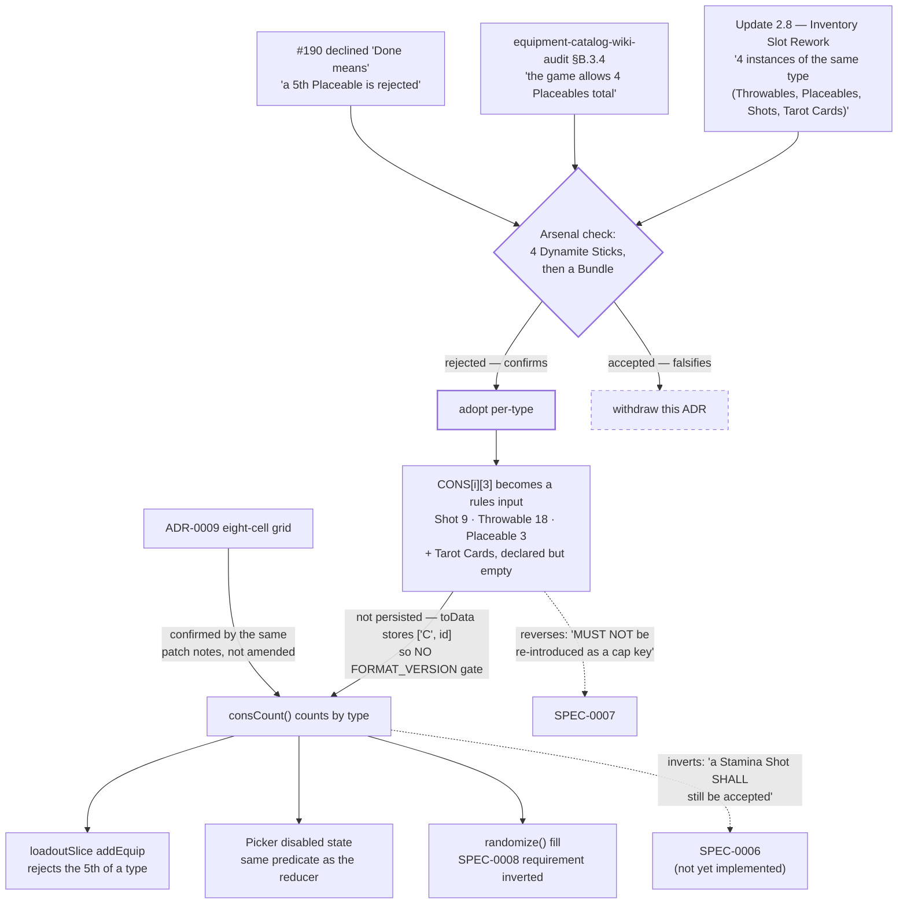

# ADR-0015: Cap Consumables at Four Per Type, Not Four Per Specific Item

## Context and Problem Statement

`consCount()` counts copies of one specific `CONS` entry, and its comment states the rule it
implements: "The 4-consumable cap is per specific consumable, not per type: four Dynamite Sticks plus
a Dynamite Bundle is a legal build." The app arrived there deliberately — #190 replaced a per-type cap
with per-item counting, #207 corrected SPEC-0006 to match, and `catalog.test.js` now exists partly to
pin "what the cap is **NOT** (per type)."

Update 2.8's Inventory Slot Rework says the opposite:

> Consumables are restricted to **4 instances of the same type (Throwables, Placeables, Shots and
> Tarot Cards)**

Because ADR-0009's grid is eight freely-mixed cells — which the same patch notes confirm — the two
rules diverge by a factor of two: the app accepts **eight** Throwables (four Dynamite Sticks plus four
Bundles) where the game permits four. So which cap does the builder enforce, where does the cap
category live given that SPEC-0007 forbids `type` from being one, and how much confidence does one
patch-note sentence buy?

## Decision Drivers

* **The rule is stated, current, and unrevised.** Nothing in Update 2.8.0.1, 2.8.0.2, 2.8.0.3 or
  2.8.1 — the latest — touches that bullet.
* **The same patch notes confirm the rest of ADR-0009 almost verbatim**, which makes the one bullet
  that contradicts the app harder to dismiss as loose writing: weapon sizes 1–5, "the player's default
  weapon capacity is 5 and can be extended to 6 with Quartermaster", and "tools and consumables are no
  longer restricted by type. Players can freely equip any tool or consumable to any slot, in any
  combination." Three for three on the app's model, then a fourth the app contradicts.
* **`CONS[i][3]` already holds the cap taxonomy, not an effect taxonomy.** Its values are exactly
  `Shot` (9 rows), `Throwable` (18) and `Placeable` (3) — three of Update 2.8's four categories, with
  the fourth (Tarot Cards) excluded from `CONS` by a separate scope decision. It holds **none** of the
  ten effect categories `/wiki/Consumables` lists (Rending, Healing, Noise, Vision, Light, …). Whoever
  authored `type` authored it against the cap categories.
* **A prior audit reached the same conclusion from game knowledge.**
  `docs/audits/equipment-catalog-wiki-audit.md` §B.3.4 records that the app "allows 4 Medical Packs
  *plus* 4 Ammo Boxes where **the game allows 4 Placeables total**", and §B.3.3 reasons that "the
  game's cap categories are *mechanical* (how the item is used), not thematic". That audit predates
  #190.
* **#190's own acceptance criterion was per-type and was overridden.** `catalog.test.js` records that
  its "Done means" asked for a test that "a 5th Placeable is rejected", and that this was declined as
  "reintroducing the retired rule". Under Update 2.8 that criterion was correct.
* **Per-type is a materially tighter bound, not a rounding difference.** `Throwable` has 18 members.
  Under per-item a build may hold 8 distinct throwables; under per-type it may hold 4 in total.
* **The evidence is thin in exactly one respect.** `"4 instances"`, `"instances of the same type"` and
  even the word `"Placeables"` each return **one** wiki-wide search hit — `Update/2.8`. The rule is
  restated on no evergreen page, and `/wiki/Consumables` still documents the pre-2.8 model (a "4-slot
  inventory" and the ten effect categories 2.8 replaced). Reversing an accepted normative requirement
  on a single sentence warrants one confirmation.
* **SPEC-0007 forbids the obvious implementation.** REQ text: "`CONS[i][3]` (`type`) is descriptive —
  it labels picker rows — and **MUST NOT be re-introduced as a cap key**." That requirement was
  written on the belief that per-item was correct.

## Considered Options

* **Cap per type, reusing `CONS[i][3]` as the cap key, and reverse SPEC-0007's prohibition**
* Keep the per-item cap (the status quo)
* Cap per type, but carry the category in a new field so SPEC-0007's prohibition stands
* Enforce both caps — four per item *and* four per type

## Decision Outcome

Chosen option: **cap consumables at four per type, keyed on `CONS[i][3]`, and reverse SPEC-0007's
prohibition with the reason recorded.** The per-item cap is not kept alongside it: four of one item is
already four of its type, so per-type subsumes it.

**The code change is gated on one in-game observation.** This ADR settles the direction; the
Confirmation section below requires an Arsenal check before `consCount`, the tests and the specs
change. The gate exists because the wiki evidence, though corroborated three ways inside this repo, is
one sentence on one page — and because the check is a single loadout edit.

Reusing `type` rather than adding a field is the honest form of the change. A parallel `capCategory`
column would hold the same three values `type` already holds, and would leave a reader to work out
which of two near-identical fields the rules read. SPEC-0007's `MUST NOT` was not an arbitrary
guardrail: it was the correct conclusion from a wrong premise, recorded so that the retired per-type
rule could not creep back by accident. It is being reversed **deliberately, by an ADR, with the
evidence stated** — which is precisely the path that requirement was written to force.

**`type` therefore becomes a rules input, and inherits the obligations of one.** SPEC-0007 REQ already
anticipates the promotion: "Any field newly identified as a rules input SHALL be checked for positional
or persisted coupling before it is corrected." That check has been done and both halves are on record —
the evidence in `docs/audits/equipment-catalog-wiki-audit.md`, which found `type` "is never persisted —
`toData()` stores only `["C", id]`", and the conclusion in SPEC-0007 itself: "`type` has been checked
and has none, so it carries no `FORMAT_VERSION` gate." So promoting it carries **no migration and no
wire-format gate**. That is the one place this decision is cheaper than it looks, and it is the sharpest
contrast with ADR-0014, whose equivalent change is a bump and a migration.

**Tarot Cards are the fourth category and stay out of the catalog for now.** The cap mechanism must
accept a category with no rows yet, so the cap is read from a declared list of categories rather than
inferred from the rows present. When Tarot Cards are admitted — at cost 0 under ADR-0013 — they need
no new mechanism, which removes the argument the `CONS` boundary comment currently makes for keeping
them out.

### Consequences

* Good, because the app stops accepting builds the game rejects. The current error is unidirectional
  and always permissive: every over-cap build the app allows is unbuildable in a match.
* Good, because no schema, wire-format or migration work is required — `type` is not persisted, so
  this is a predicate change and its tests.
* Good, because the cap becomes a declared category list, so admitting Tarot Cards later is data, not
  mechanism.
* Good, because `type`'s meaning stops being contradicted by its own values. A field holding exactly
  the game's cap categories while being documented as "descriptive, not a rules input" is a trap for
  the next reader.
* Bad, because it reverses an accepted normative requirement and inverts SHALL-level scenarios in
  two specs. That cost is real and is the reason this is an ADR and not a bug fix.
* Bad, because it is a visible tightening: a build a user has already saved and shared may now exceed
  a cap it did not exceed when they built it. The picker will disable items it previously offered.
* Bad, because per-type counting is less legible in the UI than per-item — "why can I not add this
  Frag Bomb?" is answered by a budget the user cannot see on the item they clicked, whereas a per-item
  cap is self-evident from the four copies in front of them. Whatever surfaces the cap has to name the
  category.
* Neutral, because the app's five `CONS_GROUPS` UI buckets (`Shots`, `Explosives`, `Fire`, `Gas`,
  `Utility`) are **not** the cap categories and must not be conflated with them. Medical Pack is
  `group: "Shots"` and `type: "Placeable"`; that divergence is correct and stays.

### Consequence for ADR-0009

ADR-0009 is confirmed, not amended. Update 2.8's "freely equip any tool or consumable to any slot, in
any combination" is the eight-cell freely-mixed grid ADR-0009 chose, stated by the game. The
`/wiki/Consumables` sentence describing a separate "4-slot inventory" for consumables is pre-2.8 text,
corroborated as stale by Update 2.6 bug reports still referring to "Consumable slots 1 and 4".

What changed is narrower: SPEC-0006 has since shipped (`equipment-slot-arrangement/spec.md` corrected
its own "not implemented" claim on 2026-08-13, and this ADR's identical claim was never propagated
with it — corrected here 2026-08-17 per `/sdd:audit`). `state.equip` is a sparse eight-element array,
`blocked` is a set of cell indices, and `FORMAT_VERSION` has since moved past even SPEC-0006's own
v2. Inverting its two cap scenarios is accordingly a behaviour change against live code, not a spec
edit against unbuilt work. Its stacking model does interact — a `×3` stack counts 3 toward its
**type's** budget rather than its item's — and that clarification was written into SPEC-0006 as part
of its own implementation rather than remaining owed.

### Consequence for ADR-0013

Tarot Cards are one of the four cap categories, which settles a live question in the `CONS` boundary
comment. That comment argues admitting Tarot Cards "needs no new modelling" because "what is capped is
the specific item, so a fourth Tarot Card is bounded by the same rule as a fourth Frag Bomb." Under
per-item counting with eight cells that is false — eight Tarot Cards pass — and under this decision it
becomes true for a different reason: they are bounded because their **category** is capped at four.
The conclusion survives; its stated reason does not, and the comment should be corrected rather than
left to be re-derived.

### Confirmation

The decision rests on documentary evidence with one gap, so the gap is closed first and the invariant
is asserted after:

1. **Prerequisite, before any code changes: one Arsenal observation.** Equip four Dynamite Sticks,
   then attempt a Dynamite Bundle. Rejected confirms per-type; accepted falsifies this ADR and it
   should be withdrawn rather than amended. Record the result and the game version in this ADR. This
   is deliberately the only manual step and it gates the rest.
   **SATISFIED — the Bundle was rejected.** See "Amendment (2026-08-12)" below. Steps 2–6 are now
   implementable.
2. **A reducer test asserts the cap per type**, in the form #190's original "Done means" asked for: a
   fifth `Placeable` is rejected, and — the case that inverts SPEC-0006's current scenario — a Stamina
   Shot is **rejected** after four Vitality Shots, because both are `Shot`.
3. **A catalog test asserts every `CONS` row's `type` is one of the declared cap categories.** A row
   typed outside the list is a data error that would silently escape the cap, which is the failure mode
   the misfiled `Medical Pack` produced before #155 corrected it.
4. **The picker and the reducer are asserted to agree**, per SPEC-0006's existing requirement that
   the picker's enabled state derive from the same predicate the reducer enforces. A per-type cap makes
   divergence easier, because the disabling item is not the item clicked.
5. **The generator is asserted to respect it** — SPEC-0008 currently requires the opposite in so many
   words ("counted per specific consumable rather than per consumable type"), so the randomizer's fill
   is in scope for this change, not a follow-on.
6. `npm test` covers 2–5 offline. Step 1 cannot be automated and is not pretended to be.

## Pros and Cons of the Options

### Cap per type, reusing `CONS[i][3]`, and reverse SPEC-0007's prohibition

`consCount` counts entries sharing a `type` rather than an index; the cap reads a declared list of
categories so an empty one (Tarot Cards) is legal.

* Good, because the field already holds exactly the right three values and no new data is authored
* Good, because `type` is not persisted, so there is no migration and no `FORMAT_VERSION` gate
* Good, because it matches the only stated game rule and the audit that predates the current code
* Neutral, because it reverses a requirement — acceptable only because an ADR is the mechanism that
  requirement named for reversing it
* Bad, because it inverts SHALL scenarios in SPEC-0006 and SPEC-0008
* Bad, because the cap becomes invisible on the item that triggers it

### Keep the per-item cap

The status quo, as #190 and #207 established it.

* Good, because it is shipped, tested, specified and understood, and legible in the UI
* Good, because no accepted requirement is reversed and no saved build becomes over-cap
* Bad, because it accepts up to eight consumables of a type where the game permits four, so the
  builder's central promise — that a priced build is a build you can field — is false for those builds
* Bad, because it leaves `CONS[i][3]` holding the game's cap categories while documented as not being
  a cap key, which invites the same rediscovery again
* Bad, because the divergence is now recorded in three places (Update 2.8, the audit, #190's declined
  criterion) and leaving it costs the credibility of the ones that noticed

### Cap per type via a new `capCategory` field

Leave `type` descriptive and introduce a second field holding the cap category.

* Good, because SPEC-0007's `MUST NOT` stands unamended, so no accepted requirement is reversed
* Good, because it leaves room for a cap category that is *not* a type, should one appear
* Bad, because the new field's values would be identical to `type`'s for all 30 rows, so the codebase
  carries two fields with one meaning and a reader must learn which the rules read
* Bad, because it widens the positional `CONS` tuple, which ADR-0010 recorded as touching every
  consumer that destructures it — a cost ADR-0013 also declined
* Bad, because it honours the letter of a requirement whose premise is now known to be wrong, which is
  a worse record for the next reader than a documented reversal

### Enforce both caps — four per item and four per type

Keep `consCount` and add a second per-type check.

* Good, because it is strictly the safest: no build passes that either rule rejects
* Bad, because the per-item rule is redundant — four of one item is already four of its type, so the
  second check can never be the binding one
* Bad, because it keeps a rule with no evidence behind it alongside one with evidence, and a future
  reader cannot tell which is load-bearing
* Neutral, because it would preserve the existing tests unchanged, which is a real convenience and
  the only argument for it

## Architecture Diagram

## More Information

* **Extends ADR-0009** (Model Equipment Slots as a Fixed, Sparse Eight-Cell Grid). The grid is
  confirmed by Update 2.8 rather than changed; see "Consequence for ADR-0009". ADR-0009's own
  "Duplicate consumables are already legal" section is where the per-category → per-item history is
  recorded, and it is the paragraph this decision reverses.
* **Governs SPEC-0006, SPEC-0007 and SPEC-0008.** The specific text this decision changes, so a
  reviewer can find it: SPEC-0007's REQ sentence "`CONS[i][3]` (`type`) is descriptive … and MUST NOT
  be re-introduced as a cap key" plus its scenario ending "same `type`, different item — it SHALL be
  accepted"; SPEC-0006's Overview paragraph "two different consumables never share a budget" and its
  scenario "while a Stamina Shot SHALL still be accepted"; SPEC-0008's requirement "counted per
  specific consumable rather than per consumable type, consistent with `consCount` in `calc.js`".
* **Why per-type is the natural reading of the bullet.** "4 instances of the same type" could be read
  as "4 of the same item", with the parenthetical merely naming the categories consumables belong to.
  Three things make the category reading the better one: the parenthetical glosses "type" with exactly
  four category names; the *previous* bullet retires type as a constraint on **placement** ("no longer
  restricted by type … any slot"), which is only worth saying if type still constrains **quantity**;
  and the same notes add "category filters for Throwables, Placeables, Shots and Tarot Cards" to the
  arsenal UI. `CONS[i][3]` independently matching that four-item list is the fourth.
* **The cap categories are not the UI groups, and the wiki has a third taxonomy.**
  `/wiki/Consumables` lists ten *effect* categories (Throwable, Placeable, Rending, Healing, Noise,
  Explosive, Fire, Poison, Vision, Light) and no "Shots" at all; Update 2.8 says its four filters
  "have (for now) replaced some of the previous more granular filters", so that list is pre-2.8. The
  app's `CONS_GROUPS` is a fourth, app-side grouping. Only Update 2.8's four are cap categories.
* **The one contrary data point, and why it does not bear on this.** `/wiki/Consumables` describes a
  "4-slot inventory" for consumables, which would cap consumables at four *in total* rather than four
  per type. It is pre-2.8 text on the same page as the replaced category list, and Update 2.8's
  free-assignment bullet contradicts it directly. If it were current, ADR-0009's eight cells would be
  wrong too — and the patch notes confirm those. Recorded because it is the sentence a reader checking
  `/wiki/Consumables` will find first.
* **Out of scope**: admitting Tarot Cards to `CONS` (a scope decision the `CONS` boundary comment owns,
  and one this decision makes cheaper rather than makes); how the cap is surfaced in the UI beyond the
  requirement that it name the category; and SPEC-0006's stacking model, which needs one clarifying
  clause but is unimplemented and unblocked by this.
* **Provenance.** The reading of Update 2.8, the taxonomy comparison and the surface measurement
  (originally stated as 3 code sites, 3 test files with contrary assertions, 5 spec documents — the
  test and spec counts were wrong; see "Amendment (2026-08-12)") come from a verification pass
  over the live wiki on 2026-08-12, recorded in `docs/reports/suggested-adrs.md` § 3.4 and § I, which
  arrives on `main` with **#266** alongside ADR-0014. Every quotation there was string-matched against
  its source rather than retyped.
* **Related issues**: #155 (Placeable consumable type — the rows this cap reads, and the misfiling
  that motivated a test), #190 (replaced the per-type cap with per-item `consCount`; this decision
  reverses it and its original acceptance criterion was right), #207 (corrected SPEC-0006 to state the
  cap per item), #161 (the Tarot Card scope boundary whose "no new modelling" argument this changes).

## Amendment (2026-08-12): the Arsenal check confirms the per-type cap, and two surface figures were wrong

**Confirmation step 1 is satisfied and this ADR moves to `accepted`.** Four Dynamite Sticks were
equipped in the Arsenal and a Dynamite Bundle was then attempted; **the Bundle was rejected.** Both
rows are `type: "Throwable"`, so the fourth Stick exhausts the Throwables budget exactly as Update
2.8 bullet 4 describes. The falsification condition this ADR set for itself — "accepted falsifies
this ADR and it should be withdrawn rather than amended" — did not fire.

That closes the one gap the Decision Outcome named. The rule is no longer a patch-note reading: it is
a patch-note reading corroborated by direct observation, which is the standard this ADR asked for
before any code changed. **The client version was not captured with the observation.** It should be
filled in here for the record; the latest patch documented on the wiki as of 2026-08-12 was 2.8.1,
and nothing in 2.8.0.1 through 2.8.1 revises bullet 4.

**Two figures in the Provenance bullet were wrong, and both were understatements of precision rather
than of size.** Measured directly against `main` at `943105b`:

| Artifact | Stated | Actual |
|---|---|---|
| Code sites | 3 | **3** — correct as stated |
| Test files with contrary assertions | 3 | **2** |
| Spec documents | 5 | **3 files across 2 specs** |

The three code sites are `calc.js` (the `consCount` definition), `loadoutSlice.js:48` (the reducer
guard) and `Picker.jsx` (the picker's enabled state) — the figure was right. A fourth file,
`catalog.js`, carries only a comment quoting SPEC-0008's per-item wording, and needs updating without
being a predicate site.

The two test files are `client/src/utils/calc.test.js` and `client/src/data/catalog.test.js`. There is
no third.

The three spec files are `equipment-slot-arrangement/spec.md` (SPEC-0006 — the Overview plus the
scenario at line 232), `loadout-randomization/spec.md:157` and `loadout-randomization/design.md:154`
(both SPEC-0008). SPEC-0007's `MUST NOT` is reversed by this decision too, but it lives in the
catalog-dataset spec and the Decision Outcome already names it separately, so counting it here would
double-count.

**The report misattributes one of those artifacts.** `docs/reports/suggested-adrs.md` § 3.4's conflict
table lists "SPEC-0005 spec.md:229-237" as holding the scenario that asserts a Stamina Shot is still
accepted after four Vitality Shots. That scenario is at `equipment-slot-arrangement/spec.md:232`,
which is **SPEC-0006**; SPEC-0005 is Desktop Distribution and says nothing about consumable caps. The
correction is marked inline in the report rather than patched silently, per that document's own
convention. It matters because the inverted scenario is the single most load-bearing edit in the
implementation, and the table would have sent an implementer to the wrong spec.
