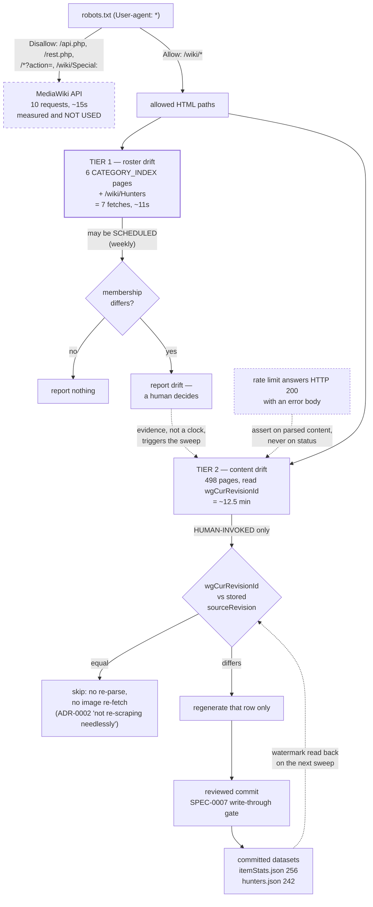

# ADR-0016: Detect Dataset Staleness in Two Tiers over Allowed HTML, Not the MediaWiki API

## Context and Problem Statement

The committed datasets are a snapshot: 256 items in `itemStats.json` and 242 hunters in
`hunters.json`, each row carrying the `sourceRevision` it was derived from. Every game update makes
that snapshot silently stale, and the only detection today is a human noticing.

ADR-0005 deferred the fix and named the questions it would have to settle — "how change detection
reads the wiki's histories (MediaWiki exposes revision and recent-changes data through an API, which
is a different and much lighter client than the HTML page fetch used here) … where the ingested-revision
watermark is persisted once the backend owns it rather than the repo; how a scrape run triggered by a
server reaches the committed data this ADR chose as the data home … and what cadence and failure/retry
behavior the scheduler needs."

**The lighter client ADR-0005 pointed at is not available to us.** `huntshowdown.wiki.gg/robots.txt`
disallows it under `User-agent: *`:

```
Disallow: /index.php
Disallow: /api.php
Disallow: /rest.php
…
Disallow: /*?action=
Disallow: /*?*&action=
```

So `api.php` is blocked by path *and* by query pattern, and `Disallow: /wiki/Special:` blocks
`RecentChanges` too — the two obvious cheap signals. ADR-0002 requires that "the scrape script MUST
respect `robots.txt`", and the repo's own `isAllowedByRobots` already returns `false` for `/api.php`.
So: what change detection is possible using only allowed paths, and who is allowed to run it?

## Decision Drivers

* **The watermark already exists and already works.** All 256 items and all 242 hunters carry a
  `sourceRevision`, and `scrape-stats.mjs:455` already reads the live value out of each page's own
  HTML (`readRlconf(html, "wgCurRevisionId")`). Verified 2026-08-12 against all 256 items: every
  stored revision matches the live page. The baseline ADR-0005 promised to leave behind is there and
  correct; nothing new has to be invented to compare against it.
* **`robots.txt` forbids the cheap path, and asks for restraint in the same file.** Its own preamble:
  "Your access to the network may also get restricted if you act too irresponsibly about any traffic
  generated in an automated way. The network has a lot of pages, and there are some poorly-mannered
  spiders in the wild that go way too fast."
* **ADR-0002 already licences the shape of this, and names the duty it serves.** It permits "a
  bounded, one-time (**or periodic, on-demand**) download that self-hosts the results", forbids
  running the scrape "as part of the app's runtime request path or every CI build", and lists the
  ongoing obligation this decision is built to discharge: "**not re-scraping needlessly**".
* **Under HTML-only access, detection does not make fetching cheaper — it makes committing cheaper.**
  Reading a page's revision costs the same fetch as scraping it. What the comparison saves is
  everything downstream: regenerating 3 rows instead of 498, a reviewable diff instead of an
  unreadable one, and skipping the image tier (5.45 MB across 498 assets) for unchanged items.
* **There is exactly one cheap allowed signal, and it answers a different question.** The category
  index pages are allowed (`/wiki/Category:Weapons` → `ALLOWED`). Six of them cover items
  (`CATEGORY_INDEX`) and one gallery page covers hunters, so **7 fetches** detect *roster* drift —
  pages added or removed — without touching the other 491. `--discover` already does this.
* **A and B both multiply the payload.** ADR-0014's per-weapon ammo means reading every weapon page
  for its `== Ammo Types ==` section; the 89 variant rows already tripled the weapon count. The
  cheapest moment to build this is before the payload grows again.
* **The failure mode is silent.** The wiki answers rate-limited requests with **HTTP 200** and an
  error body — `{"error":{"code":"ratelimited"}}` — so a job that checks status codes records
  rejected pages as successful empty ones. This is not hypothetical: it cost 136 of 147 pages in one
  run during the verification pass that produced this ADR.

## Considered Options

* **Two-tier detection over allowed HTML: a cheap scheduled roster check, and a human-invoked
  per-page revision sweep**
* Use the MediaWiki API anyway
* Register a wiki.gg bot account and seek permission for API access
* Single-tier: re-fetch all 498 pages on a schedule
* Decline the refresh; leave `sourceRevision` as provenance only

## Decision Outcome

Chosen option: **two-tier detection over allowed HTML paths.**

* **Tier 1 — roster drift. 7 fetches, may be scheduled.** Re-crawl the six `CATEGORY_INDEX` pages
  and the `/wiki/Hunters` gallery, and diff the membership against the committed datasets. This
  detects added and removed pages — new weapons, new variants, new hunters, tombstones — which is the
  drift a game update produces most often. At the governed 1500 ms delay this is about **11 seconds**
  of traffic, which is proportionate to run on a schedule.
* **Tier 2 — content drift. 498 fetches, human-invoked.** Fetch each page already in the datasets,
  read `wgCurRevisionId`, and compare to the stored `sourceRevision`. Regenerate and commit **only
  the rows whose revision moved.** About **12.5 minutes** of traffic.

**Tier 2 is deliberately not scheduled.** 498 automated fetches on a timer is the behaviour
`robots.txt` warns about in its own preamble, and ADR-0002's discipline is the reason to keep the
heavy traffic deliberate. Tier 1 firing is what tells a human that tier 2 is worth running, so the
expensive sweep is triggered by evidence rather than by a clock.

**The MediaWiki API is not used, and this is a constraint rather than a preference.** Recorded plainly
because the opposite conclusion is easy to reach and was reached once: the API is genuinely lighter —
50 titles per request, 10 requests for all 498 pages, ~15 seconds instead of 12.5 minutes, measured —
and it is disallowed. The measurement is kept in this ADR precisely so the option is not rediscovered
and quietly adopted on the strength of how much better it is.

### ADR-0005's five questions, answered

1. **How change detection reads the histories** — it does not read histories. It reads each page's own
   `wgCurRevisionId` from allowed HTML, which the scraper already parses.
2. **Where the watermark is persisted "once the backend owns it rather than the repo"** — the premise
   is declined. No backend owns it. It stays per-row in the generated, committed files, which is
   where it already is and where ADR-0005's own data-home decision puts it.
3. **How a server-triggered run reaches the committed data** — no server runs it. Tier 1 runs in CI
   and *reports*; tier 2 runs on a developer's machine and produces a reviewed commit. The
   "server-side stat store" option ADR-0005 rejected stays rejected, so its trust boundary is
   untouched.
4. **Cadence** — tier 1 weekly, plus on demand. Tier 2 when tier 1 fires, when a game update ships,
   or when someone asks. Not a fixed interval, because the thing being tracked is irregular.
5. **Failure and retry** — see Confirmation. The governing rule is that success is asserted on parsed
   content, never on a status code.

### Consequences

* Good, because staleness stops depending on a human noticing, and the cheap tier is cheap enough to
  run often without straining ADR-0002's posture.
* Good, because it discharges ADR-0002's "not re-scraping needlessly" duty with a mechanism instead of
  an intention: an unchanged revision is a *reason* not to re-fetch the image and not to rewrite the
  row.
* Good, because a refresh becomes a reviewable diff. Regenerating only changed rows is what makes the
  write-through gate SPEC-0007 already requires actually reviewable at 498 rows.
* Good, because it needs no new persistence, no backend, and no wire-format change — the watermark is
  already committed and already correct.
* Bad, because tier 2 is slow and stays manual, so content drift can sit undetected between sweeps.
  That is the price of the robots.txt constraint and it should not be dressed up: the API would make
  this a 15-second automated check.
* Bad, because tier 1 detects roster changes only. A weapon whose price changed with no page added or
  removed is invisible until someone runs tier 2 — and price changes are exactly what a balance patch
  produces.
* Neutral, because a scheduled tier 1 makes this project a periodic automated visitor to the wiki for
  the first time. ADR-0002 permits it explicitly, the volume is seven requests, and the user agent
  already identifies the project and a contact address — but the character of the relationship
  changes from "one-time" to "recurring", and that is worth having stated.

### Consequence for ADR-0002

ADR-0002's terms are met, not stretched: this is periodic and on-demand rather than runtime, it is not
part of every CI build, it rate-limits, and it respects `robots.txt` — including by giving up the
design ADR-0005 preferred. The one thing ADR-0002 should gain is the finding that produced this
decision: **`/api.php`, `/rest.php`, `/*?action=` and `/wiki/Special:` are disallowed**, which is a
fact about the source that no ADR currently records and that the next person to reach for a "lighter
client" needs.

### Confirmation

1. **A test asserts the robots gate covers the access mode.** `isAllowedByRobots` must return `false`
   for `/api.php`, `/api.php?action=query`, `/rest.php` and `/wiki/Special:RecentChanges`, and `true`
   for `/wiki/{Page}` and `/wiki/Category:{Name}`, against a committed fixture of the live
   `robots.txt`. This is the test that would have caught the API being off-limits before it was
   designed around.
2. **Rate limiting is asserted on content, not status.** A fixture returning HTTP 200 with an
   `{"error":{"code":"ratelimited"}}` body must fail the run loudly. A refresh that records rejected
   pages as unchanged is worse than no refresh, because it reports freshness it has not verified.
3. **The watermark comparison is asserted in both directions**: a page whose `wgCurRevisionId` equals
   the stored `sourceRevision` must be skipped, and one that differs must be regenerated. A run that
   regenerates everything is a failure of this decision even though its output is correct.
4. **Tier 1 is asserted to be tier 1.** The roster check must issue no more than the 7 documented
   fetches. A regression that walks item pages during the cheap tier turns a scheduled job into the
   spider `robots.txt` complains about.
5. `npm test` covers 1–4 offline against fixtures, consistent with ADR-0005's posture that the app and
   its tests never call the wiki.

## Pros and Cons of the Options

### Two-tier detection over allowed HTML

Cheap scheduled roster check; expensive human-invoked revision sweep; commit only what moved.

* Good, because every path it touches is allowed, so ADR-0002 needs no exception
* Good, because it reuses what exists — `--discover`, `readRlconf`, the rate limiter, the per-row
  watermark — rather than building a client
* Good, because the two tiers have honestly different costs and are governed differently, instead of
  one compromise cadence that is either too slow or too rude
* Neutral, because it answers four of ADR-0005's five questions by declining their premises, which is
  a legitimate answer but not the one ADR-0005 expected
* Bad, because content drift detection stays manual and slow
* Bad, because tier 1's cheapness comes from only detecting roster changes, missing the balance-patch
  case entirely

### Use the MediaWiki API anyway

10 requests, ~15 seconds, fully automatable. Measured, and it works.

* Good, because it is an order of magnitude cheaper and would make content-drift detection a
  scheduled job rather than a chore
* Good, because it returns cleaner data — wikitext rather than rendered HTML, no DRUID markup to parse
* Bad, because `robots.txt` disallows it two ways, and ADR-0002 commits this project to respecting
  `robots.txt` without qualification
* Bad, because the argument for doing it anyway ("robots.txt targets indexers; ten requests is not
  crawling") is one this project would be making about someone else's stated wishes, on their
  infrastructure, to save twelve minutes of a task run a few times a year
* Bad, because it is undiscoverable drift: nothing in CI would fail, so the violation would persist
  as long as the code did

### Register a wiki.gg bot account and seek permission

The rate-limit response itself invites this: "please make sure you are setting a custom user agent
with the username of your wiki account."

* Good, because it would legitimately unlock the cheap path — `robots.txt` governs anonymous
  crawlers, and an identified, rate-limited, permitted bot is a different relationship
* Good, because the wiki's own error text points at it, so it is the sanctioned route rather than a
  loophole
* Neutral, because it costs an outward-facing request and a wait, and the answer may be no
* Bad, because it blocks the whole decision on a third party, when a compliant design is available
  today
* **Recorded as this ADR's revisit trigger** rather than rejected: if API access is ever granted,
  tier 2 becomes a scheduled 10-request check and most of this decision's Bad consequences disappear.

### Single-tier: re-fetch all 498 pages on a schedule

One job, one cadence, full content detection.

* Good, because it detects everything tier 2 detects, automatically
* Bad, because 498 scheduled fetches is precisely the automated traffic `robots.txt` asks visitors not
  to generate, and ADR-0002's "not re-scraping needlessly" would be violated on every run that found
  nothing
* Bad, because it makes the expensive case the default rather than the exception

### Decline the refresh

Leave `sourceRevision` as provenance and keep noticing staleness by hand.

* Good, because it is free and the current process has not visibly failed
* Good, because it keeps the project's wiki traffic strictly human-initiated
* Bad, because "the only detection is a human noticing" is not a process, and the datasets are now
  498 rows across two files
* Bad, because it leaves ADR-0005's deferral open indefinitely while the payload grows under ADR-0014

## Architecture Diagram



## More Information

* **Extends ADR-0005** (Scrape Item Stats into a Generated, Committed Data File). This closes the
  deferral at ADR-0005 line 236 and answers its five questions above — four of them by declining their
  premises, which ADR-0005 explicitly allowed for by "deliberately not prejudg[ing] any of those". Its
  parenthetical that `scripts/lib/wiki.mjs` "should not assume HTML scraping is the only access mode"
  turns out to be moot rather than wrong: the other access mode exists and is disallowed.
* **Extends ADR-0002** (Source Weapon/Equipment Images via a One-Time, Self-Hosted Scrape). See
  "Consequence for ADR-0002". The two clauses this decision leans on are its allowance for a
  "periodic, on-demand" download and its duty of "not re-scraping needlessly"; the clause that
  constrains it is "MUST respect `robots.txt`".
* **The hunter roster is in scope on identical terms.** All 242 `hunters.json` entries carry
  `sourceRevision`, so the 498 figure is 256 items plus 242 hunters and tier 1's seventh fetch is the
  `/wiki/Hunters` gallery. ADR-0007 scoped that dataset; nothing here changes its shape.
* **What the API experiment measured, kept as a record of the road not taken.** 50 titles per request
  (the limit is stated by the API itself — asking for 60 returns
  `{"code":"toomanyvalues","limit":50,"lowlimit":50,"highlimit":500}`, an error rather than a
  truncation); all 256 item revisions verified in 6 requests; `list=categorymembers` returns a whole
  category in one call; `action=parse&prop=wikitext` avoids DRUID markup entirely. MediaWiki 1.43.6.
  **None of this is usable under `robots.txt`**, and it is recorded so the next reader can see the
  option was measured and declined rather than missed.
* **The robots finding is new and was nearly missed in the opposite direction.** The verification pass
  that produced this ADR used `api.php` throughout before checking whether it was allowed, and its
  report notes only that the existing gate does not *cover* the API — not that `robots.txt` *forbids*
  it. Recorded because the mistake is easy: the gate is called with `/wiki/...` paths, so it passes,
  and nothing objects until someone reads the disallow list.
* **Out of scope**: fetching images on refresh (ADR-0002's pipeline already has `--force` and can be
  driven from the changed-row list this produces); a server-side or runtime refresh, which stays
  rejected per ADR-0005 and would cross ADR-0011's trust boundary; and any change to what is scraped —
  this decision is about *when*, not *what*. ADR-0014's `availableAmmo` will enlarge tier 2's payload
  and needs no change here.
* **Revisit when**: API access is granted for an identified bot account (see the third option), or
  `robots.txt` changes its disallow list. Either makes tier 2 a scheduled 10-request check and this
  decision's two Bad consequences largely disappear. `robots.txt` is dated "Last updated: 30/05/2025"
  in the file itself, so it is not static.
* **Provenance.** The robots findings, the 498/7 fetch counts and the full-dataset watermark
  verification come from a pass over the live wiki on 2026-08-12, recorded in
  `docs/reports/suggested-adrs.md` § 4 and § G, which arrives on `main` with **#266**. That report's
  § 4 recommends the API and is **corrected by this ADR** — the first of its findings to be overturned
  rather than refined.
