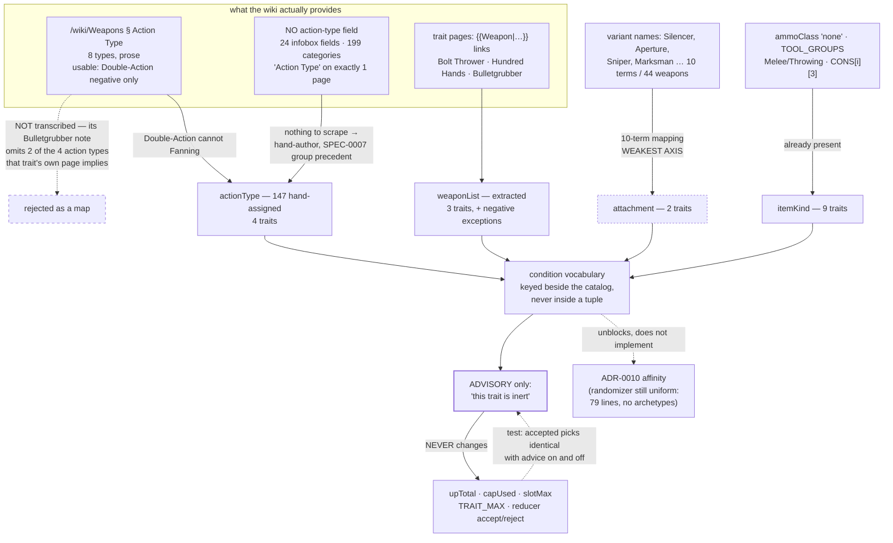

# ADR-0017: Model Trait Applicability as a Four-Axis Condition Vocabulary, Enforced Only as Advice

> **Disposition confirmed 2026-08-15 — in scope, and the strongest pass of any ADR reviewed against the
> admission test. Build it staged by axis, not in one story.**
>
> **Why it passes.** ADR-0021's test asks whether a fact earns UI by helping someone assemble a loadout.
> Telling a player that Bulletgrubber does nothing with their Derringer is not trivia about the game —
> it changes which trait they pick, which is the tool's entire job. Of the ADRs reviewed in this pass
> (0018, 0019, 0020, 0021), this one sits closest to the test's core case.
>
> **State: entirely unbuilt.** `actionType`, `weaponList`, `attachment` and `itemKind` appear in zero
> files across `client/src`, `data` and `scripts`; `itemStats.json` carries no `conditions` key; and
> nothing in the UI surfaces a trait as inert.
>
> **Stage it by axis, because the axes differ sharply in cost and in risk.** This decision's advice is
> only worth having if it is right — **wrong advice is worse than none in a loadout tool**, since a
> player who is told a trait is inert will drop a trait that actually works. The four axes are not
> equally safe, and this ADR says so itself:
>
> | Axis | Cost | Risk | Order |
> |---|---|---|---|
> | `itemKind` | free — resolves against `ammoClass: "none"`, `CONS[i][3] === "Throwable"` and `TOOL_GROUPS`, all of which exist; 9 traits | low | first |
> | `weaponList` | small — 3 traits state their weapons as `{{Weapon|…}}` links, Bulletgrubber with a negative exception | low | second |
> | `actionType` | 147 hand-assigned values, 130 sourced from page prose | medium | third |
> | `attachment` | a 10-term mapping over variant names | **highest — this ADR calls it "the weakest axis" and records it as a hand-authored judgement about which terms denote an optic** | last, or not at all |
>
> `itemKind` alone delivers nine traits' worth of correct advice for essentially no work. `attachment`
> is the axis most likely to call a working trait inert, so it should ship last on its own evidence —
> or be dropped without blocking the rest.
>
> **The advice-never-a-block posture is unchanged**: `upTotal`, `capUsed`, `slotMax`, `TRAIT_MAX` and
> the reducer's accept/reject logic stay untouched whatever ships.

## Context and Problem Statement

Many Hunt traits do nothing unless the loadout carries a particular kind of weapon. Levering needs a
lever-action; Fanning needs a single-action pistol; Bolt Thrower needs a crossbow or bomb launcher.
The app models none of this, so **it will let a player spend 7 upgrade points on Levering beside two
weapons that cannot lever, and say nothing.** For a planner whose whole job is telling you what a
build costs before you buy it, that is the most valuable warning it does not give.

The obvious fix is a weapon `actionType` field. Measured against the wiki on 2026-08-12, that is not
enough: **17 of 58 traits name a weapon class or kind in their description, and they do it on four
different axes.** Action type is only one of them, covering about five.

So: what shape does trait applicability take, where does it come from given that SPEC-0007 forbids the
scraper from deriving app-side taxonomies, and what does the app *do* when a trait cannot help?

## Decision Drivers

* **The wiki does not state action type per weapon, anywhere.** `{{Infobox Weapon}}` uses 24 distinct
  field names across all 147 pages and none is an action. Of the wiki's 199 categories, none encodes
  one. The literal string "Action Type" appears on **exactly one page** wiki-wide — `/wiki/Weapons` —
  as an eight-item prose list, which explains its own absence: those categories "aren't represented by
  official designations and it's not possible to filter for them, however their used gets tracked and
  players are able to unlock matching elements for their Player Profile." The game tracks them
  internally and publishes nothing.
* **That prose list is not a conditional-trait map, and transcribing it would be wrong.** It attaches
  traits to types — Levering to Lever Action, Fanning to Single-Action, and usefully a **negative**
  ("Double-Action: cannot benefit from the Fanning trait"). But for Bulletgrubber it says only that
  "some" Bolt Action and "some" Pump Action weapons benefit, while
  [its own page](https://huntshowdown.wiki.gg/wiki/Traits/Bulletgrubber) enumerates nine weapons "and
  their variants" that span **four** action types: pump (Marathon, Specter 1882), bolt (Berthier 1892,
  Lebel 1886, Mosin-Nagant, Mosin Obrez), **lever** (Terminus — "lever-action repeating shotgun") and
  **semi-automatic** (Bornheim No. 3, Dolch 96). A rule transcribed from the Action Type section is
  wrong for three of the nine.
* **The conditions genuinely run on four axes.** Scanning all 58 trait descriptions:

  | Axis | Traits | Data available today |
  |---|---|---|
  | **Action type** | Levering, Fanning, Iron Eye, Fast Fingers | **None.** Prose only, on 130 of 147 pages. |
  | **Weapon list / family** | Bolt Thrower, Hundred Hands, Bulletgrubber | Extractable — `{{Weapon\|…}}` links on the trait's own page |
  | **Attachment** | Steady Aim, Scopesmith ("scope or Aperture sights") | Partial — 44 weapons carry one of 10 optic terms in their *name* |
  | **Item kind** | Assailant, Berserker, Silent Killer, Surefoot, Pitcher, Dauntless, Blade Seer, Blast Sense, Ambidextrous | **Already present** — `ammoClass: "none"` (7 melee), `TOOL_GROUPS` Melee/Throwing, `CONS[i][3]` |

* **A non-applicable trait is legal.** The game sells Levering to a hunter carrying no lever-action
  weapon. So applicability cannot be a cap — blocking it would reject a build a player can actually
  field, which is the same error ADR-0013 corrected for Scarce items in the other direction.
* **The app has no vocabulary for "legal but inert".** Every rule today is a hard bound: `capMax`,
  `slotMax`, `TRAIT_MAX`, the consumable cap. Introducing advice is a new category of assertion, not a
  new instance of an existing one.
* **SPEC-0007 is the governing tension, and `group` is the precedent.** REQ "Fields the Scraper Must
  Not Derive" held `group` back because it is an app-side taxonomy. Action type is *nearly* the same
  case — but not identically, and the ADR should say which: `group` is a UI bucket this project
  invented, whereas action type is a real property of the gun that the wiki describes and the game
  tracks without publishing. Both end up hand-authored; the reasons differ.
* **SPEC-0008 already specifies a shape for this, and it is the flat one.** REQ: "A **trait-affinity
  map** SHALL declare, for each trait that depends on specific equipment, the set of catalog ids that
  make that trait live — for example Fanning against the single-action pistols, Levering against the
  lever-action Winfields, Bolt Thrower against the bows and crossbows, Pitcher against the
  throwables." So the id-set form is not a hypothetical alternative; it is accepted normative text,
  and any decision here has to either satisfy it or amend it. *(Its illustrative list is also
  narrower than the roster: Levering applies to the Centennial, Vandal 73C, Frontier 73C and the
  lever-action Terminus shotgun, not only to "the Winfields".)*
* **ADR-0010's affinity payoff is prospective, not blocked.** The report behind this decision says
  "the randomizer's trait-affinity map is hand-authored, and every new weapon or trait silently falls
  outside it." That is **wrong about the shipped code**: `randomize.js` is 79 lines and draws traits
  **uniformly at random** from the whole pool, with a 30% Quartermaster bias and budget retries. There
  is no affinity map and no archetypes — ADR-0010's decision is unimplemented. So validation is the
  only live use case, and affinity is a beneficiary rather than a driver.

## Considered Options

* **A four-axis condition vocabulary, hand-authored, enforced only as advice**
* A single hand-authored `actionType` field on the weapon tuple
* A flat per-trait list of applicable weapon ids
* Parse conditions out of trait descriptions in the scrape
* Do nothing

## Decision Outcome

Chosen option: **a four-axis condition vocabulary — `actionType`, `weaponList`, `attachment`,
`itemKind` — hand-authored, stored beside the catalog rather than inside its tuples, and surfaced only
as advice that never blocks a build.**

**Four axes rather than one, because one does not reach.** An `actionType` column serves 4 of the 17
conditional traits. The vocabulary is cheaper than four times the work because three of the four axes
already have data or need only a small mapping:

* **`itemKind` is free.** Melee is `ammoClass: "none"`; throwables are `CONS[i][3] === "Throwable"`;
  melee and throwing tools are `TOOL_GROUPS` buckets. Nine traits resolve against fields that exist.
* **`weaponList` is extractable.** Three traits state their weapons as `{{Weapon|…}}` links on their
  own pages, with Bulletgrubber also stating a negative exception ("Doesn't work with Derringers").
  Reading links is not deriving a taxonomy.
* **`attachment` needs a 10-term mapping, not 44 rows.** Optic and silencer terms appear in variant
  *names* — `Silencer`, `Aperture`, `Sniper`, `Marksman`, `Deadeye`, `Pointman`, `Bullseye`,
  `Precision`, `Sharpeye`, `Trueshot` across 44 weapons. `Aperture` is named outright by Steady Aim, so
  that one is clean; the rest are a hand-authored judgement about which terms denote an optic. **This
  is the weakest axis and is recorded as such.**
* **`actionType` is the genuinely new work**: 147 hand-assigned values, with the wiki's prose
  description as the source for the 130 pages that name one.

**Advice, never a block.** A trait whose conditions no equipped weapon satisfies is reported as
inert — it still costs its upgrade points, still occupies one of ADR-0012's fifteen cells, and the
build stays valid and saveable. Concretely: no change to `upTotal`, `capUsed`, `slotMax`, `TRAIT_MAX`
or the reducer's accept/reject logic. This is deliberately the opposite posture from ADR-0015, where
the game's rule made a build illegal; here the game permits the build and only the player's money is
wasted.

**The Action Type section is used for two facts and not as a map.** Its transcribable content is the
**Double-Action negative** (Fanning does not apply) — a case a naive positive-only map would miss —
and the Single-Shot ammo-split rule, which belongs to ADR-0014 rather than here. Bulletgrubber is why
the rest is not transcribed.

**SPEC-0008's flat id-set map is satisfied by resolution, not contradicted.** The vocabulary is the
*authored* form; the id set SPEC-0008 requires is its *resolved* form, computed by evaluating each
trait's conditions against the catalog. So "the set of catalog ids that make that trait live" is
produced rather than hand-maintained — which is what keeps it correct after 89 variants arrive in one
commit. SPEC-0008 needs no amendment to its requirement, only a note that the set is derived from
declared conditions rather than enumerated by hand.

**Conditions live beside the catalog, keyed by trait id, not inside the tuples.** ADR-0010 recorded
that widening a positional tuple "touches every consumer that destructures them", and ADR-0013
declined that cost for rarity. The same reasoning applies: a conditions table keyed by trait id adds
no arity to `TRAITS`. `actionType` is the one exception worth debating, since it is a property of a
weapon rather than of a trait — and it is still kept out of the `WEAPONS` tuple for the same reason,
in a weapon-id-keyed table alongside.

### Consequences

* Good, because the app can finally warn about the most expensive silent mistake available to it —
  7 upgrade points on a trait that cannot fire.
* Good, because no budget, cap or slot function changes and no build becomes invalid. The feature is
  additive, which is what makes an advisory posture cheap to ship and safe to get partly wrong.
* Good, because 12 of the 17 conditional traits resolve against data that already exists or is
  extractable, so the hand-authored surface is `actionType`'s 147 values plus a 10-term attachment
  mapping — not 17 traits × 147 weapons.
* Good, because it gives ADR-0010's deferred affinity model something real to build on if the
  archetype randomizer is ever implemented.
* Bad, because `actionType` is 147 hand-assigned values with no machine check against the wiki, so it
  drifts exactly the way `group` does and needs the same discipline. New weapons arrive untyped.
* Bad, because the attachment axis rests on reading meaning into variant names. `Precision`,
  `Bullseye` and `Trueshot` may denote accuracy rather than an optic, and nothing in the data settles
  it — this is game knowledge and should be labelled as such rather than presented as derived.
* Bad, because advice is a new UI concept and a new failure mode: advice that is wrong is worse than
  no advice, because a player who trusts it buys the wrong trait *on purpose*.
* Neutral, because four axes is more machinery than "one action-type column", and the justification is
  entirely empirical — 17 traits measured, not a design preference. If the count were 4 rather than 17,
  the single column would win.

### Consequence for ADR-0010

ADR-0010 weighed "extend the scrape to derive affinity — parse trait descriptions and weapon action
types off the wiki" and deferred it, noting ADR-0005 "is the reason the 'extend the scrape' option is
a live" one. This decision answers the data half of that option and rejects its method: the conditions
are **hand-authored, not parsed**, because the wiki does not state action type per weapon at all and
the one place it discusses types is wrong about Bulletgrubber.

Nothing in ADR-0010 changes. Its archetype randomizer remains unimplemented, and this decision does
not implement it — it removes the data blocker SPEC-0008 records, and stops there.

### Consequence for SPEC-0008

SPEC-0008's trait-affinity REQ is **met, not amended**. Its "set of catalog ids that make that trait
live" becomes the resolved output of the condition vocabulary rather than a hand-enumerated table, so
the requirement's normative content stands and only its *provenance* changes. Two smaller things it
should gain:

* A note that the id set is **derived from declared conditions**, so a reader does not maintain it by
  hand and a reviewer knows where to correct an error.
* A correction to its illustrative list. "Levering against the lever-action Winfields" undercounts:
  the Centennial, Vandal 73C and Frontier 73C are lever-actions, and the Terminus is a lever-action
  *shotgun*. The example reads as if Levering were a Winfield-family trait, which is the mistake a
  flat hand-authored map would encode permanently.

Its statement that "the scraped dataset carries no weapon action type and no trait weapon-conditions,
so it cannot supply affinity today" stays true of the scrape — this decision does not make it
scrapable, it makes it authored.

### Consequence for SPEC-0007

REQ "Fields the Scraper Must Not Derive" gains a second member with a different reason. `group` is
excluded because it is a taxonomy this project invented for its own UI. `actionType` is excluded
because the wiki genuinely does not carry it — 24 infobox fields, 199 categories, one prose page — so
there is nothing to scrape rather than something the scraper must not touch. The requirement's
conclusion holds for both; its stated rationale covers only the first, and should say so.

### Confirmation

Advice that is wrong is the failure mode, so the data is bound to its source where a source exists:

1. **Every conditional trait has a condition, and every condition names a known axis.** A trait whose
   description matches the weapon-class vocabulary but carries no condition entry fails the suite —
   that is the "17 measured" figure becoming a checkable invariant rather than a note in an ADR.
2. **`weaponList` conditions are asserted against the wiki.** Each weapon id in a `weaponList` must
   correspond to a `{{Weapon|…}}` link on that trait's own page, and Bulletgrubber's negative
   exception must be represented. This axis has a machine-checkable source and should be checked.
3. **Every weapon has an `actionType`, and every value is in the declared set** of the eight the wiki
   names. A new weapon row with no action type fails, which is the drift guard `group` never got.
4. **The advisory predicate never affects validity.** A property-style assertion: for any loadout, the
   set of accepted picks is identical with the advisory layer enabled and disabled. This is what keeps
   "advice" from quietly becoming a cap.
5. **The Double-Action negative is asserted explicitly** — Fanning against a double-action revolver
   reports inert, not applicable. Positive-only condition models get this wrong, and the wiki states
   it outright.
6. `npm test` covers all of it offline against the committed dataset.

## Pros and Cons of the Options

### A four-axis condition vocabulary, advisory only

`actionType`, `weaponList`, `attachment`, `itemKind`, keyed beside the catalog; a trait with no
satisfied condition is reported inert.

* Good, because it covers all 17 measured conditional traits rather than 4
* Good, because three axes reuse existing data, so the marginal cost over the single-column option is
  a 10-term mapping and some extraction
* Good, because advisory-only means nothing that currently works can break
* Neutral, because it introduces a vocabulary the app has no precedent for, and vocabularies attract
  members — the declared axis set needs to be closed, not open
* Bad, because `actionType` is unverifiable hand-authored data at 147 rows
* Bad, because the attachment axis is inference from names dressed as data

### A single hand-authored `actionType` field

Add action type to the weapon tuple or a side table; cover Levering, Fanning, Iron Eye, Fast Fingers.

* Good, because it is the smallest change that addresses the traits people actually asked about
* Good, because one field is far easier to review and to keep current than four axes
* Bad, because it silently covers 4 of 17 conditional traits, and the 13 it misses include the two —
  Bolt Thrower and Bulletgrubber — whose data is the *easiest* to obtain
* Bad, because Bulletgrubber is not expressible on this axis at all, so the model would be wrong for
  it rather than merely silent
* Bad, because it would need a second decision almost immediately, and the second decision is this one

### A flat per-trait list of applicable weapon ids

Skip the axes; record which weapon ids each conditional trait applies to.

* Good, because the logic is trivial and immune to the axis-classification problem entirely
* Good, because it is exactly the shape Bulletgrubber's own page uses, so for some traits it is a
  transcription
* Good, because **SPEC-0008 already requires exactly this** ("the set of catalog ids that make that
  trait live"), so choosing it would need no spec change at all — the strongest argument for it, and
  the reason the chosen option resolves *to* this shape rather than replacing it
* Bad, because it is a hand-authored matrix that goes stale on every weapon added — and 89 variants
  arrived in a single commit, each of which would need assigning to every applicable trait
* Bad, because it discards the reason a trait applies, so nothing can check it and a reviewer cannot
  tell an omission from a deliberate exclusion
* Bad, because "and their variants" — the wiki's own shorthand — has to be expanded by hand into every
  variant row, which is where the staleness enters

### Parse conditions out of trait descriptions in the scrape

Teach `scrape-stats.mjs` to read "single-action pistols only" and populate conditions.

* Good, because it would track the game automatically, which is the drift problem the chosen option
  has and does not solve
* Bad, because the weapon half is impossible: the wiki does not state action type per weapon, so
  parsing trait prose yields a class name with nothing to resolve it against
* Bad, because it puts a game rule inside the scrape, which ADR-0005 forbids and SPEC-0007 REQ
  "Budget-Affecting Attributes Are Stored, Never Inferred" reinforces
* Bad, because trait prose is free text — "one-handed or two-handed single-action pistols" is a
  sentence, not a field, and a parser that gets it 90% right produces confidently wrong advice

### Do nothing

Keep the status quo: no conditions, no advice.

* Good, because it is free, and no wrong advice can be given
* Good, because the app remains correct about everything it does claim — it simply does not claim this
* Bad, because the silent 7-point mistake stays available, and it is the most expensive one the app
  permits
* Bad, because SPEC-0008 keeps recording a data gap as the reason affinity is impossible, which stays
  true indefinitely

## Architecture Diagram

## More Information

* **Extends ADR-0005** (Scrape Item Stats into a Generated, Committed Data File). SPEC-0007 REQ
  "Fields the Scraper Must Not Derive" is the governing constraint; see "Consequence for SPEC-0007"
  for why `actionType` joins `group` there for a different reason.
* **Extends ADR-0010** (Archetype-Driven Loadout Randomizer). See "Consequence for ADR-0010". Its
  "extend the scrape to derive affinity" option is answered: the data is worth having, the parsing
  method is not available.
* **The 17 conditional traits, for the record**, since the count is load-bearing and derived rather
  than asserted: Fanning, Levering, Iron Eye, Fast Fingers (action type); Bolt Thrower, Hundred Hands,
  Bulletgrubber (weapon list); Steady Aim, Scopesmith (attachment); Assailant, Berserker, Silent
  Killer, Surefoot, Pitcher, Dauntless, Blade Seer, Blast Sense, Ambidextrous (item kind). Measured by
  scanning all 58 committed trait descriptions for weapon-class vocabulary; the axis assignment is
  this decision's, not the wiki's.
* **A correction to the report that motivated this.** `docs/reports/suggested-adrs.md` § C states that
  "the randomizer's trait-affinity map is hand-authored, and every new weapon or trait silently falls
  outside it." There is no such map: `randomize.js` draws `RANDOM_TRAIT_COUNT = 3` traits uniformly
  from the whole pool. ADR-0010 *chose* archetypes with affinity and that choice is unimplemented, so
  the correct statement is that affinity does not exist rather than that it is stale. This matters
  because it moves affinity from a driver of this decision to a beneficiary of it.
* **Also corrected: the report's C section claimed the validation feature was "unreachable from wiki
  data alone", then that the Action Type section made it transcribable.** Neither is right. The
  section exists and is useful for two facts; it is not a conditional-trait map, and Bulletgrubber is
  the case that decides it.
* **Out of scope**: how the advice is presented (badge, tooltip, panel note) beyond the requirement
  that it name the unsatisfied condition; implementing ADR-0010's archetypes; the Single-Shot
  ammo-split rule from the same wiki section, which belongs to ADR-0014; and any use of `Category` or
  `ConditionalEffect` from the trait infobox — `ConditionalEffect` holds `Solo`/`Catalyst`, which are
  game-mode and trait-interaction conditions on a different axis again, and ADR-0013 already records
  that Catalyst is a function rather than a rarity.
* **Revisit when**: the wiki begins stating action type as a field or category — the "Action Type"
  section notes the game tracks these internally for Player Profile unlocks, so a future wiki template
  could expose them, and that would convert `actionType` from hand-authored to scraped and retire this
  decision's worst consequence.
* **Related issues**: #42 and #162 (why `group` is hand-authored — the precedent this reasons from),
  #157 (trait roster), and SPEC-0008 § "Trait Affinity" (the data gap this closes).
