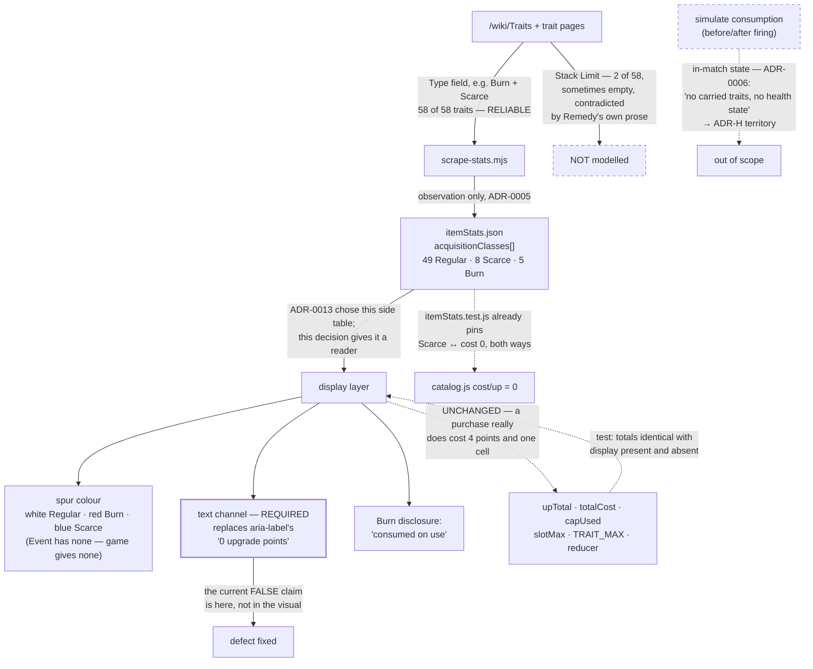

# ADR-0018: Surface Acquisition Class as Colour-plus-Text, and Disclose Burn Traits Rather Than Simulate Them

## Context and Problem Statement

ADR-0013 is titled, correctly, *"Model Scarce Items as Selectable at Zero Cost, **and Keep Rarity Out
of the Cost Field**."* It kept rarity out of `cost`. It did not put rarity anywhere else — so twelve
catalog rows now carry a hand-authored `0` with nothing to explain it, and the UI renders a Scarce
trait exactly as it would render a free one.

The accessible label is the sharper half of the problem. `TraitsPanel.jsx:36` builds
`` `${name}, ${up} upgrade point${up === 1 ? "" : "s"}. Activate to remove.` `` — so a Scarce trait
announces **"Berserker, 0 upgrade points"**. The visual merely omits the reason; the label makes a
positive claim that the trait is free.

Separately, five traits carry `Burn`, and the wiki says what that means: they are consumed on use.
The app models all five as ordinary permanent traits. So: where does rarity get displayed, and does
the app need to *model* a trait that vanishes mid-match, or only say so?

## Decision Drivers

* **The data already exists and ADR-0013 already chose where it lives.** `itemStats.json` carries
  `acquisitionClasses` per item — 49 Regular, 8 Scarce, 5 Burn — read from each page's own category
  membership. ADR-0013 chose that side table deliberately over widening the positional tuples. This
  decision consumes it; nothing new is authored.
* **Rarity is a set, not a scalar, and the wiki proves it.** `Type` on the trait page holds
  `{{Trait_Type|Burn,Scarce}}` for Death Cheat, Rampage, Relentless and Remedy. Whatever renders it
  has to render more than one value per trait.
* **`Type` is a reliable structured field; `Stack Limit` is not.** `Type` is present on **58 of 58**
  traits. `Stack Limit` is present on **2** — and where it does appear it is sometimes the empty
  string (`Final Gasp`, `Shadow Crush`), and it is contradicted by prose:
  [Remedy](https://huntshowdown.wiki.gg/wiki/Traits/Remedy) has **no** `Stack Limit` field yet its
  update history states it "can no longer be stacked up to three times, instead being locked to a
  single instance". Stacking is therefore **not** modelled here.
* **Burn means consumed, and the wiki states it plainly.** [`/wiki/Traits`](https://huntshowdown.wiki.gg/wiki/Traits):
  "**Burn Traits** are Traits that give an effect once before being **burned up and disappearing from
  a Hunter's loadout**. Most Burn Traits are also Scarce, with the exception of Necromancer."
* **But the app's arithmetic is already correct, because it prices a purchase and not a match.** The
  same page: "Scarce and Burn Traits can also be removed from a Hunter in the game menu, but no
  {{Upgrade Points}} will be paid back." A Burn trait costs its points and holds one of ADR-0012's
  fifteen cells **while held** — Necromancer states `Cost=4` and the app charges 4. It burns *during
  a match*, which is state this app does not model at all.
* **ADR-0006 drew that boundary explicitly, and named this case.** "This decision models **filing,
  not hunters**. No permadeath, **no carried traits**, no recruitment cost, no per-hunter carry-limit
  validation, no health state." A trait that disappears part-way through a match is carried-trait
  state.
* **Three spur colours, four types, and one modifier.** `/wiki/Traits`: spurs "can either be **white**
  (indicating a Regular Trait), **red** (Burn Trait) or **blue** (Scarce Trait)". Types are four —
  Regular, Burn, Scarce, **Event** — and Event traits have no spur, being event-mechanic only. Exactly
  four spur assets exist (`World Item Regular/Burn/Scarce/Sealed Trait Spur.png`), the fourth being a
  *Sealed* modifier on red and blue rather than a fourth colour.
* **The existing test already binds the invariant this display depends on.** `itemStats.test.js`
  asserts the Scarce↔cost-0 pairing in both directions, so the relationship is machine-checked even
  though it is currently invisible. Rendering it makes a checked fact legible rather than introducing
  an unchecked one.

## Considered Options

* **Display-only: render `acquisitionClasses` as spur colour plus a text channel, and disclose Burn
  consumption in words**
* Model Burn consumption as loadout state (before/after firing)
* Treat Burn traits as a third loadout entity
* Render rarity as text or a badge only, without the game's colour vocabulary
* Do nothing (the status quo ADR-0013 left)

## Decision Outcome

Chosen option: **display-only.** `acquisitionClasses` is surfaced as the game's spur colour **plus a
text channel**, and a Burn trait's single-use nature is **disclosed in words rather than simulated**.

**No arithmetic changes, and that is the point.** `upTotal`, `totalCost`, `capUsed`, `slotMax`,
`TRAIT_MAX` and the reducer are untouched. The app's numbers for a Burn trait are already right: at
the moment a player commits to the build — which is the only moment this app models — Necromancer
costs 4 points and occupies a cell. What the app fails to say is that those 4 points buy **one use**,
where every other trait at that price buys the whole match. That is a disclosure defect, not an
arithmetic one.

**Never colour alone.** The `trait-cell-up` span is `aria-hidden` and the cell's meaning reaches
assistive technology only through the composed `aria-label`, which today asserts "0 upgrade points"
for a Scarce trait. So the text channel is not an accessibility nicety bolted onto a colour scheme —
**it is the channel that currently carries a false claim, and fixing it is the substance of this
decision.** The colour is the part that is optional.

Concretely, the label for a zero-cost Scarce trait must stop asserting a price and start naming the
acquisition route; the label for a Burn trait must say it is consumed on use. The exact wording is
left to implementation, but "0 upgrade points" is ruled out as a rendering of "cannot be bought".

**Rarity renders as a set.** A trait that is both `Burn` and `Scarce` shows both. A single-value badge
would be wrong for four of the five Burn traits, which is the same trap ADR-0013 avoided when it
declined a scalar `rarity` column.

**Stacking is out of scope**, on evidence rather than preference: `Stack Limit` covers 2 of 58 traits,
is sometimes empty where present, and is contradicted by Remedy's own prose. There is nothing
trustworthy to render.

### Consequences

* Good, because it removes a false statement rather than adding a feature. The current label tells a
  screen-reader user that a Scarce trait is free; that is the defect, and it is the cheapest thing in
  this decision to fix.
* Good, because no budget, cap or slot function changes, and no saved loadout is affected — the data
  is already committed, the invariant is already tested, and the wire format never carried rarity.
* Good, because it uses vocabulary players already know. Trait Spurs are picked up in match in white,
  red and blue; matching them means the UI teaches nothing new.
* Good, because rarity stays a set, so `Burn + Scarce` is representable — which a scalar badge could
  not manage and which four of the five Burn traits require.
* Bad, because "disclosed but not simulated" is a defensible line that will read to some users as a
  half-measure: the app will say Necromancer is consumed and still count it as a permanent 4-point
  trait in the totals. The ADR's answer is that both are true of a purchase.
* Bad, because it adds a colour dimension to a UI that currently distinguishes traits only by icon and
  group, and three of the five `TRAIT_THUMBS` glyphs are already shared across many rows — so colour
  will be doing more visual work than the icons do.
* Neutral, because Event traits get no spur colour, since the game gives them none. The 17 held-back
  Event traits therefore need no display decision, which is convenient rather than principled.

### Consequence for ADR-0013

ADR-0013's Bad consequence was stated as: "a hand-authored `0` is visually indistinguishable from a
missing or un-scraped price. A data-entry slip that drops a real cost reads as a legitimate free item,
and nothing about the value itself objects." This decision closes the *display* half of that. The
detection half stays with `itemStats.test.js`, where ADR-0013 put it, and is not weakened — the test
remains the thing that catches a wrong `0`; the UI now merely stops presenting one as ordinary.

ADR-0013 also noted the rarity side table is "worth having even though no budget function reads it".
It now has a reader.

### Consequence for the Event-trait hold-back — its revisit trigger is unfireable as written

`catalog.js`'s `TRAITS` boundary holds back 17 Event traits on grounds of **data confidence**, and
names its trigger: "REVISIT WHEN: a page-level liveness signal exists for Event traits that does not
depend on a page stating its own removal — **or when Shadow Crush is resolved either way, since it is
the concrete case this boundary was drawn around.**"

**Shadow Crush and Shadow Leap are two different traits, so there is nothing to resolve.** Read
2026-08-12:

| | Shadow Crush | Shadow Leap |
|---|---|---|
| `Type` | `Event` | `Scarce` |
| `Category` | Offensive | **Movement** |
| Effect | "damage any Monster or Target once. (25m)" | "channel a Monster within range to jump to its location and kill it instantly. Excludes Targets. (50m)" |
| Update history | **1 row** — one event, never removed, never reformed | **4 rows**, ending at 2.8.1 |

Different type, category, effect, range and target set. The "silent replacement" the boundary was
drawn around is not supported by either page.

**The hold-back itself still stands** — its real ground is that the Event index cannot be trusted to
describe the live roster, and Shadow Crush remains a trait with exactly one event appearance and no
liveness signal, which is that ground rather than a counter-example to it. What needs correcting is
the **trigger**: half of it can never fire. This decision does not reopen the 17 traits and does not
amend `catalog.js`; it records that the second clause should be struck, leaving the first — the
page-level liveness signal — as the real condition.

### Confirmation

1. **Every zero-cost catalog row renders a rarity, and no rendering says "0 upgrade points" for a row
   whose cost is zero-by-rarity.** The second half is the assertion that matters, because it is the
   current false claim, and it is testable against the composed accessible label rather than the
   visual.
2. **Rarity renders as a set.** A trait whose `acquisitionClasses` holds both `Burn` and `Scarce`
   surfaces both. A test with Death Cheat catches a scalar regression.
3. **Every Burn trait's disclosure is present**, keyed off `acquisitionClasses` containing `Burn` — so
   a sixth Burn trait arriving in the dataset surfaces automatically rather than silently rendering as
   permanent. (`Final Gasp` is that sixth today, `Type: "Event,Burn"`, correctly held back from the
   catalog — so the test must key on the *dataset*, not on a hand-listed five.)
4. **The arithmetic is asserted unchanged.** `upTotal` and `totalCost` for a loadout are identical
   with the display layer present and absent — the same property-style guard ADR-0017 uses for advice,
   for the same reason.
5. **No test asserts a Stack Limit behaviour**, because the field cannot support one. Recorded as a
   deliberate absence so a later reader does not add one from the two rows that happen to carry it.
6. `npm test` covers all of it offline against the committed dataset.

## Pros and Cons of the Options

### Display-only: spur colour plus a text channel, Burn disclosed in words

* Good, because it corrects a false accessible label, which is the only part of this that is
  unambiguously a bug
* Good, because it requires no new data, no schema change, and no arithmetic change
* Good, because it respects ADR-0006's boundary instead of quietly crossing it
* Neutral, because it leaves a real mechanic partly unmodelled and says so, which is a choice a reader
  may disagree with — the ADR's job is to make it visible rather than to hide it
* Bad, because a player who wants to know "what does this build look like after the Burn traits fire"
  still cannot ask

### Model Burn consumption as loadout state

Represent before/after so the build shows what remains once Burn traits are spent.

* Good, because it answers the report's literal complaint: the claim on both budgets *is* temporary
* Good, because it would make Burn traits genuinely comparable to permanent ones at the same price
* Bad, because "after firing" is in-match state, and ADR-0006 excludes exactly that — "no carried
  traits, no health state" — so this is ADR-H territory (the in-game hunter), not a trait-display
  decision
* Bad, because there is no single "after" state: Burn traits fire independently, so the honest model
  is a lattice of 2^n states, and the useful one is a UI affordance rather than a data model
* Bad, because it would change `upTotal` output for a build the player has not yet taken anywhere,
  which is a worse claim than the one being fixed

### Treat Burn traits as a third loadout entity

Model them beside traits and consumables, since they cost points like a trait and are spent like a
consumable.

* Good, because it is the most faithful description of the mechanic
* Bad, because they occupy trait cells and draw on the trait budget, so they would need every trait
  rule applied to them anyway — the entity would be a trait wearing a different label
* Bad, because it is a wire-format question (a third collection to persist) for a mechanic whose only
  distinguishing behaviour happens in a match the app does not model
* Neutral, because ADR-0013 already anticipated this being answered "just traits" and called that
  legitimate; this decision takes that answer and records the reason

### Text or badge only, without the colour vocabulary

* Good, because it is accessible by construction and needs no colour-contrast work
* Good, because it cannot mislead a colour-blind user, and the app has no existing colour language for
  item metadata
* Bad, because it discards a vocabulary the game already taught the player — white, red and blue
  spurs are picked up in match, and matching them is free recognition
* Neutral, because the chosen option is this option *plus* colour, so nothing here is lost by
  choosing colour-plus-text; the difference is only whether the colour is added

### Do nothing

* Good, because it is free, and ADR-0013 shipped deliberately without it
* Bad, because the accessible label actively states that a Scarce trait costs 0 upgrade points, which
  is not "information omitted" but "a wrong claim made"
* Bad, because five traits are described to the user as permanent when the wiki says they are consumed

## Architecture Diagram

## More Information

* **Extends ADR-0013** (Model Scarce Items as Selectable at Zero Cost, and Keep Rarity Out of the Cost
  Field). See "Consequence for ADR-0013". The short version: ADR-0013 kept rarity out of `cost` and
  chose `acquisitionClasses` as its home; this decision reads it.
* **Related to ADR-0006** (Hunter Loadout Lists). Its "filing, not hunters" boundary — "no carried
  traits… no health state" — is the reason Burn consumption is disclosed rather than simulated.
  Unchanged by this decision; cited as the constraint that shapes it.
* **The five Burn traits, and why the sixth is not one of them.** Death Cheat, Necromancer, Rampage,
  Relentless and Remedy carry `Burn` in the dataset. `Category:Traits/Burn` has **six** members; the
  sixth is `Final Gasp`, whose `Type` is `"Event,Burn"` — Event-only, stating no cost, and therefore
  correctly held back under the `TRAITS` roster boundary. Confirmation step 3 keys off the dataset
  rather than a hand-listed five precisely so it arrives on its own if that ever changes.
* **Necromancer is the exception that matters for pricing.** It is the one `Burn`-without-`Scarce`
  trait, states `Cost=4`, and is charged 4 by the app. The other four are also Scarce and cost 0. So
  "Burn" does not imply free — ADR-0013 already recorded that, and it is the reason the disclosure is
  keyed on `Burn` while the zero is keyed on `Scarce`.
* **Rarity is display-only and must stay that way.** SPEC-0007 REQ "Budget-Affecting Attributes Are
  Stored, Never Inferred" is the reason cost stays a stored `0` rather than becoming "derive 0 when
  Scarce". This decision adds a *reader* of rarity, not a second source of truth for price.
* **The Event-trait hold-back's trigger needs a one-clause correction** — see the Consequence section.
  Not amended here, because `catalog.js` is data and this is a display decision; recorded so whoever
  next touches that comment does not spend the effort re-deriving a resolution that cannot exist.
* **Out of scope**: stacking (no trustworthy field); the picker's rarity filter, which is a natural
  follow-on but not required to fix the false label; reopening the 17 Event traits; and any change to
  `TRAIT_THUMBS`, though the Bad consequence above notes colour will carry more weight than the shared
  glyphs do.
* **Provenance.** The `/wiki/Traits` quotations, the 58-of-58 vs 2-of-58 field coverage, the four spur
  assets, and the Shadow Crush / Shadow Leap comparison come from a pass over the live wiki on
  2026-08-12, recorded in `docs/reports/suggested-adrs.md` § E, § E4 and § 3.3, arrives on `main` with
  **#266**. Every quotation there was string-matched against source rather than retyped.
* **Related issues**: #157 (trait roster), #164 (tombstone classification — the liveness problem behind
  the Event hold-back), #230 (`acquisitionClasses` captured per item).
