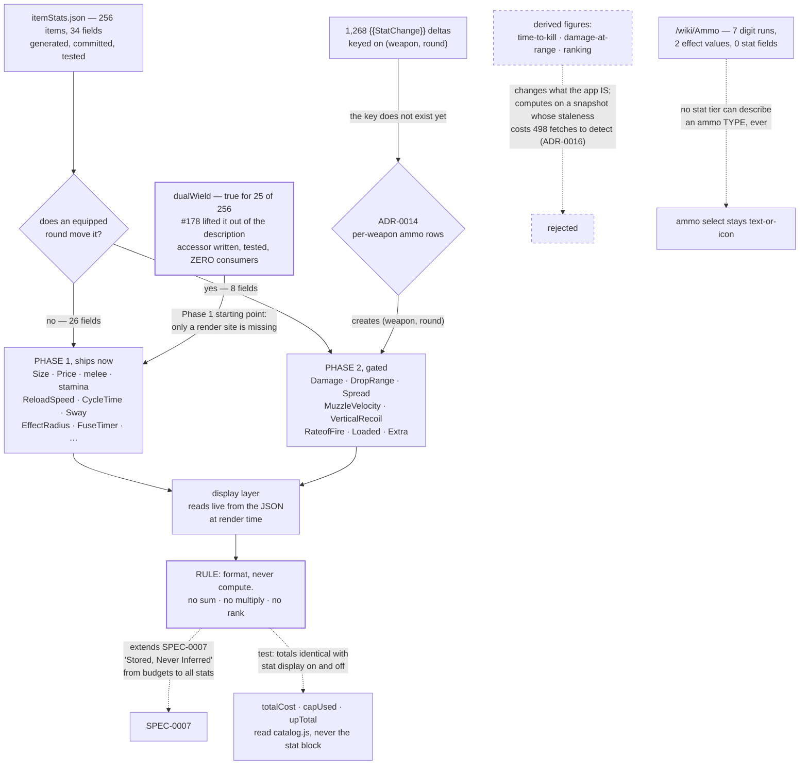

# ADR-0019: Display the Scraped Stat Block, Never Compute From It, and Phase It Around the Ammo Delta

## Context and Problem Statement

ADR-0005 justified the stat scrape partly on a benefit it has never collected:

> Good, because item pages gain real decision-relevant content — **damage, effective range, rate of
> fire, reload speed**, per-weapon ammo variants, and prose descriptions — **turning the picker from a
> price list into a comparison tool**

`itemStats.json` now holds **256 items across 34 infobox fields**, committed and tested. Of the six
payoffs that bullet names, exactly **one** has been collected: prose descriptions. The module exports
six things and the app consumes one.

So: which of the 34 fields does the app show, what does it do with the ones the equipped round
changes, and — the question underneath — **is it allowed to compute anything from them?**

## Decision Drivers

* **The app consumes one of six exports.** Tracing every non-test importer of
  `client/src/data/itemStats.js`:

  | Export | Non-test consumers |
  |---|---|
  | `descriptionFor` | `Picker.jsx`, `TraitsPanel.jsx` |
  | `statsFor` · `dualWieldFor` · `statFieldFor` · `ITEM_STATS` · `STATS_GENERATED` | **none** |

  *(`catalog.js` mentions `statFieldFor` at line 798, but that is a governing comment describing how a
  figure in the comment was derived — `catalog.js` has no `import` statements, so it cannot call it.)*
* **`dualWield` is the sharpest instance, and it is dated.** #178 (`32a0ba5`) exists specifically to
  lift dual-wieldability *out* of the description blob into a queryable boolean — its rationale is that
  "a scraper that captures the description string satisfies §3.0 while leaving dual-wieldability locked
  inside a blob of text — it must be lifted to its own boolean to be queryable." The field is populated
  (**`true` for 25 of 256**), `dualWieldFor` is written and tested, and **nothing calls it.** A whole
  merged PR's value, scraped and committed and not collected.
* **Eight of the 34 fields are moved by the equipped round.** Measured against the 139 weapon pages
  carrying an `== Ammo Types ==` section, whose **1,268 `{{StatChange|field|from|to}}`** templates state
  the movement:

  | Field | items carrying it | `StatChange` hits |
  |---|---|---|
  | `MuzzleVelocity` | 147 | 310 |
  | `DropRange` | 147 | 276 |
  | `Damage` | 171 | 208 |
  | `Extra` | 141 | 198 |
  | `VerticalRecoil` | 142 | 164 |
  | `Spread` | 147 | 101 |
  | `RateofFire` | 144 | 1 |
  | `Loaded` | 144 | 1 |

  The remaining **26 fields are static** — no round changes them.
* **Three of ADR-0005's four named stats are in that ammo-sensitive set.** "Damage", "effective range"
  (`DropRange`) and "rate of fire" all move with the round; only "reload speed" is static. So the
  benefit ADR-0005 promised cannot be delivered honestly without the delta, which is ADR-0014's key.
* **Absence is the common case, not the exception.** `Damage` covers 171 of 256; `EffectRadius` 20;
  `EffectDuration` 15; `Quantity` 13; `FuseTimer` 9; `ControlRange`, `DamageperTick` and
  `ThrowStaminaConsumption` 3 each. Any layout has to treat a missing field as normal.
* **Ammo has no stats at all**, so no stat tier can ever describe an ammo *type*: `/wiki/Ammo` carries
  seven digit runs in its whole body, two of them effect magnitudes, and zero stat fields. The ammo
  select stays text-or-icon regardless of what this decides.
* **SPEC-0007 already draws the line this decision has to sit on.** REQ "Budget-Affecting Attributes
  Are Stored, Never Inferred" forbids deriving numbers that feed a budget. A stat tier needs an
  explicit statement of which side it is on, before someone reasonably decides that a damage figure the
  app already displays may as well be summed.
* **The data is a snapshot, and ADR-0016 establishes that detecting its staleness is expensive** —
  498 HTML fetches, human-invoked, because the API is disallowed. That asymmetry matters here: a
  displayed stale number is visibly attributable to the wiki, while a computed one reads as the app's
  own claim.

## Considered Options

* **Display only, phased: the 26 static fields now, the 8 ammo-sensitive ones after ADR-0014**
* Display everything now, base values only
* Display everything at once, after ADR-0014 lands
* Display plus item-to-item comparison
* Display plus derived figures (time-to-kill, damage-at-range)
* Do nothing

## Decision Outcome

Chosen option: **display only — the app renders scraped values and derives nothing from them — phased
so that the 26 static fields ship now and the 8 the equipped round moves wait for ADR-0014.**

**Never compute, and this is the identity decision the report identified.** Displaying `Damage: 145` is
a UI change. Computing a time-to-kill, a damage-at-range curve, or a "this beats that" ranking makes
The Outfitter a theorycrafting tool rather than a budget planner — a different obligation to be right,
and a different exposure when the dataset is stale. The rule is one sentence: **every number the app
shows from the stat block is a value the wiki stated, rendered as such; the app performs no arithmetic
on stat fields.** `totalCost`, `capUsed` and `upTotal` remain the only arithmetic, and they read
`catalog.js`, not the stat block.

This extends SPEC-0007's never-infer line rather than sitting beside it. That requirement forbids
*deriving* budget attributes; this decision forbids deriving *any* stat figure. One rule, applied
consistently, is easier to hold than two rules with a boundary between them.

**Phase 1 — the 26 static fields, shippable now.** Size, Price, melee and heavy melee damage, stamina
consumption, reload speed, cycle time, sway, throw range, effect radius, effect duration, quantity,
fuse timer, control range, damage-per-tick, unlock, and the trait/consumable metadata. None is
contradicted by an equipped round.

**`dualWield` is Phase 1's starting point and needs no new data.** The field is populated for 25
weapons, the accessor is written and tested, and the only missing piece is a render site. It is also
the cheapest possible demonstration of the phasing rule — a boolean cannot be moved by a round.

**Phase 2 — the 8 ammo-sensitive fields, gated on ADR-0014.** Showing `Damage: 104` on a Conversion
while the equipped Dumdum round moves it is **worse than showing nothing**: it presents a number the
app knows to be wrong for the build on screen, with no indication that it is conditional. The
`{{StatChange}}` deltas that would fix it are keyed on **(weapon, round)**, and that key does not exist
until ADR-0014 creates it. So Phase 2 is not a nice-to-have sequel; it is the same field being shown
*correctly* rather than *early*.

**A missing field renders as absent, never as zero.** With `EffectRadius` on 20 of 256 rows, a layout
that shows `0` for a weapon with no blast radius would be asserting a fact. Absence is the common case
and must read as "not stated".

### Consequences

* Good, because it collects value already paid for. The scrape, the tests and the write-through
  contract all exist; this is a render site.
* Good, because `dualWield` turns a merged PR's stranded field into a shipped one, which is the
  cheapest useful change available in the whole report.
* Good, because "never compute" is a single sentence a reviewer can apply, and it keeps the app's
  claims inside what the wiki said. Nothing the app displays can be wrong in a way the wiki is not
  already wrong.
* Good, because phasing means the honest half ships without waiting on ADR-0014's migration, and the
  dishonest half cannot ship by accident.
* Bad, because two phases means the stat tier is visibly incomplete for a while, and the missing half
  contains the fields players most want — damage and range. A user who sees stamina consumption but not
  damage will reasonably ask why.
* Bad, because "never compute" forecloses genuinely useful features. A player comparing two shotguns
  wants a verdict, and this decision commits the app to never offering one. That is a real cost and it
  is chosen deliberately.
* Bad, because displayed stats invite the inference the app declines to make. Showing damage and
  velocity side by side is *implicitly* a comparison tool even if no code compares, and the ADR cannot
  prevent a user from doing the arithmetic the app refuses to.
* Neutral, because the ammo select stays text-or-icon: `/wiki/Ammo` has no stats, so ammo has nothing
  to display here no matter what ADR-0014 decides about rows and images.

### Consequence for ADR-0005

This collects the benefit ADR-0005 named and never received, and it corrects the accounting of that
bullet. Of its six named payoffs: **prose descriptions** are delivered; **per-weapon ammo variants**
belong to ADR-0014; **reload speed** ships in Phase 1; and **damage, effective range and rate of fire**
are ammo-sensitive and therefore wait for Phase 2. So ADR-0005's "comparison tool" was always going to
need the ammo model first — a dependency it did not know it had, because the `{{StatChange}}` deltas
were not measured until 2026-08-12.

Nothing in ADR-0005 changes. Its data home, its wiki-authoritative rule, and its prohibition on the
scrape writing `AMMO` all stand.

### Consequence for SPEC-0007

SPEC-0007's write-through contract covers the fields `--write-catalog` reconciles into `catalog.js`
(`size`, `cost`, trait `up`). The stat fields this decision displays are **read live from the generated
JSON at render time** and are not reconciled into the catalog, so they stay outside the write-through
contract and outside `itemStats.test.js`'s pinning. That is the right side of the line: pinning a
displayed-only field would mean a wiki balance patch fails the suite, which is noise rather than
signal.

What SPEC-0007 should gain is the **never-compute rule** stated as a requirement, since it is the thing
a future change is most likely to violate quietly.

### Confirmation

1. **No arithmetic is performed on a stat field.** The assertion is structural rather than behavioural:
   the display layer may read `statFieldFor`/`statsFor` and format, and must not sum, multiply,
   subtract or rank. A test that fails when a stat value reaches an arithmetic operator is the honest
   form of this, and if that proves impractical the fallback is a documented review rule — recorded so
   the weaker option is a known compromise rather than a silent one.
2. **A missing field renders as absent, not as zero.** Asserted against an item that genuinely lacks
   the field — `EffectRadius` is absent on 236 of 256 rows, so examples are plentiful.
3. **No ammo-sensitive field is displayed before ADR-0014 lands.** The eight are named in this ADR; a
   test pinning the Phase 1 field list fails if one of them appears early. This is the guard that keeps
   the phasing from eroding.
4. **`dualWieldFor` has a consumer.** Trivial, and it is the whole point: the test that would have
   failed for the last four months.
5. **The totals are unchanged.** `totalCost`, `capUsed` and `upTotal` produce identical output with the
   stat display present and absent — the same property guard ADR-0017 and ADR-0018 use, for the same
   reason.
6. `npm test` covers 2–5 offline against the committed dataset.

## Pros and Cons of the Options

### Display only, phased around the ammo delta

* Good, because every number shown is the wiki's, so the app's exposure is the wiki's exposure
* Good, because the safe 26 fields are not held hostage to ADR-0014's migration
* Good, because it makes the "worse than nothing" case explicit — a conditional number shown
  unconditionally — rather than treating all fields as equivalent
* Neutral, because two phases is more sequencing overhead than one release
* Bad, because the fields players want most are in the later phase
* Bad, because it permanently forecloses derived figures, which is the feature a comparison tool
  eventually implies

### Display everything now, base values only

* Good, because it is the fastest route to what ADR-0005 promised, and the data is all committed
* Good, because it needs no dependency on ADR-0014 at all
* Bad, because it knowingly displays eight fields the equipped round contradicts, on a screen that also
  shows the equipped round — the contradiction is visible in one glance
* Bad, because it would have to be walked back when ADR-0014 lands, and walking back a displayed number
  is worse than never showing it

### Display everything at once, after ADR-0014

* Good, because the stat tier arrives complete and coherent, with one design and one release
* Good, because there is no interim state where a user asks why damage is missing
* Bad, because it blocks 26 safe fields and a stranded boolean behind a `FORMAT_VERSION` bump and a
  migration — the most expensive prerequisite in the project
* Bad, because `dualWield` has already waited through one merged PR for a consumer, and this would
  extend that indefinitely

### Display plus item-to-item comparison

Side-by-side diffing of the same field across two selected items.

* Good, because it derives no new quantity — it is arguably still display, and it is literally the
  "comparison tool" ADR-0005 named
* Good, because it is the feature a player actually wants from a stat block
* Bad, because a diff is a verdict once it is rendered with a direction, and "higher is better" is
  false for spread, recoil and sway — so the app would be asserting a preference it has no basis for
* Bad, because it invites ranking immediately, and ranking is the theorycrafting line

### Display plus derived figures

Time-to-kill, damage-at-range curves, effective DPS.

* Good, because it is the most useful thing that could be built on this data
* Bad, because it changes what the app is, with a different obligation to be right — the identity
  question this ADR exists to answer
* Bad, because it computes on a snapshot whose staleness takes 498 fetches to detect (ADR-0016), and a
  wrong derived figure is attributed to the app rather than to the wiki
* Bad, because it sits on the wrong side of SPEC-0007's never-infer line, which would have to be
  narrowed rather than extended

### Do nothing

* Good, because it is free, and the app is currently correct about everything it claims
* Bad, because it leaves ADR-0005's stated benefit uncollected indefinitely, and `dualWield` stranded
  after a merged PR whose whole purpose was to make it queryable

## Architecture Diagram

## More Information

* **Extends ADR-0005** (Scrape Item Stats and Descriptions into a Generated, Committed Data File). See
  "Consequence for ADR-0005" — this collects the benefit its own Good bullet promised, and corrects the
  accounting of which of the six named payoffs is deliverable when.
* **Related to ADR-0014** (per-weapon ammo rows). Phase 2 is gated on it, because the deltas are keyed
  on (weapon, round). Not `extends`: this decision does not build on ADR-0014's model, it waits for one
  key from it.
* **The eight ammo-sensitive fields, named so the phasing is checkable**: `Damage`, `DropRange`,
  `Spread`, `MuzzleVelocity`, `VerticalRecoil`, `RateofFire`, `Loaded`, `Extra`. Derived by matching
  `{{StatChange}}` field names against `itemStats` keys across all 139 pages that carry an ammo section;
  note `Extra Ammo` → `Extra` and `Loaded Ammo` → `Loaded`, which a naive exact-name match misses.
* **Why the deltas are not scraped by this decision.** They are 1,268 rows keyed on a pair, which does
  not fit `itemStats.json`'s per-item shape. Creating that key is ADR-0014's job, and doing it here
  would duplicate the decision. This ADR only commits to *not displaying* the fields until it exists.
* **Field coverage, for whoever designs the layout.** `Price` / `Update` / `MeleeDamage` /
  `HeavyMeleeDamage` 198 · `Damage` 171 · `Size` / `DropRange` / `Spread` / `MuzzleVelocity` 147 ·
  `StaminaConsumption` 146 · `AmmoType` / `Loaded` / `RateofFire` / `ReloadSpeed` 144 · `CycleTime` /
  `Sway` 143 · `VerticalRecoil` 142 · `Extra` 141 · `Unlock` 101 · `Category` / `Type` 58 · `Cost` 50 ·
  `ThrowRange` 25 · `HeavyStaminaConsumption` 22 · `EffectRadius` 20 · `EffectDuration` 15 ·
  `Quantity` 13 · `ConditionalEffect` / `FuseTimer` 9 · `ControlRange` / `DamageperTick` /
  `ThrowStaminaConsumption` 3 · `StackLimit` / `Total` 2.
* **`ConditionalEffect` is not a stat and should not be displayed as one.** It holds `Solo` and
  `Catalyst` — game-mode and trait-interaction conditions — and ADR-0013 already records that Catalyst
  is a function rather than a rarity. ADR-0017 covers trait conditions; this decision leaves that field
  alone.
* **Out of scope**: the layout itself (picker row, filled slot, expandable detail) beyond the
  requirements that absence read as absence and that nothing be computed; a rarity badge, which is
  ADR-0018; the ammo image tier; and any comparison or ranking affordance, which is rejected above
  rather than deferred.
* **Revisit when**: someone wants a comparison or derived figure badly enough to argue the identity
  question again. That is a legitimate future decision and this ADR is the record of the current
  answer, not a permanent bar — but it should be reopened explicitly rather than eroded by a feature
  that quietly sums two fields.
* **Provenance.** The consumer trace, the 8-vs-26 field partition, the 1,268 `{{StatChange}}` count and
  the coverage figures come from a pass over the live wiki and the committed dataset on 2026-08-12,
  recorded in `docs/reports/suggested-adrs.md` § D, § A1 and § A2, arriving on `main` with **#258**.
* **Related issues**: #178 (`dualWield` lifted to its own boolean — the stranded field this ships),
  #227 and #248 (picker grid and picker scale, which any stat row interacts with).
