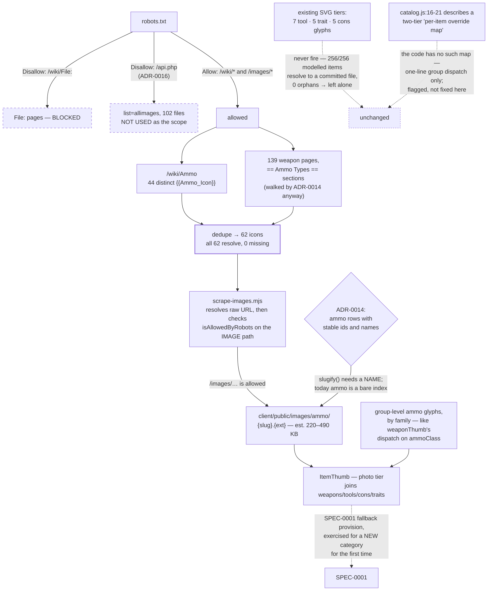

# ADR-0020: Give Ammo an Image Tier from Allowed Paths, and Leave the SVG Fallback Group-Level

> **Disposition confirmed 2026-08-15 — wanted, and deliberately not specced yet.** This decision stands
> and will get a governing spec, but not now. Per Jon it is *"something I want to do shortly after
> shipping the desktop app once the ammo data is fixed"* — so it is sequenced behind two things:
>
> 1. **The ammo data is fixed.** SPEC-0010 replaces the ten shared ammo pools with per-weapon rows
>    carrying stable ids; drawing images for ammo that is about to be re-modelled would key them to
>    identifiers that are on their way out.
> 2. **The desktop app ships.** SPEC-0005 is itself `status: blocked` behind seven product-completeness
>    gates, so this sits behind those too.
>
> Note that item 1 is now item 2's gate as well: the ammo data became the seventh SPEC-0005 gate on
> 2026-08-15, so SPEC-0010 blocks the desktop ship, which in turn blocks this. The order is unchanged —
> ammo data, then desktop, then these icons — but the two prerequisites are no longer independent.
>
> **Until then, its absence is intentional.** An accepted ADR with no spec is normally a gap worth
> raising; this one is not, and `/sdd:audit`, `/sdd:check` and any drift review MUST NOT report it as
> unplanned work or missing coverage. Revisit when SPEC-0010 has landed and desktop distribution is
> unblocked.

## Context and Problem Statement

Image coverage for everything the app models is complete. Running the app's own `slugify()` over every
catalog row against what is committed:

| Category | Rows | Files | Resolve |
|---|---|---|---|
| weapons | 147 | 147 | **147** |
| tools | 21 | 21 | **21** |
| consumables | 30 | 30 | **30** |
| traits | 58 | 58 | **58** |

A bijection in both directions — every row finds art, and **zero committed files are claimed by no
row**. ADR-0002's pipeline did its job.

So the gap is not missing art for modelled items. It is **one entity class with art on the wiki and no
presence in the app at all**: ammo. There is no `client/public/images/ammo/` directory, no ammo entry
in `ItemThumb`'s category map, and no SVG fallback tier for it. Ammo is the only thing a player
*buys* in this app that has never had a picture.

Two questions follow. **How many icons, enumerated how** — given ADR-0016 established that
`/api.php` is disallowed and my enumeration of "102 ammo files" went through it. And **what happens to
the SVG fallback**, which the report describes in terms the code does not support.

## Decision Drivers

* **The art exists and is complete.** Every distinct `{{Ammo_Icon}}` name referenced on the wiki
  resolves to an existing file — **zero missing**. Unlike ADR-0002's situation, there is no sourcing
  problem here, only a fetching one.
* **`robots.txt` permits the fetch, and the existing scraper already checks.** `/wiki/File:` is
  **disallowed**, but the direct `/images/…` path is **allowed** — and `scrape-images.mjs:285-293`
  already resolves the raw image URL, runs `isAllowedByRobots` against **the image path**, and throws
  `RobotsDisallowedError` if blocked. So the pipeline is compliant for this by construction. **This is
  the opposite of ADR-0016's situation** and worth stating, because the two decisions read the same
  `robots.txt` and reach different conclusions for good reason.
* **The enumeration must not use the API, and does not need to.** Deduping `{{Ammo_Icon}}` names from
  `/wiki/Ammo` (44) plus the 139 weapon pages' `== Ammo Types ==` sections gives **62** distinct
  icons, all of which resolve. Both sources are allowed paths. The API's `list=allimages` returned
  102 — a number this decision deliberately does not adopt, because it can only be obtained through a
  path the project has just decided not to use.
* **62 is also the *right* 62, not merely the reachable one.** It is exactly the icons for rounds that
  appear in the data — the index's canonical variants plus the per-weapon rounds that appear nowhere
  else (Chu Ko Nu's two bolts, the Bomb Lance charges, the Hand Crossbow's four). So scope tracks
  ADR-0014's rows rather than the wiki's upload history.
* **The enumeration is free.** ADR-0014's scrape already walks all 139 weapon pages for their ammo
  sections. Collecting the icon name beside the round name and price adds no fetch.
* **The fallback tier currently never fires, which changes what it is for.** With all 256 modelled
  items resolving to a committed file, the SVG tier is reached only for content that has not been
  scraped — in practice brand-new DLC. That is an argument for keeping it coarse, not for refining it.
* **ADR-0002 records asset weight as an explicit downside**, so the cost needs stating. Committed
  imagery is **5.45 MB** today (weapons 2410 KB, hunters 2550, consumables 245, traits 206, tools 166).
  62 ammo icons at the observed per-file averages for the smallest categories — traits 3.5 KB, tools
  7.9 KB — implies roughly **220–490 KB**, about **4–9%**. *This is an estimate from comparable
  categories, not a measurement: the files have not been fetched, and enumerating their sizes would
  need the disallowed API.*
* **The report's description of the SVG tier does not match the code.** It says "the per-item SVG
  override maps in `catalog.js` are **empty by design**" and that there are "exactly five glyphs per
  category". Neither holds: `toolThumb`, `traitThumb` and `consThumb` (`catalog.js:905-915`) are
  one-line group dispatches with **no per-item map at all**, and `TOOL_THUMBS` has **seven** groups
  since `a794e86` split Decoys and Sidearms. So "fill the empty per-item map" is not a task that
  exists — adding per-item icons means *introducing* a tier.

## Considered Options

* **Scrape the 62 allowed-path icons into `images/ammo/`, and add group-level ammo glyphs to the SVG
  fallback**
* Scrape all 102 files the API enumerates
* Scrape only the 44 icons on `/wiki/Ammo`
* Add ammo art with no SVG fallback
* Add ammo art and also fill per-item glyphs for the existing categories
* Do nothing

## Decision Outcome

Chosen option: **scrape the 62 icons enumerable from allowed paths into
`client/public/images/ammo/{slug}.{ext}`, and give the SVG fallback a small set of group-level ammo
glyphs. The existing fallback tiers are left exactly as they are.**

**This depends on ADR-0014 and cannot ship before it.** The image contract is
`/images/{category}/{slug}.{ext}` with the slug derived from the item's *name* — so ammo needs to be a
catalog row with a stable id and name before a path can be derived for it. Today the 31 ammo rows are
`[name, cost]` pairs addressed by array index inside a pool, which `slugify()` cannot key on. The
dependency is real and one-directional.

**The enumeration is a byproduct, not a crawl.** ADR-0014's scrape already reads every weapon page's
`== Ammo Types ==` section for round names and prices; the `{{Ammo_Icon}}` name sits in the same
template call. Collecting it there costs nothing and keeps the icon set automatically in step with the
rounds actually modelled.

**Group-level glyphs, by ammo family, not per round.** The fallback's only audience is content not yet
scraped, so a handful of glyphs — one per ammo family, matching how `weaponThumb` already dispatches
on `ammoClass` — is proportionate. Per-round glyphs would mean authoring 62 SVGs that a user sees only
if the scrape has not run.

**The other categories' fallback tiers are not touched**, and the reason is measured rather than
asserted: they never fire. The "all sixteen Medical traits draw the same cross" complaint is real but
invisible — the photo tier is 100% populated, so that cross is reached only for a trait that does not
yet exist. Refining it is work whose entire benefit accrues to unreleased content.

**`catalog.js`'s image-model header needs a correction, and this decision does not make it.** Lines
16-21 describe dispatch functions that "check a per-item override map first" with "the per-item maps
are empty today" — a two-tier lookup the code does not implement. Recorded here because the report's F
recommendation was built on that description, and the next reader deserves to know the map is absent
rather than empty. The comment is `catalog.js`'s to fix.

### Consequences

* Good, because it closes the one genuine coverage gap: the app will stop pricing something it cannot
  picture.
* Good, because the enumeration needs no disallowed path and no extra fetches — it rides ADR-0014's
  walk, and every one of the 62 names is known to resolve.
* Good, because scope self-maintains. Icons are collected from the same sections that supply the
  rounds, so a new round arrives with its icon rather than needing a separate pass.
* Good, because it leaves 5 tiers of SVG glyphs alone on measured grounds rather than aesthetic ones,
  which is a smaller change than the report proposed.
* Bad, because it adds an estimated 220–490 KB to a 5.45 MB tree, and the estimate is not a
  measurement — the real figure is only knowable after fetching, which is exactly when it is too late
  to reconsider. ADR-0002 named asset weight as a downside and this is the fourth category added to it.
* Bad, because it cannot ship until ADR-0014 lands, so the most visible gap in the app is gated behind
  its largest migration.
* Bad, because 62 is a floor rather than a ceiling: the API saw 102 files, so roughly 40 exist that
  allowed paths do not reveal. If one of them turns out to be needed, the only compliant discovery
  route is a wiki page that references it.
* Neutral, because ammo icons are small and uniform, so this is the least visually risky category the
  pipeline has taken on — but it is also the first where the app will show an icon for something that
  is not an object a hunter carries in a slot.

### Consequence for ADR-0002

ADR-0002's terms are met without amendment: this is an offline, human-invoked, rate-limited scrape of
specific assets the catalog needs, not a mirror. Two things it should gain:

* **The robots finding, stated positively.** `/wiki/File:` is disallowed; `/images/…` is allowed.
  ADR-0002 requires respecting `robots.txt` and `scrape-images.mjs` already checks the image path, so
  the pipeline was correct before anyone asked — but no ADR records *why* it is correct, and ADR-0016
  now records the opposite finding for `/api.php`. Both belong on the record together, or the pair
  reads as inconsistent.
* **A fourth category on the asset-weight ledger**, with the estimate above marked as an estimate.

### Consequence for SPEC-0001

SPEC-0001 REQ "Image Coverage Across All Catalog Categories, with Fallback" gains a fifth category, and
this is the **first time its fallback provision is exercised for a new one**. The requirement already
says a category may enter with its fallback in place before art is scraped; nobody has done it. This
decision does it in the safe order — glyphs first, then art — so the provision is tested rather than
assumed.

### Confirmation

1. **Every ammo catalog row resolves to a committed file**, asserted the same way this decision
   measured the existing categories: run `slugify()` over the rows and check
   `/images/ammo/{slug}.{ext}`. The existing four categories already pass this; ammo joins them.
2. **No orphan files.** Every committed ammo asset is claimed by a row. This is what caught nothing in
   the existing categories and is worth keeping, because an unclaimed file is either a stale row name
   or a mis-slugged fetch.
3. **The fallback resolves for a row with no art**, which is the SPEC-0001 provision nobody has
   exercised: an ammo row whose file is absent must render its family glyph, not a broken image.
4. **The enumeration is asserted to come from allowed paths only.** A test fixture of the live
   `robots.txt` must show `/images/…` allowed and `/wiki/File:` disallowed — the same fixture ADR-0016
   introduces, reused here for the opposite conclusion.
5. **The scrape does not fetch what it already has.** Per ADR-0002's "not re-scraping needlessly", an
   ammo asset already committed is skipped absent `--force`, which the pipeline already implements and
   which ADR-0016's watermark can drive once ammo rows carry a `sourceRevision`.
6. `npm test` covers 1–4 offline; 5 is a scrape-script behaviour with its own suite.

## Pros and Cons of the Options

### Scrape the 62 allowed-path icons, add group-level ammo glyphs

* Good, because every path used is allowed and every name is known to resolve
* Good, because the enumeration rides a walk ADR-0014 already performs
* Good, because scope equals the rounds the app models, so it cannot drift from the data
* Neutral, because it commits to a floor rather than the full upload history, and says so
* Bad, because it is gated on ADR-0014
* Bad, because the byte cost is estimated rather than measured

### Scrape all 102 files the API enumerates

* Good, because it is complete, and completeness is easy to verify
* Good, because it would cover rounds the app might model later without a second pass
* Bad, because `list=allimages` is only reachable through `/api.php`, which `robots.txt` disallows —
  adopting this number would mean adopting the path ADR-0016 just declined
* Bad, because roughly 40 of the 102 correspond to no round in the data, so it would commit bytes for
  art nothing references

### Scrape only the 44 icons on `/wiki/Ammo`

* Good, because it is one page and one fetch, and the index is the canonical variant list
* Good, because it needs no weapon-page walk at all
* Bad, because it misses every round that appears only in a weapon's own section — Chu Ko Nu's two
  bolts, the Bomb Lance charges, the Hand Crossbow's four — which are precisely the rounds ADR-0014
  found the app currently gets wrong
* Bad, because the shortfall is invisible: 44 icons for a set of rounds larger than 44 looks complete
  until someone checks

### Add ammo art with no SVG fallback

* Good, because it is the smallest change and skips authoring any glyph
* Bad, because it would make ammo the only category without a fallback, contradicting SPEC-0001's
  coverage requirement
* Bad, because a new round shipped by a game update would render a broken image rather than a
  placeholder, and ADR-0002's whole fallback rationale is that new DLC is the expected case

### Add ammo art and also fill per-item glyphs

* Good, because it addresses the "sixteen Medical traits, one cross" complaint the report raises
* Bad, because the photo tier is 100% populated, so per-item glyphs are seen only for items that do
  not exist yet — the benefit is entirely hypothetical
* Bad, because there is no per-item map to fill: it would mean introducing a second lookup tier, which
  is a larger change than the report's framing implies (see §"Consequence" on `catalog.js`'s header)

### Do nothing

* Good, because it is free, and the app has priced ammo without pictures since it shipped
* Bad, because the ammo select is the only purchase surface in the app with no visual identity, and
  ADR-0014 is about to make ammo a first-class row with a name and an id

## Architecture Diagram

## More Information

* **Extends ADR-0002** (Source Weapon/Equipment Images from huntshowdown.wiki.gg via a One-Time,
  Self-Hosted Scrape). See "Consequence for ADR-0002" — the terms are met, and two things belong on its
  record: the positive robots finding, and a fourth category on the asset-weight ledger.
* **Enabled by ADR-0014** (per-weapon ammo rows) — a **hard dependency**, not a shared foundation. The
  image path is derived from an item's name via `slugify()`, so ammo must be a named, id-addressed row
  first. Today it is a `[name, cost]` pair at an array index. Declared as `enables` on ADR-0014.
* **F2 from the report is already resolved and needs no decision.** All 92 weapon-variant subpages
  carry a distinct `image=`, and `192aac5` shipped all of them — verified through the app's own
  `slugify()` at 147/147 with zero orphans. The report's worry that variants would multiply the image
  payload was correct and has already been paid: weapons went 58 files / 924 KB → 147 / 2410 KB
  (+161%), recorded against ADR-0002 in that commit.
* **Why the two robots conclusions differ**, since ADR-0016 and this decision read the same file and
  disagree: `robots.txt` disallows the *API* and the *File: description pages*, and allows the
  *article* namespace and the *image binaries*. The image pipeline needs only the latter two. There is
  no tension — the wiki is asking not to be crawled through its machine interfaces, and self-hosting a
  named asset fetched from `/images/…` is what ADR-0002 was always doing.
* **The 62 are a floor.** The API saw 102 files matching `Ammo*`, so ~40 exist that no allowed page
  references — and two of the 102 (`Ammo_Collage.png`, `Ammo_Choke_Bomb.png`) are not variant icons at
  all. If a needed round turns out to have no referencing page, the compliant discovery route is
  whichever wiki page names it, not an enumeration.
* **Out of scope**: Tarot Card art (14 rows, blocked on a scope decision, not on iconography), Event
  trait art (17 rows held back on data confidence per the `TRAITS` boundary), world items (Ammo Box,
  Special Ammo Crate — not catalog entities), and any change to the four existing SVG tiers.
* **Revisit when**: a needed ammo round has no icon on any allowed page, or ADR-0002's fan-content
  premise changes — ADR-0002 names a change in Crytek's policy as its own revisit condition and nothing
  here touches that.
* **Provenance.** The coverage bijection, the 62-vs-102 enumeration, the robots positions and the
  asset-weight figures come from a pass over the live wiki and the committed tree on 2026-08-12,
  recorded in `docs/reports/suggested-adrs.md` § F, § F1, § F2 and § 3.7, arrives on `main` with
  **#266**.
* **Related issues**: #7 (the original image scrape), #178 and #227 (picker surfaces any thumbnail
  appears in).
