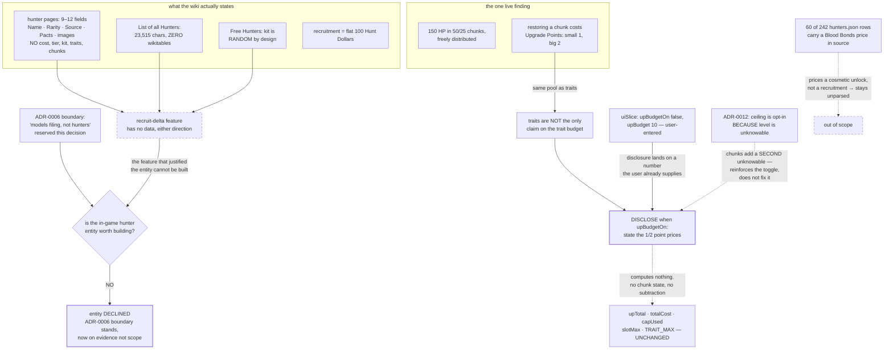

# ADR-0021: Decline the In-Game Hunter Entity, and Disclose That Health Chunks Spend Trait Points

## Context and Problem Statement

ADR-0006 reserved this decision by name:

> This decision models **filing, not hunters**. No permadeath, no carried traits, no recruitment cost,
> no per-hunter carry-limit validation, no health state. If a future feature wants to model an actual
> in-game hunter, that is a different entity than the list described here and **deserves its own ADR**
> rather than accreting fields onto `loadoutLists`.

The feature that would justify the entity is compelling: in game you do not build a loadout from
nothing — you recruit a hunter who arrives *with* weapons and traits, then buy the difference. **A
planner that knows a recruit's starting kit can price the delta**, which is the decision a player is
actually making at the recruitment screen.

Measured against the wiki on 2026-08-12, **that starting kit does not exist as data.** So the question
is not "how do we model the in-game hunter" but "is there anything left to model, once the motivating
feature turns out to be unbuildable?"

## Decision Drivers

* **Hunter pages carry none of the five fields the feature needs.** Two pages, two different templates,
  the same vocabulary:

  | Page | Template | Fields |
  |---|---|---|
  | `Hunters/Bad Hand` | `{{Infobox Hunter Variant}}` | 12 — per-variant `_title` / `_caption` / `_Source` / `_Pacts` pairs, plus `Name`, `Rarity`, `images` |
  | `Hunters/The Beast Hunter` | `{{Infobox Hunter}}` | 9 — `Title`, `image`, `caption`, `Name`, `Rarity`, `Source`, `Update`, `Pacts`, `Event Boost` |

  **Neither page mentions Hunt Dollars, Blood Bonds, Recruit, Tier, Rank or Health Chunk even once.**
  Nor is there a table to mine: `== List of all Hunters ==` is 23,515 characters containing **zero
  `wikitable`s** — galleries only. **ADR-0007's roster scope was correct.**
* **The starting kit is explicitly random, so it is a generator spec rather than a dataset.**
  `/wiki/Hunters` § "Free Hunters": four free hunters after each mission, with "a **random** name and
  come with relatively cheap Weapons, a melee tool and a First Aid Kit as well as a **random**
  Consumable and **one random Trait**." There is no per-hunter kit to diff against, for any hunter.
* **Recruitment is a flat 100 Hunt Dollars.** `/wiki/Hunters`: "he can spend **100 {{Hunt Dollars}}** to
  recruit a Common or Legendary hunter." So there is no per-hunter recruitment cost to model, and
  `totalCost()` staying a single number is not in tension with anything.
* **Blood Bonds sit at a different layer, and the data for them is already committed.** BB buys the
  *unlock* of a Legendary hunter's appearance, and roster slots at 150 BB each. **60 of the 242
  `hunters.json` rows already carry a BB figure inside `source`** as unparsed text — 300, 400, 500,
  600, 700, 800, 900, 1000 and 1500 across 4/3/6/6/5/12/10/12/2 hunters. That is latent per-hunter cost
  data, but it prices a cosmetic unlock rather than a recruitment, so it does not rebuild the feature.
* **What is genuinely there is a budget interaction, not an entity.** `/wiki/Hunters` § "Health &
  Death": 150 HP split into 50 or 25 HP chunks, "The player can distribute them freely, only the lowest
  50 HP can not be altered". And § "Hunter XP & Level": Upgrade Points "can be used to purchase Traits
  **and restore lost Health Chunks** — a small Health Chunk costs 1 {{Upgrade Points}}, a big costs 2."
  **So health chunks and traits compete for the same points**, and the app models the pool as
  traits-only.
* **The app already asks the user for that pool, which makes the disclosure cheap.** `uiSlice.js` holds
  `upBudgetOn: false` and `upBudget: 10` — a user-entered, opt-in ceiling. A note that chunk
  restoration also draws on it lands on a number the user already supplies, requiring no new state.
* **ADR-0012 explains why building the entity would not fix the underlying problem.** "The UP budget is
  opt-in *because* it varies with hunter level, so the app cannot know a player's real ceiling." Adding
  chunk state would make the ceiling depend on *more* unknowable per-hunter facts, not fewer.
* **Two adjacent decisions have already set the posture.** ADR-0018 discloses Burn consumption rather
  than simulating it; ADR-0019 displays scraped stats and computes nothing. A third disclosure is
  consistent rather than novel.

## Considered Options

* **Decline the entity; disclose that health-chunk restoration spends trait points**
* Model the in-game hunter as the entity ADR-0006 reserved
* Decline H entirely and add nothing
* Build the recruit-delta feature from a hand-authored starting-kit table

## Decision Outcome

Chosen option: **decline the in-game hunter entity, and adopt only the one live finding — a disclosure
that health-chunk restoration draws on the same Upgrade Point budget as traits.**

**The entity is declined because its motivating feature is unbuildable, not because it is unwelcome.**
ADR-0006 asked for this ADR on the assumption that a future feature would want the entity. The feature
that would have wanted it — pricing the delta from a recruit's starting kit — has no data behind it in
either direction: the wiki states no per-hunter kit, and the free-hunter kit is *defined* as random. A
decision to build an entity in service of a feature that cannot be built is worse than a decision not
to.

**ADR-0006's boundary therefore stands unchanged, and is now stood on evidence rather than on scope
discipline.** "No recruitment cost" was a scoping choice in 2026; it is now also a factual statement —
there is no per-hunter recruitment cost to model, because recruitment is a flat 100 Hunt Dollars.

**The disclosure is the whole of what is adopted.** When the Upgrade Point budget is enabled, the app
must make clear that the trait total is not the only claim on those points: restoring a lost health
chunk costs 1 point for a small chunk and 2 for a big one. **The app computes nothing from this** — it
does not track chunks, does not subtract them, and does not ask the user how many they have lost.
Consistent with ADR-0019's rule, this is a stated fact rendered as such.

**Nothing is derived and no state is added.** `upTotal`, `totalCost`, `capUsed`, `slotMax` and
`TRAIT_MAX` are untouched. `uiSlice`'s `upBudget` gains no companion field. A user who wants to reserve
points for chunks does what they already do with any other unmodelled cost: enters a smaller budget.

### Consequences

* Good, because it closes ADR-0006's deferral honestly instead of leaving it open indefinitely, and
  records *why* the entity is not worth building rather than that nobody got to it.
* Good, because it corrects a premise before anyone spends effort on it. The recruit-delta feature reads
  as obviously valuable and is obviously unbuildable, and only measurement distinguishes the two.
* Good, because the adopted half is nearly free: one disclosure on a number the user already enters,
  with no new state, no scrape, and no arithmetic.
* Good, because it keeps the app's stance consistent — three consecutive decisions (ADR-0018, ADR-0019,
  this one) choose disclosure over simulation, which is now a recognisable posture rather than three
  separate judgement calls.
* Bad, because the disclosure is weak medicine for a real problem. A player who has lost three chunks
  genuinely has fewer points for traits, and the app will tell them that fact without helping them
  apply it. "Enter a smaller budget" is a workaround, not a feature.
* Bad, because it declines the most interesting feature in the report. Pricing a recruit's delta is the
  decision a player actually makes, and this ADR's answer is that the data does not exist — which is
  correct today and might not be permanent.
* Bad, because 60 rows of committed Blood Bonds prices stay unused. That is defensible (they price
  cosmetics, not recruitment) but it does mean the roster carries cost data the app ignores, which is
  the same shape of waste ADR-0019 identified for `dualWield`.
* Neutral, because health-chunk *configuration* — how a player distributes 150 HP across 50s and 25s —
  is left entirely unmodelled. It costs no points to arrange, only to restore, so it is a preference
  rather than a budget item and the planner has no reason to hold it.

### Consequence for ADR-0006

ADR-0006's boundary is **confirmed and re-grounded**, not amended. Its list — "no permadeath, no
carried traits, no recruitment cost, no per-hunter carry-limit validation, no health state" — was
written as a scope decision. Three of its five items are now also findings:

* **no recruitment cost** — because recruitment is a flat 100 Hunt Dollars, not a per-hunter figure
* **no carried traits** — ADR-0018 established that Burn consumption is in-match state, which this is
  a special case of
* **no health state** — because the only budget-relevant fact about health is a per-chunk *price*, which
  is a constant and needs no state to state

Its final clause — that a future feature wanting the entity "deserves its own ADR" — is satisfied by
this one. The answer happens to be no.

### Consequence for ADR-0012

ADR-0012's reasoning is reinforced. It made the UP ceiling opt-in "because it varies with hunter level,
so the app cannot know a player's real ceiling", and contrasted that with fifteen, which "does not
vary". Health chunks add a **second** source of per-hunter variance to the same ceiling — so the toggle
was even more right than its own argument claimed, and this decision adds the second reason to the
record rather than changing the mechanism.

### Confirmation

This decision mostly forbids things, so the assertions are mostly that nothing happened:

1. **No hunter entity exists.** `loadoutLists` gains no health, level, or recruitment field — the
   accretion ADR-0006 warned about. A structural check on the slice's shape is the cheap version.
2. **The arithmetic is unchanged.** `upTotal`, `totalCost`, `capUsed`, `slotMax` and `TRAIT_MAX` produce
   identical output with the disclosure present and absent — the same property guard ADR-0017,
   ADR-0018 and ADR-0019 use.
3. **The disclosure states the wiki's numbers, not the app's.** 1 point for a small chunk, 2 for a big
   one, sourced from `/wiki/Hunters`. If those change, the disclosure is wrong in the way a stale
   scraped value is wrong — visibly attributable — rather than in the way a computed figure is.
4. **`hunters.json` gains no parsed cost field.** The 60 Blood Bonds figures stay as the unparsed
   `source` text ADR-0007 scoped them as, so this decision cannot be mistaken for having admitted
   hunter pricing by the back door.
5. `npm test` covers 1, 2 and 4 offline.

## Pros and Cons of the Options

### Decline the entity; disclose the health-chunk claim

* Good, because the declined half is declined on measurement, and the adopted half is nearly free
* Good, because it keeps ADR-0006's boundary intact while answering the question ADR-0006 asked
* Good, because it needs no new state, no scrape, and no arithmetic
* Neutral, because it closes a deferral with a "no", which is a legitimate ADR outcome but an
  unsatisfying one to read
* Bad, because the disclosure informs without helping — the player still has to translate it into a
  smaller budget by hand

### Model the in-game hunter as ADR-0006's reserved entity

User-entered level or UP total, plus health-chunk state, enabling "points remaining after restoring
chunks".

* Good, because it is the only option that makes the UP budget genuinely accurate for a specific hunter
* Good, because it is buildable — chunk state is user input, so no scraped data is required, which is
  the usual blocker and is absent here
* Bad, because it inherits ADR-0012's problem rather than solving it: the ceiling already varies with a
  level the app cannot know, and this adds a second unknowable per-hunter input
* Bad, because it asks the user to maintain state that changes every match, in an app whose entire
  value is being faster than the in-game screen
* Bad, because the feature that justified the entity does not exist, so the entity would be built for a
  budget refinement rather than for the recruit view — a much weaker case than ADR-0006 anticipated

### Decline H entirely, add nothing

* Good, because it is the cleanest possible close of the deferral, and zero risk
* Good, because it keeps three consecutive ADRs from all landing disclosures on the same surface
* Bad, because it discards the one thing measurement actually found: that traits are not the only claim
  on the trait budget
* Bad, because "we looked and there is nothing" is a less useful record than "we looked, the feature is
  unbuildable, and here is the one fact worth keeping"

### Build the recruit-delta feature from a hand-authored starting-kit table

Author each hunter's starting weapons and traits by hand, since the wiki does not state them.

* Good, because it would deliver the feature the report wanted, and hand-authoring is a precedent this
  project accepts (`group`, `ammoClass`, and ADR-0017's four axes)
* Bad, because the kit is **random by design** — there is no per-hunter truth to author, so the table
  would encode a fiction rather than an unstated fact. That is categorically different from
  hand-authoring `actionType`, where the fact exists and is merely unpublished.
* Bad, because it would be 242 rows of invented data with no source to check against, and no test could
  ever fail

## Architecture Diagram

## More Information

* **Extends ADR-0006** (Organize Saved Loadouts into User-Named Lists). See "Consequence for ADR-0006".
  Its final clause asked for this ADR; the answer is no, and three of its five boundary items are now
  findings rather than scope choices.
* **Related to ADR-0012** (Fifteen-Trait Cap). See "Consequence for ADR-0012" — health chunks add a
  second source of per-hunter variance to the ceiling ADR-0012 made opt-in for exactly that reason.
* **What ADR-0007 got right.** It scoped `hunters.json` to "a name, an id and a portrait" plus
  acquisition metadata, matching what ADR-0006 consumed. Measurement confirms there was nothing else to
  take: the fields this decision looked for are absent from both hunter infobox templates and from the
  roster listing.
* **The report's H premise, corrected.** `docs/reports/suggested-adrs.md` § H states that "/wiki/Hunters
  carries considerably more: recruitment cost, rank/tier, a starting loadout, starting traits, and the
  health-chunk configuration", marked `[VERIFY]`. Verified: **none of the five is a per-hunter field.**
  Recruitment is a flat 100 HD stated once; the starting kit is defined as random; health chunks are a
  global mechanic with a constant price. The `[VERIFY]` marker did its job, and this is the one
  recommendation in that report whose central feature does not survive contact with the pages.
* **The Blood Bonds figures, recorded because they are easy to mistake for the missing data.** 60 of 242
  rows carry a BB price in `source` across nine price points. They price a **cosmetic unlock** — making
  a Legendary hunter available in the store — not a recruitment, which is always 100 Hunt Dollars. So
  they do not reconstruct the recruit-delta feature, and this decision deliberately leaves them
  unparsed rather than admitting hunter pricing through a side door.
* **Health-chunk configuration is unmodelled and that is correct.** Distributing 150 HP across 50s and
  25s costs nothing; only *restoring* a depleted chunk costs points. So the arrangement is a preference,
  not a budget item, and a planner has no reason to hold it.
* **Out of scope**: permadeath, XP and levelling, the roster slot limit (10 rising to 75 at 150 BB
  each), Soul Survivor's granted loadout, and any per-hunter state whatsoever.
* **Revisit when**: the wiki begins stating a per-hunter starting loadout, or the game introduces fixed
  recruit kits. Either would restore the recruit-delta feature's data and make the entity worth
  reconsidering on ADR-0006's original terms. Absent that, this decision should be reopened only by
  someone who wants the entity for a *different* feature than the one that motivated it.
* **Provenance.** The field audits of both hunter templates, the zero-wikitable measurement, the
  recruitment and health-chunk quotations, and the 60-row Blood Bonds tally come from a pass over the
  live wiki and the committed dataset on 2026-08-12, recorded in
  `docs/reports/suggested-adrs.md` § H, § H1, § H2 and § 3.6, arriving on `main` with **#258**.
* **Related issues**: ADR-0010's archetype generator (the free-hunter kit spec — "cheap weapons, a melee
  tool, a First Aid Kit, a random Consumable and one random Trait" — is a plausible archetype, which is
  the one place this data is still useful).
