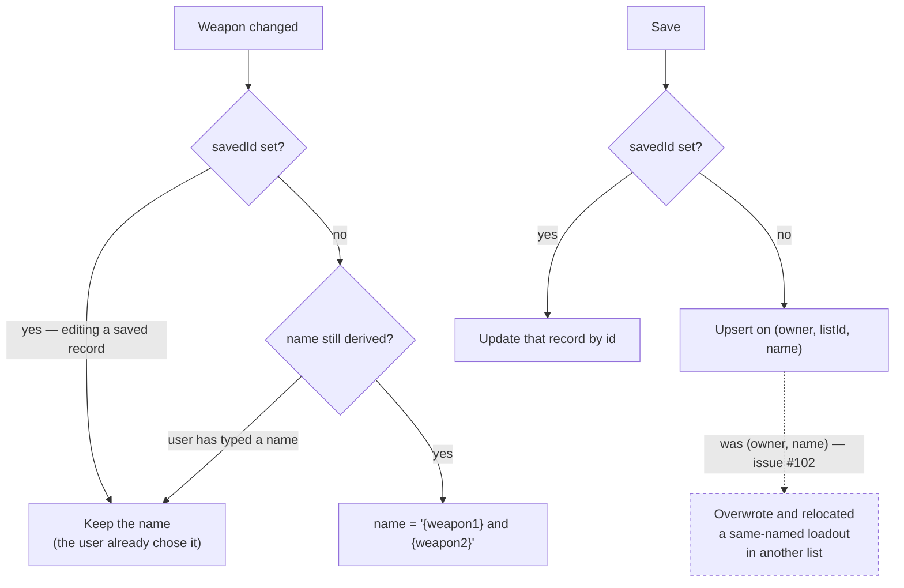

# ADR-0022: Scope the Loadout Upsert Key to Its List, and Derive Loadout Names from the Weapons Until the User Owns Them

## Context and Problem Statement

Saving a loadout can destroy a different one. `POST /api/loadouts` matches an existing record on
`(owner, name)` alone — `server/src/routes/loadouts.js:263`:

```js
const existing = liveRecords(db.data.loadouts).find((l) => l.owner === token && l.name === trimmedName);
```

That was correct when loadouts were one flat collection. Since ADR-0006 made lists the filing unit, a
save files into whichever list is open — so saving "Fanning" while *Solo Necro* is open **overwrites and
relocates** the "Fanning" already sitting in *Aggro Duo*. The user sees a success banner; the other copy
is gone. This is issue #102, open since 2026-08-10, and per-list duplicate names are exactly what lists
invite.

Separately, a naming proposal: when the user changes the primary weapons, default the loadout's name to
`{weapon1} and {weapon2}`, so tinkering always proposes a fresh name and saves as a new record rather
than silently replacing the one it grew out of — **except** when the user has loaded one of their own
saved loadouts and is updating it in place, which works today and must keep working.

These are one decision, not two, because **the naming proposal makes the collision bug worse.** A derived
name is a pure function of the weapon pair, so two loadouts built from the same two weapons in different
lists receive the *same* name by construction. Today a collision requires the user to type the same name
twice; under derived naming it becomes the default outcome for anyone who builds a Sparks/Conversion pair
in both "Solo" and "Duo". So: what identifies a saved loadout, and where does its name come from?

## Decision Drivers

* **Data loss on a routine flow.** Not a corner case — filing the same build into two lists is the
  motivating use of lists.
* **The server already has what it needs.** `savedLoadoutsSlice.js:50` calls
  `upsertLoadout(name, toData({ ...loadout, name }), listId)`; `listId` reaches the server and is stored.
  Only the match key ignores it. The fix is one predicate.
* **Derived names collide deterministically.** This inverts the usual "collisions are rare" assumption
  and is the reason the two changes cannot ship independently.
* **The behaviour we want to preserve is a side effect of the bug.** `loadSavedThunk`
  (`thunks.js:47-49`) dispatches `setLoadout(fromData(record.data))` and **discards `record.id`**. After
  loading, the client does not know which record it came from. "Editing a loaded loadout updates it in
  place" works *only* because the name round-trips through `data` and the server matches on name. Any fix
  to the key, and any change to the name, disturbs it.
* **There is no provenance state at all.** No `savedId`, `loadedFrom`, or `dirty` anywhere in
  `client/src/store`. The requested exception cannot be expressed without introducing one.
* **A precedent exists, and it is deliberately weaker than what is proposed here.** SPEC-0003 REQ "New
  Lists Default Their Name from the Chosen Portrait" defaults a list's name from the selected hunter, and
  specifies that the defaulted name "SHALL be an ordinary mutable value, **indistinguishable in storage
  from a user-typed name**." That is a one-shot default with no memory. Re-deriving as weapons change
  requires knowing the name is *still* derived — the very distinction SPEC-0003 refused to store.
* **A name the user typed is theirs.** Whatever is chosen must never overwrite it.

## Considered Options

**For record identity:**

* **Scope the upsert key to `(owner, listId, name)`**
* Keep `(owner, name)` and warn before clobbering
* Keep `(owner, name)` and reject the collision with `409`

**For naming:**

* **Derive from the weapons until the user owns the name** ("derive-until-owned")
* One-shot default, mirroring SPEC-0003's list behaviour exactly
* No derived names — status quo

## Decision Outcome

Chosen: **scope the upsert key to `(owner, listId, name)`, and derive the loadout name from the weapon
pair until the user edits it**, with a client-only `savedId` carrying provenance so a loaded loadout
still updates in place.

**The ordering is part of the decision.** The key fix MUST land and deploy before derived naming does.
Shipping the naming change first multiplies the collisions the key fix exists to prevent, and does so
silently. This is the single most important sentence in this ADR.

### The key

`(owner, listId, name)` matches the mental model ADR-0006 established: a list is a folder, and two
loadouts named "Fanning" in different folders are different loadouts. `listId` is nullable — the
Unassigned pseudo-list is `null` — so the comparison must treat `null` as a value rather than as
"missing", or every Unassigned save collapses onto the first record.

**Existing records need no migration.** The key narrows rather than widens: any pair that matched under
`(owner, name)` and shared a `listId` still matches, and any pair that matched *across* lists was the bug.
No stored record changes shape, and `FORMAT_VERSION` is untouched — `listId` lives in the envelope, not
in `data` (SPEC-0003 REQ "Loadouts Are Filed into Lists by Nullable Reference").

### The name

The derived name is `{weapon1} and {weapon2}` from `WEAPONS[i][1]`, the display name. Degenerate cases
are named explicitly rather than left to the implementer: one weapon yields that weapon's name alone;
no weapons yields the existing generic default, not the string "and".

**Only a weapon change re-derives.** The name can express nothing but the weapons, so re-deriving on a
consumable swap would rewrite the string to an identical value and burn a render for nothing.

**Derive-until-owned** means the client tracks whether the current name is still derived. The moment the
user edits the name field, the name becomes theirs and is never re-derived again — for that editing
session. That flag is **client-only and ephemeral**: it is not persisted, not sent to the server, and not
part of the wire format, so it costs no version bump and SPEC-0003's "indistinguishable in storage"
property survives intact. Storage sees an ordinary string either way; only the live editor knows the
difference.

### The exception, and what it costs

`loadSavedThunk` must carry `record.id` into loadout state as `savedId`. With it:

* A loadout loaded from a saved record has `savedId` set. Weapon changes **do not** re-derive its name —
  the user is editing a thing that already exists and already has a name they chose.
* A loadout built from scratch, randomized, or decoded from a share URL has `savedId` unset, and derives
  freely.
* Saving with `savedId` set updates that record by id. Saving without it upserts on
  `(owner, listId, name)` as above.

This is the part that is *not* free. It introduces the first piece of provenance state the client has
ever had, and provenance state invites a follow-on question this ADR deliberately leaves open: when a
loaded loadout is edited beyond recognition, at what point does it stop being that record? Answering
"never, until the user renames it" is the status quo and is what this ADR adopts.

### Consequences

* Good, because the data loss in #102 stops, on a change small enough to review in one sitting.
* Good, because two loadouts named the same in different lists become legal, which is what lists imply.
* Good, because tinkering stops silently consuming the build it grew from — the fresh name is the signal
  that this is a new thing.
* Good, because the derived-name flag stays out of storage, so no `FORMAT_VERSION` bump and no migration.
* Good, because "update the loaded one in place" becomes an explicit identity rather than an accident of
  name matching, which is a precondition for ever changing naming again.
* Bad, because the client gains provenance state it has never had, and provenance is a category of bug
  the app has so far avoided entirely — a stale `savedId` would write over the wrong record.
* Bad, because loading a loadout from list A and saving it while list B is open now creates a copy in B
  rather than moving the original. That is the correct behaviour and it is still a behaviour change.
* Bad, because a user who liked typing names sees the field change under them until they touch it once.
* Neutral, because the derived name is only a default. Nothing prevents two identical names in one list
  if the user insists; the key stops that from destroying data, it does not forbid it.

### Confirmation

1. **A server test proves the collision is gone**: two loadouts, same owner, same name, different
   `listId`, both saved — two records survive, neither relocates. And the `null`-`listId` case: two
   Unassigned saves under one name still upsert onto one record.
2. **A test pins the ordering constraint** by covering the key with derived names in play: two loadouts
   with the same weapon pair, filed into different lists, both retained.
3. **A client test asserts derive-until-owned**: changing a weapon re-derives; typing in the name field
   then changing a weapon does not.
4. **A client test asserts the exception**: a loadout loaded via `loadSavedThunk` does not re-derive its
   name when weapons change, and saves back onto its own `savedId`.
5. **A test asserts the degenerate names** — one weapon, and none.
6. `npm test` covers all of the above offline. No manual step is required.

## Pros and Cons of the Options

### Scope the upsert key to `(owner, listId, name)`

* Good, because it matches ADR-0006's folder model, which users already see in the UI
* Good, because `listId` already reaches the server — the diff is a predicate, not a feature
* Good, because it narrows the match, so no existing record needs migrating
* Neutral, because it makes duplicate names legal, which some users will find untidy
* Bad, because "save" now depends on which list is open, and that is not visible at the moment of saving

### Keep `(owner, name)` and warn before clobbering

* Good, because it preserves one-name-per-user, which is simple to explain
* Bad, because it needs a UI affordance the app does not have, on a path that is currently one click
* Bad, because under derived naming the warning would fire constantly — the same weapon pair produces the
  same name by design, so the "collision" is the normal case rather than the exception
* Bad, because a warning is a worse guarantee than a correct key: it moves a data-integrity property into
  the user's hands

### Keep `(owner, name)` and reject with `409`

* Good, because it is the most conservative and cannot lose data
* Bad, because it turns a working flow into an error for a case that is legitimate under lists
* Bad, because it needs the same client prompt as the warning option, plus error handling

### Derive from the weapons until the user owns the name

* Good, because it delivers the requested behaviour — tinkering always proposes a fresh name
* Good, because the flag is ephemeral, so storage and wire format are untouched
* Bad, because it introduces a piece of state whose lifetime is a UI session, and such state is easy to
  leak across a route change or a randomize
* Bad, because it departs from SPEC-0003's list-naming rule, so the two naming behaviours in the app are
  no longer the same rule

### One-shot default, mirroring SPEC-0003

* Good, because the app then has exactly one naming rule, stated once
* Good, because it needs no derived-name flag at all
* Bad, because it does not do what was asked: the name is set once when weapons are first chosen and then
  goes stale the moment the build changes, which is precisely the tinkering case

### No derived names

* Good, because it is free and changes nothing
* Bad, because "Unnamed loadout" is the default today, so every unnamed save collides with every other
  unnamed save — the collision problem in its purest form

## Architecture Diagram



## More Information

* **Extends ADR-0006** (Organize Saved Loadouts into User-Named Lists). ADR-0006 made the list the filing
  unit; this decision makes the list part of the record's identity, which is the conclusion ADR-0006
  implies but does not state. Nothing in ADR-0006 is reversed.
* **Governs SPEC-0003** (Hunter Loadout Lists). Two requirements are affected. REQ "Loadouts Are Filed
  into Lists by Nullable Reference" gains the consequence that the reference is part of the identity, not
  only an attribute. And REQ "New Lists Default Their Name from the Chosen Portrait" acquires a sibling
  that is deliberately *not* the same rule — lists default once, loadouts re-derive until owned — which
  should be stated in the spec rather than left for a reader to infer from two similar-looking behaviours.
* **The ordering constraint is the load-bearing part.** If only one half of this ADR is implemented, it
  must be the key. Derived naming shipped alone converts a rare user error into a systematic one.
* **`loadSavedThunk` currently discards `record.id`** (`client/src/store/thunks.js:47-49`). The exception
  requested here cannot be built without changing that, and it is worth noting that today's
  correct-looking
  "update in place" is an emergent property of the very bug being fixed rather than a designed behaviour.
* **Out of scope**: what happens when a loaded loadout is edited beyond recognition (it stays bound to its
  record until renamed); any UI for resolving a deliberate same-name-same-list collision; and whether
  `savedId` should survive a page reload, which is a persistence question this decision does not need to
  answer.
* **Related issues**: #102 (the collision and its three options), #198 (the record-ceiling rule that
  shares
  the upsert path and must keep working — only a *new* record is refused, so re-saving under an existing
  name must remain an update).
