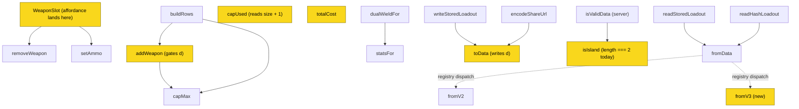

# ADR-0023: Model a Dual-Wielded Pair as a Flag on One Weapon Entry, Costed at Size Plus One

> **Accepted 2026-08-15.** This spent two days at `proposed` while its implementation shipped — the v3
> decoder (#396), the costing and stored-attribute gate (#397), the wire-format encode (#398) and the
> pair affordance (#399) are all merged. The status is now caught up with the code.
>
> **All confirmation criteria are now met.** One was left standing unmet for two days rather than
> softened:
>
> > The affordance is keyboard-reachable and carries an accessible name in all three states (ghost,
> > plus, locked).
>
> The locked state used the native `disabled` attribute, which keeps it in the accessibility tree but
> removes it from the tab order, so a keyboard-only user could not reach it to discover *why* pairing
> was unavailable. Rather than amend the confirmation to match what had shipped — which would have
> converted a real gap into a false pass — the criterion was recorded as open and the code moved to it:
> #401 swapped the native attribute for `aria-disabled`, keeping the control focusable and announced as
> disabled, with an early return in the click handler because an `aria-disabled` button still fires
> events. The `togglePair` reducer guard remains the enforcement.

## Context and Problem Statement

A dual-wielded pistol pair cannot be expressed in a loadout. The loadout holds exactly two weapon
entries of the shape `{ i, a }` — a catalog index and an ammo index — and `capUsed` sums each entry's
own `WEAPONS[w.i][2]`. The only way to represent a pair today is to put the same pistol in both
entries, which gets the arithmetic right and the loadout wrong: it consumes the second weapon entry,
so the player cannot also carry a rifle. In game the pair costs a fraction of the slot budget
precisely so that a second weapon still fits. The app can express the price of dualies but not the
loadout they exist to enable. Users are already hitting this — `server/data/db.json` carries a saved
list named "The Turncoat - Dual Dolches".

How should a pair be modelled, costed, encoded, and surfaced, given that the underlying game rule is
Crytek's to change at any time?

## Decision Drivers

* **The rule is not ours and will move.** A future trait could make Haymakers dual-wieldable. Whatever
  is chosen must be correctable by editing data, not by re-deriving a rule from other columns.
* **`weapons.length === 2` is load-bearing.** `addWeapon`, the picker, `isValidLoadoutShape`, and the
  server validator all assume it. Pair support must not become "a third weapon entry".
* **Pair plus rifle must be legal.** This is the entire point of the change; any design that consumes
  both entries has reimplemented the workaround.
* **Budget-affecting attributes are stored, never inferred** — SPEC-0007 already states this rule, and
  slot cost is budget-affecting.
* **A format bump is not free.** It touches the decoder registry, the server validator, and every
  persisted record; ADR-0014 already owes one.

## Considered Options

* **A flag on the weapon entry** — `{ i, a }` becomes `{ i, a, d }`, with `d` set only where the data
  says the weapon is dual-wieldable
* **A third weapon entry** — relax `weapons.length` to 3 and put the twin in the extra slot
* **A synthetic catalog row per pair** — `dolch-96-dual` as its own weapon with its own size and price
* **Derive from `size`** — treat every size-1 pistol as dual-wieldable and compute the rest

## Decision Outcome

Chosen option: **a flag on the weapon entry**, with the pair costing the single weapon's size plus
one, carrying exactly one weapon's worth of ammo, riding a `FORMAT_VERSION` bump to 3, and surfaced as
an affordance on the weapon slot itself.

Six things follow, and together they are the decision:

* **Dual-wieldability is stored, not computed.** It already is: the scrape lifted it out of the wiki's
  description prose into a `dualWield` field on `itemStats.json`, read through `dualWieldFor(id)`
  (`client/src/data/itemStats.js:53`). Of 33 catalog Pistols, 25 are marked dual-wieldable. Deriving
  it from `size` is refuted by the data — Haymaker and Uppercut are both size 2 and only one can be
  paired — and deriving it from anything else re-opens the correction problem the moment Crytek moves
  the rule.
* **A pair costs `size + 1`.** A Conversion pair is 2 of 5 slots, leaving 3 for a rifle, which matches
  Update 2.8's "most dual-wielded pistol pairs" reserving 2. An Uppercut or Dolch 96 pair is 3. The
  size-2 figure is the untested one — see Open Questions.
* **A pair's ammo is exactly a single weapon's ammo.** Both pistols fire the same round, so a pair is
  never two independently-configured weapons and no ammo field is added or doubled — which closes the
  question #179 left open ("does a pair buy one ammo variant or two?") in favour of one. And a pair
  **keeps** whatever slots that one weapon has, confirmed for the case where it can differ: dual
  Sparks Pistols retain both of ADR-0014's ammo slots. The rule is therefore the simplest available —
  *dual-wielding changes slot cost and weapon price and nothing whatsoever about ammo* — and `d` stays
  orthogonal to the ammo fields at every format version.
* **The weapon price doubles; the ammo price does not.** You buy two pistols, so `totalCost` counts the
  weapon twice. Ammo is charged per slot (ADR-0014: the listed price buys one slot, and 32 catalog
  rows are priced "(N per slot)"), and the bullet above fixes the pair's slot count at a single
  weapon's — two for a Sparks pair, one for the other 24 — so the ammo line is untouched. This is the
  second half of #179's open cost question, and it falls out of the ammo rule rather than needing its
  own decision.
* **`FORMAT_VERSION` goes to 3**, with the weapon entry encoding as `[id, ammo, d]`. This is discussed
  at length below, because it is the part with a real cost.
* **The affordance lives on the weapon slot, not in the picker.** Equipping a dual-wieldable pistol
  renders a ghosted second copy within that weapon's own tile: a plus sign when the budget has room
  for the extra slot, a locked state when it does not. Weapon entry 1 is never touched, so pair plus
  rifle is legal by construction rather than by careful arithmetic. This supersedes the picker-toggle
  sketch in #179.

### On spending a second format bump

ADR-0014 is accepted and already owes a bump — it replaces the single ammo index with two stable-id
selections per weapon and says so plainly: *"This is one `FORMAT_VERSION` bump and one migration."* It
is unimplemented; `itemStats.json` carries no `availableAmmo` field, and no spec covers it.

So this decision does not choose whether to bump the format. It chooses whether to **share** a bump
that is already owed — and it declines to. #179 argued the opposite case for the v2 bump ("these two
should share one bump rather than each spending their own"), and that bump was then spent on the
equipment grid alone, so the precedent is not as settled as it reads.

The reason to decline is sequencing. ADR-0014 is large: an `availableAmmo` scrape, stable ammo ids
retiring bare indices, `ammoClass` demoted from a rules input to a display grouping, and scarce ammo
repriced to zero under ADR-0013. Coupling dual-wield to it means dualies ship when all of that ships.
The cost of declining is honest and bounded: a second widening of the server validator and a second
migration over the same records, in a decoder registry explicitly built to hold several versions.

The two bumps compose rather than conflict:

| Version | Weapon entry | Carries |
|---|---|---|
| 2 (today) | `[id, ammo]` | — |
| 3 (this decision) | `[id, ammo, d]` | the pair flag |
| 4 (ADR-0014) | `[id, ammoA, ammoB, d]` | two-slot stable-id ammo |

`ammoA` and `ammoB` are ADR-0014's **per-weapon** ammo split — the two rounds one weapon may load at
once, which a lone pistol carries just the same. They are not one round per pistol of a pair, and a
pair never gets its own extra ammo field. A pair keeps exactly the slots its single weapon has, so `d`
is orthogonal to the ammo fields and neither version needs a dual-specific ammo case.

### Consequences

* Good, because pair plus rifle becomes representable, which is the loadout the feature exists for.
* Good, because `weapons.length === 2` survives untouched, so every consumer that assumes it keeps
  working without review.
* Good, because a rule change from Crytek is a data edit. A dual-wield Haymaker is one field.
* Good, because it gives the scraped-stats seam its first real consumer — #256 records that nothing
  currently reads it.
* Bad, because it spends a format version that could have been shared, and commits to a second
  server-validator change and a second migration.
* Bad, because a stale browser tab holding a v3 record decodes it through `fromLegacy` and mangles it.
  This is the failure mode chosen deliberately over the alternative: appending a third element under
  v2 would let an old client read the pair as a single pistol and undercount the slot budget silently.
  Visibly broken beats quietly wrong.
* Bad, because the ghosted-twin affordance is a new interaction pattern with no precedent in the app,
  and it must reach the same accessibility bar as every other control.

### Confirmation

* `capUsed` returns `size + 1` for a flagged entry and `size` otherwise, asserted per weapon size.
* A loadout holding a flagged pair in entry 0 and a rifle in entry 1 validates, saves, and round-trips.
* `d` cannot be set on a weapon whose data does not mark it dual-wieldable, by **any** route — the
  slot affordance, `setLoadout`, a decoded share URL, or the randomizer. A test per route, not one
  test at the reducer.
* `totalCost` counts a flagged weapon's price twice and its ammo price once — flagging a pair changes
  the weapon line and leaves the ammo line byte-identical, asserted directly rather than via a total.
* Setting `d` adds no ammo field and changes no ammo selection. When ADR-0014 lands, a flagged Sparks
  Pistol still carries both of its ammo slots — the test that would fail if a pair were ever special-
  cased into one.
* A v3 record round-trips through `toData`/`fromData`; a v2 and a v1 record still decode.
* The server rejects a weapon tuple that is not exactly three elements — the widened validator remains
  a ceiling, not a floor, preserving the #198 hardening.
* The affordance is keyboard-reachable and carries an accessible name in all three states (ghost,
  plus, locked).

## Pros and Cons of the Options

### A flag on the weapon entry

`{ i, a }` → `{ i, a, d }`; `capUsed` branches on `d`; `addWeapon` gates `d` on the stored attribute.

* Good, because the two-entry invariant is preserved, so no consumer needs revisiting.
* Good, because the pair stays one thing — one entry, one ammo selection, one price line.
* Good, because it is the smallest change that makes pair plus rifle legal.
* Neutral, because it needs a format bump, which any option carrying new state also needs.
* Bad, because a positional wire tuple grows a third element, and the next attribute will want a
  fourth. The entry is on a path toward wanting to be an object.

### A third weapon entry

Relax `weapons.length` to 3 and place the twin in the extra slot.

* Good, because the twin is a real weapon in the data, so rendering it needs no special case.
* Bad, because `weapons.length !== 2` is asserted in `isValidLoadoutShape`, the server validator, and
  the picker's slot logic — every one of them would need review, for a change that adds no capability
  the flag does not.
* Bad, because it makes "two pistols and a rifle" structurally representable, which is not a legal
  loadout, so a new invariant is needed to forbid what the old shape forbade for free.
* Bad, because the pair's ammo selection is now two fields that must be kept equal.

### A synthetic catalog row per pair

Add `dolch-96-dual` as its own weapon with its own size and price.

* Good, because no format change at all — it is an ordinary weapon id, and every existing path works.
* Good, because the pair's slot size and price are authored directly rather than computed.
* Bad, because it doubles the pistol rows in the picker, and the duplicates are not meaningfully
  different items to browse past.
* Bad, because it duplicates every future per-weapon attribute across the single and the pair, and
  they will drift — the scrape has one row per wiki page, not two.
* Bad, because switching a single to a pair becomes a different weapon rather than a toggle, which
  makes the ghosted-twin affordance impossible to express.

### Derive from `size`

Treat size-1 pistols as dual-wieldable; compute the rest.

* Good, because it needs no stored attribute and no scrape.
* Bad, because it is factually wrong. Haymaker (size 2, two-handed, not dual-wieldable) and Uppercut
  (size 2, one-handed, dual-wieldable) are the counterexample, and Dolch 96 sits with the Uppercut.
* Bad, because it hard-codes a Crytek rule into a derivation, so a balance patch becomes a code change.
* Bad, because it contradicts SPEC-0007 REQ "Budget-Affecting Attributes Are Stored, Never Inferred".

## Architecture Diagram

<!-- Call graph: capUsed|capMax|addWeapon|removeWeapon|setAmmo|toData|fromData|fromV2|dualWieldFor|totalCost|isValidData|isIsland, generated 2026-08-13. Filtered and capped at 20 nodes; cgg reports 481 callables across the two workspaces. -->

Highlighted nodes are the ones this decision changes. `fromData` reaches its decoders through the
`DECODERS` registry rather than by direct call, which is why those edges are dashed — cgg cannot
resolve them, and the registry is exactly the seam that makes a third version cheap.

## Open Questions

Three, recorded rather than guessed:

1. **Are the scoped variants two-handed?** The data marks eight Pistols as not dual-wieldable:
   `haymaker` plus seven scope/marksman variants — `bornheim-no-3-match`, `dolch-96-precision`,
   `nagant-m1895-deadeye`, `nagant-m1895-precision`, `scottfield-precision`, `uppercut-deadeye`,
   `uppercut-precision`. If those seven are two-handed, a `hands` attribute derives dual-wieldability
   cleanly and could replace the boolean. If they are one-handed and merely scoped, then `hands` is
   explanatory metadata at best and the stored boolean is doing the real work. This decision does not
   depend on the answer — it stores the attribute either way — but the answer determines whether
   `hands` is worth adding.
2. **What does a size-2 pair actually cost?** The `size + 1` rule says an Uppercut or Dolch 96 pair is
   3 slots. Size-1 pairs at 2 slots match the wiki's wording; the size-2 case does not appear in any
   source found and needs in-game verification before the figure is trusted.
3. **The dataset's tri-state has collapsed.** `dualWieldFor` is documented as three-valued, where
   `false` is an inference from absence and `null` means nothing was read — and its own comment warns
   that `=== false` is not proof a weapon cannot be paired. But `itemStats.json` holds 25 `true`, 231
   `false`, and zero `null`, so "confirmed not dual-wieldable" and "could not read the page" are
   indistinguishable. That violates #178's acceptance criterion that unresolved rows must not default
   to `false`. For the Pistols group the outcome looks correct on inspection, which is why this is a
   question rather than a blocker; resolving it means either a re-scrape that preserves `null` or
   hand-curating the ten rows that matter.

## More Information

**What already exists**, verified at `main` = `4acd970`. Issues #178 and #179 predate most of it and
should be corrected before either is picked up — as written they send an implementer looking for
prerequisites that have already landed:

* `FORMAT_VERSION` is **2**, not 1 as #179 states (`client/src/utils/loadoutCodec.js:16`), and the
  decoder registry at `:444` already holds `{v:2}`, `{v:1}`, and a legacy fallback.
* `dualWieldFor(id)` exists and the scrape has run — 256 stat rows carry `dualWield`.
* The name-collision trap #178 flagged was avoided: `officer` is `true`, `nagant-officer-carbine` is
  `false`.
* The Sparks Pistol size correction landed — `catalog.js:109` is size 1.
* Variant subpages are already catalog rows, and #255 is open to retire the `variantOf` framing that
  #178 lists as a blocker.
* The catalog weapon tuple is unchanged at six elements; the dual-wield data lives only in the scraped
  `itemStats.json`, not in `catalog.js`.

**The server is the hard gate.** `isIsland` (`server/src/routes/loadouts.js:37`) requires
`v.length === 2` exactly, and the comment above its call site explains why: a floor with no ceiling
once accepted unbounded trailing junk that was then stored. Widening it to three is required under any
encoding, and it must stay an equality check.

**Downstream artifacts.** SPEC-0006 owns the slot model and the wire format; SPEC-0007 owns the
catalog dataset shape and the stored-not-inferred rule. Both need amendment before #179 is buildable.
ADR-0014 remains unimplemented and unspecced, and is the reason the version table above stops at 4.

**Related issues**: #178 (the catalog attribute), #179 (builder support), #256 (nothing consumes the
scraped stats seam — this decision would be its first consumer), #255 (retire `variantOf`).
