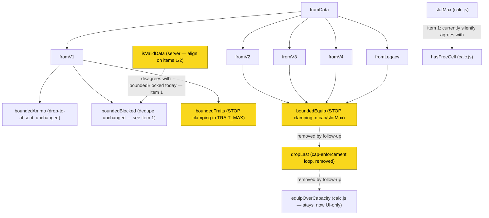

# ADR-0024: The Loadout Decoder's Contract Is "Produce a Loadable Loadout," Not "Produce a Legal One"

## Context and Problem Statement

`client/src/utils/loadoutCodec.js`'s four decoders (`fromV1`–`fromV4`, plus `fromLegacy`) and
`server/src/routes/loadouts.js`'s `isValidData` each decide, independently, what a saved-loadout
payload is allowed to contain. Nothing anywhere states what the decoder's contract *is* — whether a
malformed or rule-violating field should be dropped/repaired so the record still loads, or whether
the whole record should be rejected/clamped to something legal. Because the question was never
answered, the two ends (and the two things the client decoders themselves enforce) drifted apart.

Issue #374 (finding S1-F10 of `docs/audits/adversarial-data-qa-2026-08-14.md`) names three concrete
disagreements, all independently reproduced against `main`:

1. **Duplicate blocked cells.** `isValidData` rejects a `b` array containing a repeated cell index
   (`server/src/routes/loadouts.js:188`, `new Set(data.b).size !== data.b.length`). `fromV2`/`fromV3`/
   `fromV4` (via `boundedBlocked`, `loadoutCodec.js:127`) silently deduplicate instead. `slotMax`
   (`calc.js:157`) then computes free slots from the deduplicated count, so a stored `b: [0, 0]`
   decodes to 7 free slots via `slotMax` while `hasFreeCell` — which correctly treats the grid as
   having one blocked cell, not two — also reports 7. The two happen to agree today only because both
   were separately patched (issue #363) to dedupe; the server was never brought into that agreement,
   so the same payload that the client repairs and loads, the server refuses to store.
2. **A cell can be both occupied and blocked.** Nothing on either end rejects an `e` entry and a `b`
   index that name the same cell. Permitted at both ends, and no arithmetic anywhere (`slotMax`,
   `equipOverCapacity`) accounts for the overlap — `slotMax` subtracts blocked cells and
   `heldItems`/`equipOverCapacity` counts occupied cells as if the two sets were always disjoint.
3. **Traits and equipment disagree with each other about decode-time clamping, and the direction the
   original filing described is now stale.** As filed, traits were clamped to `TRAIT_MAX` on decode
   (`boundedTraits`, `loadoutCodec.js:109`) while equipment was not, cited via `e:
   Array(8).fill(["C","dynamite-stick"])` decoding to eight instead of ADR-0015's four-per-type cap.
   **That is no longer true of this codebase.** PR #421 ("Clamp equipment on decode with
   `boundedEquip`"), which closed #353, merged 2026-08-15 — the day *after* the audit this issue cites
   was dated, and has been on `main` throughout the life of #374. `boundedEquip`
   (`loadoutCodec.js:173`) now clamps equipment on every decoder to `slotMax` and to ADR-0015's
   four-per-category cap, the same way `boundedTraits` clamps traits to `TRAIT_MAX`. Verified directly
   against the live decoders, not inferred from the issue text: all four of `fromV1`–`fromV4` call
   `boundedEquip`, and `docs/adrs` and `git log` both confirm #421 landed before this ADR was written.
   So the disagreement item (3) actually names today is not "equipment doesn't clamp, traits do" — it
   is now "**both** clamp, and per the contract this ADR sets below, **neither should**." The
   remediation direction changes as a result; see "Consequence for issue #374's item (3)" below.

**Player-facing consequence: none reachable today**, for all three — `slotMax` and the now-deleted
`selectSlotMax` have no live callers, and the reducer cannot itself produce an occupied-and-blocked
cell. This is a correctness and consistency question about what the codec promises, not a live bug.

## Decision Drivers

* **Every other decode precedent in this codebase already answers this question, and answers it the
  same way.** An ammo selection that no longer resolves decodes to "no round chosen" rather than
  throwing or refusing the record (issue #201's store-persists-before-render hazard, `boundedAmmo`).
  A retired weapon id resolves through an alias table (`RETIRED_WEAPON_ALIASES`, issue #243) or is
  dropped silently (`WEAPON_BY_ID.has` failing). A grid hole from an unresolvable equipment id is
  preserved as `null` rather than repacked (`fromV2`'s comment: "leaves a hole; later cells must not
  shift"). Malformed `b` decays to `[]` rather than throwing. None of these enforce a game rule at
  decode time; every one of them degrades to the nearest safe value and lets the record load.
* **The store persists before it renders** (issue #201). Every decoder feeds a subscriber that writes
  the decoded loadout to `localStorage` before the UI has drawn a frame from it. A decoder that
  *rejects* an out-of-range or over-cap value, rather than degrading it, cannot avoid this: the
  record either fails to decode (breaking the load) or is written in its rejected form and breaks on
  every subsequent visit. This is the reasoning `boundedAmmo`, `boundedTraits`, and (as of #421)
  `boundedEquip` all cite for clamping rather than throwing — it is a real constraint, but it argues
  for *degrading gracefully*, not specifically for *clamping to the legal maximum*, and dropping to
  empty/absent is just as loadable as clamping to a cap.
* **Trait clamping is the outlier, not the norm, and it is explainable historically.** `TRAIT_MAX`
  enforcement (PR #224, "enforce the fifteen-trait cap at every client write path") was built early,
  as one of several *write*-path enforcement points (the reducer's `addTrait` also refuses a
  sixteenth trait), and the decoder's clamp rides along with it rather than being a deliberately
  decided decode-time rule. It was never generalized to equipment until #421 did so — accidentally
  making the codebase *more* consistent in the wrong direction, by making equipment enforce a rule at
  decode time too, rather than by removing the trait behavior it was drifting toward matching.
* **A loaded record legitimately CAN be transiently over a current rule**, and that is not the
  decoder's problem to hide. A save made under a looser historical rule (traits before #224's PR, or
  equipment before ADR-0015's per-type cap was adopted 2026-08-12) is real data the player made real
  choices about. Silently rewriting it at load time (dropping the fifth Dynamite Stick, or the
  sixteenth trait) makes a decision the player never made and gives no way to review or contest it.
  Letting the record load over-cap and surfacing that in the UI — which already exists independently:
  the equipment panel's over-capacity warning (PR #416) shipped specifically *before* #421's clamp,
  precisely so a clamp would not be the only way a player learns their save changed — treats the
  player's data as theirs to see and fix, not the decoder's to silently correct.
* **A syntactic question and a rules question are different questions, and the three disagreements
  split cleanly across that line.** Items (1) and (2) are about what the wire format permits
  *syntactically* — is a repeated blocked-cell index or an occupied-and-blocked cell even a
  well-formed payload, independent of whether the resulting loadout is a legal build. Item (3) is
  about whether a *well-formed, syntactically valid* payload's game-rule violation (too many traits,
  too many of one consumable type) should be enforced at decode time. Conflating them is exactly how
  the codebase arrived at its current state: `boundedBlocked` and the server's duplicate-`b` check
  are answering the syntactic question inconsistently, while `boundedTraits`/`boundedEquip` are
  answering the rules question by enforcing when the contract below says they should not.

## Considered Options

* **"Produce a loadable loadout"** — resolve what can be resolved, drop or null out what cannot, and
  leave every game-rule cap (equipment four-per-type, fifteen traits, weapon size budget) to be
  enforced where a live action is taken: the reducer and the UI, at the point of an add/equip/save,
  not at decode/load time.
* **"Produce a legal loadout"** — clamp or reject on decode so that anything that reaches the store is
  already within every current rule, the same way `boundedTraits` and (since #421) `boundedEquip`
  currently behave.

## Decision Outcome

Chosen option: **"produce a loadable loadout."** Decode/validate SHALL resolve what it can, degrade
what it cannot to its nearest safe absence (empty, `null`, a dropped array entry), and MUST NOT enforce
a game-rule cap — the equipment four-per-category cap, the fifteen-trait cap, or any future cap of the
same kind — as part of decoding. Rule *enforcement* belongs to the reducer and the UI, at the point of
a live user action, where the player can see and choose to fix an over-cap record rather than have it
silently rewritten underneath them.

This is the contract every other decode path in this codebase already implements (ammo resolution,
weapon-id aliasing/retirement, equipment-hole preservation, malformed-input decay to the empty grid).
`boundedTraits` and `boundedEquip` are the two decode-time rule-enforcement outliers against that
pattern, not the established norm, and both are gated by the same decoder that also handles the
non-rule cases correctly. Fixing them to match the rest of the codebase — rather than making the rest
of the codebase match them — is the smaller, more consistent change, and it is what "loadable, not
legal" means concretely:

* A malformed or rule-violating field decodes to its nearest safe value (empty, dropped, or — only
  where dropping is genuinely not cheaper, which this codebase's existing patterns do not present a
  case of — clamped) rather than causing the whole record to fail to decode.
* Rule ENFORCEMENT (the four-per-type equipment cap, the fifteen-trait cap, the weapon size/budget
  cap) is the UI/reducer's job at the point of a live user action, not the decoder's job at load time.
  A loaded record may transiently violate a rule — most plausibly an old save made under a looser
  historical rule — and the UI SHALL let the player see and fix that rather than the decoder silently
  rewriting their save. `equipOverCapacity` (`calc.js:192`) and the equipment panel's warning (PR
  #416) already exist and already work over a loadout the store holds regardless of how it arrived
  there; decode-time clamping is redundant with them, not a prerequisite for them.
* The client decoders and the server validator SHALL agree on what is syntactically well-formed —
  reject (or repair) the same payloads — even though neither SHALL enforce a game rule as part of that
  agreement. "Syntactically well-formed" and "represents a legal build" are different questions, and
  only the first one belongs to decode/validate.

### Consequence for issue #374's items (1) and (2)

Both are MISMATCHES about what is even syntactically acceptable, not questions about rule
enforcement — resolving them does not touch this ADR's "no caps at decode" rule at all.

* **(1) duplicate blocked cells**: the client and server must agree on ONE answer — either both reject
  a `b` array containing a repeated index, or both accept it and deduplicate the way `boundedBlocked`
  already does. The follow-up issue should pick one (deduplicating is more consistent with this ADR's
  "degrade rather than refuse" principle and is already the client's behavior, so rejecting would be
  the bigger change) and make `isValidData`'s duplicate check agree with it.
* **(2) occupied-and-blocked overlap**: same shape of fix — decide whether an `e`/`b` overlap is
  rejected outright or resolved deterministically (e.g., blocked wins and the occupied entry becomes a
  hole, or vice versa), and make both ends implement the same resolution. `slotMax` and
  `equipOverCapacity`'s arithmetic should be re-checked once the overlap case has a defined meaning,
  since both currently assume the two sets are disjoint.

Both should be expressed, per the issue's own request, as a single shared table of malformed/edge-case
payloads and the agreed outcome for each — read by both `isValidData` and the decoders' tests — rather
than restated independently at each end, so a future change to one is checked against the other by
construction rather than by discipline.

### Consequence for issue #374's item (3)

The original issue framed the fix as "equipment doesn't clamp, traits do — decide which is right, and
make the other match." Since #421 landed after the issue's audit was dated, **that framing no longer
matches the code**: both now clamp. Under this ADR's contract, clamping at decode is the wrong
behavior for *either*, so the correct fix is not "start clamping equipment" (already true, and about to
be undone) and it is not merely "stop clamping traits" (which alone would leave the codebase
internally consistent about traits but re-introduce the equipment/trait split in the opposite
direction). **The correct fix is to remove decode-time cap enforcement from both `boundedTraits` and
`boundedEquip`.**

Concretely, for the follow-up to implement:

* `boundedTraits` (`loadoutCodec.js:109`) should keep deduplicating (issue #357's fix — a genuine
  syntactic repair, unrelated to the fifteen-trait cap) and keep filtering to ids that resolve against
  `TRAIT_BY_ID`, but should stop slicing to `TRAIT_MAX`.
* `boundedEquip`/`dropLast` (`loadoutCodec.js:162-180`) should keep resolving items against the
  catalog and preserving holes (the genuinely structural, non-rule half of what it does), but should
  stop invoking `equipOverCapacity`'s cap-driven `dropLast` loop — i.e., it stops clamping to
  `slotMax` and to ADR-0015's four-per-category cap.
* Both changes require the corresponding live-UI warning to already cover the over-cap case a decoded
  (rather than reducer-built) loadout can now carry. The equipment side already has this (PR #416,
  `equipOverCapacity` reads any loadout the store holds, regardless of provenance). The trait side
  needs the same check before or alongside the decode-clamp removal — the follow-up issue MUST verify
  a trait-panel (or equivalent) over-cap warning exists, or add one, so removing the clamp does not
  regress from "silently wrong" to "silently wrong with worse UX." This mirrors the explicit ordering
  issue #374 already named for #353 ("warn before clamping") — here it runs in the opposite direction
  (warn before *un*-clamping), for the same underlying reason: a rule violation must be visible to the
  player before the decoder stops hiding it.
* This is a behavior change with a compatibility angle worth flagging for the follow-up, not resolving
  here: a record written under the current (clamping) decoders that already lost data during a prior
  decode cannot un-lose it — the clamp is destructive once it has run and been re-saved. The new
  behavior only prevents *future* clamping; it does not restore data already dropped by a decode that
  happened before the follow-up ships.

### Consequences

* Good, because the decoder's contract now matches every other decode precedent in this codebase, so a
  future decoder change (a fifth format version, a new cap category) has one pattern to follow instead
  of two contradictory ones to choose between.
* Good, because it stops the decoder from making a silent, unreviewable decision (which trait or
  equipment item to discard) on the player's behalf — that decision moves to a place the player can
  see and act on it.
* Good, because "syntactically malformed" and "rule-violating" become independently answerable
  questions, which is what items (1)/(2) vs. item (3) needed all along — the audit finding treated all
  three as one inconsistency, but they are two different kinds of disagreement with two different
  fixes.
* Bad, because it is a second reversal in the same area within days: #421 added equipment clamping to
  close #353, and the follow-up this ADR calls for removes it again along with the trait clamp it was
  modeled on. Both reversals are individually well-reasoned (see #353/#421's own ordering requirement,
  and this ADR's contract) but a future reader tracing `boundedEquip`'s history sees two changes that
  cancel out, which is worth this paragraph existing to explain.
* Bad, because removing trait clamping requires confirming (or building) a decode-reachable, over-cap
  trait warning first — undone in the wrong order, a player's over-cap save becomes silently invisible
  rather than silently corrected, which is a regression, not a neutral change.
* Neutral, because there is no reachable player-facing bug being fixed or introduced today — `slotMax`
  has no live caller and the reducer cannot produce the item (2) overlap — so the value of this ADR is
  in the contract it establishes for what the next decoder change should do, not in a behavior a user
  can currently observe.

## Pros and Cons of the Options

### Produce a loadable loadout (chosen)

* Good, because it matches ammo resolution, weapon-id aliasing, and equipment-hole handling — the
  established pattern for every other decode edge case in this file.
* Good, because it treats an over-cap save as the player's data to review, not the decoder's to
  rewrite.
* Good, because it composes cleanly with the store-persists-before-render constraint (issue #201):
  degrading to absence is exactly as loadable as clamping to a maximum, so nothing about avoiding the
  #201 hazard requires clamping specifically.
* Bad, because it requires the follow-up to first confirm a live over-cap warning exists (or add one)
  before removing a clamp that currently substitutes for one — real, sequenced work, not a pure
  deletion.

### Produce a legal loadout

* Good, because every record the store holds is always within every current rule, which is simpler to
  reason about locally at the decoder.
* Bad, because it contradicts how every other field in these same decoders already behaves — ammo,
  weapon ids, and equipment holes are all resolved-or-dropped, never clamped-to-legal, so adopting
  this option for caps specifically keeps the codebase in the two-contracts state this ADR exists to
  end.
* Bad, because clamping silently discards player data with no way for the player to see what changed
  or why, which is a worse experience than a visible warning on a loadout they can still edit.
* Bad, because a rule is Crytek's to change (the same "the rule is not ours and will move" driver
  ADR-0023 names for dual-wield), and a decoder that bakes in enforcement of today's rule has to be
  revisited every time the rule does, where a decoder that defers enforcement to the reducer only
  needs the reducer's copy of the rule updated.

## Architecture Diagram

<!-- Call graph: fromData|fromV1|fromV2|fromV3|fromV4|fromLegacy|boundedTraits|boundedEquip|boundedBlocked|boundedAmmo|dropLast|equipOverCapacity|isValidData|slotMax|hasFreeCell, generated 2026-08-16 for this ADR. -->

Highlighted nodes are what the follow-up issue changes. `equipOverCapacity` is not removed — it stays
exactly as-is, and becomes the *only* place the equipment cap is evaluated (the live UI warning),
rather than being duplicated into a decode-time clamp as it currently is via `dropLast`.

## More Information

**What this ADR does not do.** Per issue #374's own sizing note ("the written decision is small. The
code alignment that follows is not — scope it as a follow-up"), this ADR does not touch
`loadoutCodec.js` or `server/src/routes/loadouts.js`. It is a documentation-only change. The three
disagreements remain live on `main` after this ADR merges; they are closed by the follow-up issue this
ADR's merge also files (see below), not by this one.

**Ownership of each disagreement, for the follow-up:**

| Item | Kind | Fix |
|---|---|---|
| (1) duplicate blocked cells | syntactic mismatch | make `isValidData` and `boundedBlocked` agree — dedupe on both ends (recommended) or reject on both |
| (2) occupied-and-blocked overlap | syntactic mismatch, currently unhandled at both ends | define one resolution and implement it on both ends; re-check `slotMax`/`equipOverCapacity` arithmetic once overlap has a meaning |
| (3) trait/equipment cap enforcement at decode | rule-enforcement inconsistency | remove `TRAIT_MAX` clamping from `boundedTraits` AND remove the cap/`slotMax` clamp from `boundedEquip`, sequenced behind confirming a live over-cap warning exists for traits (equipment's already does, PR #416) |

**Provenance.** Issue #374, finding S1-F10 (P3, CONFIRMED as an inconsistency) —
`docs/audits/adversarial-data-qa-2026-08-14.md`, § "P3 — unverifiable / rot risk" and § "Merged and
coupled findings". Item (3)'s "equipment doesn't clamp" premise was re-verified directly against
`client/src/utils/loadoutCodec.js` on `main` while writing this ADR (2026-08-16) and found to have been
overtaken by PR #421 (merged 2026-08-15), which is the correction this ADR records rather than silently
absorbs.

**Related issues.** #363 and #357 (already closed — the deduplication precedents items (1)/(2)'s fix
should follow, for blocked cells and traits respectively). #353 (already closed by #421 — the equipment
clamp this ADR's item (3) now asks to remove, with the same "warn before touching the data" ordering
discipline #353 established, applied in reverse). #201 (the store-persists-before-render hazard that is
this whole family of decoders' reason to degrade rather than throw). Do not reopen or expand the scope
of any of #363/#357/#353 — the follow-up issue this ADR calls for owns items (1), (2), and (3) as a new,
separate piece of work.
