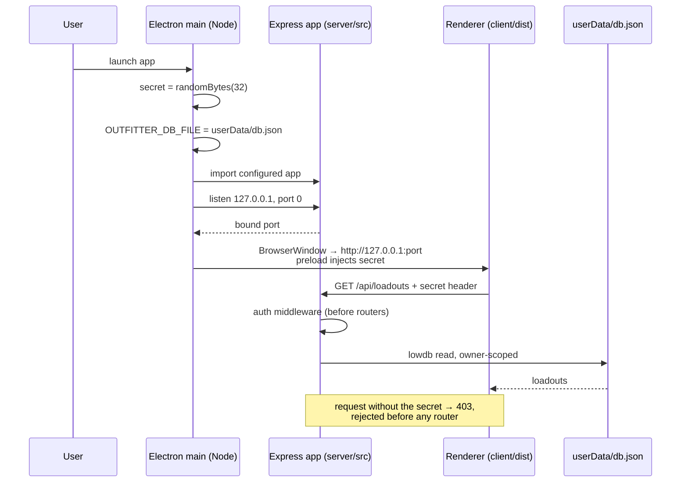

# Design: Desktop Distribution

## Context

The Outfitter runs today as a single Node process serving an Express API and the Vite-built client from one origin, persisting to `server/data/db.json` through lowdb. Getting an instance requires Docker or a Node 20 checkout, a free port, and a persistent volume — three README subsections of operator concerns imposed on an audience of Hunt: Showdown players.

ADR-0008 chose to add an Electron desktop target rather than rewrite for Tauri or settle for an installable PWA, on one dominant fact: the backend is Node and it is not incidental. `server/src/lib/ownership.js` carries the token-scoped boundary that closed issue #17, `db.js` quarantines pre-ownership legacy records, and 63 server tests hold both. ADR-0006 names the cross-token ownership rule "the rule most likely to be missed." Electron's main process is a Node process, so that code runs as-is; every alternative either reimplements it (Rust) or ships a Node binary anyway (sidecar) at comparable size and greater pipeline complexity.

Two seams make this cheap, and both already exist and are already tested: `server/src/db.js` resolves `OUTFITTER_DB_FILE` ahead of its default, and `client/src/api/loadouts.js` defaults its API base to the relative `/api`. The desktop host sets the first and serves the client at an origin that satisfies the second.

The one thing the packaging choice costs is a trust boundary. That is what most of this design is about.

## Goals / Non-Goals

### Goals

- An installer per platform, with no Node, Docker, terminal, or volume prerequisite
- The desktop backend *is* `server/src/` — shared code, not shared design
- The one gap the choice opens (an unauthenticated local listener) is closed before first release, mechanically and testably
- Self-hosting stays first-class, with its existing CI guard green
- lowdb's single-writer constraint becomes true by construction rather than documented as a hazard
- The Node major the desktop ships stays tied to `.nvmrc` (SPEC-0002)
- Artifacts built by CI on a tag, never from a laptop; explicitly designated signed or unsigned, with signing and notarization in place before broad promotion *(amended 2026-08-10 — this goal previously read "Signed, notarized artifacts from CI on a tag," which contradicted the unsigned-publication decision below)*

### Non-Goals

- Replacing or deprecating the hosted target
- Offline-first or client-side persistence — the store stays server-side, in-process
- Auto-update policy and cadence (`electron-updater` is anticipated, not specified here)
- Certificate procurement and account logistics
- Importing loadouts from a hosted instance into the desktop app
- Multi-user support on one desktop install — OS user accounts are the boundary
- Mobile or app-store distribution

## Decisions

### An in-process HTTP server on loopback, rather than Electron IPC

**Choice**: The Electron main process imports the configured Express app and binds it to `127.0.0.1` on an ephemeral port. The renderer loads that origin and talks to it over HTTP.

**Rationale**: This is the entire reason the desktop backend can be the hosted backend. The client's API layer, the routers, ownership resolution, and the lowdb store all work unaltered because the transport is unaltered. Serving over `http://127.0.0.1:<port>` rather than `file://` also keeps the renderer a normal same-origin web app: relative `/api` resolves, `localStorage` has a real origin to key the client token against, and no module-loading or CSP special cases arise.

**Alternatives considered**:

- *Electron IPC, with a shim translating `client/src/api/*` calls into `ipcRenderer.invoke`*: genuinely more secure — no listener to reach — and it was the strongest challenger. Rejected because the shim is a second API surface that must stay behaviorally identical to the HTTP one, including status codes, the 404-for-not-yours conflation, and error envelopes. That is exactly the duplicated-contract risk this ADR exists to avoid, traded against a boundary we can instead close explicitly. The security advantage is real, which is why the authentication requirement below is a hard precondition rather than hardening.
- *`file://` renderer calling a server on a fixed port*: rejected on both counts — a fixed port is predictable and collides with a self-hosted instance, and `file://` origins break `localStorage` keying and relative URLs.

### The loopback listener is authenticated, and CORS is not the mechanism

**Choice**: The main process generates a ≥128-bit random secret per launch, injects it into the renderer through a preload bridge, and rejects any `/api` request lacking it with `403` — in middleware registered before every router. Bind is `127.0.0.1` explicitly; the port is OS-assigned.

**Rationale**: "Only on localhost" is not access control. Every other process on the machine can reach the port, and a web page the user visits can script `fetch` at `127.0.0.1` on their behalf. Without this, installing The Outfitter silently exposes a read/write API over the user's saved data.

CORS specifically cannot do this job here, and the reason is worth stating because it looks like it could. `server/src/index.js` admits any request with no `Origin` header — deliberately, so `curl` and same-origin static serving work against an operator's instance. A local process issuing a raw HTTP request sends no `Origin` at all, so it lands in the permitted path. The allowlist protects a *hosted* server from *browser-borne* cross-origin scripting; it says nothing about a machine where the attacker is a peer process.

Per-launch and memory-only matter for the same reason: a secret persisted to disk or derived from anything stable (install path, machine id, user name) is readable by exactly the local processes the boundary is meant to exclude. Ephemeral ports remove the other half — an attacker who cannot guess the port must scan for it, and cannot rely on a constant.

**Alternatives considered**:

- *A stable secret in the user's config directory*: rejected — any local process running as that user can read it, which is the threat model.
- *Origin checking on the loopback origin*: rejected, as above; non-browser clients simply omit `Origin`.
- *Unix domain socket / named pipe instead of TCP*: attractive, and it removes the port-scanning surface entirely. Rejected for now because Chromium's fetch stack cannot address one from the renderer, so it would force the IPC design back in through the side door. Worth revisiting if the renderer ever proxies through the main process anyway.
- *Nothing, on the grounds that the data is low-value loadouts*: rejected. The exposure is a write API to a file in the user's home directory, and the precedent — desktop apps shipping open local ports — is the one we would least like to set.

### `index.js` exports the app; the listen call is guarded

**Choice**: `server/src/index.js` exports the configured `app`, and `app.listen()` runs only under an entry-point guard. Both `npm start` and the desktop host go through that export.

**Rationale**: The module currently binds a port as an import side effect, which makes it unimportable by any second consumer. This is the minimum change that admits one, and it is target-neutral — the hosted path's observable behavior is identical. It also improves testing: the suite reaches the app without a listener.

**Alternatives considered**:

- *Desktop spawns the server as a child process*: rejected. It reintroduces process-lifecycle management (orphan cleanup, crash restart, stdio plumbing) that in-process import does not have, for no benefit — Electron's main process is already a Node process.
- *A separate `createApp()` factory module, leaving `index.js` alone*: a reasonable shape, but it splits the app's construction across two files for no gain over a guarded export.

### `userData` via the existing `OUTFITTER_DB_FILE` seam

**Choice**: The host sets `OUTFITTER_DB_FILE` to a path under Electron's `userData` directory before importing the server. `db.js` is untouched.

**Rationale**: The seam exists, is documented in SPEC-0002's environment-variable requirement, and is already exercised by the test suite (which uses it to avoid clobbering dev data). Adding a desktop branch inside `db.js` would put target awareness into shared code, which is precisely the property this capability is trying to keep out of it.

Writing inside the application bundle is not an option: macOS app bundles are read-only and signed, and on Windows and Linux the install directory is shared between OS users.

**Alternatives considered**:

- *A user-configurable data directory in app settings*: deferred, not rejected. It is additive once the default works, and it is not needed for a first release.

### Parity between Electron's Node and `.nvmrc` is asserted, not assumed

**Choice**: CI fails the release job when the Electron runtime's bundled Node major differs from `.nvmrc`'s, deriving both at build time.

**Rationale**: SPEC-0002 made `.nvmrc` canonical and eliminated four hardcoded pins. Electron reintroduces a Node version chosen by a *dependency range* rather than by that file — a routine `electron` bump can move the runtime major with no signal. Convention will not hold this; a check will. Deriving both values rather than comparing against a literal is the same discipline ADR-0004 applied, for the same reason.

**Alternatives considered**:

- *Pin Electron exactly and rely on review*: rejected — it makes every Electron security patch a manual parity audit, which is the cadence most likely to be skipped.
- *Accept divergence and test the desktop build separately*: rejected. Two runtime majors means the server suite's guarantees apply to one target and are merely suggestive for the other.

### Unsigned publication is permitted; silent unsigned publication is not

*(amended 2026-08-10 — this decision originally read "Unsigned artifacts are not published")*

**Choice**: A release is explicitly designated signed or unsigned. Unsigned releases may be published on any platform provided the download page documents the per-platform bypass. Signing is required before broad promotion. A release designated *signed* fails when credentials are missing rather than falling back to unsigned output.

**Rationale**: The original rule conflated two different things under one prohibition. What actually needed preventing was a *silent* downgrade — a credential misconfiguration quietly emitting unsigned artifacts that get published as though they were signed. What did not need preventing was a maintainer deciding, with open eyes, to ship free and see whether anyone wants the app. Separating the designation from the credential check preserves the first protection while unblocking the second.

The friction being traded away is real but wildly asymmetric between platforms, and the asymmetry is why one blanket rule was wrong:

- **Linux**: none. AppImage and deb need no signing.
- **Windows**: a SmartScreen dialog whose "Run anyway" hides behind "More info." Two clicks.
- **macOS**: a trip to System Settings → Privacy & Security. Sequoia removed the Control-click override, so this is no longer a one-step dismissal.

Two facts sharpen the cost/benefit and are recorded because both cut against the intuitive answer. First, **Windows signing may not remove the warning**: SmartScreen keys on reputation, and a new OV certificate has none, so signed builds keep warning until downloads accumulate — only EV certificates carry instant reputation. Paying for OV signing can buy the same dialog for months. Second, **the credential cannot be a file any more**: publicly-trusted code-signing keys must live on a hardware token or cloud HSM, so CI signing requires a cloud signing service rather than a secret-held certificate. Together these make Apple's $99/yr the far higher-value spend — it converts a System Settings expedition into a double-click, which no amount of Windows spend reliably matches.

The Homebrew cask path is worth calling out as the free mitigation with the best ratio: Homebrew strips the quarantine attribute, so an unsigned app installed from a tap launches normally, and a personal tap has none of the notability requirements the official cask repo imposes.

**Alternatives considered**:

- *Keep the blanket prohibition*: rejected. It reads as prudence but its practical effect is to make a hobby project's first release contingent on an Apple Developer account, while doing nothing the narrower silent-downgrade rule does not already do.
- *Permit unsigned publication with no documentation requirement*: rejected. An unsigned macOS build with no instructions is not a release; it is a download that appears broken. The instructions are what make the choice honest, which is why they are a release gate rather than a docs task.
- *Ship Linux first, defer the other two*: still the recommended sequencing, and now compatible with shipping all three unsigned in the interim rather than holding Windows and macOS back entirely.
- *Instruct users to disable Gatekeeper/SmartScreen*: rejected outright, and forbidden in the spec. Teaching users to turn off OS protections to run a loadout builder is a worse outcome than not shipping to that platform.

## Architecture

Process shape on the desktop:

Where each requirement binds:

| Concern | Lives in | Requirement |
|---|---|---|
| Window lifecycle, bind, secret | `desktop/` | Authenticated Loopback Boundary |
| Routing, ownership, persistence | `server/src/` (shared) | One Server Implementation |
| Data location | `desktop/` sets env; `db.js` unchanged | Per-User Data Directory |
| Client assets | `client/dist` (shared) | Reproducible Release Artifacts |
| Runtime version | CI check | Runtime Version Parity |

The `desktop/` workspace contains no request-path code other than the secret plumbing. That is the invariant worth grepping for: application logic appearing there is the signal this capability has drifted into a forked backend.

## Risks / Trade-offs

- **The authentication boundary is the whole security posture.** If it is implemented late, weakly, or after the routers, the desktop app is strictly worse than the hosted one. It is specified first and scenario-tested for exactly this reason.
- **Installer size is disproportionate** — roughly 80–150 MB of runtime for a few megabytes of app. Accepted; ADR-0008 records it as Tauri's strongest argument.
- **Chromium's CVE cadence becomes a shipping obligation.** An unpatched shipped app cannot be fixed by redeploying a server. This implies a release cadence commitment and, in practice, auto-update — both outside this spec.
- **Unsigned macOS builds will cost real adoption.** Sequoia's System Settings route is a meaningful drop-off for a non-technical audience, and the Homebrew tap only helps users who already have Homebrew. This is the accepted price of shipping before spending; the signed-before-broad-promotion gate is what keeps it from becoming permanent.
- **The signed/unsigned designation is a new thing to get wrong.** A release mislabelled `signed` fails closed (no credentials, no artifacts), which is the safe direction. One mislabelled `unsigned` publishes unsigned artifacts on purpose — which is why the bypass-instruction gate sits in front of it.
- **Token-scoped ownership is near-vestigial on the desktop** — one user, one token. It costs nothing and keeps the targets code-identical, but no desktop behavior depends on it, so a future change could break it without a desktop symptom. The server suite is the guard.
- **A user running both the desktop app and a self-hosted instance has two separate data stores** with no sync. Expected, and the ephemeral port keeps them from colliding, but it will surprise someone.

## Migration Plan

Nothing to migrate — this is purely additive. Sequencing that keeps each step independently verifiable:

1. Refactor `server/src/index.js` to export `app` behind a guarded listen. Ship alone; the existing server suite and container smoke job are the proof it changed nothing.
2. Add the `desktop/` workspace: bind, secret generation, preload bridge, `userData` resolution. Land the loopback authentication tests with this step, not after it.
3. Add the Node-major parity check to CI.
4. Add the release matrix. Linux first — no signing, no instructions needed. Then Windows and macOS as `unsigned` releases, landing the download page's bypass instructions in the same step that first publishes them.
5. Switch to `signed` releases before broad promotion: Apple Developer ID and notarization first (the higher-value spend by a wide margin), Windows cloud signing after.
6. Document both install paths in the README, keeping the existing lowdb single-writer warnings on the hosted path.

## Open Questions

- Auto-update: `electron-updater` against GitHub Releases is the obvious default, but the cadence commitment it implies has not been made.
- Whether `/healthz` should be omitted entirely from the desktop host rather than left open — it has no meaning without an orchestrator.
- Whether the desktop app should offer to import from a hosted instance, and if so whether that reuses the client token or asks for one.
- Whether to expose a user-configurable data directory, or leave `userData` fixed.
- Linux packaging beyond AppImage and deb (Flatpak, rpm) — deferred until there is demand.
