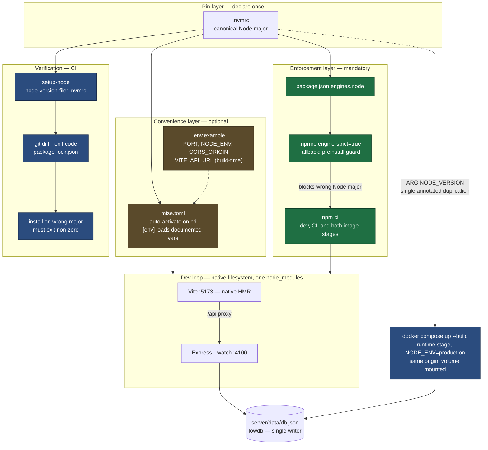

# Design: Developer Environment Consistency

## Context

The Outfitter is an npm-workspaces monorepo with two workspaces: a React 18 + Redux Toolkit client built by Vite (ADR-0003) and an Express + lowdb API server. Onboarding today is `npm install` followed by `npm run dev`, which starts Vite on 5173 proxying `/api` to Express on 4100.

Nothing in the repository enforces the toolchain that setup assumes. `.nvmrc` records Node 20, `.github/workflows/ci.yml` hardcodes `node-version: "20"`, and `Dockerfile` hardcodes `node:20-alpine` in both its `client-build` and `runtime` stages — four independent declarations of one fact, none of them read automatically, and no `engines` field anywhere to make a mismatch fail. The machine ADR-0004 was authored on resolves `node` to v24.13.1. Separately, the README's `npm install` diverges from the `npm ci` used by CI and both image stages, so a local install can rewrite `package-lock.json` and produce a CI failure on an unrelated pull request. Four environment variables (`PORT`, `NODE_ENV`, `CORS_ORIGIN`, `VITE_API_URL`) are read by the app and documented nowhere.

SPEC-0002 implements ADR-0004, which rejected containerized development for this repository. That rejection is the load-bearing context for everything below: the design deliberately keeps the dependency tree, the filesystem, and the dev loop on the host.

## Goals / Non-Goals

### Goals

- A wrong Node major produces a non-zero exit with an actionable message, not a silent divergence
- The Node version is declared once and derived everywhere else
- Development, CI, and image builds install dependencies identically, and lockfile drift fails on the pull request that caused it
- Every environment variable the app reads is discoverable without grepping source
- Native filesystem HMR and single-tree editor tooling are preserved exactly as they are today
- The contribution floor goes down, not up: a contributor already on Node 20 needs no new tooling

### Non-Goals

- Pinning below the Node ecosystem — libc, system OpenSSL, and future native dependencies remain host-determined
- A development container, dev container spec, or Compose dev profile (rejected in ADR-0004; see Decisions)
- Making the default dev loop exercise the production topology — that stays an on-demand check
- Replacing npm scripts with a new task runner
- Pinning editor tooling (extension versions, formatter configuration)
- Managing production environment configuration; `.env.example` documents variables, it does not deploy them

## Decisions

### Host-side pinning rather than a containerized dev environment

**Choice**: Pin the toolchain on the host with a version manager plus install-time enforcement. Do not add a `dev` stage to the `Dockerfile` or a dev service to `docker-compose.yml`.

**Rationale**: The reproducibility gap this repository actually has is confined to the Node toolchain and the lockfile. The entire runtime dependency set is `express`, `cors`, `express-rate-limit`, `cross-env`, and `lowdb` — no database, cache, queue, native compilation, or OS-level tool. Compose's central value is collapsing multi-daemon setup into one command, and there are no daemons to collapse.

**Alternatives considered**:

- *Docker Compose dev profile*: rejected because it would not deliver the parity that appears to justify it. The dev service would still run Vite on 5173 proxying Express on 4100, leaving same-origin serving, `NODE_ENV=production`, and `client/dist` unexercised — and that parity is already available through the existing production Compose path. What it would actually buy is a pinned libc, at the cost of bind-mount HMR, a shadowed second `node_modules`, and a Docker prerequisite.
- *Dev Container*: rejected as a layer on top of the above, inheriting its parity limitation while additionally coupling the supported workflow to the VS Code family.
- *Nix flake + direnv*: rejected on cost. It occupies the same slot as the chosen option and differs mainly in rigor; hermeticity stops at the npm boundary regardless, which is exactly where `esbuild`'s platform binaries live.
- *Status quo*: rejected — `.nvmrc` already records the right answer and is already being ignored.

### `.nvmrc` as canonical, with one annotated duplication

**Choice**: `.nvmrc` is the single source of truth. CI derives from it via `node-version-file`. The `Dockerfile` mirrors it through a single `ARG NODE_VERSION` carrying a comment that names `.nvmrc` as canonical.

**Rationale**: Reducing four hardcoded pins to one canonical file plus one annotated mirror eliminates most of the drift surface. A `Dockerfile` cannot read `.nvmrc` without build-time plumbing (an entrypoint script or a `--build-arg` wired through every invocation) that would cost more than the drift risk it removes. Making the duplication *singular and labelled* is the honest compromise: a maintainer changing `.nvmrc` sees exactly one other place to touch, and a comment tells them why.

**Alternatives considered**:

- *`--build-arg NODE_VERSION=$(cat .nvmrc)` in every build invocation*: rejected because it moves the coupling into every call site — CI, Compose, and any manual `docker build` — which is more places to drift, not fewer.
- *Reading `.nvmrc` from `package.json` `engines` via a generator*: rejected as machinery disproportionate to a two-line problem.

### `engine-strict` as the enforcement point, with a documented fallback

**Choice**: Declare `engines.node` in the root `package.json` and set `engine-strict=true` in a repo-root `.npmrc`. If a dependency's own `engines` field causes a spurious failure, replace it with a `preinstall` guard checking `process.versions.node` against the root range.

**Rationale**: `engines` alone only warns, and a warning in an install log is functionally identical to the advisory `.nvmrc` this spec exists to replace. `engine-strict` is the smallest configuration change that converts the warning into a failure. Its known weakness is breadth — it applies to every package in the tree, not just the root — so the fallback is specified up front rather than discovered under time pressure.

**Alternatives considered**:

- *`preinstall` guard from the start*: a defensible choice, and the design accepts it as the fallback. `engine-strict` is preferred initially because it is declarative configuration rather than a script to maintain, and the tree is small enough that the spurious-failure risk is low.
- *CI-only enforcement*: rejected because it catches the mismatch after the contributor has already done the work, which is the failure mode this capability exists to eliminate.

### Version manager recommended, not required

**Choice**: Recommend `mise` and ship `mise.toml`, but specify the requirement as an outcome (automatic activation of the pinned toolchain) rather than as a named tool. The repository must stay usable without it.

**Rationale**: Two distinct populations exist. A regular contributor benefits from automatic activation and env loading. A drive-by contributor to a fan project should not have to install a version manager to fix a typo. Specifying the outcome lets an `asdf` or `nvm` user satisfy the requirement with their existing tooling, and keeps the enforcement layer — which *is* mandatory — cleanly separated from the convenience layer, which is not.

**Alternatives considered**:

- *Mandate `mise`*: rejected because it raises the contribution floor for no enforcement benefit; `engine-strict` already provides the guarantee.
- *Recommend nothing and rely on enforcement alone*: rejected because enforcement reports the problem without helping anyone fix it. The pairing matters: `engine-strict` catches a wrong Node, `mise` is what makes getting the right one automatic.

### Parity delegated to the existing production Compose path

**Choice**: Document `docker compose up --build` as the on-demand production-topology check. Do not make the default dev loop production-like.

**Rationale**: Same-origin serving, `NODE_ENV=production`, and volume-backed `server/data` are the three places dev and prod genuinely diverge, and the existing production Compose service already exercises all three. Building the client and serving it from Express as a third dev mode would close the gap but eliminate HMR — the reason ADR-0003 selected Vite.

**Alternatives considered**:

- *A third "production-like" dev mode*: rejected on the HMR trade-off. Revisit if same-origin bugs start recurring.

## Architecture

The design has three layers. The **pin layer** declares the toolchain once. The **enforcement layer** turns a violation into a non-zero exit. The **convenience layer** makes compliance automatic for contributors who opt into it. Only the enforcement layer is mandatory — which is what keeps the contribution floor low while still making the guarantee real.

## Risks / Trade-offs

- **`engine-strict=true` is repo-wide.** It enforces `engines` for every package in the tree, so a dependency with a narrow or malformed range can fail an install for a reason unrelated to the root pin. → The `preinstall` fallback is specified in advance (SPEC-0002 REQ "Toolchain Enforcement at Install Time", third scenario), so the response is a documented switch rather than an improvised one.
- **The convenience layer is unenforceable.** `engine-strict` catches a wrong Node only *after* the contributor already has one; `mise` is what makes getting the right one automatic, and nothing compels its installation. → Accepted deliberately. The error message names the required range, which converts a silent failure into a self-service fix.
- **Pinning stops at the Node ecosystem.** libc, system OpenSSL, and any future native dependency remain host-determined. → Accepted for now; ADR-0004 records the trip-wire (a move from lowdb to a real database, or the arrival of a native dependency) that would reopen the containerization decision.
- **Parity remains opt-in.** The default loop still does not exercise production serving, so a contributor can be fully green locally and still ship a same-origin or persistence break. → Mitigated by documenting the Compose check as a distinct, purpose-stated step rather than burying it in the deployment section. Not eliminated.
- **A fifth pin location could appear.** Any future tool needing the Node version can re-fragment what this work consolidates. → The `Dockerfile` `ARG` comment names `.nvmrc` as canonical, establishing the convention for whatever comes next.
- **`.env.example` can rot.** Variables added to the code without a corresponding entry silently reintroduce the discoverability gap. → The first scenario under "Documented Environment Variables" is written as an auditable check; automating it in CI is listed as an open question.

## Migration Plan

Not greenfield in the sense of a new service, but every artifact this spec requires is absent today (`mise.toml`, `.npmrc`, `.env.example`), so there is no migration of existing state — only additions and two edits.

1. Add `mise.toml`, `.npmrc`, and `.env.example`. Purely additive; no existing behavior changes.
2. Add `engines.node` to the root `package.json`. This is the first change that can fail an install, and it will fail for any maintainer currently on a non-20 Node — which is the intended effect, and worth announcing rather than landing silently.
3. Switch CI to `node-version-file: .nvmrc` and introduce `ARG NODE_VERSION` in the `Dockerfile`. Behavior-neutral while `.nvmrc` still reads `20`; verify the image still builds before merging.
4. Add the lockfile-integrity step to CI. Expect it to fail first on any pull request already carrying drift — resolve those before merging this step, or it lands red.
5. Update the README: `npm install` → `npm ci`, add the `mise` and `.env.example` steps, and document the Compose parity check as a distinct step.

**Rollback**: Every item is independently revertable. Removing `.npmrc` restores warning-only behavior without touching anything else; reverting the CI step restores the prior workflow. No data, schema, or runtime artifact is involved, so rollback carries no state risk.

**Sequencing note**: Step 2 before step 4. Landing the lockfile check while contributors are still on mismatched Node majors risks lockfile churn that the check then flags, conflating two problems.

## Open Questions

- Should `.env.example` completeness be enforced in CI — a script diffing variables read in source against entries in the file — or left as a review-time check? The requirement is written to be auditable either way, but only the automated form actually resists rot.
- Should the wrong-Node-major CI assertion (REQ "Toolchain Enforcement at Install Time", first scenario) run on every pull request, or on a schedule? Running it every time costs an extra job for a guard that rarely changes; running it never means the guard can silently stop working.
- Does `mise`'s `[env]` loading of `.env.example` defaults risk masking a genuinely required variable by supplying a default the production environment would not have? `VITE_API_URL` is the specific candidate, since it is inlined at client build time.
- ADR-0004 is `proposed`, not `accepted`, and its pull request is open. If review reverses it toward containerized development, this spec is invalidated wholesale rather than amended — worth confirming the ADR lands before implementation begins.
