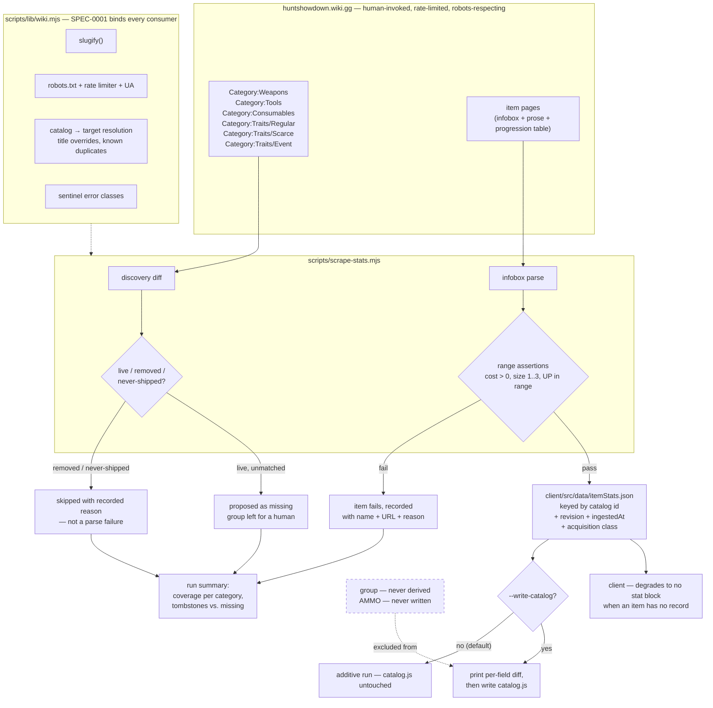

# Design: Equipment Catalog Dataset

## Context

ADR-0005 decided, on 2026-08-09, that item stats would be scraped into a generated, committed `client/src/data/itemStats.json` by a new `scripts/scrape-stats.mjs`, sharing a wiki client with the existing image scrape. The shared client was extracted (issue #108, `scripts/lib/wiki.mjs`) and two dependent ADRs that declare `extends: [ADR-0005]` — ADR-0006 loadout lists and ADR-0007 the hunter roster — were specified and shipped. The parent decision's own two outputs were never built.

In the gap, two reconciliation audits measured the hand-authored catalog against the wiki. They were written while wiki egress was blocked, so their sharpest findings are counts and structural claims rather than per-item values, and they say so. What they establish:

| Category | Catalog rows | Wiki members | Notes |
|---|---|---|---|
| Weapons | 39 | — | 14 stale display names; whole `size`/`cost` column presumed stale post-2.8 |
| Tools | 22 | 23 (2 tombstones) | Katana misfiled as a Tool; it is a size-2 melee Weapon |
| Consumables | 30 | 54 (~13 Tarot, ~11 unresolved) | Three rows misfiled into the wrong cap bucket |
| Traits | 32 | 58 purchasable | 26 missing — 45% of the roster |

ADR-0005 gained two amendments recording these. The amendments matter more than the original decision for anyone implementing this spec, because they invalidate the obvious approach in three specific places: `group` cannot be scraped in any category, `AMMO` has no source page at all, and `CONS.type` is a rules input whose mis-derivation produces no error.

Fifteen open issues sit downstream of this work. Five of them — #156, #157, #159, #163, #178 — are explicitly blocked on "the first `scrape-stats.mjs` run".

## Goals / Non-Goals

### Goals

- Build the two outputs ADR-0005 named, under its amended constraints
- Make roster membership **checkable** rather than arguable, by capturing the acquisition class that decides it
- Make the wiki-authoritative write-through safe enough to use: bounded, opt-in, range-asserted, and reviewable as a diff
- Close the class of defect the audits found most alarming — a data field that silently drives a rule
- Report coverage per category, so "every cost is right" can never again be read as "every item is present"

### Non-Goals

- **The loadout rules engine.** This spec constrains what data feeds it and identifies which fields are rules inputs; it does not define the caps themselves. The missing 15-trait maximum, the dual-wield slot arithmetic, and the four-per-cap-category consumable enforcement (per ADR-0015; previously stated here as "4-per-consumable") are rules-engine changes with tests, and ADR-0005 is explicit that its write-through machinery must not be extended to cover them.
- **Restructuring the `AMMO` pool model.** ADR-0005 already flags that per-weapon ammo compatibility may not cleanly replace the shared-pool model and that revisiting it "deserves its own decision". This spec forbids scraping the table and gates edits to it; it does not redesign it. *(That decision has now been made — ADR-0014 and SPEC-0010, 2026-08-16. This non-goal stands unchanged: SPEC-0010 is the "own decision" ADR-0005 deferred to, not an amendment of this one. What this spec owns after SPEC-0010 is narrower than before — `ammoClass` keeps its gated, hand-authored status, but per SPEC-0010 REQ "`ammoClass` Survives as a Grouping Label Without Rules Authority" it no longer decides compatibility, price or slot count, and this file's "Fields the Scraper Must Not Derive" requirement records that. See issue #348.)*
- **Wire-format version 2.** SPEC-0006 already schedules a `FORMAT_VERSION` bump for the sparse equip grid, and the dual-wield flag needs the same bump. Both belong to that spec's migration, not this one. This spec only states which catalog changes require the gate. *(Resolved 2026-08-15, and not the way this anticipated: the two bumps did **not** share one version. The sparse grid took v2, and the dual-wield flag took its own bump to **v3** under SPEC-0009 and ADR-0023 — separated because the grid shipped well ahead of pairs, and coupling them would have held the grid behind a rules change it does not depend on. The non-goal itself stands: both bumps still belonged to SPEC-0006's version model rather than to this spec, and SPEC-0009 widened that model rather than starting a second one. What this spec owns remains the stored attribute — `dualWield` in `itemStats.json` — not the format that carries it.)*
- **List 2 weapon variants.** Bornheim Extended, Scottfield Swift, Pax Claw, Dolch Bullseye and their siblings need a `variantOf` schema change that is sequenced ahead of bulk import.
- **The incremental, revision-driven backend** ADR-0005 describes as the long-term shape. This is the bootstrap that leaves it a baseline.

## Decisions

### Provenance is captured in the bootstrap, before anything reads it

**Choice**: Every record carries the source page's revision identifier and an ingestion timestamp from the first run.

**Rationale**: Inherited from ADR-0005 and restated because it is the one place this work spends effort on the future. The incremental design's first question is "what changed since I last looked?", and that is unanswerable without a baseline. Capturing an identifier the HTTP response already contains is nearly free; reconstructing it later costs a full re-scrape.

**Alternatives considered**:
- *Add provenance when the backend needs it*: makes the first incremental run either re-scrape everything to establish a baseline or treat every item as changed.

### Write-through is opt-in, and the default run is additive

**Choice**: `itemStats.json` is written by default; `catalog.js` is touched only under `--write-catalog`, after a printed per-field diff, and only for values that pass range assertions.

**Rationale**: The wiki-authoritative rule is what makes automated reconciliation worth having, and it is also the single most dangerous thing in this design. A wiki HTML change that makes the parser extract a wrong-but-well-formed number corrupts budget math invisibly — a Winfield that costs $3 instead of $76 just looks like a bargain. Every guardrail here exists to convert that from a silent corruption into a reviewable diff hunk. ADR-0005 records the fallback if the guardrails prove insufficient: adopt the rejected "flag conflicts, resolve manually" posture, which needs no re-scrape.

**Alternatives considered**:
- *Silent write-through*: fastest, and it is exactly the failure ADR-0005 names as its worst realistic outcome.
- *Never write the catalog*: keeps the hand-maintained table drifting, which is the problem this whole decision exists to solve.

### Some fields are not scrapable, and the spec names them rather than leaving it to judgment

**Choice**: `group` is never derived, in any category. `AMMO` is never written.

**Rationale**: Both are app-side abstractions with no wiki equivalent, and both are the kind of thing a competent implementer would reasonably try to populate. The wiki's Tools/Consumables subcategories are multi-valued, and its trait taxonomies are two orthogonal schemes — neither is a single-valued UI category, so any derived `group` would be a coin flip that looks like data. `AMMO` is worse: `/wiki/Ammo` exists and is prose, so a scraper aimed at it returns something plausible from the wrong place. Naming both as prohibitions is cheaper than discovering them twice.

### `type` is treated as a rules input, and the general class is named

**Choice**: `CONS.type` may only be assigned from a mechanical cap category. The spec states the general rule — a field read by `calc.js` or `loadoutSlice.js` to decide loadout legality is a rules input — so the next such field is recognized on arrival.

**Rationale**: This is the audits' most transferable finding. The Medical Pack is filed by the wiki under both `Category:Healing_Consumables` (effect) and `Category:Placeable_Consumables` (cap); the app took the effect classification and wrote it into the field that drives the cap. The result is bidirectional: four Ammo Boxes and four Frag Bombs are permitted only in combination, while four Medical Packs plus four Ammo Boxes are permitted where the game allows four Placeables total. Neither shows up as an error. A scraper deriving `type` from "the subcategory" would reproduce this at scale.

`type` was checked for the coupling that bit the two earlier write-through fields — display name feeding the image path, `ammoClass` feeding a persisted bare index — and has none. It is never persisted (`toData()` stores `["C", id]`) and never feeds a slug, so it is correctable with no version bump. That negative result is recorded so the check is not repeated from scratch.

**Resolved 2026-08-12, in this document's favour** *(per [ADR-0015](../../../adrs/ADR-0015-consumable-cap-per-type.md))*. This decision and its companion `spec.md` disagreed. The rationale above describes the game's rule correctly — "four Medical Packs plus four Ammo Boxes are permitted where the game allows four **Placeables total**", and `type` as "the field that drives the cap" — while `spec.md` simultaneously required that `type` "MUST NOT be re-introduced as a cap key" and stated the cap per specific item. Both could not hold: a field cannot drive the cap and be barred from keying it.

ADR-0015 settles it the way this document had it. Update 2.8 caps consumables at four per category, confirmed in-game, so `type` is a rules input in the full sense and the prohibition in `spec.md` is withdrawn. Nothing in the choice or rationale above changes; only the contradiction is removed. The coupling check recorded here is what makes the promotion free — no `FORMAT_VERSION` gate, no migration.

### Discovery classifies before it proposes

**Choice**: Every category member not matched to a catalog row is classified live / removed / never-shipped before it can be proposed as missing.

**Rationale**: `Category:Tools` has 23 members and two are tombstones — 9% of the category. One of them, the Electric Lamp, this repo deleted on purpose in `e0076d3` and holds a legacy carve-out for. A naive diff proposes re-adding it. This generalizes ADR-0005's existing world-weapon rule ("not every weapon page is a buyable item") one layer earlier, into discovery rather than parsing.

The same hazard was confirmed during this spec's authoring: `/wiki/Traits/Iron_Repeater` is a live page in `Category:Purchasable_Traits` that states the trait was removed in Update 1.15 and merged into another. The audit had inferred from its category membership that it was live and that `catalog.js` was wrong to call it removed. The catalog was right. That correction is why the wiki's 58-trait count is an upper bound rather than a target.

### Acquisition class is scrape metadata, not a catalog field

**Choice**: Trait acquisition class and consumable purchasability land in `itemStats.json`, not in `catalog.js`, and never in `group`.

**Rationale**: It answers "should this item have a row?" — a question about the catalog rather than a property the app renders. Keeping it in the generated file means a roster diff can be recomputed from data on disk instead of being re-argued. Issue #37 has now re-litigated the Tarot Card boundary twice, the second time on a premise Update 2.8.1 falsified: they were excluded as limited-time event items, they are permanent as of 2.8.1, and the durable reason is that they are Scarce and cannot be bought.

**Amended 2026-08-12 per ADR-0013**: the question it answers is now "what does this row cost?" rather than "should this row exist?". Unpurchasability admits an item at zero cost instead of excluding it, so the metadata's job changed while its location did not. Tarot Cards remain out of scope as a scope decision rather than on the unpurchasability ground, which now applies to items that are in.

### Acquisition class is a set, read from categories rather than the infobox

**Choice**: The class is an ordered set drawn from `Regular`, `Scarce`, `Burn`, `Event`, read from each page's own category membership.

**Rationale**: The wiki's data is a set — four traits are both Scarce and Burn, six are both Scarce and Event — and a scalar cannot express that. The infobox `Type` field does carry the truth, but as a comma-joined string (`"Burn , Scarce"`) that equals neither class, so it is unusable for the membership check this spec asks for. Category membership is preferred for a second, decisive reason: a Scarce trait page omits `Type` entirely and carries no cost row, yet still declares `Category:Traits/Scarce`, so categories answer where the infobox is silent. The pages are already fetched, so the set costs no extra request.

**Alternatives considered**:
- *Parse the comma-joined `Type` string*: works today but depends on the wiki's punctuation, and answers nothing for pages that omit the field — which is exactly the Scarce ones the decision cares about.
- *A rarity field on the catalog tuple*: cannot hold a set without nesting an array inside a positional tuple, and makes cost a derived value, which "Budget-Affecting Attributes Are Stored, Never Inferred" forbids.

### Only the acquisition axis is read, and the functional axis is excluded by name

**Choice**: `Offensive`, `Defensive`, `Movement`, `Supportive`, `Solo` and `Catalyst` are enumerated in the scrape purely so their exclusion is visible. `Pact` is on neither axis and is enumerated separately.

**Rationale**: Both axes live in the same category block, so a filter that merely omits the functional ones looks like an oversight; naming them makes the exclusion a decision. The functional axis *is* `group`, which this spec forbids the scrape supplying. This is not hypothetical — an earlier cut listed `Catalyst` on the acquisition axis and reported five traits as `Regular + Catalyst`, i.e. two rarities on one trait, when it was one rarity plus one function. The wiki's own infobox settles it: those five state `Type: "Regular"` and nothing else.

`Pact` exists with zero members and states no axis, so guessing would be endorsed by the cost-0 check rather than caught by it. Recording no class is the direction that fails loudly.

## Architecture

## Risks / Trade-offs

- **A parser regression writes wrong-but-well-formed numbers into budget math** → the whole guardrail stack: opt-in flag, printed per-field diff, range assertions, and `git diff` on a hand-authored file. ADR-0005's documented fallback is to drop to flag-and-resolve-manually, adoptable later without re-scraping.
- **`type` is fixed but the next rules input is not recognized** → the spec names the general class rather than only the instance, and requires a coupling check whose result is recorded. Mitigation is partial: nothing mechanically detects that a new field has become a rules input.
- **The wiki's 58-trait count is itself unaudited for tombstones** → the Iron Repeater case proves category listings carry them, so discovery classification runs before any roster target is treated as real. The delta is an upper bound, and the spec reports classified counts rather than a bare number. *(2026-08-12: the 58 was also the wrong frame entirely — `Category:Purchasable_Traits` redirects to `Category:Traits/Regular`, so the crawl never saw 27 further traits. Nine of the 58 were tombstones; the live roster is roughly 76. Both errors were in the same figure and pointed in opposite directions, which is why neither showed up as an implausible number.)*
- **A hand-authored `0` cost is indistinguishable from a price nobody supplied** → the bidirectional test in "A Zero Cost Is Evidenced as Unpurchasable" is the whole mitigation, and it is asserted in both directions because the reverse direction is what catches a reclassifying re-scrape leaving a stale price. Residual risk: the test can only run once cost-0 rows exist, so it lands with the roster import rather than ahead of it.
- **A `$0` build is ambiguous to any UI that reads a low total as "cheap"** → accepted and unmitigated in this spec. "Costs nothing" and "made of things you cannot buy" are different claims, and nothing currently distinguishes them in the totals line.
- **Two scripts fetch the same page twice when both run** → accepted as a bootstrap cost. Once the revision-driven backend lands, both-payloads-for-one-item is the rare case.
- **Stat data goes stale between runs with no visible fallback** → unlike a missing image, which falls back to an SVG icon, a stale stat just reads wrong. Provenance capture is what makes staleness detectable at all; nothing in this spec makes it visible in the UI.
- **Committing a generated blob adds repo churn** → accepted; it is the same trade ADR-0007 made, and it is what keeps `git diff` able to separate wiki changes from human ones.

## Migration Plan

Not greenfield: `catalog.js` is live, its ids are the wire format for saved loadouts and share links, and 15 issues describe corrections to it.

1. **Build the scraper additively.** Default runs write only `itemStats.json`. Nothing about `catalog.js` changes, so nothing about saved loadouts can break.
2. **Land the corrections that need no wiki access first** — the `type`/`Placeable` fix is decided by evidence already in the repo and carries no version gate, since `type` is neither persisted nor slug-feeding.
3. **Run discovery before any roster import**, so tombstones are classified out before counts are treated as targets. This now requires the multi-index crawl first: until traits are read from the Scarce and Event indexes as well as Regular, a coverage run cannot see the roster it is supposed to verify, and no cost-0 row can be evidenced.
4. **Import missing roster members as appends with fresh ids.** Never revive a retired id or position; `loadoutCodec.js` resolves legacy records against frozen positional tables.
5. **Enable `--write-catalog` last**, once range assertions and the diff output have been exercised against a full run.

Rollback at every step is `git revert` of a reviewable diff — which is the point of keeping the generated file separate from the hand-authored one.

## Open Questions

- **Does a dual-wielded pair buy one ammo variant or two?** `w.a` is a single ammo index today, and the cost line cannot be written without an answer. Flagged in #179; the data half is #178.
- **Is the pair's slot size stated per weapon anywhere on the wiki?** Update 2.8 reserves two slots for "most" dual-wielded pairs, which means per-weapon. If the wiki does not state it, that is itself the finding and the fallback is in-game verification.
- **Does the Katana move to `WEAPONS`, or stay a Tool with a recorded reason?** Moving it is a wire-format change touching `LEGACY_TOOL_IDS[6]`, `fromV1`'s `["T","katana"]` records, and the image path. The wiki is internally inconsistent here — Update 1.16 moved it to a Small Slot while the infobox still reads 2.
- **Do all weapons in an ammo class charge the same price for the same variant?** The shared-pool model assumes it and nobody has checked. Per-weapon prices in `itemStats.json` would answer it. *(Answered 2026-08-16 by SPEC-0010's own audit: no. 13 of 46 (class, round) groups vary across weapons — the 1890 Cavalry and the Martini-Henry are both Long and both two-slot and charge 60 and 30 for FMJ — and the variance is not recoverable from a formula, so SPEC-0010 REQ "Price Belongs to the Weapon-and-Round Pair" stores every pair's price rather than computing one.)*
- **Which of `winfield-m1873c` (44) and `frontier-73c` (72) carries the right cost?** They are the same weapon — `/wiki/Weapons/Frontier_73C` opens `WINFIELD M1873C "FRONTIER 73C"` — and the duplicate is skipped rather than resolved, so deleting the row without reconciling picks a winner silently.
- **Should `Tarot Card` become a fourth `CONS` type?** The field generalizes either way; the answer depends on whether Tarot Cards ever enter the catalog, which remains a scope decision — ADR-0013 keeps them out while removing unpurchasability as the reason.
- **Do Event traits cost upgrade points?** Scarce items are free because they cannot be bought at all, and Event traits are a different axis: time-limited availability, not in-match-only acquisition. Their pages sit outside the current crawl, so this is answered by data rather than decided — the multi-index run will state it.
- **Is Final Gasp genuinely a Burn trait?** Its `Type` reads `"Event , Burn"`, which would make it the only event-gated Burn trait. If the categorisation is a wiki artifact rather than game behaviour, that is a data-quality finding and not something to encode.
- **May a generated loadout spend free picks?** SPEC-0008's archetype generator does not exist yet, and a cost-free pool changes what "within budget" means for it — fifteen free traits is legal, so an unconstrained generator could produce it every time. Flagged rather than decided here; related to #226.
