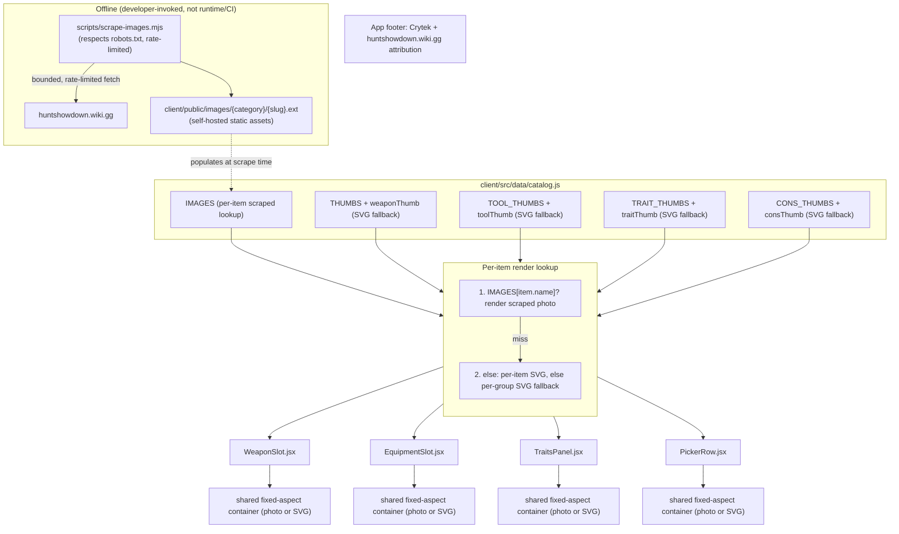

# Design: Equipment Iconography

## Context

The Outfitter's weapon picker renders a small icon for every weapon via `THUMBS` (a map of hand-drawn SVG path strings keyed by weapon silhouette class) and `weaponThumb(w)`, a dispatch function in `client/src/data/catalog.js`. `WeaponSlot.jsx` and `PickerRow.jsx` render the result as an inline `<svg><path d="..."/></svg>`. Tools, Traits, and Consumables have no equivalent today.

The previous revision of this spec (implementing ADR-0001) planned to extend that same SVG approach to all four categories, on the grounds that Hunt: Showdown's art is Crytek's copyrighted IP with no license granted to this app. ADR-0002 supersedes that decision: Crytek's fan content policy is understood to permit non-commercial fan-tool use of its assets, and this app has no commercialization plans. This revision replaces the SVG-primary approach with a scraped-image-primary approach — real, recognizable Hunt: Showdown imagery, sourced via a bounded, ethically-run scrape of huntshowdown.wiki.gg and self-hosted, with the existing SVG icons demoted to a fallback role rather than discarded.

## Goals / Non-Goals

### Goals
- Every catalog item, in every category (including Weapons now), renders real scraped imagery where available
- The scrape is a deliberate, bounded, offline action — not a live runtime dependency on huntshowdown.wiki.gg
- Nothing ever renders with zero imagery: the existing SVG icon system (per-item, then per-category fallback) becomes the safety net for any item not yet scraped
- Explicit, visible attribution to Crytek and huntshowdown.wiki.gg
- Failures in the scrape process are loud and per-item, not silent or catastrophic

### Non-Goals
- Continuous or scheduled live scraping — this is an on-demand script, not a cron job hitting the wiki repeatedly
- Hotlinking — no runtime `` pointed at huntshowdown.wiki.gg
- Mirroring the wiki's full content (flavor text, lore, unrelated pages) — only the specific item images the catalog needs
- Redesigning the app's visual theme around the new imagery — scraped images slot into the existing frontier-themed layout, framed the same way SVG icons were
- A general-purpose, reusable "wiki scraper" tool — this is scoped to Hunt: Showdown item images for this app's catalog

## Decisions

### Offline scrape script, not a runtime or CI dependency

**Choice**: A standalone Node script (e.g. `scripts/scrape-images.mjs`, run manually or on-demand — not part of `npm run dev`, `npm run build`, or CI) fetches item images from huntshowdown.wiki.gg, respecting `robots.txt` and rate-limiting requests, and writes them to `client/public/images/{category}/{slug}.{ext}`.

**Rationale**: This is the architectural expression of "ethically done" scraping from ADR-0002 — a bounded, infrequent interaction with the wiki's infrastructure, invoked deliberately when the catalog changes (e.g., new DLC), rather than a standing dependency that hits their servers on every build or every page view.

**Alternatives considered**:
- Scrape at build time (part of `vite build`): rejected — turns every CI run into a wiki request, and build failures would become coupled to a third party's availability.
- Scrape at runtime (server-side proxy/cache): rejected — reintroduces a live dependency on the wiki and adds backend complexity for no real benefit over a static, self-hosted asset.

### Per-item image map with SVG fallback, for all four categories uniformly

**Choice**: Extend the catalog data model with a per-item scraped-image lookup (e.g. `IMAGES` keyed by item name, populated by the scrape script) that all four categories share. Rendering call sites check `IMAGES[item.name]` first; if absent, they fall back to the existing SVG lookup (`weaponThumb()`, and the previously-planned `toolThumb()`/`traitThumb()`/`consThumb()` per-item-then-per-group SVG lookups).

**Rationale**: This unifies Weapons with the other three categories under one consistent primary/fallback model, rather than leaving Weapons permanently SVG-only (which the prior spec revision did, but which ADR-0002 explicitly doesn't carve out an exception for). It also means the SVG fallback work already designed in the prior revision isn't wasted — it becomes the permanent safety net for any item across any category that hasn't been scraped yet, rather than being thrown away.

**Alternatives considered**:
- Only add scraped images to Tools/Traits/Consumables, leave Weapons SVG-only forever: rejected — contradicts ADR-0002's "supersedes ADR-0001 in full" framing, and produces an inconsistent app where 3/4 categories can show real art but Weapons never can.
- Require every item to be scraped before any image renders: rejected — same reasoning as the prior revision's fallback requirement; blocks the whole feature behind a complete, always-current scrape, which isn't realistic as DLC ships.

### Consistent framing container for photos and SVG fallbacks alike

**Choice**: All four render call sites (`WeaponSlot.jsx`, `EquipmentSlot.jsx`, `TraitsPanel.jsx`, `PickerRow.jsx`) wrap item imagery — whether a scraped `` or an SVG fallback — in the same fixed-size, bordered container, with `object-fit: contain` applied to photos.

**Rationale**: Real photos and abstract SVG silhouettes have very different natural aspect ratios and framing; without a shared container treatment, the UI would look inconsistent depending on whether a given item happens to be scraped yet. A shared container makes the transition from "mostly fallback icons" to "mostly real photos" (as scraping coverage grows over time) visually seamless rather than jarring.

### Attribution as fixed footer copy

**Choice**: Carry the attribution in the app's existing footer, alongside (not replacing) the existing "fan-made planner..." rules disclaimer: a fan-page statement linking Hunt: Showdown and disclaiming affiliation, then an ownership statement naming Crytek GmbH as rights holder and huntshowdown.wiki.gg as the source of the images and data, with both linked.

**Rationale**: Simple, always-visible, no interaction required — consistent with how the app already surfaces its fan-made-tool disclaimer. The requirement fixes *what the footer must say and link* rather than one verbatim sentence, so the copy can be reworded without a spec change as long as the named parties, the disclaimer of ownership, and the links survive. Linking Crytek and the wiki rather than only naming them makes the attribution checkable by a reader instead of just present.

## Architecture

## Risks / Trade-offs

- **Scrape script fragility if the wiki's HTML structure changes** → Mitigated by per-item error handling (see spec.md's Error Handling Standards requirement): a failed selector match logs a clear per-item failure rather than silently producing a blank or wrong image, and the item safely falls back to its SVG icon
- **Image asset weight (bundle/storage size)** → Mitigate by optimizing/compressing images during the scrape step (resize to the UI's actual display resolution, not full-resolution wiki originals) rather than as a later cleanup pass
- **Ongoing dependency on Crytek's fan content policy remaining permissive** → Explicitly called out in ADR-0002's Confirmation section; not re-litigated here, but this design assumes that policy holds
- **Visual inconsistency across scraped photos from different wiki pages** → Mitigated by the shared fixed-aspect container decision above; further cropping/consistency work can be done per-image during the scrape step if needed
- **Incomplete scrape coverage over time as new DLC ships** → Mitigated by the fallback tier (this was already the design for Tools/Traits/Consumables in the prior revision; now applies uniformly to Weapons too)

## Migration Plan

1. Build the scrape script (`robots.txt` check, rate limiting, per-item error handling and logging per spec.md's Error Handling Standards requirement)
2. Run an initial scrape pass, prioritizing Tools/Traits/Consumables first (currently zero imagery — biggest visible improvement) then Weapons (already have decent SVG fallback coverage, lower urgency)
3. Add the `IMAGES` per-item lookup to `catalog.js` and wire the primary/fallback render logic into `WeaponSlot.jsx`, `EquipmentSlot.jsx`, `TraitsPanel.jsx`, and `PickerRow.jsx`
4. Apply the shared fixed-aspect container treatment across all four render call sites
5. Add the attribution line to the footer
6. Verify visually across all four categories, in both "scraped image present" and "SVG fallback" states
7. Document the re-scrape procedure (how to re-run the script when new DLC items ship) so this isn't a one-off, undocumented manual step

## Open Questions

- Should the SVG fallback icons (both the existing weapon `THUMBS` and the previously-planned Tool/Trait/Consumable group icons) still be actively maintained/expanded going forward, or treated as a shrinking legacy safety net that fades in importance as scrape coverage approaches 100%?
- Should the scrape script's re-run cadence be manual-only (run when someone notices new DLC), or should there be a lightweight, still-offline way to detect "the wiki has items we don't have images for yet" (e.g., a dry-run diff mode) without turning it into a live/scheduled dependency?
