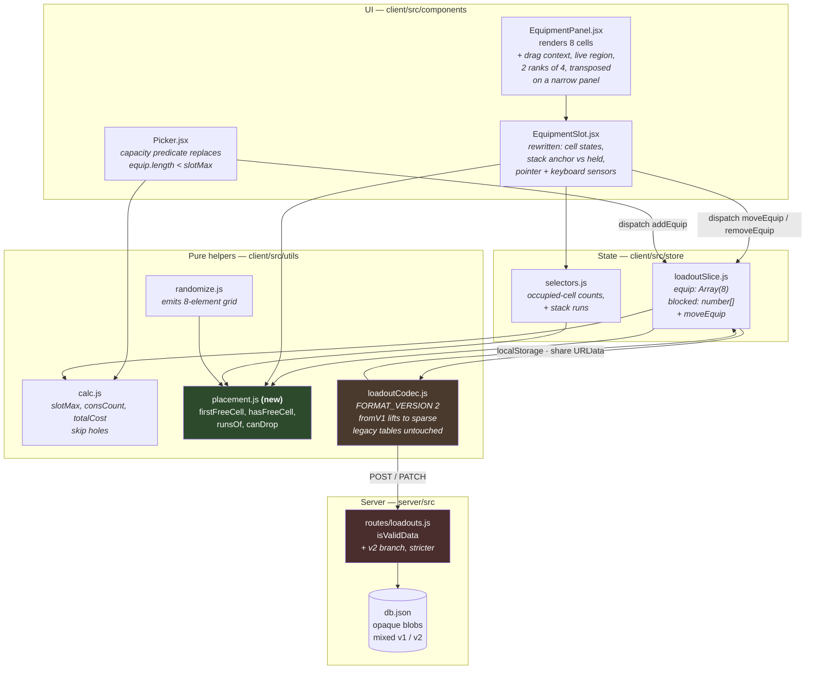
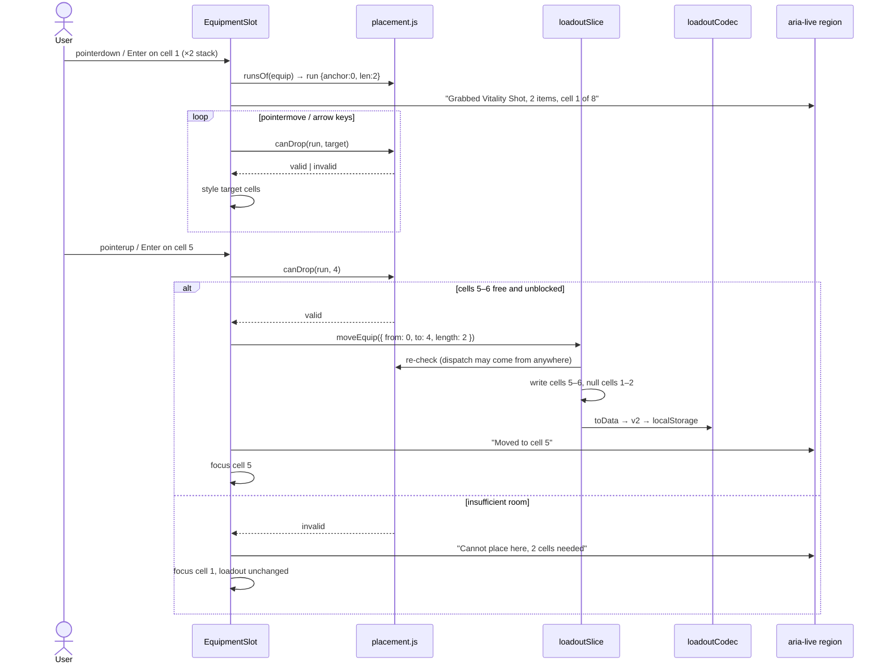

# Design: Equipment Slot Arrangement

## Context

The Equipment panel has looked like eight addressable slots since it was built and has behaved like a queue. `EquipmentPanel.jsx` renders `Array.from({ length: 8 })` and hands each index to `EquipmentSlot`, which reads `state.equip[index]`. Because `state.equip` is a dense packed array, that index is only incidentally a cell — it is really a position in a list that always starts at the front. `removeEquip` is a `splice`, so unequipping cell 1 relocates every item behind it.

Nobody wrote that behaviour down as a decision, and no test asserts it, because it was never chosen. It is what a packed array does.

Three properties of the surrounding code decide how expensive it is to change:

**The wire format is versioned and the migration path is exercised.** `loadoutCodec.js` declares `FORMAT_VERSION = 1` and dispatches through a `DECODERS` table with a frozen legacy branch. Issue #68 is the scar tissue: the pre-versioning decoder read the *live* catalog arrays on the assumption that positions still lined up, and the assumption expired the moment a row was deleted from the middle of `TOOLS`, so a record meaning Spyglass came back as Decoys. The fix froze the legacy tables and added a test asserting every non-null entry still resolves. That history is the reason this design treats "position becomes load-bearing" as something that has to be paid for with an explicit, tested migration rather than a comment.

**The server validates the payload but never interprets it.** `isValidData` in `routes/loadouts.js` asserts `data.e` is an array of at most eight `[t, id]` pairs with no holes, and `data.b` is a number in `0..8`. It exists to keep unresolvable references out of the data file (issue #19). Everything else about equipment is opaque to the server — consistent with ADR-0008's observation that `server/src/` is a store, not a model.

**`slotMax` has six consumers and one of them re-derives it.** `calc.js`, `selectors.js`, `loadoutSlice.js` (twice), `thunks.js`, `randomize.js`, and `Picker.jsx` all read it, and `Picker.jsx` independently computes room as `loadout.equip.length < sMax`. That duplicated predicate is the single most likely place for the panel and the picker to disagree once the array is sparse, which is why SPEC-0006 states capacity once as "a free, unblocked cell exists" and forbids the length comparison by name.

SPEC-0006 carries the requirements; ADR-0009 carries the decision and its rejected alternatives. This document covers the parts that are neither — the shape of the code that results, and the choices made inside the space ADR-0009 defines.

## Goals / Non-Goals

### Goals

- Make cell position a stored, versioned, validated property of a loadout, so it survives a save, a share link, and a reload.
- Let a player put any item in any of the eight cells, including leaving gaps.
- Let a player mark any cell blocked, not just cells at the tail.
- Render repeated adjacent consumables as one tile with an honest quantity badge.
- Provide one move operation with two entry points — pointer and keyboard — that cannot diverge.
- Draw the eight cells as two fixed ranks of four at every width — rotated when the panel is narrow, never reflowed to a different track count — so a cell is a place the player can recognise and not only an index the payload records.
- Migrate every existing record, including pre-versioning ones, without relocating a single item.

### Non-Goals

- **Dragging from the picker into a chosen cell.** The picker keeps its current append semantics, refined to "lowest free unblocked cell". Adding a second drag source doubles the drop-target surface and the touch-gesture surface for a convenience the user did not ask for.
- **Splitting a stack by dragging one copy out of it.** A stack moves as a unit; reducing it is done by removing copies. The peel-one-off gesture is discussed under Open Questions.
- **Changing any game rule.** The four-copies-of-one-consumable cap, the one-of-each-tool rule, and the eight-cell ceiling are unchanged. This capability changes where items sit, not which items are legal.
- **Closing the security-headers gap.** The app ships no CSP today. That is real and it is not this capability's to fix; SPEC-0006 only forbids making it harder to fix.
- **Server-side migration of stored records.** Old records stay v1 in the data file until re-saved.
- **Reworking the loadout row preview.** SPEC-0003 owns that; this capability constrains it and flags the amendment it needs.

## Decisions

### Sparse eight-element array as the single representation

**Choice**: `state.equip` is `Array(8)` of `null | { t, i }`. Index is the cell, always.

**Rationale**: It is the only representation in which the three corrupt states — an item with no cell, a cell with no item that is nonetheless claimed, and two items claiming one cell — are unrepresentable rather than merely invalid. The full argument, including the packed-plus-position-map and quantity-field alternatives, is in ADR-0009.

**Alternatives considered**: See ADR-0009 § "Pros and Cons of the Options".

### The tracks are pinned in CSS, and the narrow arrangement is a transpose

**Choice**: `.equip-grid` gets two rule blocks and no third. Wide is `grid-template-columns: repeat(4, minmax(0, 1fr))` in normal row flow; narrow is `grid-template-rows: repeat(4, minmax(0, 1fr))` with `grid-auto-flow: column`, which fills cells 1–4 down the first column and 5–8 down the second. Both replace today's `repeat(auto-fill, minmax(140px, 1fr))`.

`grid-auto-flow: column` is what makes this a transpose with **no DOM reordering**: the elements stay in document order 1–8 and the layout walks them down the columns instead of along the rows. Tab order therefore matches the visual reading order in both arrangements for free, with no `order` property and no `tabindex` juggling — the two things that usually make a responsive grid an accessibility defect.

**Rationale**: ADR-0009's amendment of 2026-08-12 carries the argument for two ranks; what it means for the code is that the arrow-key sensor computes `target ± 1` along a rank and `target ± 4` across ranks with an edge clamp, and needs exactly one bit — which arrangement is current — rather than a measurement. The stack renderer knows where the rank break falls without asking the DOM anything at all, since the break is between cells 4 and 5 in both.

The track shape is `minmax(0, 1fr)` rather than `minmax(min, 1fr)` deliberately: a non-zero minimum on a fixed track count is what forces overflow, and horizontal scroll on the grid would trade a WCAG 1.4.10 pass for a layout that never gets small. `.trait-grid` already resolved this the same way, and its `--trait-art-scale` percentage — an icon sized as a share of its tile rather than in pixels — is the pattern the equipment tile should follow at the small end.

**The threshold is a container query, not a media query, and this is where the measurement matters.** The panel sits in `.left-column` (`flex: 1 1 400px; min-width: 320px`) beside `.right-column` (`flex: 1.25 1 440px; min-width: 320px`), inside `.app-main` with a 20px gap and 28px side padding, and `.panel` adds 20px of its own. That makes panel width a piecewise function of viewport width, not a proportional one:

| Viewport | Layout | Panel content | Four across |
|---|---|---|---|
| 1440px | side by side | ~593px | ~141px/cell |
| 1024px | side by side | ~408px | ~94px/cell |
| 760px | side by side, both at `min-width` | ~286px | ~64px/cell |
| 716px | just stacked | ~620px | ~147px/cell |

The narrowest panel in the app is at a *tablet* viewport, and it is more than twice as wide 44px further down. A media query keyed to the viewport would transpose the phone, where four across is comfortable, and leave the tablet at 64px cells. `@container` on `.panel` (`container-type: inline-size`) asks the question that actually determines the answer.

The cost is that the keyboard sensor cannot use `matchMedia`; it needs a `ResizeObserver` on the panel. That is not the thing rejected below — the sensor compares an observed width against the *same declared threshold constant* the stylesheet uses, so the threshold remains one value in one place and the layout is never the source of truth. Reading back `getComputedStyle(grid).gridTemplateColumns` would be the opposite: the layout answering for itself.

**Alternatives considered**:
- *A single fixed axis — four columns at every width*: this was the first draft of the amendment and the table above is why it was dropped. Shrinking alone runs out well before 64px, and it makes the tightest case the one with no relief.
- *A media query that reflows to two columns on phones*: rejected, and not the same proposal as the transpose. Four rows of two makes cell 5 a neighbour of cell 6 and no longer of cell 1, so it is a different arrangement of the same payload rather than a rotation of it — the "cell 5 is somewhere else now" problem the fixed grid exists to remove, at discrete widths instead of continuously. The transpose is admissible precisely because it preserves the adjacency graph; nothing weaker than that is.
- *Keep auto-fill and derive the arrow step from the rendered track count* (`getComputedStyle`): technically workable and the reason to reject it is not difficulty. It makes a keyboard operation's meaning a function of layout, so the pointer and keyboard routes stop being two callers of one thing — the property this design is built around. Observing a width to pick between two declared arrangements does not have that property; asking the grid what it did does.

**Testing note**: `cssRules.js` deliberately throws when a conditional at-rule restates a property the same selector declares unconditionally, and the two arrangements necessarily do exactly that for the grid template properties. The orientation assertions therefore cannot go through `effective()`/`resting()`; they need to read the two rule blocks and the threshold constant directly. Worth knowing before the test is written rather than after it throws.

### Stacking is a view function, not a state field

**Choice**: A stack is a maximal run of consecutive cells holding identical `(t, i)`. Quantity is computed at render time by a pure function over `state.equip`; nothing is stored.

**Rationale**: The property SPEC-0006 needs — *the badge and the cell count can never disagree* — is free if the cells are the source of truth and expensive to guarantee if they are not. A stored `q` would let the two drift, and would need reconciliation logic on every mutation to stop it.

It also removes a special case. Because `addEquip` already forbids two of the same tool, a run of length ≥ 2 can only be consumables. The run detector never tests category; "stacks are consumables-only" is inherited from a rule that is already enforced and already tested rather than restated as a second rule that could fall out of sync with the first.

**Alternatives considered**:
- *Entry carries `q` and reserves `q` cells*: breaks index-is-position for every entry after a stack, which is the exact coupling this design exists to remove, and needs collision rules for growth and for partial-fit drops.
- *Stack cells merged into one grid cell that spans visually*: makes the eight-cell accounting invisible, which is the opposite of the user's stated want — they specifically asked that the extra copy visibly consume one of the eight.

### One move operation, two callers

**Choice**: The reducer exposes `moveEquip({ from, to })` — and its stack-aware form — and nothing else. Pointer drag and keyboard grab-and-place both dispatch it. Placement legality lives in one pure function that both callers consult before dispatching, and that the reducer re-checks.

**Rationale**: The most likely failure mode for a keyboard alternative is not that it is missing but that it is a second, thinner implementation that drifts — a drop the mouse permits and the keyboard refuses, or a swap that only one route performs. Making them callers of one operation makes divergence a code change rather than an oversight.

Re-checking in the reducer is deliberate duplication: the UI check is for affordance (dimming an invalid target), the reducer check is for correctness (a dispatch from anywhere is safe).

### Pointer Events, not the HTML5 drag-and-drop API

**Choice**: Implement dragging on `pointerdown`/`pointermove`/`pointerup` with pointer capture, not `draggable` + `dragstart`/`drop`.

**Rationale**: Three reasons, in order of weight. HTML5 drag-and-drop does not fire for touch input at all, so a touch user would have no route to a feature whose whole purpose is arranging things. Its drag image and drop-effect styling are inconsistent across browsers and largely unstyleable, and this grid's cells are custom-rendered tiles. And its `dataTransfer` model is oriented toward moving data between documents, which is not what is happening here — the payload is a cell index in the same component tree.

The cost is that inertia, auto-scroll, and drag-image rendering become ours to write. The grid is eight fixed cells in one viewport, so none of those are load-bearing here.

**Alternatives considered**: A drag-and-drop library (`dnd-kit`, `react-beautiful-dnd`) would supply the keyboard sensor and the ARIA announcements this design otherwise writes by hand. Rejected on dependency weight for an eight-cell grid in an app whose only runtime client dependencies today are React and Redux Toolkit — but this is the decision most worth revisiting if the hand-written keyboard sensor proves fiddly.

### Capacity is one predicate, named and exported

**Choice**: `firstFreeCell(loadout)` returns the lowest-numbered free unblocked cell index or `-1`; `hasFreeCell(loadout)` is `firstFreeCell(loadout) !== -1`. `Picker.jsx`, `addEquip`, and the randomizer all use them. The `loadout.equip.length < sMax` comparison is deleted, not adapted.

**Rationale**: That comparison is not merely wrong under a sparse array — it is wrong in a way that produces a plausible-looking picker. An eight-element array always has `length === 8`, so the naive port disables every item permanently; a careless fix to `filter(Boolean).length < sMax` silently ignores which cells are blocked. Naming the predicate once removes both.

### `blocked` is an index array, not a boolean array of eight

**Choice**: `blocked: number[]`, holding cell indices.

**Rationale**: `slotMax()` stays a one-line arithmetic change (`8 - blocked.length`), the wire format stays compact and human-readable in a share link, and the v1 migration is a direct expression of the old meaning (`b: 3` → `[5, 6, 7]`). A `boolean[8]` would encode eight values to say what is usually zero or one fact, and would put a second fixed-length-eight invariant into the format for the validator to police.

The cost is that "is cell *n* blocked" is a linear scan rather than an index. Eight elements makes that free.

### The server accepts both versions permanently

**Choice**: `isValidData` branches on `data.v` and validates v1 and v2 shapes side by side, forever. No server-side migration, no deprecation window.

**Rationale**: There is no moment at which every stored record is v2, because a record is only rewritten when its owner re-saves it, and nothing compels them to. A transitional window would therefore be a window that never closes, and hard-coding one would eventually reject records the app itself wrote. Version dispatch already lives in the client decoder; keeping the server a validator of two shapes rather than a translator between them preserves ADR-0008's property that the server stores blobs it does not interpret.

The v2 branch is *stricter* than v1's, not looser: `e` must be exactly eight elements, and `b` must be unique in-range integers. A sparse array of the wrong length is precisely the input that would render items in the wrong cells, so it is the one thing the validator must not wave through.

## Architecture

The change is concentrated in the client store and codec; the server contributes one validator branch. What follows is every module that reads or writes equipment state, annotated with what this capability does to it.

The new `placement.js` is the answer to the six-consumers problem: every question about where an item may go is asked there, by the reducer, the picker, the drag sensors, and the randomizer alike.

A stack move is the interaction with the most moving parts, and the one where the pointer and keyboard routes must provably agree:

Both branches end by moving focus deliberately and announcing the outcome. That is not decoration: a rejected drop that only snaps the tile back is invisible to a screen-reader user, which is why SPEC-0006 makes the announcement a requirement rather than a nicety.

## Risks / Trade-offs

- **Six files must learn to tolerate holes, with no compiler to find the misses.** `consCount`, `totalCost`, `toData`, `randomize`, `selectEquipCount`, and `Picker.jsx`'s capacity test each iterate or measure `state.equip` and each is wrong the moment it is sparse — silently, and in ways that produce plausible numbers. → Route every one of them through `placement.js` or an explicit `.filter(Boolean)`, and add a test per consumer asserting behaviour on a grid with gaps, not only on a full or empty one. The capacity predicate is the highest-risk of the six because a naive port disables the entire picker and a careless fix ignores blocked cells.

- **The client cannot ship before the server.** A v2 payload is a 400 against today's `isValidData`, so a client-first release turns every save into an error. → The validator branch lands and deploys first; it accepts v2 before any client emits it, and accepting a shape nothing sends yet is harmless.

- **The migration is where a repeat of issue #68 would live.** Lifting v1 to v2 means asserting what a v1 record *meant* about cells, and that assertion is exactly the kind that previously lived in a comment and was wrong. → The lift is mechanical and total — dense entries into cells 1..n, `b: N` into the last `N` indices — and is covered by round-trip tests including the case where a middle item no longer resolves and must leave a hole rather than close one. The frozen `LEGACY_*_IDS` tables are not touched.

- **Non-adjacent duplicates render as two tiles with no badge.** A player with Vitality Shots in cells 1 and 6 sees no indication they hold two. → Accepted, and arguably correct under free placement, since the player chose those cells. Revisit only if it is reported as confusing; the fix would be a non-positional "you hold 2" summary in the panel header rather than a change to the stacking model.

- **The equipment tile does not survive four-across, and `auto-fill` has been hiding that.** A slot carries an image, a name, a category, and a cost in a `min-height: 92px` box with a 140px-minimum column. The grid only ever reaches four columns above a ~1434px viewport; below that `auto-fill` quietly drops to three and then two, so the panel has never had to draw a four-across tile at a real desktop width. Pinning the tracks removes that escape and makes the tile the gating work, at ~141px per cell on a 1440px display and ~94px at 1024px. → The tile's internal layout absorbs it, not the grid: the artwork scales as a share of the tile (`.trait-cell-thumb`'s `--trait-art-scale` is the precedent), and the text elements give way first. Transposition covers the narrow end — two across the same panel is roughly 138px per cell where four across is 64px — so the design target is a tile that works from about 94px up, not from 64px up. This is the one part of the change with no existing pattern to copy wholesale, and it is worth designing before the CSS is written rather than after.

- **Two arrangements double what a reviewer has to check.** Every rendering and interaction requirement is now true-of-both or broken, and an assertion written against the wide arrangement alone passes while the narrow one is wrong. The likeliest specific miss is the arrow-key sensor, where the wide mapping (Up/Down = ±4) is the intuitive one and the narrow mapping is its transpose. → Every orientation-sensitive scenario in SPEC-0006 names its arrangement explicitly, and the two edge-clamp scenarios are deliberately the same move in both. The sensor takes the arrangement from one declared threshold, so the narrow path cannot be reached by one consumer and not another.

- **Hand-written drag and keyboard sensors are a known source of subtle accessibility bugs.** Focus loss on removal, announcements that fire twice, and grabs that survive an unmount are all classic. → SPEC-0006 names the focus destination for every outcome, and the sensor is one component rather than one per cell. `dnd-kit` remains the escape hatch if the hand-written version proves fragile.

- **SPEC-0003's loadout preview reads equipment in slot order.** Its "shed later slots before earlier ones" rule assumes a dense list. → It is unimplemented, so there is no regression to cause — but it must be amended in the same commit that lands the sparse model, not left to be discovered by whoever implements it.

## Migration Plan

1. **Server first.** Add the v2 branch to `isValidData`, keeping the v1 branch intact and adding the stricter v2 guards. Deploy. Nothing emits v2 yet; the server is simply ready.
2. **Pure helpers.** Add `placement.js`. Make `calc.js` and `randomize.js` hole-tolerant. Both steps are behaviour-preserving against a dense array, so the existing suite is the guard.
3. **Codec.** Raise `FORMAT_VERSION` to 2, add `fromV2`, and rewrite `fromV1` to lift into cells. Keep the legacy branch and its frozen tables untouched. This is the step that needs the densest round-trip tests.
4. **Store.** Change `equip` to eight elements and `blocked` to an index array; rewrite `removeEquip` to null in place; add `moveEquip`; tighten `setLoadout`'s shape check.
5. **UI.** Pin `.equip-grid` to two ranks of four, add the container-query transpose, and rework the tile for narrow cells — this lands first within the step, because the drag and keyboard sensors are written against a declared arrangement rather than a measured one. Then rewrite `EquipmentSlot` for the new cell states and the stack anchor/held distinction; add the pointer and keyboard sensors and the live region to `EquipmentPanel`; replace `Picker.jsx`'s capacity comparison.
6. **Amend SPEC-0003.** Update "Filed Loadouts Preview Their Contents" to skip holes when shedding by slot.

**Rollback**: Steps 3–5 revert together as one client change; the server's v2 branch is additive and can be left in place, since a server that accepts a shape no client sends is inert. Records already written as v2 would not decode against a reverted client — so if a rollback is needed after v2 records exist, the reverted client must retain `fromV2` as a read-only decoder. Keeping `fromV2` on the rollback path is cheaper than the alternative, which is data loss.

## Open Questions

- **Should dragging a *held* cell peel one copy off the stack rather than moving the whole run?** It is the natural gesture for splitting and would remove the "remove copies then re-add" workaround, at the cost of making the drag semantics depend on which cell of a stack was grabbed. Deferred until the whole-run behaviour has been used.
- **What is the transpose threshold's numeric value?** SPEC-0006 requires it to be declared once and consumed by both the stylesheet and the sensor, and deliberately does not fix the number, because it is "the panel width below which the redesigned tile stops working four across" and the tile does not exist yet. The measurements above bound it: above ~593px of panel content four across is at least as roomy as today's widest case, and at ~286px it is 64px per cell and plainly past the point. Set it when the tile is designed, not before.
- **Should the saved-loadout preview transpose too?** Currently no, and SPEC-0006 says so: its cells are floored thumbnails that fit four across at any width, and its container is a card that can be narrow at any viewport, so a container-keyed threshold would rotate some cards and not others in the same list. The cost is that on a phone the builder is portrait and the preview is landscape. Revisit if that reads as two different loadouts rather than one loadout twice.
- **Should the panel header summarise total quantity per item?** It would close the non-adjacent-duplicates legibility gap without touching the stacking model. Cheap, but adds a second place equipment is described.
- **Should a blocked cell be expressible mid-drag** — that is, should the user be able to block cells while an item is grabbed? Current answer is no, and there is no evident reason to want it.
- **Does the randomizer have a placement preference worth expressing?** It currently fills whatever cells it finds. Whether a random loadout should cluster items at the front, spread them, or reproduce a previous arrangement is a product question this design does not answer.
