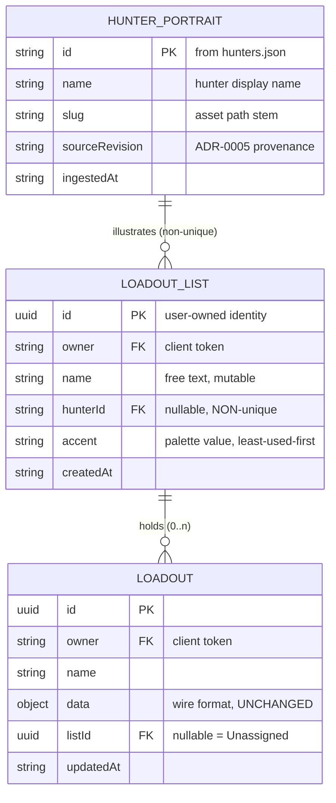
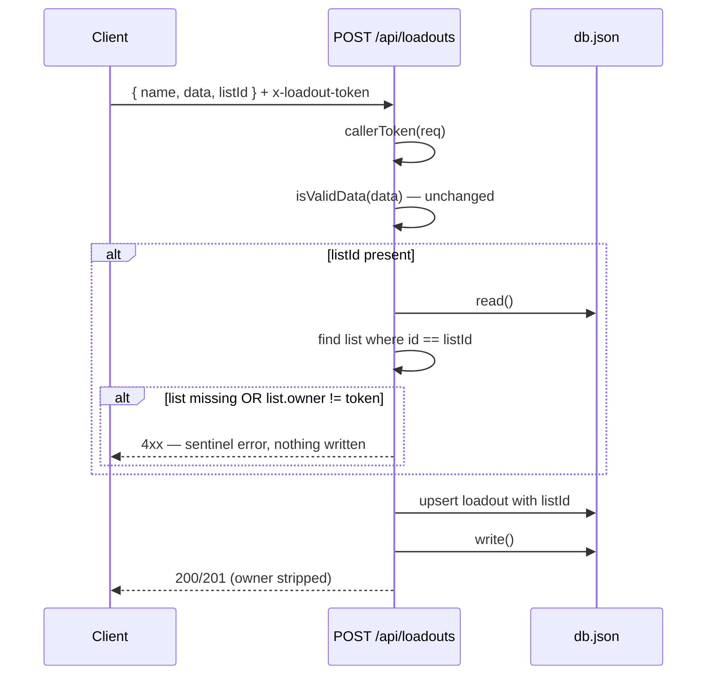
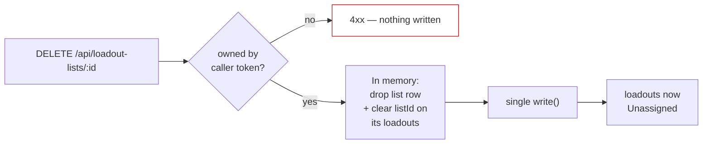

# Design: Hunter Loadout Lists

## Context

The Outfitter persists saved loadouts server-side in a `lowdb` JSON file, scoped to a client-issued token carried in the `x-loadout-token` header. `SavedLoadoutsPanel` renders every record the fetch returns in one flat column. Past roughly a dozen saves that becomes unusable, and users compensate by prefixing names by hand — "Rat — long ammo", "Rat — shotgun" — which is a grouping mechanism implemented in a text field.

ADR-0006 decided to replace that with lists: user-named groups illustrated with hunter portraits. Its central move is separating identity from imagery, because binding a list to a roster hunter one-to-one caps a user's list count at the size of the library and makes non-hunter groupings ("shotgun experiments") inexpressible.

Two pieces of existing history constrain this design:

**Issue #17 (ownership).** `db.js` and `routes/loadouts.js` carry a deliberate, documented ownership model: records are token-scoped, there is no shared anonymous bucket, and well-known sentinel owner values are rejected as forgeable. Anything added here inherits that model verbatim.

**Design handoff.** The UI layer is specified by `docs/design/hunter-loadout-lists/`, an interactive HTML prototype plus its handoff notes. It is a design reference, not production code — the work is to recreate it in the existing React/Redux client using `global.css` tokens and `ItemThumb`.

**SPEC-0001 (equipment iconography).** Portraits are self-hosted scraped images and reuse that spec's asset-path convention, its `` fallback chain, and its attribution posture. This spec `requires` SPEC-0001 for that reason.

## Goals / Non-Goals

### Goals

- Group saved loadouts under user-named lists with strong visual identity
- Keep the set of expressible groupings unbounded — independent of how many hunters exist
- Preserve every existing loadout with no migration, backfill, or rewrite
- Leave the loadout wire format and share URLs untouched
- Make retirement cheap and non-destructive
- Extend the existing ownership model without weakening it

### Non-Goals

- Modeling in-game hunter mechanics — no permadeath, carried traits, recruitment cost, health, or carry-limit validation. A list is a playlist with a face
- **Specifying the hunters dataset.** Scrape scope, fields, and refresh belong to a separate hunter-data decision; this spec only states the contract it consumes
- User accounts or real authentication. The token remains a pseudonymous scope key
- Drag-and-drop for moving loadouts between lists — deferred as a future enhancement to that page
- Sharing a list with another user, and nested lists
- Changing how loadouts themselves are encoded, validated, or shared

## Decisions

### List identity is a server-generated UUID, not a portrait reference

**Choice**: `loadoutLists` records are `{ id: uuid, owner, name, hunterId, accent, createdAt }`. `hunterId` is nullable and explicitly non-unique.

The collection is `loadoutLists`, not `hunterLists` — a list need not correspond to a hunter at all, and a forthcoming `hunters` dataset (photos, names, descriptions) would make the latter name actively misleading about which thing the collection stores.

**Rationale**: This is the decision the whole capability turns on. Identity must be user-defined and unbounded; imagery is better drawn from a fixed pool the user doesn't have to supply. Separating them means "shotgun experiments" and "my Rat builds" are the same kind of object with no special case, and adding hunters to the library adds options rather than slots.

**Alternatives considered**:
- *Roster hunter is the list, bound one-to-one*: rejected — caps list count at library size, and a user wanting two Rat lists for different playstyles simply cannot have them.
- *Free-text group name on the loadout record, no list entity*: rejected — renaming means rewriting every referencing loadout as a multi-record write with no transaction on `lowdb`, and there is nowhere to store a portrait.

### The list set is stored, not derived

**Choice**: A `loadoutLists` collection exists as its own persisted entity, rather than deriving the group set from `DISTINCT listId` over the user's loadouts.

**Rationale**: "Create a list, then add loadouts to it" requires the list to exist between those two steps. A derived set makes an empty list unrepresentable — it would vanish until the first save lands. Retirement also needs something to act on: with no row to delete, removing a list would mean unassigning every loadout in it, conflating two different user intents.

**Alternatives considered**:
- *Derive from loadouts*: rejected for the two reasons above, despite being a strictly smaller server change.

### `listId` lives on the record envelope, never in `data`

**Choice**: The loadout record gains `listId` as a sibling of `name` and `updatedAt`. `toData()`/`fromData()` and `FORMAT_VERSION` are untouched.

**Rationale**: The `data` object is the shared wire format for saves, local drafts, and share URLs. Putting `listId` there would force a format version bump, a migration path in the decoder, longer share URLs, and would encode a list reference meaningless to any recipient. Keeping it on the envelope means `isValidData()` needs no edit and sharing cannot regress.

A useful side effect: absent `listId` already means Unassigned, so every pre-existing record is correct as written and no migration exists to get wrong.

### Retirement is a delete plus an unassign, applied atomically

**Choice**: Retiring deletes the list row and clears `listId` on its loadouts in a single committed write. No cascade delete anywhere.

**Rationale**: A list is a playlist. Deleting a playlist deletes the playlist — the tracks are still in your library. Loadouts are the artifact with value; a list is a filing label, and destroying work while managing folders is the one failure this feature cannot afford.

The delete is a hard delete: no `retired` flag, no archived copy, no hidden record. The spec forbids retaining the list in any form. Recreating an equivalent list is a two-click operation against a stable portrait library, so a tombstone would carry cost with no payoff.

Atomicity matters more than it first appears. `lowdb` reads the whole file, mutates in memory, and writes it back — a multi-step mutation committed in pieces can leave loadouts referencing a deleted list. The read is cheap enough that combining both steps before a single `write()` is straightforward; the design requirement is that it be *deliberate* rather than incidental.

### Portrait reuse is made comfortable, not merely legal

**Choice**: Each list carries an `accent` colour assigned on creation and user-editable, giving it an identity channel independent of both its name and its portrait.

**Rationale**: Allowing two lists to share a hunter creates an interface problem the data model doesn't see: at a glance, two "Rat" lists are indistinguishable except by reading their names. The accent is what makes reuse feel intentional rather than like a mistake the app tolerated — and it works everywhere a list appears, not only at the moment of creation.

Accessibility constrains the mechanism: the accent cannot be the *only* differentiator. The list name remains the primary accessible identity. See the palette decision below for why that constraint is load-bearing rather than precautionary.

### Accent palette: six fixed values, assigned least-used-first

**Choice**: `#b04a3e` clay · `#7a8a4e` olive · `#5a6e96` slate · `#5e8a8a` teal · `#8a5e86` plum · `#a3703e` amber. Exposed as `--list-accent-{1..6}` in `global.css`, assigned least-used-first among the owner's lists, duplicates permitted.

**Rationale**: Six values is enough that a typical user's lists rarely collide, and few enough that each stays memorable. Least-used-first assignment means collisions only begin after the sixth list rather than by luck of a random draw.

Every value clears WCAG 2.1 SC 1.4.11 (3:1 non-text) against all three surfaces the accent can sit on — measured, not assumed:

| accent | vs `--panel` | vs `--scroll-track` | vs `--bg` |
|---|---|---|---|
| `#b04a3e` clay | 3.36:1 | 3.43:1 | 3.52:1 |
| `#7a8a4e` olive | 4.81:1 | 4.91:1 | 5.04:1 |
| `#5a6e96` slate | 3.54:1 | 3.62:1 | 3.71:1 |
| `#5e8a8a` teal | 4.73:1 | 4.83:1 | 4.95:1 |
| `#8a5e86` plum | 3.47:1 | 3.55:1 | 3.64:1 |
| `#a3703e` amber | 4.27:1 | 4.36:1 | 4.47:1 |

**The palette separates by hue, not luminance** — olive against teal is 1.02:1, clay against plum 1.03:1. Anyone with red-green or blue-yellow deficiency may see adjacent accents as identical. This is why the spec forbids the accent being the sole differentiator and keeps the list name as primary accessible identity: that rule is load-bearing, not belt-and-braces.

**Alternatives considered**:
- *Include `--gold` `#c4a05e` as the sixth value* (as originally designed): rejected. `--gold` is the theme's primary interactive colour — panel titles, links, hover states — so a gold-framed card reads as selected or active. `#5a6e96` replaces it, clearing 3:1 with 40° of hue separation from its nearest neighbour, the widest of the candidates tested.

### Reuse is unrestricted and unmarked

**Choice**: The picker neither prevents selecting an already-used hunter nor marks which hunters are in use.

**Rationale**: An earlier draft required an in-use marker. The design handoff dropped it as a product call, and the reasoning holds: marking reuse implies unmarked hunters are the correct choice, which is the opposite of the intent. If reuse is genuinely unremarkable, the interface should treat it as unremarkable.

The problem the marker was meant to solve — two lists that look alike — is solved better by the accent frame, which distinguishes lists everywhere they appear rather than only at the moment of creation.

### UI shape: roster grid with expand-in-place

**Choice**: Lists render as a grid of poster cards (`auto-fill, minmax(150px, 1fr)`, 220px tall, 3px accent frame). Clicking a card expands it to full width at its sorted position; siblings stay collapsed. Expanding selects the list. Unassigned is pinned first with a dashed neutral border and never carries an accent.

**Rationale**: Expand-in-place keeps the user's spatial context — the card does not move, so the roster stays legible while one list is open. It also gives selection a physical meaning: the open list *is* the selected list, so no separate selection affordance is needed and the two states cannot drift apart.

Saving stays in `ActionsPanel`; a save files into whichever list is currently open. The expanded header carries a "default list for saved loadouts" badge so the consequence of the current selection is visible.

**Alternatives considered**:
- *Sidebar list + detail pane*: rejected — costs horizontal space the picker and loadout rows need, and the app is already narrow on phones.
- *Modal per list*: rejected — hides the roster, and makes comparing lists impossible.

### Moving a loadout between lists is a native select, not a menu

**Choice**: Each loadout row carries a native `<select>` whose value is the loadout's current list, with Unassigned pinned first. Changing it moves the loadout. Visual detail is in #87.

**Rationale**: Modelling the control as *state* — "which list is this in?" — rather than as a "Move to…" *action* is what makes it cheap to get right. A native select brings keyboard operation, type-ahead, Escape-to-cancel, and a correct assistive-technology announcement for free, where a custom menu would need a focus trap, arrow-key handling, and `aria-expanded` bookkeeping all hand-built and separately tested. It also matches the sort control already in the panel header, so it reads as part of the same system.

The non-obvious cost is what happens *after* a successful move: the row leaves the open list, taking focus with it. Left alone, focus falls to `document.body` and a keyboard user is stranded — the same failure the retire flow already guards against. Focus must move deliberately to the next row or to the list heading.

**Alternatives considered**:
- *Drag-and-drop as the primary affordance*: rejected — the spec forbids it as the only path, and it is unusable by keyboard.
- *Custom menu button*: rejected — every affordance the native select provides would have to be rebuilt and retested, for styling control this design does not need.
- *Modal picker*: rejected — far too heavy for a per-row operation, and it hides the roster the user is choosing among.

### The picker filters, because 285 portraits is not a grid

**Choice**: The picker requires name search, classification filters, and lazy-loaded imagery.

**Rationale**: This was discovered by counting rather than reasoned from first principles. The wiki's roster page lists roughly **285 hunters**. A flat grid renders 285 tiles and, at the portrait budgets SPEC-0004 sets, loads several megabytes of images to let someone pick one.

That is not a scale problem to solve later. It is the difference between a picker that works and one that hangs a phone, so filtering is specified as a functional requirement rather than an enhancement.

It also changes what the SPEC-0004 classification fields are for. They were originally framed as preparation for future sorting; at this roster size they are what filtering *runs on*, which is why SPEC-0004 now requires `acquisition` and `obtainable` rather than leaving them optional.

The requirement is written to not collide with "The Hunter Picker Does Not Restrict or Mark Reuse". Filtering narrows *which hunters are candidates*; it never distinguishes among the candidates it shows. A filtered-out hunter is out of scope for this selection, which is a different thing from a shown hunter being marked as already used.

### List ordering is client-side, with alphabetical as the default

**Choice**: Default alphabetical by list display name. Alternatives: alphabetical by hunter name, creation date, most-recently-used, and loadout-count. Unassigned holds a fixed position regardless of sort. The preference is client state.

**Rationale**: List name and hunter name are genuinely different orderings once a user renames anything, and both are useful — "where's my Rat stuff" and "where's that shotgun list" are different questions. Since the app carries a full hunters dataset, resolving `hunterId` to a name is a local lookup, so offering both costs nothing but the sort function.

List name is the *default* because it is the text actually rendered in the selector; a default ordering that disagrees with the labels on screen reads as broken. Names also default from the hunter, so for untouched lists the two orderings coincide and the distinction only appears once the user has deliberately diverged.

Hunter-name ordering needs one rule that list-name ordering doesn't: a list may have no hunter, or may reference a hunter that has since left the dataset. Those have no sort key at all. Treating a missing name as an empty string would scatter them to the top, interleaved with real entries, which reads as corruption. The spec instead groups them after everything that resolves, ordered by list name among themselves — a defined, explainable position rather than whatever the comparator happens to do with `undefined`.

Unassigned is pinned because it is a permanent structural group rather than a peer of the user's lists; letting it shuffle between "Rat" and "Scout" on a name sort would be noise.

### The selected list is client state

**Choice**: Selection lives in `uiSlice`, optionally mirrored to `localStorage`. It is never persisted server-side.

**Rationale**: It is a cursor, not a fact. Persisting it means a server write on every click of the list selector, and two tabs fighting over which list is "current." The durable facts are which lists exist and where each loadout is filed.

### Cross-collection ownership is checked explicitly

**Choice**: A `listId` supplied on any write is validated as belonging to the caller's token, not merely as well-formed. Rejection is a client error, not a silent downgrade to Unassigned.

**Rationale**: This is the one genuinely new security surface. Until now, ownership checks in this codebase compare a record's `owner` against the caller — a single-collection check. Here a loadout write references a *different collection's* record, and if that reference isn't ownership-checked, a user can file into a stranger's list by guessing a UUID. Rejecting loudly rather than downgrading to Unassigned matters too: a silent downgrade would mask an attack and confuse a legitimate client bug.

## Architecture

### Data model

`HUNTER_PORTRAIT` is generated, committed, and identical for every user. `LOADOUT_LIST` and `LOADOUT` are per-user rows in `db.json`. The portrait relationship is deliberately many-to-one and carries no uniqueness constraint.

### Filing a loadout — the ownership check in context

The branch in the middle is the new integrity rule. Note it runs *before* any mutation, and that "list missing" and "list not owned" are distinct sentinels — the client needs to tell a stale reference apart from a rejected one.

### Retirement

Both mutations are staged in memory and committed by one `write()`. There is no intermediate persisted state in which a loadout references a deleted list.

## Risks / Trade-offs

- **Cross-collection ownership check is new and easy to omit** → It is called out as the first bold item in the spec's Confirmation list, and gets a dedicated scenario. The test asserting token A cannot file into token B's list should be written before the endpoint.
- **Two lists sharing a portrait look alike at a glance** → Addressed by the per-list accent colour alone; the picker deliberately does not mark reuse. Residual risk is that the accent is not accessible on its own — the palette separates by hue rather than luminance — so the list name remains the primary accessible identity and the accent must never be the sole differentiator.
- **`lowdb` read-modify-write interleaving under concurrent requests** → Pre-existing in the loadouts routes, but retirement's multi-step mutation raises the stakes. Addressed by the atomic-write requirement; if interleaving proves real in practice, serializing writes behind a queue is the smallest available fix.
- **Free-text list names can still drift** → Blunted rather than solved by defaulting the name from the chosen portrait, so lists only diverge from the roster's vocabulary when the user deliberately types something else.
- **First heavy image assets in the app** → Portraits are photographic, the picker shows many at once, and the dataset covers the full roster rather than a subset. Mitigated by lazy-loading and the SPEC-0001 fallback chain; the sequencing below defers assets entirely until the feature works, so the weight lands last and can be tuned independently.
- **Hunters dataset refreshes independently of stored lists** → A list may outlive its hunter's dataset entry. The spec requires such a list stay fully usable behind a neutral placeholder rather than breaking or disappearing; this is the concrete reason `hunterId` resolution must never be treated as a hard reference.
- **Cross-artifact edges must stay in step with reversals** → SPEC-0003 `implements` ADR-0006, so a decision reversed here has to be reflected there or the graph reports two sources of truth. The in-use-marker reversal required an amendment to ADR-0006 for exactly this reason.

## Migration Plan

There is no data migration. Absent `listId` already means Unassigned, so every pre-existing loadout record is correct as written.

Deployment sequencing, ordered so the slow half never blocks the usable half:

1. **Scrape hunter names only** — no portraits. Small payload, no asset weight, no bundle impact. Unblocks everything downstream.
2. **Ship the grouping feature** — `loadoutLists` collection, `listId` on loadouts, all endpoints, the cross-collection ownership check and its tests, and grouped UI against a text-only library. The feature is fully usable at this point; lists simply have no faces yet.
3. **Add portraits** — scrape assets, wire the picker, lazy-load with the SPEC-0001 fallback chain.

Rollback: steps 2 and 3 are additive. Reverting the server change leaves `listId` as an ignored field on existing records, and reverting the client leaves the flat list rendering every loadout regardless of assignment — degraded but not broken, and no data is lost either way.

## Resolved Questions

Settled during review of the initial draft, recorded so the reasoning is not re-litigated:

- **Move affordance** — a native `<select>` on the loadout row whose value is the loadout's current list, not drag-and-drop. DnD may be added later; if it is, the explicit control stays rather than being replaced. Full detail in the decision below and in #87.
- **List ordering** — alphabetical by list name by default, with hunter name, creation date, most-recently-used, and loadout count as alternatives. Hunter-name ordering places hunterless and unresolvable lists after everything that resolves.
- **Picker behaviour for already-used hunters** — never restrict them, and never mark them either. Reuse is unremarkable; the per-list accent colour is what keeps lists distinguishable. (An earlier draft required an in-use marker; see the decision above for why it was dropped.)
- **Collection name** — `loadoutLists`, not `hunterLists`, because lists need not correspond to hunters and a `hunters` dataset is coming.
- **Portrait scope** — the full wiki roster, and the dataset's sourcing is factored out into its own decision rather than being specified here.
- **Accent palette** — six fixed values, assigned least-used-first, all verified at 3:1 or better. `--gold` was dropped from the designed palette to avoid colliding with the theme's interactive colour.
- **"Most recently used"** — means last *opened*, not last saved into or last modified. Opening a list is the act that expresses intent to work in it.
- **In-use marker in the picker** — dropped. Reuse is unrestricted and unmarked.
- **Catch-all group name** — "Unassigned", kept because it is technically accurate: those loadouts have no list assignment, as distinct from belonging to a category that happens to be uncategorized.

## Open Questions

- Should the undo affordance for a move ship in the first pass, or follow? A move removes the row from view, which argues for undo, but it is additive and the spec does not require it.
- Should the expanded card animate open, or swap instantly? The prototype swaps instantly. Animation would help orient the user when a card grows to full width, but risks feeling sluggish in a panel that is otherwise immediate.
- What is the right empty state for a brand-new user with no lists at all — an empty roster, or a prompt to create the first list?
