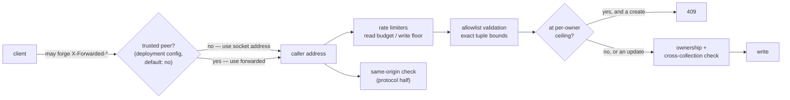
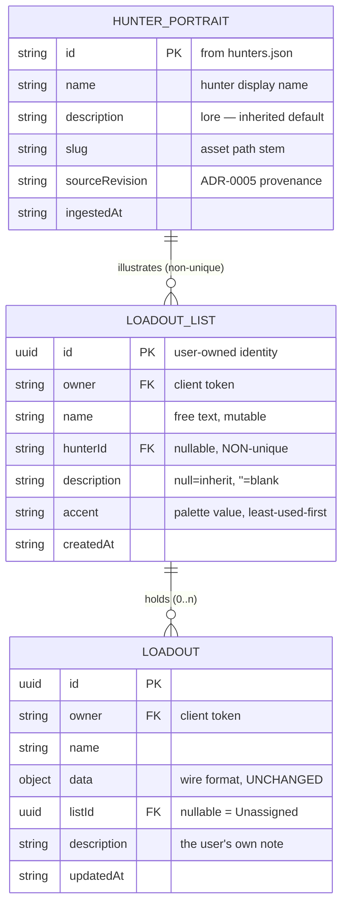
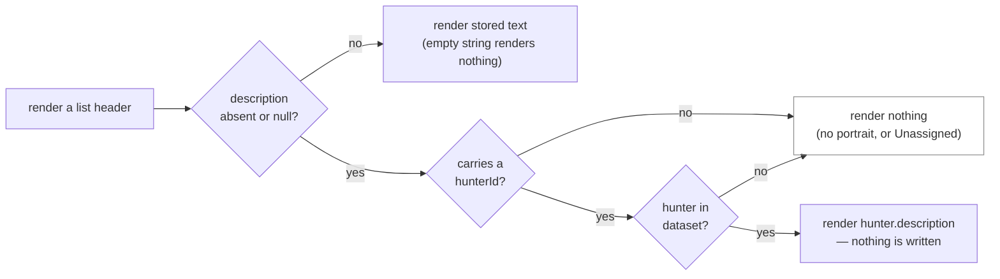
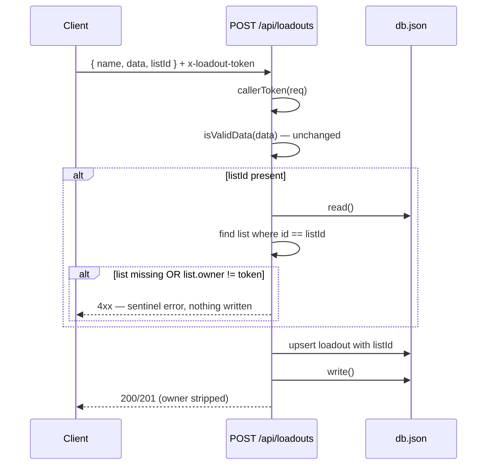
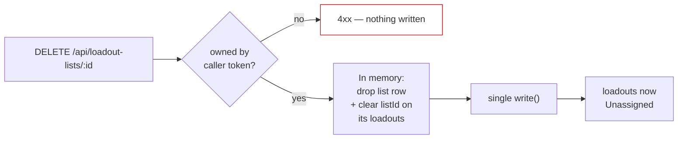

# Design: Hunter Loadout Lists

## Context

The Outfitter persists saved loadouts server-side in a `lowdb` JSON file, scoped to a client-issued token carried in the `x-loadout-token` header. `SavedLoadoutsPanel` renders every record the fetch returns in one flat column. Past roughly a dozen saves that becomes unusable, and users compensate by prefixing names by hand — "Rat — long ammo", "Rat — shotgun" — which is a grouping mechanism implemented in a text field.

ADR-0006 decided to replace that with lists: user-named groups illustrated with hunter portraits. Its central move is separating identity from imagery, because binding a list to a roster hunter one-to-one caps a user's list count at the size of the library and makes non-hunter groupings ("shotgun experiments") inexpressible.

Two pieces of existing history constrain this design:

**Issue #17 (ownership).** `db.js` and `routes/loadouts.js` carry a deliberate, documented ownership model: records are token-scoped, there is no shared anonymous bucket, and well-known sentinel owner values are rejected as forgeable. Anything added here inherits that model verbatim.

**Design handoff.** The UI layer is specified by `docs/design/hunter-loadout-lists/`, an interactive HTML prototype plus its handoff notes. It is a design reference, not production code — the work is to recreate it in the existing React/Redux client using `global.css` tokens and `ItemThumb`.

**SPEC-0001 (equipment iconography).** Portraits are self-hosted scraped images and reuse that spec's asset-path convention, its `` fallback chain, and its attribution posture. This spec `requires` SPEC-0001 for that reason.

## Goals / Non-Goals

### Goals

- Group saved loadouts under user-named lists with strong visual identity
- Keep the set of expressible groupings unbounded — independent of how many hunters exist
- Preserve every existing loadout with no migration, backfill, or rewrite
- Leave the loadout wire format and share URLs untouched
- Make retirement cheap and non-destructive
- Extend the existing ownership model without weakening it
- *(2026-08-10)* Make a filed loadout identifiable without opening it, and let a user say what it is for in their own words

### Non-Goals

- Modeling in-game hunter mechanics — no permadeath, carried traits, recruitment cost, health, or carry-limit validation. A list is a playlist with a face
- **Specifying the hunters dataset.** Scrape scope, fields, and refresh belong to a separate hunter-data decision; this spec only states the contract it consumes
- User accounts or real authentication. The token remains a pseudonymous scope key
- Drag-and-drop for moving loadouts between lists — deferred as a future enhancement to that page
- Sharing a list with another user, and nested lists
- Changing how loadouts themselves are encoded, validated, or shared

## Decisions

### List identity is a server-generated UUID, not a portrait reference

**Choice**: `loadoutLists` records are `{ id: uuid, owner, name, hunterId, accent, createdAt }`. `hunterId` is nullable and explicitly non-unique.

The collection is `loadoutLists`, not `hunterLists` — a list need not correspond to a hunter at all, and a forthcoming `hunters` dataset (photos, names, descriptions) would make the latter name actively misleading about which thing the collection stores.

**Rationale**: This is the decision the whole capability turns on. Identity must be user-defined and unbounded; imagery is better drawn from a fixed pool the user doesn't have to supply. Separating them means "shotgun experiments" and "my Rat builds" are the same kind of object with no special case, and adding hunters to the library adds options rather than slots.

**Alternatives considered**:
- *Roster hunter is the list, bound one-to-one*: rejected — caps list count at library size, and a user wanting two Rat lists for different playstyles simply cannot have them.
- *Free-text group name on the loadout record, no list entity*: rejected — renaming means rewriting every referencing loadout as a multi-record write with no transaction on `lowdb`, and there is nowhere to store a portrait.

### The list set is stored, not derived

**Choice**: A `loadoutLists` collection exists as its own persisted entity, rather than deriving the group set from `DISTINCT listId` over the user's loadouts.

**Rationale**: "Create a list, then add loadouts to it" requires the list to exist between those two steps. A derived set makes an empty list unrepresentable — it would vanish until the first save lands. Retirement also needs something to act on: with no row to delete, removing a list would mean unassigning every loadout in it, conflating two different user intents.

**Alternatives considered**:
- *Derive from loadouts*: rejected for the two reasons above, despite being a strictly smaller server change.

### `listId` lives on the record envelope, never in `data`

**Choice**: The loadout record gains `listId` as a sibling of `name` and `updatedAt`. `toData()`/`fromData()` and `FORMAT_VERSION` are untouched.

**Rationale**: The `data` object is the shared wire format for saves, local drafts, and share URLs. Putting `listId` there would force a format version bump, a migration path in the decoder, longer share URLs, and would encode a list reference meaningless to any recipient. Keeping it on the envelope means `isValidData()` needs no edit and sharing cannot regress.

A useful side effect: absent `listId` already means Unassigned, so every pre-existing record is correct as written and no migration exists to get wrong.

### Retirement is a delete plus an unassign, applied atomically

**Choice**: Retiring deletes the list row and clears `listId` on its loadouts in a single committed write. No cascade delete anywhere.

**Rationale**: A list is a playlist. Deleting a playlist deletes the playlist — the tracks are still in your library. Loadouts are the artifact with value; a list is a filing label, and destroying work while managing folders is the one failure this feature cannot afford.

The delete is a hard delete: no `retired` flag, no archived copy, no hidden record. The spec forbids retaining the list in any form. Recreating an equivalent list is a two-click operation against a stable portrait library, so a tombstone would carry cost with no payoff.

Atomicity matters more than it first appears. `lowdb` reads the whole file, mutates in memory, and writes it back — a multi-step mutation committed in pieces can leave loadouts referencing a deleted list. The read is cheap enough that combining both steps before a single `write()` is straightforward; the design requirement is that it be *deliberate* rather than incidental.

### Portrait reuse is made comfortable, not merely legal

**Choice**: Each list carries an `accent` colour assigned on creation and user-editable, giving it an identity channel independent of both its name and its portrait.

**Rationale**: Allowing two lists to share a hunter creates an interface problem the data model doesn't see: at a glance, two "Rat" lists are indistinguishable except by reading their names. The accent is what makes reuse feel intentional rather than like a mistake the app tolerated — and it works everywhere a list appears, not only at the moment of creation.

Accessibility constrains the mechanism: the accent cannot be the *only* differentiator. The list name remains the primary accessible identity. See the palette decision below for why that constraint is load-bearing rather than precautionary.

### Accent palette: six fixed values, assigned least-used-first

**Choice**: `#b04a3e` clay · `#7a8a4e` olive · `#5a6e96` slate · `#5e8a8a` teal · `#8a5e86` plum · `#a3703e` amber. Exposed as `--list-accent-{1..6}` in `global.css`, assigned least-used-first among the owner's lists, duplicates permitted.

**Rationale**: Six values is enough that a typical user's lists rarely collide, and few enough that each stays memorable. Least-used-first assignment means collisions only begin after the sixth list rather than by luck of a random draw.

Every value clears WCAG 2.1 SC 1.4.11 (3:1 non-text) against all three surfaces the accent can sit on — measured, not assumed:

| accent | vs `--panel` | vs `--scroll-track` | vs `--bg` |
|---|---|---|---|
| `#b04a3e` clay | 3.36:1 | 3.43:1 | 3.52:1 |
| `#7a8a4e` olive | 4.81:1 | 4.91:1 | 5.04:1 |
| `#5a6e96` slate | 3.54:1 | 3.62:1 | 3.71:1 |
| `#5e8a8a` teal | 4.73:1 | 4.83:1 | 4.95:1 |
| `#8a5e86` plum | 3.47:1 | 3.55:1 | 3.64:1 |
| `#a3703e` amber | 4.27:1 | 4.36:1 | 4.47:1 |

**The palette separates by hue, not luminance** — olive against teal is 1.02:1, clay against plum 1.03:1. Anyone with red-green or blue-yellow deficiency may see adjacent accents as identical. This is why the spec forbids the accent being the sole differentiator and keeps the list name as primary accessible identity: that rule is load-bearing, not belt-and-braces.

**Alternatives considered**:
- *Include `--gold` `#c4a05e` as the sixth value* (as originally designed): rejected. `--gold` is the theme's primary interactive colour — panel titles, links, hover states — so a gold-framed card reads as selected or active. `#5a6e96` replaces it, clearing 3:1 with 40° of hue separation from its nearest neighbour, the widest of the candidates tested.

### Reuse is unrestricted and unmarked

**Choice**: The picker neither prevents selecting an already-used hunter nor marks which hunters are in use.

**Rationale**: An earlier draft required an in-use marker. The design handoff dropped it as a product call, and the reasoning holds: marking reuse implies unmarked hunters are the correct choice, which is the opposite of the intent. If reuse is genuinely unremarkable, the interface should treat it as unremarkable.

The problem the marker was meant to solve — two lists that look alike — is solved better by the accent frame, which distinguishes lists everywhere they appear rather than only at the moment of creation.

### UI shape: roster grid with expand-in-place

**Choice**: Lists render as a grid of poster cards (`auto-fill, minmax(150px, 1fr)`, 220px tall, 3px accent frame). Clicking a card expands it to full width at its sorted position; siblings stay collapsed. Expanding selects the list. Unassigned is pinned first with a dashed neutral border and never carries an accent.

**Rationale**: Expand-in-place keeps the user's spatial context — the card does not move, so the roster stays legible while one list is open. It also gives selection a physical meaning: the open list *is* the selected list, so no separate selection affordance is needed and the two states cannot drift apart.

Saving stays in `ActionsPanel`; a save files into whichever list is currently open. The expanded header carries a "default list for saved loadouts" badge so the consequence of the current selection is visible.

**Alternatives considered**:
- *Sidebar list + detail pane*: rejected — costs horizontal space the picker and loadout rows need, and the app is already narrow on phones.
- *Modal per list*: rejected — hides the roster, and makes comparing lists impossible.

### Moving a loadout between lists is a native select, not a menu

**Choice**: Each loadout row carries a native `<select>` whose value is the loadout's current list, with Unassigned pinned first. Changing it moves the loadout. Visual detail is in #87.

**Rationale**: Modelling the control as *state* — "which list is this in?" — rather than as a "Move to…" *action* is what makes it cheap to get right. A native select brings keyboard operation, type-ahead, Escape-to-cancel, and a correct assistive-technology announcement for free, where a custom menu would need a focus trap, arrow-key handling, and `aria-expanded` bookkeeping all hand-built and separately tested. It also matches the sort control already in the panel header, so it reads as part of the same system.

The non-obvious cost is what happens *after* a successful move: the row leaves the open list, taking focus with it. Left alone, focus falls to `document.body` and a keyboard user is stranded — the same failure the retire flow already guards against. Focus must move deliberately to the next row or to the list heading.

**Alternatives considered**:
- *Drag-and-drop as the primary affordance*: rejected — the spec forbids it as the only path, and it is unusable by keyboard.
- *Custom menu button*: rejected — every affordance the native select provides would have to be rebuilt and retested, for styling control this design does not need.
- *Modal picker*: rejected — far too heavy for a per-row operation, and it hides the roster the user is choosing among.

### The picker filters, because 242 portraits is not a grid

**Choice**: The picker requires name search, classification filters, and lazy-loaded imagery.

**Rationale**: This was discovered by counting rather than reasoned from first principles. The roster is **242 hunters** — this decision was originally taken against a ~285 estimate from the wiki's roster page, which the SPEC-0004 scrape later corrected downward. A flat grid renders 242 tiles and, at the portrait sizes SPEC-0004 measured, loads roughly 1 MB of thumbnails to let someone pick one. The correction does not touch the conclusion — 43 hunters fewer is still far past the point where a flat portrait grid stops being scannable.

That is not a scale problem to solve later. It is the difference between a picker that works and one that hangs a phone, so filtering is specified as a functional requirement rather than an enhancement.

It also changes what the SPEC-0004 classification fields are for. They were originally framed as preparation for future sorting; at this roster size they are what filtering *runs on*, which is why SPEC-0004 now requires `acquisition` and `obtainable` rather than leaving them optional.

**The measured distribution argues for name search as the primary affordance.** With the real dataset in hand, the classification filters are weaker than this rationale assumed and free-text name matching is stronger:

- `acquisition` is lopsided. Three of its nine values — `dlc` (65), `blood-bonds` (60) and `event` (50) — are **175 of 242, about 72%** of the roster. Selecting the largest bucket still leaves 65 tiles, a grid too big to scan, so the filter narrows without actually resolving the problem it was specified to solve. The other six values cover 65 hunters between them, and two hunters carry no value at all.
- `acquisition` also splits characters against themselves. The ten Rookie / Survivor / Veteran families do not share a value: Survivor and Veteran are `progression` for nine of them while the matching Rookie is `bloodline`, `prestige` or `story-challenge`. A user hunting for a specific character is exactly the user an acquisition filter serves worst.
- Name matching has neither problem. It is the only affordance that reliably takes 242 down to a handful, and the variant families make it the one that finds a character *and* their variants together.

This does not demote the classification filters — they remain required, and `acquisition` is genuinely useful for browsing rather than searching. It does mean the name filter is the one to get right first, and the one whose absence would make the picker unusable.

The requirement is written to not collide with "The Hunter Picker Does Not Restrict or Mark Reuse". Filtering narrows *which hunters are candidates*; it never distinguishes among the candidates it shows. A filtered-out hunter is out of scope for this selection, which is a different thing from a shown hunter being marked as already used.

### Favorites filter and group; they do not gate

*Amended 2026-08-10: favorites move from an inline sort priority to their own section, and the "favorites only" toggle gains a threshold default. The gate/filter distinction below is unchanged and is what constrains both amendments.*

**Choice**: Favorites are a token-scoped server-side collection, surfaced as a distinct section ahead of the rest of the roster plus an optional "favorites only" toggle over the full roster. Never pre-populated.

**Rationale**: Favorites were proposed as a way to cut the picker's loading cost. They do not do that, and it is worth being precise about why: the picker requirement already mandates lazy loading, so bytes fetched are proportional to what the user scrolls to, not to the roster. A favorites-only picker and a lazily-loaded 242-hunter picker fetch roughly the same initial payload — whatever fills the viewport.

What favorites actually solve is *finding* the handful of hunters someone returns to among 242. That is a real problem, and arguably the larger one, since 242 is tiresome to scroll even when it is cheap.

Choosing filter-over-gate follows directly. A gate needs a seeding answer, because you cannot favorite a hunter you have never seen — which is what makes a brand-new user's picker empty. A filter has no cold start at all: an empty favorites set is simply no filter applied, and the picker behaves exactly as it would without the feature.

Not pre-populating is the same instinct. Seeding favorites randomly, as was floated, would write preferences the user never expressed and make their first action removing hunters they did not choose. If a head start is wanted later, deriving one from actual behaviour beats inventing it.

Storage mirrors `loadoutLists` exactly — a token-scoped collection under the ownership rules issue #17 established — so the ownership checks and their tests carry over rather than being reinvented.

**Alternatives considered**:
- *Gate: show only favorites, with a "browse all" escape*: rejected — strongest at reducing 242 to a handful, but it hides hunters the user has not discovered, and discovery is the whole reason a picker exists.
- *Section only, no toggle*: viable and smaller, but with 242 hunters the "favorites only" view is the one a returning user wants most, and it costs one boolean.
- *Client-only, in localStorage*: rejected for the reason SPEC-0003 already gives about grouping — it would split the durability model, with lists surviving server-side while the preferences that organise them do not.

### Favorites are sectioned, not sorted inline

*Added 2026-08-10. Reverses the inline-sort half of the decision above.*

**Choice**: Favorited hunters are lifted into their own labelled, counted section ahead of the rest of the roster. A hunter appears in exactly one section — never in both.

**Rationale**: The inline sort was correct about priority and wrong about legibility. Sorting favorites to the front of a single 242-tile grid produces no visible boundary: the user sees tiles in an order they did not choose and cannot tell where their own curation stops and the alphabet resumes. The information "these six are yours" was present in the ordering but not *readable*.

A section makes the boundary explicit and gives each group a count, which is the number the user actually wants ("I have six favorites") rather than the number the old design surfaced ("241 of 242 hunters").

Appearing once rather than in both sections is the load-bearing sub-decision. Duplication would keep the alphabetical roster complete, but it breaks three things at once: the section counts stop summing to the match count, the picker's roving tabindex has to treat one hunter as two cells with two focus positions, and a user who favorites from the lower copy watches a tile appear above while the one they clicked stays put. One hunter, one tile.

**Alternatives considered**:
- *Keep the inline sort*: rejected as above — priority without a legible boundary.
- *Show favorites in both sections*: rejected for the three costs above. The alphabetical completeness it preserves is worth less than a coherent count and a single focus position per hunter.
- *A separate favorites tab*: rejected — it hides the rest of the roster behind a mode switch, which is the gate this capability has twice declined to build.

### "Favorites only" defaults on past ten

*Added 2026-08-10.*

**Choice**: When an owner has more than 10 favorites, the picker opens with "favorites only" already enabled. The toggle stays visible and one click restores the full roster; the auto-enabled state is never persisted.

**Rationale**: Past a certain amount of curation, the favorites *are* the roster the user means. Someone who has marked eleven hunters has expressed a preference strong enough that opening to 242 tiles makes them re-narrow on every visit.

This stays a filter rather than a gate under the definition the decision above establishes, and the distinction is worth stating precisely because it looks like a gate: a gate is a state the user cannot leave, while this is a **default position of a control they can operate**. Every hunter remains exactly one click away, the control is visible rather than buried, and turning it off works immediately. What changes is where the control starts, not what it can reach.

**Ten is a judgement, not a measurement, and the spec says so.** There is no study behind it. It sits at roughly the point where a favorites section stops fitting on one screen and starts needing its own scroll — which is when the full roster below it has stopped being useful context and started being noise. It is specified as a named constant precisely because it is the kind of number that should be cheap to revise once real usage exists.

Not persisting the override follows the rule already governing the selected list and the sort order: what the user favorited is durable, which subset they are looking at right now is not. Persisting it would also make the threshold sticky in a confusing way — a user who turned it off once would never see the default again, and the feature would silently stop working for exactly the people it was built for.

**Alternatives considered**:
- *Never auto-enable*: the status quo. Rejected because it makes heavy curators pay the same 242-tile *scrolling* cost as a brand-new user, which is backwards. (The byte cost is already equal either way — lazy loading settled that, per the decision above. This is about the user's time, not the payload.)
- *Auto-enable and persist the override*: rejected — one dismissal would disable the behaviour permanently, and it would put a view preference in the data file.
- *Auto-enable with no way off*: rejected outright. That is the gate this capability has consistently refused.
- *Scale the threshold to roster size*: rejected as false precision; a fixed constant is easier to reason about and to change.

### Loadout previews are derived from the record, never stored

> **Partly superseded 2026-08-10** by "The preview is a categorised panel on a card" below. Deriving from the record still holds and is unaffected. The *shedding order* does not: it was written for a strip degrading along one ordered list, and a fixed-cell grid has no such list.

*Added 2026-08-10.*

**Choice**: Each loadout row previews its contents by decoding the `data` payload the record already carries. No summary field is added, no extra request is made, and nothing is written.

**Rationale**: The row already decodes `data` to compute and display cost, so the contents are in hand at render time. Everything the preview needs is therefore free; the only real question was whether to *cache* it, and caching would be the expensive choice — a stored summary is a second source of truth for something the payload already states exactly, and it goes stale the moment the catalog changes.

Deriving also inherits a property the decoder already guarantees: unknown catalog ids are dropped rather than rendered. A loadout saved against a since-removed item previews as the items that survive, with no per-item placeholder and no error, because that behaviour lives in `fromData` rather than in the preview.

*(Superseded 2026-08-10 — the whole of this sub-decision, not only the ordering paragraph. A fixed-cell grid cannot shed cells without destroying the constant shape it exists to hold, so responsiveness moved to the card.)* **Responsiveness is a shedding order, not a breakpoint table.** The row's non-negotiable elements are its name, its cost and its move control — those are how the user identifies and files the loadout, and they survive every width. The preview is the part that yields.

*(Superseded 2026-08-10.)* The order was **equipment before weapons, later slots before earlier ones**, with whatever was dropped summarised as a count. That ranking is not arbitrary: weapons are what people name a loadout after ("Sparks + Conversion"), and the first weapon slot is the one that identifies a build. Equipment is more interchangeable and more numerous, so it is where shedding costs the least recognition. Saying only "show fewer items" would have left two implementations dropping opposite ends of the same list, both conforming and one useless.

Specifying an order rather than pixel breakpoints keeps this implementable in whatever layout the panel ends up with, and keeps "the row must never overflow" as the property a test can actually assert.

**Alternatives considered**:
- *Store a denormalised summary on the record*: rejected — a second source of truth for data already present, stale on catalog change, and a schema addition for a rendering convenience.
- *Fetch preview data on expand*: rejected — the payload is already in the record the client holds; a request would add latency to buy nothing.
- *Render the full loadout inline*: rejected — that is the builder, and it would make a list of ten loadouts unreadable.

### The preview is a categorised panel on a card, not a strip on a row

*Added 2026-08-10, the same day #139 shipped the strip it replaces.*

**Choice**: The preview becomes three grouped regions — weapons drawn largest, an eight-cell equipment grid as two rows of four, and a fifteen-cell trait grid — and saved loadouts move from rows to a card grid to hold it.

**Rationale**: The shipped strip conformed to the requirement as written and was smaller than what was asked for. That is a spec-authoring failure, not an implementation one, and it is worth naming precisely: the original requirement said "preview" and specified a shedding order, which is the vocabulary of *compression*. What was wanted was the vocabulary of *arrangement* — the loadout laid out the way the builder lays it out, so the same build reads the same way in both places.

The measurements make the gap concrete. Weapon art is 512×128 and was being drawn at 34×24 — roughly 7% of the width the asset carries. Tools and consumables are 128×128, traits 64×64 and were not drawn at all. The strip was not merely modest; it was discarding almost everything the assets offered.

**Fixed cell counts are the load-bearing choice.** Eight equipment cells and fifteen trait cells are constants, not functions of what the loadout holds. A grid whose shape depends on its contents cannot be scanned across a list — the eye has to re-find each category in every card. Fixing the shape means a filled cell is information and an empty cell is information, and comparing two loadouts is comparing two identically-shaped grids.

Fifteen is the game's own per-hunter trait maximum, deliberately **not** derived from the trait-point cap. The cap is user-settable, so deriving from it would make the grid reflow when a setting changed, which is exactly what fixing the shape is meant to prevent.

**Stated as cells occupied, not as an array shape.** SPEC-0006 changes `state.equip` from a packed array to a fixed sparse one and raises the wire format to v2. A preview specified against either representation alone would need rewriting when the other landed. Specifying "each item at its stored cell, empty cells rendered empty" is true under both: a packed array fills cells in order, a sparse one places them where the user put them. The follow-on work SPEC-0006 brings — consumable stacks and per-cell blocking — is additive to that, not a rewrite of it.

**Alternatives considered**:
- *Keep the strip, just enlarge it*: rejected — larger tiles in one undifferentiated line still lose the category structure that makes a loadout readable, and traits still have nowhere to go.
- *Derive the trait grid from the trait-point cap*: rejected — the grid reflows when a user changes a setting, defeating the constant shape.
- *Build against SPEC-0006's sparse model and block on it*: rejected — SPEC-0006 is draft with no issues behind it, and the preview does not actually need free placement to be correct.
- *Keep rows and let them grow tall*: rejected — ten loadouts becomes an unscannable column, and it wastes horizontal space entirely.

### Loadouts become cards, and must not read as lists

*Added 2026-08-10.*

**Choice**: Saved loadouts render as a card grid. A loadout card must be distinguishable from a list card by more than size.

**Rationale**: The categorised preview does not fit a row, and stacking full-height rows makes a list of ten unreadable. Cards also use the horizontal space the row layout was leaving empty.

The risk this creates is specific and worth stating as a requirement rather than trusting to taste: the list selector immediately above is *already* a card grid, so the panel would hold two nested grids of cards. A reader glancing at the page needs to know instantly whether a card is a list or a thing inside a list. Size will not carry that distinction, because both grids reflow with the viewport and a narrow window can make them similar. The list card's identity is a portrait, an accent frame and a loadout count; the spec forbids a loadout card reusing that combination, which leaves the design free without leaving it ambiguous.

**Responsiveness moves from the preview to the card.** The strip sheds content as width decreases; the grid must not, because shedding cells destroys the constant shape. So the card reflows — fewer cards per row — while each preview keeps its structure. That is a straight trade: the page gets taller on a phone instead of the previews getting less informative.

**Alternatives considered**:
- *One row expands at a time*: viable, and rejected as more machinery — it adds a selection state to a surface that already has one at the list level.
- *Distinguish the two card kinds by size alone*: rejected explicitly in the requirement; both grids reflow, so size is not a stable signal.

### Descriptions are resolved from the dataset, not copied into the record

*Added 2026-08-10. **Revised 2026-08-11 (#181): the field described below is the LIST's.** It was placed on the loadout, and that was the wrong record — see "Two descriptions, on the two records that earn them" below.*

**Choice**: `description` is a nullable field on the loadout list envelope with three meaningful states — null (never edited), empty string (deliberately blank), and non-empty (the user's text). When null, the UI resolves the description of the hunter the list references, live from the hunters dataset. That text is never written into the record in order to display it.

**Rationale**: The alternative — stamping the hunter's lore into the record at save time — is simpler to implement and worse in three specific ways. A re-scrape that fixes a typo would never reach existing records. Every loadout in a list would carry an identical several-hundred-byte copy of the same prose. And a loadout moved to a different list would keep the previous hunter's biography, which reads as a bug rather than as a feature.

Resolving live avoids all three, at the cost of one genuine complication: **null and empty string have to mean different things.** A user who clears a description is expressing "this has no description", and re-inheriting the hunter's lore at that point would make the field impossible to empty. That is why the spec states the three states as a table rather than in prose — collapsing them to a truthy check is the obvious implementation and the wrong one.

The inheritance path is direct: list → hunter → description. The list is the record that references a hunter, so there is nothing to reach through. *(It was loadout → list → hunter until #181, an indirection that existed only because the field was on the wrong record.)*

**This is a read-time join, and it is a cheap one.** The hunters dataset is module-level and already indexed by id for `hunterNameFor`; the same lookup returns the description. The cost is one map access per open list — and, since #181, one per list rather than one per card in it.

### Two descriptions, on the two records that earn them

*Added 2026-08-11 (#181).*

**Choice**: there are two description fields. `LOADOUT_LIST.description` is the one above — three states, inherited from the list's hunter, restorable. `LOADOUT.description` is the user's own note about a build: two states, no default, no restore, no hunter lookup anywhere on its path.

**Rationale**: the decision above was right about resolving live and wrong about where to put the field. The hunter belongs to the list, so a description inherited from a hunter belongs to the list too. On the loadout it produced the same paragraph of lore under every card filed into a list — the exact duplication the "never copy it into the record" rule exists to avoid, arriving through rendering instead of through storage — and it left a note about a *specific build* with nowhere to live that was not also the list's business.

Both halves were named in "Alternatives considered" below, one as rejected and one as deferred. Taking the deferred one answers the rejection: a list description does give every loadout in a list the same text, and that is correct, because it is the *list's* text and it renders once, on the list. The per-build note is a separate field, which is what "leaves no place for a note about a specific build" was actually asking for.

**The loadout's field is deliberately the poorer of the two.** No inherited default means two states rather than three, which means no restore control, no attribution line, and no reason for a loadout card to know which list it is filed into in order to render. A build has no hunter, so there is nothing honest to default it to: a generated summary of its contents would restate the categorised preview drawn directly below it, and the list's text would be the duplication all over again. An empty field with a prompt is the truthful default.

**Migration is nothing, and that is a property of the original design rather than luck.** Because inherited text was never written into a record, every stored loadout description is text a user typed, and it stays on the loadout untouched. A loadout storing null simply stops inheriting; the lore it was showing now renders once on its list. Had the 2026-08-10 decision stamped the hunter's prose into records, this correction would have required distinguishing copied lore from user prose after the fact — which is undecidable, since a user may have adopted the lore verbatim.

**Three states need three wire values, not two.** Because null carries meaning here, a PATCH cannot use "key absent" and "value null" interchangeably the way the loadout endpoints do today: absent means *leave it alone*, explicit null means *reset to inherited*, and empty string means *deliberately blank*. The same rule extends to `listId` on that endpoint, where explicit null is the only way to express "move to Unassigned" — previously unambiguous only because `listId` had no third state to confuse it with.

**Editing must be reversible.** Without a restore path, the first edit permanently detaches a loadout from a dataset the whole design is built to keep it in sync with — the re-scrape benefit above would apply only to loadouts nobody had ever touched. Clearing to empty cannot be that path, because empty is already spoken for. So restoring inheritance is its own action, which is a small piece of UI in exchange for the field remaining a two-way door.

**The cap governs stored text only.** A resolved default is never written to the record, so it is not subject to the server's length cap — which removes what would otherwise be a genuine coupling between this spec and SPEC-0004's scrape output. A future scrape producing longer prose cannot invalidate stored records or fail a read; the cap constrains only what a user types. It is set above the dataset's current maximum (404 characters) because the default is the text a user starts editing from, and a cap that rejected the app's own suggestion would be indefensible.

**Alternatives considered**:
- *Copy the lore in at creation*: rejected for the three reasons above. It was the other option genuinely on the table.
- ~~*Put the description on the list instead of the loadout*: simpler — the list is what has a hunter — but it gives every loadout in a list the same text and leaves no place for a note about a specific build.~~ **Half right, and taken in #181.** The list is indeed what has a hunter; the objection was answered by taking the option below at the same time, which is where the note about a specific build now lives.
- ~~*Both a list description and a loadout note*: deferred rather than rejected. It is the natural extension if per-loadout notes prove to want a separate home from inherited lore, and nothing here forecloses it.~~ **Taken in #181**, sooner than "if it proves to": shipping the single field made the duplication visible on screen immediately, which is faster evidence than waiting for the deferral to mature.
- *Store it in `data`*: rejected for the same reason `listId` is not in `data` — it would bump the format version, lengthen share URLs, and send one user's notes to another.

### List ordering is client-side, with alphabetical as the default

**Choice**: Default alphabetical by list display name. Alternatives: alphabetical by hunter name, creation date, and loadout-count. Unassigned holds a fixed position regardless of sort. The preference is client state.

*Amended 2026-08-10*: most-recently-used was originally a fourth alternative and has been dropped. It needs a persisted `lastUsedAt` — a server write on every list open — and it sits awkwardly beside the rule that the selected list is client state. Neither cost is worth one ordering. See the spec requirement for the full reasoning.

**Rationale**: List name and hunter name are genuinely different orderings once a user renames anything, and both are useful — "where's my Rat stuff" and "where's that shotgun list" are different questions. Since the app carries a full hunters dataset, resolving `hunterId` to a name is a local lookup, so offering both costs nothing but the sort function.

List name is the *default* because it is the text actually rendered in the selector; a default ordering that disagrees with the labels on screen reads as broken. Names also default from the hunter, so for untouched lists the two orderings coincide and the distinction only appears once the user has deliberately diverged.

Hunter-name ordering needs one rule that list-name ordering doesn't: a list may have no hunter, or may reference a hunter that has since left the dataset. Those have no sort key at all. Treating a missing name as an empty string would scatter them to the top, interleaved with real entries, which reads as corruption. The spec instead groups them after everything that resolves, ordered by list name among themselves — a defined, explainable position rather than whatever the comparator happens to do with `undefined`.

Unassigned is pinned because it is a permanent structural group rather than a peer of the user's lists; letting it shuffle between "Rat" and "Scout" on a name sort would be noise.

### The selected list is client state

**Choice**: Selection lives in `uiSlice`, optionally mirrored to `localStorage`. It is never persisted server-side.

**Rationale**: It is a cursor, not a fact. Persisting it means a server write on every click of the list selector, and two tabs fighting over which list is "current." The durable facts are which lists exist and where each loadout is filed.

### Cross-collection ownership is checked explicitly

**Choice**: A `listId` supplied on any write is validated as belonging to the caller's token, not merely as well-formed. Rejection is a client error, not a silent downgrade to Unassigned.

**Rationale**: This is the one genuinely new security surface. Until now, ownership checks in this codebase compare a record's `owner` against the caller — a single-collection check. Here a loadout write references a *different collection's* record, and if that reference isn't ownership-checked, a user can file into a stranger's list by guessing a UUID. Rejecting loudly rather than downgrading to Unassigned matters too: a silent downgrade would mask an attack and confuse a legitimate client bug.

### The trust boundary is configuration, and its default is disbelief

*(added 2026-08-11, per ADR-0011; specified in "Deployment Trust Boundary")*

**Choice**: Which peers the server believes about request origin is a deployment variable defaulting to trusting none, rather than a constant in the source. Full reasoning and the rejected alternatives are in ADR-0011; recorded here because it is a load-bearing input to two requirements in this spec.

**Rationale**: The claim "the per-IP limiter is a hard floor that rotating a token cannot bypass" is not a property of the limiter — it is a property of whether `req.ip` can be forged. The limiter was always written correctly; it was being handed an address the client controlled. That makes this a design decision of this spec's security model rather than a deployment detail sitting underneath it, which is why it is stated here rather than left to the ADR alone.

**Alternatives considered**:
- *Infer the topology at runtime* — circular. The forwarding headers are exactly what an untrusted client controls, so deciding whether to trust them by reading them is the original defect restated.
- *A second, hand-rolled trust gate* — rejected because the framework computes the address and protocol from **its** setting. A parallel gate would cover one call site while the framework kept its own answer, leaving the limiters keyed on the forged value regardless.

### The per-owner ceiling is a courtesy, and is specified as one

*(added 2026-08-11; specified in "One Owner Cannot Accumulate Records Without Bound")*

**Choice**: A cap on saved loadouts per owner token, applied to creates only, described in the spec as a bound on cost rather than as a security control.

**Rationale**: Honesty about what it buys. Owner tokens are caller-chosen and unlimited, so anyone willing to rotate one is bounded by the rate limits and not by this. Specifying it as a security boundary would be a claim the model cannot support, and would invite a future reader to rely on it. What it genuinely stops is one client — or a loop with a bug — making the store expensive to re-serialise, given that the file is parsed and rewritten whole on every operation. Applying it to creates only follows from the same framing: an owner at the ceiling has not done anything wrong, so taking away their ability to edit what they already hold would be a punishment rather than a bound.

**Alternatives considered**:
- *A global store-size cap* — rejected: it makes one heavy user able to deny service to everyone else, which is worse than what it prevents.
- *Refusing updates at the ceiling too* — rejected as above; the cost being bounded is growth, and an update does not grow the store.

### Validation is an allowlist, because a required-fields check is not a boundary

*(added 2026-08-11; specified in "A Write Stores Only What the Wire Format Defines")*

**Choice**: The `data` validator enumerates the keys it accepts and refuses everything else, and bounds known tuples on both sides rather than only below.

**Rationale**: The prior validator confirmed the fields it named were present and well-shaped, then returned true — so any extra property a caller invented was stored verbatim, bounded only by the body cap. The two `>= 2` length floors were the same hole wearing the shape of a field the format does define. An allowlist is also the strongest available form of a rule this spec already had: "no `listId` or `description` inside `data`" stops being a check against two known names and becomes a consequence of the shape.

**Alternatives considered**:
- *Strip unknown keys instead of refusing* — rejected. Silently discarding part of a payload makes a client bug invisible and leaves the caller believing something was stored.

### The trait cap is enforced at every writer, and enforcement does not retire the defence

*(added 2026-08-11, per ADR-0012; specified in "A Loadout Holds At Most Fifteen Traits")*

**Choice**: Fifteen is enforced at the interactive add, at the server, and in every decoder — and the preview keeps rendering an overflow it should now never see. The decision itself, with its four rejected alternatives, is ADR-0012; recorded here because it changes a position this spec previously took and because the second half is a design call this spec owns rather than the ADR.

**Rationale**: The enforcement half follows from how a trait reaches a record. There are three writers — the interactive add, decode, and generation — and the store feeds the save, the save feeds `db.json`, and `db.json` feeds decode. A bound applied at one writer is removed on the next lap. That is the same argument the wire-format allowlist above rests on, applied to a count rather than to a key set.

The defence half is the more interesting one, because the tempting move after enforcing an invariant is to delete the code that handled its violation. That is precisely backwards. Enforcement bounds what this application *writes*; the preview renders what it *reads*, and those are not the same set — a record predating the cap, a decoder that regresses, or a payload arriving by a path nobody has thought of yet all reach the preview. A component that trusts an invariant it does not itself enforce is how a bad ammo index blanked the page in issue #201, and it is why PR #203 left `WeaponSlot` defensive after bounding the value at decode. The overflow rendering costs nothing to keep and is the difference between a wrong count and a broken card.

**Alternatives considered**:
- *Retire the overflow rendering with its premise* — rejected for the reason above. Tidier, and it removes the only thing standing between a future decode regression and a visibly broken preview.
- *Enforce in the reducer only, leave the wire bound at forty* — rejected in ADR-0012. It leaves two numbers in the codebase with neither being the answer to "what is the maximum", and the rule would be advisory in exactly the cases where a loadout came from somewhere untrusted.

## Architecture

### The request boundary

Every access control in this spec resolves through one setting, which is why the trust boundary is drawn before anything else in the chain.

### Data model

`HUNTER_PORTRAIT` is generated, committed, and identical for every user. `LOADOUT_LIST` and `LOADOUT` are per-user rows in `db.json`. The portrait relationship is deliberately many-to-one and carries no uniqueness constraint.

Both descriptions are envelope state, never part of `data`. They differ in what null means. `LOADOUT.description` is null when there is no note. `LOADOUT_LIST.description` is null when the list has never been described, which means *inherit* — a read-time join along the existing edge `LOADOUT_LIST → HUNTER_PORTRAIT`, which is why the diagram needs no new relationship to express it:

The path terminating at "render nothing" three different ways is deliberate: no-hunter, Unassigned and hunter-left-the-dataset are all ordinary states, and none of them is an error or a reason to hide anything.

A loadout's note needs no such diagram, which is the point of it: non-empty renders, anything else does not.

**The first branch tests absent-or-null, not strictly null.** Every list record written before this field existed has no `description` key at all — which today is *every list in the data file* — so a strict `=== null` check would send all of them down the "render stored text" path and show nothing, silently denying inheritance to the entire collection. This is the same three-states-collapsed-to-two failure the risk register names, arriving through a comparison operator rather than through a truthy check.

### Filing a loadout — the ownership check in context

The branch in the middle is the new integrity rule. Note it runs *before* any mutation, and that "list missing" and "list not owned" are distinct sentinels — the client needs to tell a stale reference apart from a rejected one.

### Retirement

Both mutations are staged in memory and committed by one `write()`. There is no intermediate persisted state in which a loadout references a deleted list.

### Which text tokens clear WCAG AA on a row background

*Added 2026-08-10, after #139's review.*

SPEC-0003 makes WCAG 2.1 AA mandatory but names no admissible colour tokens, so every new rule re-derives whether a given token passes. That is how #139 shipped two 4.17:1 strings for review to catch. Measured against `--scroll-track` `#17130c`, the background of a loadout row and a list card:

| Token | Value | Ratio | Normal text (needs 4.5:1) |
|---|---|---|---|
| `--text` | `#c9bda0` | 9.93:1 | pass |
| `--text-muted` | `#a3936f` | 6.13:1 | pass |
| `--text-dim` | `#857659` | **4.17:1** | **fail** |

`--text-dim` is usable for large text (≥18.66px, or 14px bold — SC 1.4.3's 3:1 threshold) and for non-text indicators, but not for body-sized strings on these surfaces. Recording it here makes the question a lookup rather than a computation.

Note `.ll-empty` on `main` carries the same violation and is deliberately untouched — it belongs to #93 (a11y Tier 3, text contrast and focus visibility), which owns contrast repo-wide.

## Risks / Trade-offs

- **Two nested card grids invite confusion** → The list selector and the loadout grid are both card grids on one panel. Addressed as a requirement rather than a taste question: a loadout card may not reuse the list card's portrait + accent frame + count combination, and the distinction may not rest on size, since both reflow with the viewport.
- **A card grid of full previews is a lot of DOM per list** → Twenty-three cells per loadout across weapons, equipment and traits, multiplied by however many loadouts a list holds. Mitigated by the lazy imagery already required and by previews being pure functions of data already in hand. If it proves heavy, virtualising the card grid is the lever — not shrinking the preview, which is the thing being fixed.
- **The preview is specified against a model that is mid-change** → SPEC-0006 turns `equip` sparse and raises the wire format to v2. The requirement is written in terms of cells occupied rather than array shape so both readings conform, but SPEC-0006's follow-on features — consumable stacks and per-cell blocking — are not yet specified for the preview and will need a small amendment when they land.

- **Cross-collection ownership check is new and easy to omit** → It is called out as the first bold item in the spec's Confirmation list, and gets a dedicated scenario. The test asserting token A cannot file into token B's list should be written before the endpoint.
- **Two lists sharing a portrait look alike at a glance** → Addressed by the per-list accent colour alone; the picker deliberately does not mark reuse. Residual risk is that the accent is not accessible on its own — the palette separates by hue rather than luminance — so the list name remains the primary accessible identity and the accent must never be the sole differentiator.
- **`lowdb` read-modify-write interleaving under concurrent requests** → Pre-existing in the loadouts routes, but retirement's multi-step mutation raises the stakes. Addressed by the atomic-write requirement; if interleaving proves real in practice, serializing writes behind a queue is the smallest available fix.
- **Free-text list names can still drift** → Blunted rather than solved by defaulting the name from the chosen portrait, so lists only diverge from the roster's vocabulary when the user deliberately types something else.
- **First heavy image assets in the app** → Portraits are photographic, the picker shows many at once, and the dataset covers the full roster rather than a subset. Mitigated by lazy-loading and the SPEC-0001 fallback chain; the sequencing below defers assets entirely until the feature works, so the weight lands last and can be tuned independently.
- **Hunters dataset refreshes independently of stored lists** → A list may outlive its hunter's dataset entry. The spec requires such a list stay fully usable behind a neutral placeholder rather than breaking or disappearing; this is the concrete reason `hunterId` resolution must never be treated as a hard reference.
- **Cross-artifact edges must stay in step with reversals** → SPEC-0003 `implements` ADR-0006, so a decision reversed here has to be reflected there or the graph reports two sources of truth. The in-use-marker reversal required an amendment to ADR-0006 for exactly this reason. The 2026-08-10 amendments do not reach ADR-0006: it records the filing model and the identity/imagery split, and says nothing about favorites ordering, row previews, or descriptions.
- **The LIST `description`'s three states will get collapsed to two** → The obvious implementation is a truthy check, which silently merges "never edited" with "deliberately blank" and makes the field impossible to empty. Addressed by specifying the states as a table with a dedicated scenario for the cleared case; the test for "clearing does not re-inherit" is the one that catches the regression. *(Subject changed 2026-08-11 (#181): the loadout's field has two states by design and nothing to collapse, so this risk now attaches only to the list. The countermeasure did not move.)*
- **The two fields will be made to agree** → They are both called `description`, they share a cap and a validator, and on their two PATCH endpoints `null` means opposite things — *inherit* on a list, *clear* on a loadout. A tidying pass that unified them would either give loadouts an inherited default again or take inheritance away from lists. Addressed by naming both meanings in the spec's HTTP section, in the route comments beside each handler, and in a test that asserts the two log lines differ.
- **Auto-enabling "favorites only" reads as a gate to a future reviewer** → It is a default, not a state the user cannot leave, but the two look alike in a screenshot. Addressed by stating the distinction in both the requirement and the decision, and by the scenario asserting every hunter stays one control away.
- **Previews multiply image requests per expanded list** → A list of twenty loadouts could reference well over a hundred item icons. Mitigated by lazy loading — the shed-at-narrow-widths half of this mitigation was withdrawn on 2026-08-10 with the strip, and the DOM cost is now carried by the card-grid risk above; the icons are also the same small assets already cached from the equipment panel, so a returning user mostly re-renders from cache rather than refetching.
- **Live-resolved descriptions change under the user on a re-scrape** → Intended, and the reason the field is resolved rather than copied, but it does mean text a user read yesterday may differ today. Bounded by the fact that it only ever affects loadouts the user has never edited; anything they typed is theirs and is never overwritten.

*(added 2026-08-11 with the security amendments:)*

- **The trust boundary cannot be confirmed by CI, by construction** → The value lives in the platform's environment rather than the repository, so no test can observe it. Mitigated as far as it can be: an unresolvable value stops the process at startup, the integration tests pin both configured states against live instances, and the consequence of omitting it is documented at the call site, in `.env.example`, and in the README. The residual risk is the *absent* case specifically, which is indistinguishable from a deliberate direct-exposure deploy. This is stated in the spec as a known limit rather than left implicit.
- **The read budget is only as strong as the trust boundary** → It keys on the same resolved address as the write floor, so a deployment that mis-declares its topology loses both at once. Not separately mitigable — it is the reason the trust boundary is specified as a prerequisite of the rate-limiting requirement rather than beside it.
- **The per-owner ceiling will be read as a security control** → It is named as a courtesy ceiling in both the spec and the decision above, precisely because the obvious misreading is that it bounds an adversary. It does not; token rotation is free. Recorded in three places so a future reader reaching for it as a defence finds the disclaimer first.
- **Tightened validation now diverges further from SPEC-0006's wire v2** → The allowlist, the exact tuple bounds, and the `b` type check each reject the v2 shape that spec defines (nullable equipment entries, `b` as an array). Not a regression — v2 was already rejected and SPEC-0006 records itself as unimplemented — but the constraint now lives in three places in one validator with no cross-reference. Whoever implements SPEC-0006 must touch all three; a pointer beside the allowlist constant is the cheapest guard.
- **The spec now documents shipped code rather than leading it** → All three security amendments were implemented before being specified, which inverts the intended order. Recorded in the Overview as a fact about how they arrived, so the sequence is visible rather than smoothed over. The mitigation is not retroactive: it is that the next security change to this capability starts here. *(2026-08-11: the trait cap is the first change to arrive in the intended order — decided in ADR-0012, specified here, not yet implemented.)*

*(added 2026-08-11 with the trait cap:)*

- **The overflow rendering will be deleted as dead code** → Once nothing can write a sixteenth trait, the preview's overflow branch looks unreachable, and a reasonable person cleaning up will remove it. It is not dead: it is what a record predating the cap, or a regressed decoder, renders through. Addressed by stating the reason in the requirement itself and in the decision above rather than only in a code comment, so the justification survives a reader who only has the spec.
- **The clamp is silent, and silence is the part that ages badly** → An over-cap loadout loses traits past the fifteenth with no notice. Bounded today — the live store's largest holds five, and the encoder has never produced more than a user clicked — but the cost lands entirely on whoever hand-edited a share code, who is also the person least likely to be told. Accepted rather than solved: refusing outright was considered in ADR-0012 and rejected as louder and worse. If a surfacing affordance is ever wanted, the preview's remainder count is the natural place, which is a second reason not to delete it.
- **Fifteen is a number in three files** → The reducer, the server validator, and both decoders all have to agree. Nothing in the build enforces that they do, and the server and client share no module. This is the same shape as the wire-format allowlist needing to match the client encoder, and it is watched the same way: a test on each side pinning the same figure, and the spec as the single place the figure is stated in prose.

## Migration Plan

There is no data migration. Absent `listId` already means Unassigned, so every pre-existing loadout record is correct as written.

Deployment sequencing, ordered so the slow half never blocks the usable half:

1. **Scrape hunter names only** — no portraits. Small payload, no asset weight, no bundle impact. Unblocks everything downstream.
2. **Ship the grouping feature** — `loadoutLists` collection, `listId` on loadouts, all endpoints, the cross-collection ownership check and its tests, and grouped UI against a text-only library. The feature is fully usable at this point; lists simply have no faces yet.
3. **Add portraits** — scrape assets, wire the picker, lazy-load with the SPEC-0001 fallback chain.

Rollback: steps 2 and 3 are additive. Reverting the server change leaves `listId` as an ignored field on existing records, and reverting the client leaves the flat list rendering every loadout regardless of assignment — degraded but not broken, and no data is lost either way.

## Resolved Questions

Settled during review of the initial draft, recorded so the reasoning is not re-litigated:

- **Move affordance** — a native `<select>` whose value is the loadout's current list, not drag-and-drop. *(Re-scoped 2026-08-10: it sits on the loadout card, not a row. The decision itself is unchanged — only the surface carrying it.)* DnD may be added later; if it is, the explicit control stays rather than being replaced. Full detail in the decision below and in #87.
- **List ordering** — alphabetical by list name by default, with hunter name, creation date, and loadout count as alternatives. Hunter-name ordering places hunterless and unresolvable lists after everything that resolves. (Most-recently-used was dropped on 2026-08-10; see the ordering decision above.)
- **Picker behaviour for already-used hunters** — never restrict them, and never mark them either. Reuse is unremarkable; the per-list accent colour is what keeps lists distinguishable. (An earlier draft required an in-use marker; see the decision above for why it was dropped.)
- **Collection name** — `loadoutLists`, not `hunterLists`, because lists need not correspond to hunters and a `hunters` dataset is coming.
- **Portrait scope** — the full wiki roster, and the dataset's sourcing is factored out into its own decision rather than being specified here.
- **Accent palette** — six fixed values, assigned least-used-first, all verified at 3:1 or better. `--gold` was dropped from the designed palette to avoid colliding with the theme's interactive colour.
- **"Most recently used"** — dropped as an ordering on 2026-08-10. It had meant last *opened*, not last saved into or last modified. Recorded because the definition is the part worth keeping if it ever returns.
- **In-use marker in the picker** — dropped. Reuse is unrestricted and unmarked.
- **Catch-all group name** — "Unassigned", kept because it is technically accurate: those loadouts have no list assignment, as distinct from belonging to a category that happens to be uncategorized.

Settled on 2026-08-10, when three changes were accepted after using the shipped feature:

- **Favorites presentation** — a labelled section rather than an inline sort priority, with each hunter appearing exactly once. Showing favorites in both places was considered and rejected: it breaks the section counts, gives one hunter two focus positions, and makes favoriting from the lower copy look like nothing happened.
- **Favorites-only default** — auto-enabled past 10 favorites, never persisted, always one click from the full roster. Ten is an explicit judgement call rather than a measured figure, recorded as such so it is not mistaken for a derived number.
- **Description ownership** — on the loadout, inherited through its list's hunter, rather than on the list itself. A loadout has no hunter of its own; giving it one would duplicate the list's portrait reference and create a precedence question with no good answer.
- **Description defaulting** — resolved live from the dataset while the field is null, not copied into the record at creation. Copying was the other real option; it loses re-scrape improvements, duplicates the prose per row, and makes a moved loadout keep the wrong hunter's biography.

## Open Questions

- Should the undo affordance for a move ship in the first pass, or follow? A move removes the row from view, which argues for undo, but it is additive and the spec does not require it.
- Should the expanded card animate open, or swap instantly? The prototype swaps instantly. Animation would help orient the user when a card grows to full width, but risks feeling sluggish in a panel that is otherwise immediate.
- What is the right empty state for a brand-new user with no lists at all — an empty roster, or a prompt to create the first list?

Raised by the 2026-08-10 amendments:

- ~~Does the preview show traits?~~ **Resolved twice.** #139 answered "a count, no tiles"; the 2026-08-10 amendment overrides that with a fifteen-cell trait grid, the game's per-hunter maximum. The count survives only in the preview's single text equivalent, where announcing fifteen cells individually would be worse than useless.  
  *(original #139 note kept for the record:)* a count, no tiles. Traits appear in the preview's single text equivalent ("…3 tools, 2 consumables, 1 trait") and draw no imagery. A traits-only loadout reads "Empty — no weapons or equipment · 1 trait", because what is empty is the *strip*, not the record — asserting "Empty" about a loadout that holds something would be a wrong claim about the record.
- ~~Should an inherited description be distinguished *visually* from a written one?~~ **Settled 2026-08-11 (#181): yes — italic and de-emphasised, with a written description in ordinary body text.** The trade named here was "more honest and more cluttered", and honesty won: prose a user does not remember writing is exactly what wants explaining, and the app supplied it. The clutter is bounded because the marking is typographic rather than another element on screen — the "From {hunter}" line it accompanies was already required by the non-visual half of the rule. Two constraints came with it: the styling is presentational and so may never be the only carrier of the distinction, and "greyed" lowers the emphasis, never the contrast ratio.
- Is 10 the right threshold? It is a judgement recorded as one. Worth revisiting once there is any usage data, and cheap to change by design.
- ~~**Where** does the description sit, and how tall is it before it clamps?~~ **Settled across two changes.** The clamp is three lines, revealed to a bounded ~14em scroll container — bounded on both sides because cards share a grid row, and one open description otherwise stretches every sibling beside it. Placement was settled by #181: the **list's** description renders in the expanded list header beside rename and accent, never on the compact list card in the selector grid; the **loadout's** renders on its card, between the head and the preview, as a sibling of the preview so no length of prose can displace its category structure.
- Should restoring inheritance be an explicit control ("use The Turncoat's description") or should clearing the field twice mean reset? The spec requires a distinct action and deliberately does not name it, since a double-clear gesture is undiscoverable.
