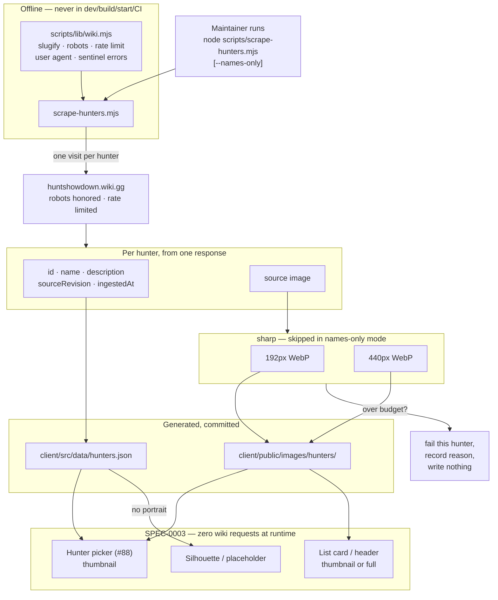

# Design: Hunter Roster Dataset

## Context

SPEC-0003 shipped loadout lists that can reference a hunter, and #100 shipped schematic silhouettes for lists whose portrait is missing. What does not exist is the roster itself — no `hunters.json`, no `scripts/scrape-hunters.mjs`, no assets under `client/public/images/hunters/`.

That gap is what still blocks the hunter picker (#88). The picker needs names to choose from; placeholder art gives it something to draw but nothing to identify.

ADR-0007 decided the shape: one script, two portrait sizes, generated-and-committed output, full roster, ethics inherited from ADR-0002 and ADR-0005. It deliberately left four things to this spec — exact dimensions, encoder, format fallbacks, and the byte budget — on the grounds that they want measurement and would otherwise force an ADR revision every time a number moves.

## Goals / Non-Goals

### Goals

- Produce the dataset SPEC-0003 already specifies consuming
- Unblock the picker with names, before any image processing exists
- Keep portrait weight defensible — this is the app's first real asset payload
- Inherit ADR-0002's ethics posture without restating or relaxing it
- Leave stored `hunterId` references valid across re-scrapes

### Non-Goals

- The picker UI itself — that is #88, consuming this
- Any runtime fetch of hunter data; the app stays offline with respect to the wiki
- Modelling in-game hunter mechanics. A hunter here is a name and a face for a list, per ADR-0006
- Scheduling. ADR-0005's open question about a backend-driven scrape applies equally here and is not answered by this spec

## Decisions

### WebP only, at 192px and 440px

**Choice**: Both sizes encoded as WebP. Thumbnail 192px wide, full size 440px wide, aspect ratio preserved, no upscaling.

**Rationale**: The dimensions are 2× the rendered sizes — the design uses 96px picker tiles and 220px list cards — so both stay crisp on high-DPI screens, which is most phones, without shipping more than that needs.

WebP is typically 25–35% smaller than PNG for photographic art at equivalent quality, and is supported by every browser this app targets. It also needs no new render-site work: `ItemThumb`'s extension chain already tries `webp`.

**Alternatives considered**:
- *WebP plus a PNG fallback per size*: rejected — four files per hunter to serve browsers this app does not target.
- *PNG, matching the 121 committed item images*: rejected — those are small flat-colour item icons where PNG is a fine choice. Hunter portraits are photographic, which is precisely the case PNG handles worst.
- *1× dimensions*: rejected — visibly soft on any retina display.

### A byte budget that fails the item rather than warning

**Choice**: 40 KB per thumbnail, 150 KB per full size. Exceeding the budget fails that hunter with a recorded reason; the oversized file is not written.

**Rationale**: A warning in a scrape log is a warning nobody reads six months later, and the failure mode it guards against — a bloated asset silently committed — is invisible in review because reviewers see a filename, not a byte count.

The numbers are anchored on what the app ships today: 121 item images, median 7 KB, max 36 KB. Portraits are photographic and legitimately heavier, but a picker grid may render dozens at once, so the *thumbnail* is the number that matters. 40 KB × 40 visible thumbnails is around 1.6 MB — high but survivable, and only on a view the user opened deliberately.

These are starting values chosen to be enforceable, not sacred. Moving them is a spec edit, which is the right amount of friction: visible, reviewed, but not an ADR revision.

### sharp, as a devDependency the app can never reach

**Choice**: `sharp`, declared in `devDependencies`, imported only by the scrape script.

**Rationale**: It is the standard choice for this job — fast, with the best resize and WebP quality of the realistic options — and it ships prebuilt binaries, so Node 20 needs no compiler. Because it runs only in a human-invoked script, its install weight never reaches users and its native binaries never enter the build.

The requirement that names-only mode work without it is deliberate: it means a contributor who cannot install native binaries can still refresh the roster.

**Alternatives considered**:
- *jimp*: pure JavaScript and therefore immune to native-binary problems, but markedly slower with lower resize quality. The immunity is worth less here than it looks, since this never runs in CI or on a user's machine.
- *No library, store as served*: reverses ADR-0007's two-size decision and ships full-resolution art into a grid rendering it small.

### Names-only mode is a first-class path, not a flag bolted on

**Choice**: The scrape can produce the complete dataset with no image processing at all.

**Rationale**: SPEC-0003's sequencing puts "scrape hunter names only" first, and the picker — the thing actually blocked — needs names, not art. Making this a real mode rather than an afterthought means the roster can land in one PR and portraits in another, and it decouples the picker from `sharp` being installable.

It also gives the byte budget somewhere to fail safely: a run that cannot meet budget still leaves a usable dataset.

### A hunter with no portrait still appears in the dataset

**Choice**: Hunters with no usable portrait are written to `hunters.json` with their id, name and description.

**Rationale**: The alternative — omitting them — would make the picker silently incomplete, and a user cannot select a hunter they cannot see. SPEC-0003 already requires consumers to render a placeholder for missing imagery, so the consuming side is ready for this; the dataset just has to not hide the hunter.

This is the same instinct as SPEC-0003's rule that a loadout referencing a deleted list degrades into Unassigned rather than vanishing: the record is the valuable thing, the imagery is decoration.

## Architecture

### Producing the dataset

### Failure isolation

Every per-hunter failure is recorded and the run continues. The distinctions that matter are between *page missing*, *portrait missing on a page that exists*, *network or rate-limit failure*, *robots disallowed*, and *over budget* — because they call for different responses. A missing page may mean the roster changed; an over-budget asset means the encoding settings need work; a robots failure means stop entirely.

Only the robots failure aborts the run, and it aborts before any hunter page is fetched.

## Risks / Trade-offs

- **Portraits are the first real asset weight in the app** → Budget enforced at write time rather than reviewed after the fact; thumbnail sized for the grid that renders many at once.
- **`sharp` is the repo's first native dependency** → devDependency only, never reachable from the build, and names-only mode works without it, so a contributor who cannot install it is not blocked from refreshing the roster.
- **The roster grows with the game** → Inherits ADR-0005's refresh problem, unanswered here. Re-running is cheap and idempotent by id, which is the mitigation available today.
- **Scraped descriptions are Crytek's prose** → Covered by the fan-content reasoning ADR-0002 established, with existing footer attribution naming both Crytek and the wiki. No new posture.
- **Byte budgets are guesses until measured against real art** → Chosen to be enforceable rather than correct. Expect to move them once the first full run reports actual sizes; that is a spec edit, deliberately more friction than a constant and less than an ADR.
- **Two sizes mean three degradation states** → Already specified in SPEC-0003, which requires falling back across sizes before reaching the placeholder. This spec only has to produce them; the consuming rule already exists.

## Migration Plan

Greenfield — nothing exists to migrate. The sequencing matters more than the migration:

1. **Names-only run.** `hunters.json` with ids, names, descriptions and provenance. No `sharp`, no assets. **This unblocks the picker (#88).**
2. **Picker built against it**, rendering the silhouettes from #100 for every hunter.
3. **Portrait run.** Assets land; the silhouettes recede to being the fallback they were always meant to be, with no render-site change.

Each step is independently useful and independently revertible. Step 3 changing nothing in the client is the test of whether steps 1 and 2 were designed correctly.

## Open Questions

- What does the wiki actually serve as a hunter's portrait — a consistent infobox image, or something that varies by page? The parser's shape depends on it, and it is the thing most likely to force a revision here.
- Are descriptions consistently present, and how long? If they are several paragraphs, the "small next to the portraits" assumption ADR-0007 made stops holding and they may want their own file after all.
- Should the scrape detect that a hunter's `sourceRevision` is unchanged and skip re-encoding its portraits? Cheap idempotence, but only worth it once a refresh cadence exists.
- Do the 40 KB / 150 KB budgets survive contact with real art, and at what WebP quality setting?
