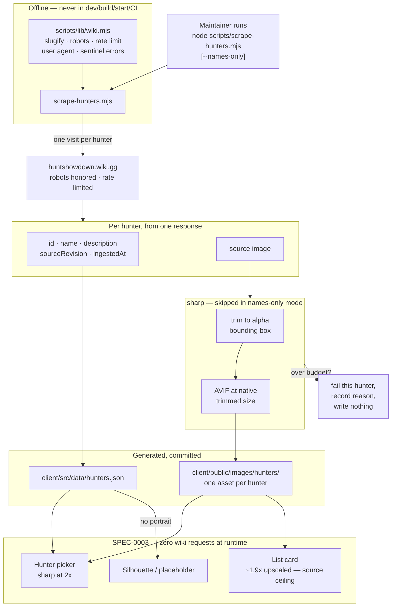

# Design: Hunter Roster Dataset

## Context

SPEC-0003 shipped loadout lists that can reference a hunter, and #100 shipped schematic silhouettes for lists whose portrait is missing. What does not exist is the roster itself — no `hunters.json`, no `scripts/scrape-hunters.mjs`, no assets under `client/public/images/hunters/`.

That gap is what still blocks the hunter picker (#88). The picker needs names to choose from; placeholder art gives it something to draw but nothing to identify.

ADR-0007 decided the shape: one script, two portrait sizes *(since amended to one — see below)*, generated-and-committed output, full roster, ethics inherited from ADR-0002 and ADR-0005. It deliberately left four things to this spec — exact dimensions, encoder, format fallbacks, and the byte budget — on the grounds that they want measurement and would otherwise force an ADR revision every time a number moves.

**Amended 2026-08-10.** Measurement eventually reached past the four numbers ADR-0007 delegated and undercut the two-size decision itself, which is why that ADR carries an amendment rather than this spec quietly diverging from it. One trimmed portrait per hunter now replaces the thumbnail/full-size pair. The decisions below are kept in the order they were made, with superseded ones marked rather than deleted — the reasoning that led here is worth more than a clean document.

## Goals / Non-Goals

### Goals

- Produce the dataset SPEC-0003 already specifies consuming
- Unblock the picker with names, before any image processing exists
- Keep portrait weight defensible — this is the app's first real asset payload
- Inherit ADR-0002's ethics posture without restating or relaxing it
- Leave stored `hunterId` references valid across re-scrapes

### Non-Goals

- The picker UI itself — that is #88, consuming this
- Any runtime fetch of hunter data; the app stays offline with respect to the wiki
- Modelling in-game hunter mechanics. A hunter here is a name and a face for a list, per ADR-0006
- Scheduling. ADR-0005's open question about a backend-driven scrape applies equally here and is not answered by this spec

## Decisions

### AVIF, at 192px and 320px — sized to what actually renders

> **Superseded 2026-08-10** by "One trimmed portrait, at native resolution" below. The dimensions here are no longer what the scrape emits. The decision is retained because its central instinct — *store what renders, not what the source happens to offer* — is what the amendment follows to its conclusion, and because the 440px rejection it records is still the right call for the right reason.

**Choice**: Both sizes encoded as AVIF. Thumbnail 192px wide, full size 320px wide, aspect ratio preserved, no upscaling.

**Rationale**: The dimensions are derived from measurement rather than from the design mock. The largest place a portrait appears anywhere in the app is a **154×220 list card**, measured in the browser at a 1440px viewport. At 2× for high-DPI that needs 308px wide; 320px gives modest headroom.

An earlier draft specified 440px, taken from the 220px card height rather than its width. For a portrait-orientation image that is roughly **twice the pixels of anything on screen** — invisible on any single asset, and across the roster a doubling of the full-size payload, which measurement has since put at 1.92 MB.

AVIF is typically 25–30% smaller than WebP at equivalent quality and is universally supported by the browsers this app targets. It needs one render-site change: adding `avif` to `ItemThumb`'s extension chain, which SPEC-0003's dataset contract now requires.

The through-line for both choices: **store what renders, not what the source happens to offer.** At one asset the difference is noise; across a 242-hunter roster it was the difference between a projected 18.9 MB and 9.5 MB.

**Alternatives considered**:
- *WebP*: rejected only on size. It was the original choice and is a perfectly good format; AVIF is simply smaller for the same quality, and the extension chain makes the switch nearly free.
- *AVIF plus a WebP fallback per size*: rejected — four files per hunter to serve browsers this app does not target, which is the same reason a PNG fallback was rejected before.
- *PNG, matching the 121 committed item images*: rejected — those are small flat-colour icons where PNG is fine. Portraits are photographic, the case PNG handles worst.
- *1× dimensions*: rejected — visibly soft on any retina display, which is most phones.
- *Keeping 440px "for headroom"*: rejected — headroom for a surface that does not exist would have roughly doubled the full-size payload on speculation. If a larger render is ever added, re-running the scrape is cheap and idempotent by id.

### A byte budget that fails the item rather than warning

> **Superseded** by "The budget is a total, not just a per-asset ceiling" below, and again on 2026-08-10 by the single per-asset ceiling. Retained for the failing-rather-than-warning principle, which still holds.

**Choice**: 40 KB per thumbnail, 150 KB per full size. Exceeding the budget fails that hunter with a recorded reason; the oversized file is not written.

**Rationale**: A warning in a scrape log is a warning nobody reads six months later, and the failure mode it guards against — a bloated asset silently committed — is invisible in review because reviewers see a filename, not a byte count.

The numbers are anchored on what the app ships today: 121 item images, median 7 KB, max 36 KB. Portraits are photographic and legitimately heavier, but a picker grid may render dozens at once, so the *thumbnail* is the number that matters. 40 KB × 40 visible thumbnails is around 1.6 MB — high but survivable, and only on a view the user opened deliberately.

These are starting values chosen to be enforceable, not sacred. Moving them is a spec edit, which is the right amount of friction: visible, reviewed, but not an ADR revision.

### The budget is a total, not just a per-asset ceiling

> **Partly superseded 2026-08-10.** The 12 MB total survives unchanged and is still the control that matters. The per-size ceilings do not: with one asset per hunter they are replaced by a single 25 KB per-asset ceiling, and the 15 KB thumbnail figure is removed rather than reassigned.

**Choice**: 15 KB per thumbnail, 25 KB per full size, and **12 MB total** across the roster. A run that would breach the total fails rather than committing a partial set.

**Rationale**: The original budgets were 40 KB and 150 KB, anchored on the 121 committed item images (median 7 KB, max 36 KB). That anchoring was sound for a single asset and meaningless in aggregate, because it was never multiplied by the roster.

The roster is **242 hunters**. At the original numbers that is 9.5 MB of thumbnails and 35.4 MB of full sizes — **44.9 MB** committed, against a repository whose entire image payload today is 1.10 MB and whose `.git` is 6.4 MB. Roughly a fortyfold increase, permanent, paid by every clone forever.

> The count this decision was made against was **~285**, taken from the wiki's roster page before a scrape existed to count properly. The scrape returned 242. The figures above are the original reasoning re-derived at the real count; the conclusion was never close enough to the ceiling for the difference to change it. Where this document once projected 52.9 MB, 22.3 MB and 11 MB, those were the same ladder computed at 285.

The per-asset numbers follow from the dimensions and encoder rather than being chosen independently: a 192px AVIF photograph and a 320px one sit comfortably inside 15 KB and 25 KB at good quality. Successive revisions moved the projection from 44.9 MB to 18.9 MB to **9.5 MB** — none of it by degrading what renders, all of it by removing pixels and bytes nothing displays.

Measurement has since undercut even that. The committed set is **2.91 MB** — 0.99 MB of thumbnails and 1.92 MB of full sizes across 484 assets — because the projection multiplied by the *ceilings* while real AVIF encodes land well inside them, at a median 4.1 KB and 7.9 KB. The ladder above is retained because it is why the budget is what it is, not a claim about what shipped.

A total ceiling is the control that actually matters here, because per-asset compliance says nothing about aggregate weight — every file can pass and the repository still gain 50 MB. Failing the run rather than warning follows the same reasoning as the per-asset rule: a total overage is invisible in any single file, so nothing in review would catch it.

**Alternatives considered**:
- *Keep the per-asset budgets and accept the total*: rejected — 45 MB of binaries is a decision, and making it by not doing arithmetic is not making it.
- *Scrape thumbnails only, defer full sizes*: viable, and was held in reserve in case the per-asset budgets proved too generous once real art was measured. Measurement made it unnecessary. Not taken because it would leave the expanded list header rendering an upscaled thumbnail, and the two-size decision in ADR-0007 exists precisely to avoid that.
- *Narrow the roster scope*: rejected — the full roster is an explicit ADR-0007 decision, and the right lever is the budget, not the coverage.

### 2.91 MB of committed assets is accepted, and both sizes are kept

> **Partly superseded 2026-08-10.** Committing the assets stands and is unaffected. "Both sizes are retained" does not — see "One trimmed portrait, at native resolution" above. The final alternative below anticipated dropping a size as "the largest remaining lever" and kept it in reserve; the amendment pulled that lever, though for a reason this decision did not foresee. It is not that the full size was too expensive, but that trimming made the two sizes nearly the same image.

**Choice**: The portrait assets are committed to the repository. Both sizes are retained.

**Rationale**: The increase over today's 1.10 MB image payload is not evidence of waste — it is proportional to content. It decomposes as **2.0× more subjects** (242 hunters against 121 items) multiplied by **1.33× more bytes per subject**, for **2.66×** overall. That second factor is two sizes instead of one times roughly three times the pixels, very largely offset by AVIF compressing photographs better per pixel than PNG compresses line art — an offset that turned out to be much stronger than this document originally assumed.

Put plainly: the existing 1.10 MB is unusually small because item icons are wide, flat, mostly-empty line art at a median 256×128. Hunter portraits are tall, dense and photographic, and still cost only 12.3 KB per hunter across both sizes against 9.3 KB per item icon. Under three times the bytes for genuinely more than twice the content, after three rounds of removing everything that was not content.

2.91 MB is an unremarkable size for a repository shipping an image-heavy web app, and committing keeps the build hermetic — no network dependency at build time, which is the price the release-artifact alternative would charge.

**Alternatives considered**:
- *Assets outside git, fetched from a release artifact at build*: rejected for now. It would keep the repository at its current size and preserve full quality, but it makes the build depend on the network and on an artifact staying available. Still viable if the repository size becomes a real problem rather than a projected one.
- *Thumbnails only, dropping the full size*: rejected. It is the largest remaining lever — the full size is 1.92 MB of the 2.91 MB — and now that the full size is 320px rather than 440px, rendering a 192px thumbnail at 154px would be only slightly soft rather than visibly pixelated. It was kept in reserve against measurement blowing the 12 MB ceiling; the committed set came in at 24% of that ceiling, so the lever stays unused and available for roster growth instead.

### One trimmed portrait, at native resolution

*Added 2026-08-10. Supersedes the two-size decision above and realizes the ADR-0007 amendment of the same date.*

**Choice**: One asset per hunter — the wiki original trimmed to the subject's alpha bounding box, encoded as AVIF at its native trimmed resolution. No second size, no downscale, no upscale, no padding back to a common aspect.

**Rationale**: Every decision above reasoned about the *canvas* and assumed it was mostly hunter. It is not. Measuring the committed set and a sample of originals settled four things at once:

- Every wiki original is **384×256 with an alpha channel** — no variation across a 12-hunter even-stride sample.
- The subject occupies about **54% of the width**. The rest is transparent padding, which the pipeline was downscaling, encoding, and shipping 242 times.
- Trimmed, the subject is **204–256px tall across all 242 hunters**.
- The list card then crops away **more than half of what was stored**, because a 3:2 source cannot fill a 0.7-aspect box.

So the softness that prompted this was never a budget problem. The bytes were going to padding, and CSS was discarding much of what remained.

Trimming changes what one asset can do. At native trimmed size every hunter clears the 192px a picker tile needs at 2× **in height (242 of 242), and 191 of 242 in width** — the 51 narrowest subjects upscale by at most 1.09× on a square tile, against 1.5× for every hunter under the padded thumbnail. The width qualification matters, and it has now been wrong twice: an early draft claimed all 242 cleared it outright (the height range quietly standing in for a two-dimensional requirement), and the correction that followed said 1.08×, a figure derived by scaling the committed 320px assets rather than measuring the 384px originals. The first real run produced a 176px floor, so the true bound is 1.09×. Meanwhile "full size" and "thumbnail" converge to 207px and 192px wide, 7% apart, and for the narrowest subjects `withoutEnlargement` emits the identical image twice. Two sizes had already stopped being two sizes; the amendment just says so.

**The result is smaller, sharper, and simpler at the same time**, which is unusual enough to state plainly: ~2.39 MB projected against 2.91 MB committed today, tiles sharp for the first time, one asset instead of two, and no size-selection rule at any render site.

**What it costs**: assets now vary in aspect between hunters, so nothing downstream may assume a uniform portrait shape. `object-fit: cover` already handles that, and it is the reason this spec no longer speaks of "preserving the source aspect ratio" — the trimmed subject *is* the aspect.

**Alternatives considered**:
- *Keep two sizes, trim both*: rejected — it stores what is very nearly the same image twice for ~4.56 MB. It also leaves the thumbnail budget with only 13% headroom (trimmed thumbs sampled at up to 13.0 KB against 15 KB) where the padded thumbs it replaces used 45%, so the budget would likely need revisiting on the next roster growth.
- *Store native untrimmed at 384px*: rejected — it keeps paying for the padding, and buys the card only 1.2× more subject resolution because the padding is what grew.
- *Pad every trimmed subject back to one aspect*: rejected — it re-introduces the exact waste the trim removes, to satisfy a layout constraint `cover` does not actually impose.
- *Crop at scrape time to the card's aspect*: rejected — smallest files of any option, but it bakes one surface's geometry into the stored asset, so any future layout change means a full re-scrape.
- *Upscale to reach the card's 440px*: rejected outright. It manufactures pixels without detail and multiplies the payload to do it.

### The trim is a pre-encode property, and two numbers were wrong

*Added 2026-08-10, after the first real run was reviewed against this spec.*

Two requirements written here failed the artifact they were meant to govern, and both failed the same way — asserted from reasoning rather than measured from output.

**The 1.08× tile bound.** Derived by scaling the committed 320px assets by 384/320 to estimate trimmed widths, which gave a 178px floor. The real run, working from the 384px originals, produced 176px — `the-rednecks-daughter` and `wight-raven` — so the true bound is 192/176 = 1.09×. A conforming run was failed by a number that was wrong by two pixels of source width.

**The transparent-border scenario.** It asserted that an emitted asset contains no fully transparent border row or column — a *post-decode* condition. 26 of 242 assets violate it while their trims are exact: lossy AVIF alpha at quality 70 zeroes an edge band the trim correctly kept. The only ways to satisfy it as written are lossless alpha or a quality chosen to pass a test, and neither buys anything visible — a transparent edge row renders exactly like the margin it replaced. The assertion now targets the rectangle selected for encoding, which is the property the pipeline actually controls.

The lesson worth keeping: a normative number derived from a projection should be marked as provisional until an artifact exists to measure, and a post-condition should be stated against the stage that owns it. Both of these were caught by review rather than by the tests, because the tests were written against the same wrong assumptions.

### The card cannot be made sharp, and the spec says so

*Added 2026-08-10.*

**Choice**: Record the 154×220 list card's ~1.9× upscale as an accepted source-resolution ceiling rather than treating it as a defect to fix in the pipeline.

**Rationale**: The card needs 440px of subject height at 2×. The wiki supplies at most 256px, and **0 of 242 hunters** reach the requirement even after trimming. No storage decision closes that gap, because the pixels do not exist upstream.

That deserves to be written down rather than left as an unexplained blur. The previous spec asserted the opposite — a scenario titled "The full size stays crisp at the largest render" — and it was wrong on arithmetic that nobody had run: it compared the asset's width against the card's width while `object-fit: cover` was cropping the asset to 47% of that width first. A future reader who notices the softness deserves to find the ceiling documented, not to re-derive it.

The gap is closable, but only in SPEC-0003: rendering the card's portrait area at **≤113px tall** would bring the card in line with the others, leaving the picker tile's bounded 1.09× as the only residual upscale anywhere. That is a visual redesign of the poster card the design handoff specifies, and it was declined as out of scope for a pipeline amendment.

### sharp, as a devDependency the app can never reach

**Choice**: `sharp`, declared in `devDependencies`, imported only by the scrape script.

**Rationale**: It is the standard choice for this job — fast, with the best resize quality of the realistic options, and AVIF encoding built in — and it ships prebuilt binaries, so Node 20 needs no compiler. Because it runs only in a human-invoked script, its install weight never reaches users and its native binaries never enter the build.

The requirement that names-only mode work without it is deliberate: it means a contributor who cannot install native binaries can still refresh the roster.

**Alternatives considered**:
- *jimp*: pure JavaScript and therefore immune to native-binary problems, but markedly slower with lower resize quality. The immunity is worth less here than it looks, since this never runs in CI or on a user's machine.
- *No library, store as served*: rejected. Under the 2026-08-10 amendment the scrape no longer resizes, which might look like it no longer needs an image library — but it still has to read the alpha channel to find the subject's bounding box, trim to it, and re-encode PNG as AVIF. Storing as served would ship 60 KB PNGs carrying 46% transparent padding, which is worse on every axis than the pipeline it would replace.

### Names-only mode is a first-class path, not a flag bolted on

**Choice**: The scrape can produce the complete dataset with no image processing at all.

**Rationale**: SPEC-0003's sequencing puts "scrape hunter names only" first, and the picker — the thing actually blocked — needs names, not art. Making this a real mode rather than an afterthought means the roster can land in one PR and portraits in another, and it decouples the picker from `sharp` being installable.

It also gives the byte budget somewhere to fail safely: a run that cannot meet budget still leaves a usable dataset.

### A hunter with no portrait still appears in the dataset

**Choice**: Hunters with no usable portrait are written to `hunters.json` with their id, name and description.

**Rationale**: The alternative — omitting them — would make the picker silently incomplete, and a user cannot select a hunter they cannot see. SPEC-0003 already requires consumers to render a placeholder for missing imagery, so the consuming side is ready for this; the dataset just has to not hide the hunter.

This is the same instinct as SPEC-0003's rule that a loadout referencing a deleted list degrades into Unassigned rather than vanishing: the record is the valuable thing, the imagery is decoration.

## Architecture

### Producing the dataset

No size selection appears anywhere in that graph. One asset leaves the scrape and the same asset serves every consumer — which is the whole of the 2026-08-10 amendment expressed structurally.

### Failure isolation

Every per-hunter failure is recorded and the run continues. The distinctions that matter are between *page missing*, *portrait missing on a page that exists*, *portrait present but unusable*, *network or rate-limit failure*, *robots disallowed*, and *over budget* — because they call for different responses. A missing page may mean the roster changed; an over-budget asset means the encoding settings need work; a robots failure means stop entirely.

*Portrait present but unusable* was added 2026-08-10 with the trimming requirement: a source whose alpha is zero at every pixel has no subject bounding box to trim to. It is kept separate from *portrait missing* because the two send a maintainer in opposite directions — one says the wiki has no art for this hunter, the other says the art is there and this pipeline cannot consume it. Merging them would be the same mistake as a generic failure mode, one level down.

Only the robots failure aborts the run, and it aborts before any hunter page is fetched.

## Risks / Trade-offs

- **Portraits are the first real asset weight in the app** → Budget enforced at write time rather than reviewed after the fact. Since 2026-08-10 the single trimmed asset is sized by its subject rather than by any surface, and the grid that renders many at once relies on SPEC-0003's lazy loading rather than on a smaller file.
- **`sharp` is the repo's first native dependency** → devDependency only, never reachable from the build, and names-only mode works without it, so a contributor who cannot install it is not blocked from refreshing the roster.
- **The roster grows with the game** → Inherits ADR-0005's refresh problem, unanswered here. Re-running is cheap and idempotent by id, which is the mitigation available today.
- **Scraped descriptions are Crytek's prose** → Covered by the fan-content reasoning ADR-0002 established, with existing footer attribution naming both Crytek and the wiki. No new posture.
- **Byte budgets are guesses until measured against real art** → Chosen to be enforceable rather than correct. Expect to move them once the first full run reports actual sizes; that is a spec edit, deliberately more friction than a constant and less than an ADR.
- **~~Two sizes mean three degradation states~~** → Removed 2026-08-10. With one asset the ladder has two rungs — portrait, then placeholder — and SPEC-0003's cross-size fallback rule has nothing left to order. The risk retired along with the second size.
- **Variable aspect ratios could surprise a render site that assumes uniformity** → `object-fit: cover` is already used at every portrait surface and is aspect-agnostic, so nothing breaks today. The exposure is a future render site written against the old assumption; the spec states the variability explicitly for that reader.
- **The card stays visibly soft, and the amendment does not fix it** → Accepted and documented as a source-resolution ceiling rather than left as an unexplained blur. The risk is that a future reader reads the softness as a regression introduced here; the spec and ADR both record that 0 of 242 hunters can satisfy the card and that closing it is a SPEC-0003 design change.
- **A re-scrape is required before any of this is true on disk** → The committed assets remain two-size and padded until someone runs the scrape. Until then the spec describes a pipeline the repository does not have, which is why the amended requirements are marked *not yet implemented* rather than silently rewritten.

## Migration Plan

**This section was greenfield and is no longer.** All three steps below have executed: the dataset, the scrape script, 484 committed assets and the picker all exist. The original sequence is kept at the end as history, because whether it was designed correctly is now answerable — it was, and step 3 landing with no render-site change is the evidence.

The live migration is the 2026-08-10 amendment, and it is not additive. It changes what is on disk and what the client asks for, so the steps are ordered to avoid a window where the two disagree:

1. **Amend SPEC-0003's consumption contract** — done in the same commit as this spec. Nothing renders differently yet; the contract simply stops requiring two sizes.
2. **Re-scrape**, emitting one trimmed asset per hunter and deleting stale `-thumb` variants in the same run. The 242 orphans are not left for a later cleanup: a scrape that leaves them makes the payload scenarios unfalsifiable.
3. **Collapse the size selection in the client** — remove the `size` argument from the portrait render path and its call sites, and replace the cross-size fallback tests with the two-rung ladder. This is what SPEC-0003's amended contract requires, and it cannot land before step 2 without pointing every surface at a file that has not been rebuilt.

**Rollback**: steps 2 and 3 revert together. Reverting step 3 alone leaves the client asking for `-thumb` assets the re-scrape deleted, which is the one ordering that actually breaks — worth stating because the natural instinct is to revert the client first.

**Original greenfield sequence, for history:** names-only run unblocks the picker → picker built against it, rendering #100's silhouettes → portrait run lands assets with no render-site change.

## Open Questions

- ~~What does the wiki actually serve as a hunter's portrait — a consistent infobox image, or something that varies by page?~~ **Resolved by measurement (2026-08-10).** Entirely consistent: every original is **384×256 PNG with alpha**, 41–69 KB, across an even-stride sample of the roster. The variation is not in the canvas but in where the subject sits inside it — trimmed subjects run 176–333 wide and 205–256 tall (measured on the emitted set; an earlier estimate of 178–334 was scaled from the committed 320px assets rather than the originals). That consistency is what made the trim amendment safe to specify as a rule rather than as a per-hunter heuristic, and this question turning out to have a boring answer is exactly why it was worth asking.
- Are descriptions consistently present, and how long? If they are several paragraphs, the "small next to the portraits" assumption ADR-0007 made stops holding and they may want their own file after all.
- Should the scrape detect that a hunter's `sourceRevision` is unchanged and skip re-encoding its portraits? Cheap idempotence, but only worth it once a refresh cadence exists.
- ~~Do the 15 KB / 25 KB per-asset budgets survive contact with real art, and at what AVIF quality setting?~~ **Resolved by the scrape.** They survive with wide margin: across 242 hunters the largest thumbnail is 6.7 KB against the 15 KB ceiling and the largest full size 14.9 KB against 25 KB, medians 4.1 KB and 7.9 KB. The 12 MB total was never approached — the committed payload is 2.91 MB, 24% of it.
- ~~Progression hunters appear as Rookie / Survivor / Veteran variants of the same character. Are those three dataset entries or one entry with three assets?~~ **Resolved by the scrape: three entries**, as assumed. Ten characters have all three variants, for 30 of the 242 entries. One wrinkle the assumption did not anticipate — a family's variants do not share an `acquisition`. Survivor and Veteran are `progression` for nine of the ten families, while the matching Rookie is `bloodline`, `prestige` or `story-challenge`. Any picker grouping by acquisition therefore scatters a single character's own variants across buckets, which is a point in favour of name search over classification filtering as the primary affordance (see SPEC-0003's design).
