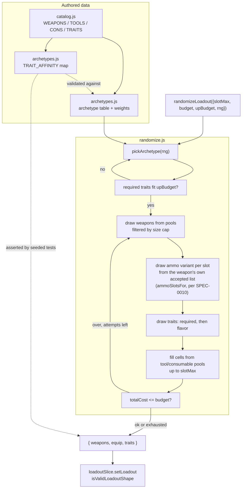

# Design: Loadout Randomization

## Context

> **Staleness note, added 2026-08-17 per `/sdd:audit`.** This section's numbers and line citations
> were accurate when written and have drifted since, in some cases for the third time — `spec.md`'s
> own copies of these same citations were corrected twice (2026-08-13 and again after #344) and this
> design doc's were never touched either time. The paragraphs below are left as written, historically,
> rather than silently updated: `TRAITS` now holds 58 entries, not 32; the trait draw is at
> `randomize.js:36-58` and the weapon draw at `randomize.js:60-72`, not `:18-27`/`:30-37`;
> `itemStats.json` now holds 270 records, not 122, and ammo compatibility for weapons is a per-weapon
> scraped `ammo.accepted` list (SPEC-0010), not `AmmoType` alone. The underlying argument this section
> makes — sampling order prevents any pairing rule from having a weapon to consult — is unaffected by
> any of these numbers changing, which is presumably why nobody noticed. Re-run `/sdd:spec --update`
> for a proper refresh rather than trusting the specific figures below.

The "Random loadout" button in `ActionsPanel.jsx` dispatches `randomizeThunk`, which calls `randomizeLoadout` in `client/src/utils/randomize.js`. That function samples each part of a build independently: three traits drawn uniformly from all 32 entries in `TRAITS`, then two weapons drawn uniformly from whatever fits the size cap, then equipment from a 50/50 tool-vs-consumable coin flip bounded by a 60-iteration guard.

The ordering is the defect. Traits are chosen at `randomize.js:18-27`, weapons at `randomize.js:30-37`. A trait cannot consult a weapon that does not exist yet, so there is no point in the current pipeline where a pairing rule could be evaluated even if one were written. This is why ADR-0010 treats the fix as a restructure rather than an added rule set.

Two constraints shape everything below. First, the affinity knowledge is not in any dataset the project has: the 122 records in `itemStats.json` carry numeric infobox fields plus `AmmoType`/`Size` for weapons and `Cost`/`Unlock`/`Category`/`Type` for traits — nothing marks a weapon single-action or lever-action, and nothing states a trait's weapon conditions. Second, the output contract is fixed by `isValidLoadoutShape` in `loadoutSlice.js` and cannot move without touching the codec and the saved-loadout API.

Related artifacts: ADR-0010 (the governing decision), SPEC-0007 (the catalog id contract these pools depend on), SPEC-0006 (the sparse grid this spec is written to be neutral about), ADR-0009 (the grid model behind SPEC-0006).

## Goals / Non-Goals

### Goals

- Make incoherent trait/weapon pairings unrepresentable rather than detectable
- Make the coherence property assertable in CI, which requires the generator to be seedable
- Give the dollar and UP budgets a principled degradation order instead of a blind retry loop
- Keep the archetype table reviewable by a Hunt player who does not read JavaScript
- Leave `{ weapons, equip, traits }`, the codec, and every saved loadout untouched

### Non-Goals

- Deriving affinity from the wiki. ADR-0010 considered and deferred it; it is a scraper project first
- Simulating game balance. An archetype encodes "these things go together", not "this build is strong"
- Changing the picker, the Random loadout button, or any UI surface
- Implementing SPEC-0006's sparse grid, or waiting for it
- Exposing seeds to users. Seedability is a testability requirement here; a "share this roll" feature is a downstream possibility, not a deliverable

## Decisions

### Archetype pools live in their own module

**Choice**: A new `client/src/utils/archetypes.js` holds the archetype table and the trait-affinity map. `randomize.js` imports it and contains only generator mechanics.

**Rationale**: The table is game knowledge and will be corrected far more often than the generator is. Keeping it in a separate file means a correction is a data edit reviewable by someone who plays Hunt, and it keeps the generator's diffs about generation.

**Alternatives considered**:
- *Tags on catalog tuples*: `catalog.js` entries are positional arrays (`[id, name, size, cost, ammoClass, group]`); adding a slot touches every consumer that destructures them, and spreads one coherent table across 350 lines of data.
- *Inline in `randomize.js`*: mixes a frequently-corrected data table with rarely-changed logic and makes review harder for exactly the people best placed to catch errors.

### Affinity is a trait → id-set map, separate from archetypes

**Choice**: A `TRAIT_AFFINITY` map declares which catalog ids make a conditional trait live. Archetypes reference traits; the map answers "is this trait satisfied by this build". Traits absent from the map are unconditional.

**Rationale**: It gives the coherence requirement a computable predicate, which is what makes the contract testable rather than aspirational. It also separates the two failure modes: an archetype whose pools cannot satisfy its own required traits fails validation at build time, while a generated build that carries an unsatisfied trait fails a seeded test. Without the map, both collapse into "the table looks wrong".

The map's *contents* are a data question, not an architecture question. Initial membership — Fanning against single-action pistols, Levering against the lever-action Winfields, Bolt Thrower against bows and crossbows, Pitcher against throwables — needs review by someone who plays the game, and errors there are corrections rather than redesigns.

**Alternatives considered**:
- *Encode affinity implicitly in archetype pools*: the pools would carry the knowledge but nothing could assert it, so a mistake in a pool would produce exactly the incoherent build the capability exists to prevent, silently.

### The wildcard archetype is a first-class member of the table

**Choice**: `wildcard` draws from the full catalog and is exempt from the required-trait contract. It carries a selection weight like any other archetype.

**Rationale**: Archetypes can only produce builds someone anticipated, which is the mirror-image failure of uniform sampling. `wildcard` keeps the long tail reachable, gives newly added catalog items a way to appear before anyone assigns them to a pool, and makes today's behavior one outcome rather than deleted behavior. Its weight is the single knob that trades variety against coherence.

**Alternatives considered**:
- *Archetypes only*: turns the randomizer into a build picker and makes every catalog addition a prerequisite edit to the table.
- *Fall back to wildcard only on failure*: reachability of the long tail would then depend on how often other archetypes fail, which is not a property anyone can reason about.

### Randomness is a parameter, not a module-level seeded generator

**Choice**: `randomizeLoadout` takes `rng` defaulting to `Math.random`; tests pass a seeded PRNG (mulberry32 or equivalent — small, dependency-free, adequate for build variety).

**Rationale**: Injection keeps the production path identical to today's and leaves `thunks.js:11` unchanged. A module-level seeded generator with a `setSeed` export would make tests order-dependent and leak test-only state into the production module.

**Alternatives considered**:
- *Mock `Math.random` in tests*: works, but silently couples every test to the exact number and order of internal draws, so any refactor of the generator breaks tests that are not about the refactor.

### The budget search re-draws within the archetype; the UP cap re-selects it

**Choice**: The dollar budget re-draws inside the already-chosen archetype for a bounded number of attempts, returning the cheapest attempt if none lands. The UP cap is handled at selection time: if an archetype's required traits do not fit, a different archetype is chosen, falling back to `wildcard`.

**Rationale**: The two budgets fail differently. Dollar cost is mostly a function of *which* items were drawn, so re-drawing within the archetype converges — the archetype stays affordable in principle, only the draw was expensive. UP cost is a function of the archetype's identity: the required traits are fixed, so re-drawing cannot help and truncating the required list produces exactly the incoherent build this capability prevents. Exchanging the archetype is the only move that preserves the contract.

**Alternatives considered**:
- *Re-select the archetype on dollar-budget failure*: a low budget would then bias output toward whichever archetypes happen to be cheap, collapsing variety precisely when the user has constrained the build.
- *Drop required traits to fit UP*: violates the required-trait contract by construction.

### Equipment fill is a bounded draw, not a guarded loop

**Choice**: Fill computes how many cells it will occupy and draws that many from the archetype's pools, shrinking the result when the pools cannot supply enough. No iteration guard.

**Rationale**: The current `EQUIP_FILL_GUARD = 60` exists because the loop can spin on rejected draws — a duplicate tool, a consumable at its cap — and it can exit early, under-filling the grid for reasons unrelated to what the build wanted. A guard that can silently truncate output is indistinguishable from a bug when it fires.

## Architecture

The two dotted edges are where the coherence contract is enforced: the affinity map validates the archetype table at build time, and validates generated output under seeded tests. Neither is a runtime check in the production path.

## Risks / Trade-offs

- **The archetype table drifts behind the catalog.** A weapon added by a game update belongs to no pool until someone adds it → `wildcard` keeps it reachable immediately, and a coverage test can report which catalog ids appear in no archetype pool, turning drift into a visible number rather than a silent gap.
- **Variety narrows.** Archetypes only produce anticipated builds → `wildcard`'s weight is the tuning knob, and the variety requirement puts a floor under it that CI can measure.
- **The affinity map encodes game rules that change.** Crytek can alter which weapons a trait applies to → the map is small, data-only, and in one file; a balance patch is a data edit, and a wrong entry degrades build quality rather than breaking the app.
- **Seeded tests can over-fit the generator's internals.** Asserting exact builds for exact seeds would break on any refactor → tests assert *properties* (required traits satisfied, caps honored, payload valid) across seeds, with equality assertions reserved for the reproducibility requirement alone.
- **This is a rewrite, not an extension.** The existing invariants in `randomize.test.js` — First Aid Kit by stable id, no duplicate tools, four-copy consumable cap — can be lost by accident → they are restated as requirements here so they are carried forward deliberately.
- **The UP re-selection loop could fail to terminate** if no archetype fits a very low `upBudget` → `wildcard` has no required traits, so it always fits and always terminates the loop.

## Migration Plan

`randomize.js` is replaced in place; no data migration is needed because no generated build is persisted at generation time. A saved loadout is saved by the user through the existing path after generation, in the existing format.

Sequencing:

1. Add `archetypes.js` with the table, the affinity map, and validation, plus its coverage tests. This lands independently and touches nothing.
2. Add the `rng` parameter to `randomizeLoadout` with its `Math.random` default, and route the existing draws through it. Behavior is unchanged; the existing tests still pass; seeded tests become possible.
3. Replace the generator body with the archetype pipeline, carrying forward the four existing invariants.

Rollback is reverting the generator; steps 1 and 2 are additive and safe to leave in place.

## Open Questions

- What is the initial archetype set, and what are its weights? ADR-0010 sketches five plus `wildcard` (long-range sniper, shotgun brawler, dual-pistol fanning, bow/stealth, utility support); the real list is a game-knowledge decision.
- Should `wildcard` builds be exempt from the required-trait contract, as specified here, or should they simply carry no required traits and thus satisfy it vacuously? The observable behavior is identical; the difference is whether the test suite special-cases it.
- Does the trait-affinity map belong to this capability at all, or to SPEC-0007 as catalog metadata? It is game data about catalog items, which argues for the catalog; it exists only to serve generation today, which argues for here.
- ~~SPEC-0006's Overview states the consumable cap is four per *category* (`CONS[i][3]`). That is now stale — `consCount` in `calc.js` counts per specific consumable, and this spec follows the code. SPEC-0006 needs a correction independent of this capability.~~ ~~**Resolved — the correction landed in #207** (`docs(spec-0006): state the consumable cap per item, not per type`), before this spec was approved. SPEC-0006's Overview now states the cap as four copies of one *specific* consumable and records `type` as descriptive rather than a rules input, which is what this spec assumed. Kept struck rather than deleted so a reader of the linked issues can see the question was asked and answered rather than dropped.~~

  **Re-opened and reversed 2026-08-12** (per [ADR-0015](../../../adrs/ADR-0015-consumable-cap-per-type.md)). **SPEC-0006's original text was right and #207 corrected it into error.** The full sequence is worth keeping visible, because it is a case of the corpus talking itself out of a correct statement: SPEC-0006 stated the cap per *category*; this design note called that stale on the grounds that `consCount` counts per item and "this spec follows the code"; #207 then edited SPEC-0006 to match the code. At no point did anything check the code against the game. Update 2.8 caps consumables at four per type, confirmed by an in-game Arsenal observation on 2026-08-12, so the category reading SPEC-0006 started with was correct all along.

  The lesson this note now records is narrower than the rule: *"this spec follows the code"* is a reasonable tie-break between two documents, and a bad one between a document and the game. `consCount`'s per-item behaviour was evidence of what the app did, never of what the app should do. SPEC-0006, SPEC-0007 and this spec have all been updated to the per-category rule, and the requirement here is now phrased against the reducer's predicate rather than naming `consCount`, so a future divergence between generator and builder cannot be resolved by following the implementation again.
