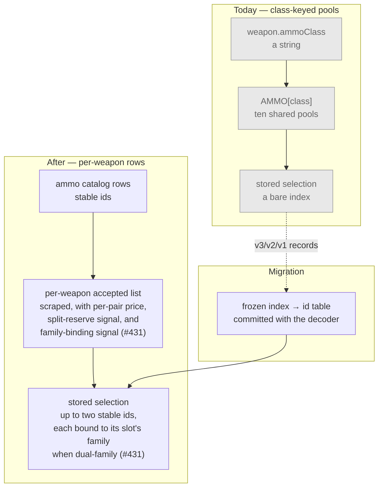
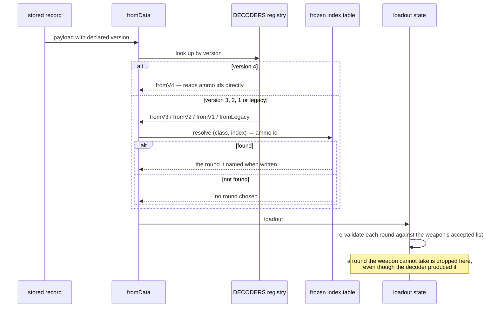

# Design: Per-Weapon Ammo Compatibility, Pricing and Slots

## Context

This is the largest data change the project has attempted, and the reason is that the current model
is wrong in three independent ways at once rather than in one fixable way.

`AMMO` is ten shared pools keyed by a weapon's `ammoClass` string. The shape asserts that every
weapon in a class is offered every round in the class, at one price, and holds one round at a time.
A diff of all 140 non-melee catalog rows against their own pages found **137 of 140 wrong** in at
least one direction: 243 rounds offered that a weapon cannot take, 147 it can take that the app
cannot express. That is not a data-entry backlog. A class-keyed pool cannot represent the truth no
matter how carefully its rows are corrected, which is what makes this a model change.

Three failures compound it:

- **Stored selections are bare indices**, so any pool edit silently re-points them. `catalog.js`
  records the Frontier 73C incident — a corrected `ammoClass` turned a saved Spitzer into a High
  Velocity, no error, no warning. SPEC-0007 gates pool reordering behind a version bump precisely
  because of this, which means the current model taxes every future data correction.
- **Seven weapons are dual-family** and a single class field names one of the two. The Drilling is
  typed to its *secondary* family today; the LeMat and Haymaker to their primary. This is the one
  that shows up as a user-visible wrong answer while looking correct in a diff: the LeMat's catalog
  class and its page's infobox agree, because both name the same half.
- **A weapon may carry two rounds.** 32 rows carry a per-slot reserve; nothing in the app expresses
  the second slot.

**Sequencing.** SPEC-0009 takes wire format version 3 for the dual-wield flag; this takes version 4.
That was decided in ADR-0023 rather than here, and the reasoning is recorded there: sharing one bump
would have sequenced dual-wielding behind this entire capability. The two compose — a version-4
weapon entry carries the pair flag SPEC-0009 introduced alongside the ammo ids this spec introduces.

**Scope.** Ammo imagery is ADR-0020 and is deliberately excluded. It is gated on this decision
because it needs the round entity this creates, and folding it in would roughly double both the spec
and the plan for no sequencing benefit.

## Goals / Non-Goals

### Goals

- Make the 243 phantom offers and 147 missing ones structurally impossible rather than corrected.
- Retire the bare-index hazard outright, rather than continuing to gate it behind version bumps.
- Make dual-family weapons and per-slot pricing representable at all.
- Settle ADR-0013's two live violations inside the ammo data in the same pass.
- Migrate every existing record without a single selection changing which round it names.

### Non-Goals

- **Ammo imagery** — ADR-0020, gated on this, specced separately.
- **The 1,268 stat-change deltas** in the same source sections. They are keyed on (weapon, round) and
  will want the key this creates, but they belong to ADR-0019's stat-block work.
- **Redesigning the picker.** Two ammo controls interact with the picker-scale problem in #248; this
  spec adds the second control and does not solve the scale question.
- **Deleting `ammoClass`.** It survives as a label with no authority. Whether to remove it entirely
  is an open question, not a goal.

## Decisions

### Ammo becomes catalog rows with stable ids

**Choice**: Rounds are ordinary catalog entities with slug ids, referenced by id everywhere.

**Rationale**: The bare-index hazard is not a bug to fix but a property of positional references.
Every other catalog category — weapons, tools, consumables, traits — moved to stable ids for exactly
this reason, and the wire format already references them that way. Ammo is the last positional
reference in the format. Retiring it makes the Frontier 73C class of incident impossible rather than
gated, and it removes the version-bump tax SPEC-0007 currently levies on every ammo data correction.

**Alternatives considered**:
- *Keep indices, gate edits harder*: rejected. It preserves the hazard and taxes all future data work.
- *Reference rounds by display name*: rejected. Names are user-visible and get corrected — the
  Winfield-to-Ranger rename would have broken every saved selection.

### Compatibility comes from the page section, not category membership

**Choice**: Parse each weapon page's own ammo section. Use category tags only to flag pages for
review.

**Rationale**: Categories look like the cheaper lookup and agree with the section on 138 of 147
pages — but the nine failures are not random. They cluster on bolt and charge weapons: the Crossbow,
Hand Crossbow and Chu Ko Nu are categorised under the *rifle* round name, so a category-keyed source
maps the Crossbow's Explosive Bolt onto Long Explosive Ammo. That is the exact conflation the source
warns about and that `catalog.js` avoided by hand. Category tags are also applied manually and lag.

**Alternatives considered**:
- *Categories as primary, section as fallback*: rejected. The nine failures are silent — a
  category-keyed reader produces a plausible wrong answer, not an error, so the fallback never fires.

### Price is stored per pair, never computed

**Choice**: Every (weapon, round) price is stored.

**Rationale**: 13 of 46 (class, round) groups vary across weapons. A family-local doubling does exist
where a sibling loses its two-slot split — six round-pairs, no exceptions — and it is tempting as a
compression. But it predicts *the doubling*, never *the base figure*: the 1890 Cavalry and the
Martini-Henry are both Long and both two-slot and charge 60 and 30 for FMJ, each half of its own
price. A computed price would be wrong for both. This also follows SPEC-0007's existing rule that
budget-affecting attributes are stored, never inferred.

### Slot count is read, not derived from action type

**Choice**: A weapon's ammo slot count comes from its per-slot signal.

**Rationale**: The action-type prose looks like the rule — 28 of 32 per-slot rows are Single-Shot by
the source's own definition — but the four Berthier 1892 rows are bolt-action carbines that split
anyway. A derivation would be right 28 times and wrong 4 times, silently. This is the same shape as
the dual-wield discriminator in SPEC-0009: a property that *nearly* falls out of another column, and
does not.

**Amended 2026-08-16 in #431**: "its per-slot signal" turned out to be two signals sharing one field,
not one. A second slot comes from either the "(N per slot)" marker (split reserve, always one family)
or the reserve's family-marking slash (dual-family, one slot per barrel) — see "Dual-family slots are
bound to their family" below. Reading only the "(N per slot)" marker undercounts a dual-family
weapon whose reserve carries the slash without that marker. The scraper now records both as separate
observations (spec REQ "The Scrape Observes and Does Not Decide"); which mechanism applies is decided
downstream, from those two recorded fields, not folded into one boolean at the source.

### Dual-family slots are bound to their family

**Choice**: A dual-family weapon's two slots each accept rounds from exactly one of its two families.
The weapon's whole accepted-round list (the union of both) is what the "which rounds can this weapon
take at all" requirement uses; it is not what either slot individually offers.

**Rationale**: The spec originally modelled slot count and family membership as independent
properties — a weapon declares its accepted-round list, and each slot draws from that list
independently. For the seven dual-family weapons that is wrong: the Drilling's list is Medium ∪
Shells, and two independently-drawn slots can both land on Medium, leaving no Shell — a build the game
refuses (the Drilling has a rifle barrel and a shotgun barrel; you choose one round for each, not two
from either). Raised from the live game, not the wiki: *"You can select only one ammo for the rifle
and one for the shotgun."* This is the ammo-side sibling of #353 — a decoder that enforces shape but
not rules — except here the flaw was in the *spec's* model, not an implementation gap, so it is fixed
before Part B's scraper (#341) commits to a shape that cannot express the binding.

**Alternatives considered**:
- *Leave slots unbound, validate at the reducer boundary instead*: rejected. The same problem SPEC-0009
  already solved for equipment — "no decoder enforces any equipment rule" — recurs if slot binding is
  left to a downstream check rather than stated as what a slot's accepted list *is*. A validator can be
  forgotten per write path; a per-slot accepted list cannot be bypassed by construction.
- *Give each dual-family weapon two separate `ammoClass`-shaped fields instead of one bound-slot
  model*: rejected. It would special-case the seven dual-family rows against the one-slot and
  split-reserve shapes the rest of the catalog uses, multiplying the decoder and control logic by
  weapon type rather than by slot.

### The migration uses a frozen table, not the live catalog

**Choice**: Legacy index resolution reads a frozen index-to-id table committed with the decoder.

**Rationale**: Resolving a stored index against the *current* catalog is precisely the bug — the
catalog moves, and the Frontier 73C incident is what that looks like. The table must be a snapshot
of what the pools contained when those records were written. The codec already uses this pattern for
retired trait identifiers, so it is a known shape rather than an invention.

An unresolvable index decodes to "no round chosen" rather than throwing or guessing. A missing round
is visible and recoverable; a wrong round is neither.

### `ammoClass` survives without authority

**Choice**: Keep the field as a display grouping; no code path that decides compatibility, price or
slot count reads it.

**Rationale**: A deliberately unglamorous outcome. Deleting it is a wider diff touching the picker's
grouping, and keeping it costs nothing as long as its authority is removed rather than merely
reduced. The risk is that "grouping label" quietly becomes "fallback" the next time someone needs a
default — which is why the requirement is written as a prohibition on reading it, not a description
of its new role.

## Architecture

The change is a replacement of one seam, and the affected surface is wide because everything that
touches ammo touches that seam.

The decode path is where the migration risk concentrates, and the shape below is what makes it
assertable rather than hopeful:

The last step matters for the same reason it did in SPEC-0009: the decoder's job is to read the
format, not to know the catalog. Compatibility is enforced where the loadout enters state, so a
hand-edited share URL cannot smuggle a pair the data forbids.

## Risks / Trade-offs

- **This is the most invasive wire-format change the project has made.** Every stored loadout, every
  localStorage draft and every share URL in circulation is affected. → The frozen-table migration is
  the mitigation, and requirement 9's round-trip assertion is what proves it. Nothing else in the
  spec matters if that one is weak.
- **A wrong migration is silent.** A re-pointed selection looks like a valid loadout. → Assert
  round-trip identity per legacy record, not merely that decoding succeeds. "Does not throw" is not
  the property under test.
- **The dataset grows, and by an unmeasured amount.** A per-pair shape is new to a file that is
  per-item throughout. → Recorded as an open question; measure before choosing a file layout, because
  the stat-change deltas will want the same key and doubling back is expensive.
- **Two ammo controls on an interface with room for one.** → The accessibility requirements are
  written as requirements rather than left to implementation; the picker-scale interaction is #248's
  problem and is explicitly not solved here.
- **`ammoClass` becomes a field with no authority**, which is an easy thing to quietly re-empower. →
  The requirement is phrased as a prohibition on reading it from any deciding path, which is testable,
  rather than as a description of its reduced role, which is not.
- **Ordering against SPEC-0009.** Version 4 assumes version 3 shipped. → If dual-wielding slips, this
  capability takes version 3 instead and SPEC-0009 takes 4; the specs are independent in content and
  only the numbers move. Say so at plan time rather than discovering it in a decoder.
- **A spec-level defect can ship as a data-model defect if caught late.** #431 found this one before
  #341's scraper committed to a shape — modelling slot count and family membership as independent let
  the spec itself permit a Drilling holding two Medium rounds and no Shell, a combination the game
  refuses. → Caught here because it was checked against the *seven affected rows* before any code
  existed to check against, not after. The same class of gap — a requirement that composes legally on
  paper into an illegal state — is worth the same per-row check on any future spec touching these
  seven weapons.

## Migration Plan

Not greenfield. Records exist at versions 3, 2, 1 and unversioned legacy, and this spec adds a fourth.

1. **Freeze the table first.** Capture the current pool contents as an index-to-id snapshot and commit
   it. This must happen before any pool is touched — once the pools change, the mapping the existing
   records depend on is unrecoverable from the repository.
2. **Land the ammo rows and the per-weapon lists** as data, with nothing reading them yet. Inert.
3. **Server accepts version 4.** Element count and the ammo element's *type* both change; deploy
   before any client emits it, exactly as SPEC-0009 requires for version 3.
4. **Decoder for version 4, plus legacy resolution** through the frozen table. Still nothing writes
   version 4.
5. **Switch the readers** — compatibility, price and slot count all move to the per-weapon list in one
   change, because a UI offering rounds the pricer cannot price is worse than either alone.
6. **Raise the version and encode ids.** After this, saves carry version 4.
7. **Second ammo control** last, once two slots are representable end to end.

**Rollback.** Steps 4–7 revert cleanly. Step 3 should not be reverted while version-4 records exist.
Step 1 must never be reverted — the frozen table is the only record of what the indices meant.

**The ordering repeats a lesson this project has already paid for twice**: SPEC-0003's derived-name
work and SPEC-0009 both carry a server-before-client constraint, and shipping a client format the
deployed server rejects fails every save at once.

## Open Questions

- Is a two-slot purchase priced as one transaction or two? This spec requires per-slot pricing
  because it is the shape that survives an empty slot; if the game charges once for both, the pricing
  requirement changes.
- Does `ammoClass` earn its keep once nothing reads it for rules? Deleting it may be smaller than
  maintaining a field whose only job is grouping the picker.
- How much larger does the generated dataset get, and does the per-pair shape belong in the same file
  as the per-item stats or beside it? The stat-change deltas will want the same key.
- Do the nine category-vs-section disagreements need individual review before the scrape runs, or is
  flagging them at scrape time sufficient?
