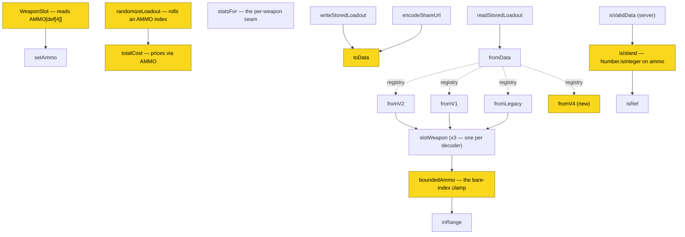

# SPEC-0010: Per-Weapon Ammo Compatibility, Pricing and Slots

## Overview

This capability replaces the shared ammo pools with per-weapon ammo. It realizes
[ADR-0014](../../../adrs/ADR-0014-per-weapon-ammo-compatibility-and-slots.md).

Ammo today is ten shared pools of `[name, price]`, and each weapon points at one through a single
`ammoClass` string. Three assumptions are baked into that shape — every weapon in a class is offered
every round in the class, at one price, and holds exactly one round at a time. All three are false.
A diff of all 140 non-melee catalog rows against their own wiki pages found the app offering **587**
(weapon, round) pairs where the wiki lists **491**: **243 rounds a weapon cannot take**, and **147 it
can take but the app cannot express**. **137 of 140 weapons are wrong in at least one direction.**

Three consequences of the pool model, each of which this spec closes:

- **A saved selection is a bare index.** Inserting, removing or reordering a pool silently re-points
  every stored selection — the Frontier 73C incident, where a corrected `ammoClass` turned a saved
  Spitzer into a High Velocity with no error.
- **Seven weapons are dual-*family*** — Drilling (+Hatchet, Shorty), LeMat (+Carbine, Carbine
  Marksman) and Haymaker each mix a core family with Shells. A single `ammoClass` names one of the
  two, so the app types the Drilling to its *secondary* family and the LeMat to its primary.
- **A weapon may carry two rounds at once**, and the listed price buys one slot. 32 catalog rows
  carry a `"(N per slot)"` reserve; nothing in the app can express the second slot.

**Ammo imagery is deliberately out of scope.** ADR-0020 gives ammo an image tier and is gated on
this decision — it needs the round entity this spec creates. It gets its own spec once this lands.

## Requirements

### Part A — Ammo Becomes a Catalog Entity

### Requirement: Ammo Rows Are Addressed by Stable Id

Every ammo round SHALL be an ordinary catalog row carrying a stable, slug-style identifier, unique
within the ammo category and never reused after removal — the same property `catalog.js` already
guarantees for weapons, tools, consumables and traits, and for the same reason.

A stored ammo selection SHALL reference a round by its id. It MUST NOT be a positional index into any
array. Inserting, removing or reordering ammo rows SHALL NOT change which round any stored selection
names.

#### Scenario: Reordering ammo rows does not re-point a saved selection

- **WHEN** ammo rows are reordered and a previously saved loadout is decoded
- **THEN** the loadout SHALL name the same round it named before the reorder

#### Scenario: A removed round does not silently become a different round

- **WHEN** a saved selection names an ammo id that no longer exists in the catalog
- **THEN** the selection SHALL decode to "no round chosen", and MUST NOT resolve to another round

### Requirement: A Scarce Round Costs Nothing and Is Still Selectable

A round the source marks Scarce SHALL be an ordinary selectable row costing zero. Rarity SHALL NOT be
encoded in the cost field, and a zero cost SHALL NOT make a round unselectable.

This extends ADR-0013's rule to ammo, which was not a catalog entity when that decision was made.
Two current data states are wrong under it and SHALL be corrected rather than carried forward: pool
rows priced 22–90 for rounds every weapon marks Scarce, and an empty `special` pool whose stated
justification — that none of its rounds can be bought — is false for three weapons.

A round costing zero SHALL carry Scarce evidence for the weapon offering it, and a round the source
marks Scarce MUST NOT carry a non-zero cost. Both directions SHALL be asserted.

#### Scenario: A Scarce round is selectable at zero

- **WHEN** a weapon offers a round its page marks Scarce
- **THEN** the round SHALL be selectable and SHALL contribute zero to the loadout's total cost

#### Scenario: A mispriced Scarce round fails the suite

- **WHEN** a round marked Scarce for a weapon carries a non-zero cost for that weapon
- **THEN** the test suite SHALL fail, naming the offending (weapon, round) pair

## Part B — Compatibility and Price Are Per Weapon

### Requirement: A Weapon Declares Which Rounds It Accepts

Each weapon SHALL carry its own list of accepted rounds, scraped from that weapon's own page. A
loadout MUST NOT be able to hold a (weapon, round) pair absent from that weapon's list.

The list SHALL be derived from the page's own ammo section rather than from category membership.
Category tags agree with the section on only 138 of 147 pages, and the nine failures cluster on bolt
and charge weapons — the Crossbow, Hand Crossbow and Chu Ko Nu are categorised under the *rifle*
round name, so a category-keyed source maps the Crossbow's Explosive Bolt onto Long Explosive Ammo.
Categories MAY be used to flag those pages for review; they MUST NOT be the source of truth.

#### Scenario: A round the weapon cannot take is unrepresentable

- **WHEN** a loadout is constructed naming a round absent from that weapon's accepted list
- **THEN** the selection SHALL be refused, and the weapon SHALL hold no round in that slot

#### Scenario: Every offered pair has evidence

- **WHEN** the test suite enumerates every (weapon, round) pair the app can offer
- **THEN** every pair SHALL appear in that weapon's scraped list, and a pair without evidence SHALL
  fail the suite

### Requirement: Price Belongs to the Weapon-and-Round Pair

A round's price SHALL be stored per (weapon, round) pair. It MUST NOT be derived from the ammo class,
from a slot count, or from any per-weapon multiplier.

Of 46 (class, round) groups priced in Hunt Dollars, 13 vary across weapons, and the base figure is
not recoverable: the 1890 Cavalry and the Martini-Henry are both Long and both two-slot, yet charge
60 and 30 for FMJ. A family-local doubling exists where a sibling loses the two-slot split, but it
predicts the doubling only — never the base figure — so it SHALL NOT be used to compute a price.

#### Scenario: Two weapons in one class charge different prices for one round

- **WHEN** two weapons of the same ammo class both offer the same round at different stated prices
- **THEN** each SHALL charge its own stated price

### Requirement: A Weapon Declares Its Own Ammo Slot Count

Whether a weapon can split its ammo between two rounds SHALL be a stored per-weapon property read
from the source's per-slot signal. It MUST NOT be derived from the weapon's action type.

28 of the 32 rows carrying a per-slot reserve are Single-Shot by the source's own definition, but the
four Berthier 1892 rows are bolt-action carbines and split anyway. A weapon with one ammo slot is the
degenerate case of a weapon with two.

#### Scenario: A bolt-action carbine splits its ammo

- **WHEN** a weapon whose source states a per-slot reserve is loaded, regardless of its action type
- **THEN** it SHALL offer two ammo slots

#### Scenario: Slot count is not inferred from action type

- **WHEN** a Single-Shot weapon whose source states no per-slot reserve is loaded
- **THEN** it SHALL offer one ammo slot

### Requirement: A Dual-Family Weapon Declares Both Families

A weapon that accepts rounds from two ammo families SHALL declare both. Its accepted-round list SHALL
include the rounds of each family it takes.

Seven rows are dual-family and are identifiable by a slash in their reserve field. The app currently
types the Drilling to its *secondary* family and the LeMat and Haymaker to their primary, so all
seven are wrong today in a way no correction to a single-class field can fix. A double-barrel weapon
whose barrels feed one family SHALL NOT be treated as dual-family.

#### Scenario: The Drilling offers both its families

- **WHEN** a Drilling is equipped
- **THEN** the rounds offered SHALL include both of the families its page lists

#### Scenario: A double-barrel single-family weapon is not dual-family

- **WHEN** a weapon with two barrels feeding one ammo family is equipped
- **THEN** it SHALL offer that one family only

## Part C — Loadout State and Wire Format

### Requirement: A Weapon Holds Up to Two Independently Chosen Rounds

A weapon SHALL hold up to as many rounds as its declared slot count, each chosen independently from
that weapon's accepted list. The two selections MAY name the same round or different rounds.

A dual-wielded pair SHALL carry exactly the slots its single weapon has, per SPEC-0009 REQ "A Pair
Carries One Weapon's Ammo and Doubles Only the Weapon Price". Pairing a weapon MUST NOT add, remove,
or duplicate an ammo slot.

Total ammo cost SHALL be the sum of the chosen rounds' per-pair prices, one price per filled slot.

#### Scenario: A two-slot weapon carries two different rounds

- **WHEN** a two-slot weapon is given a different round in each slot
- **THEN** both selections SHALL persist, and total cost SHALL include both prices

#### Scenario: Pairing a two-slot weapon leaves both slots

- **WHEN** a dual-wieldable two-slot weapon is marked as a pair
- **THEN** it SHALL still carry two ammo slots, and its ammo cost SHALL be unchanged

### Requirement: Wire Format Version 4 References Rounds by Stable Id

The wire format version SHALL be incremented to 4. A version-4 weapon entry SHALL carry its ammo
selections as stable ids rather than integer indices, alongside the catalog reference and the
dual-wield flag SPEC-0009 introduced at version 3.

An empty ammo slot SHALL be represented explicitly rather than by omission.

#### Scenario: A two-round loadout survives a round trip

- **WHEN** a loadout whose weapon carries two rounds is encoded and decoded
- **THEN** both rounds SHALL decode by id, and the loadout's total cost SHALL be unchanged

#### Scenario: A share URL names rounds readably

- **WHEN** a loadout carrying a round is encoded into a share URL
- **THEN** the encoded payload SHALL reference the round by its stable id

### Requirement: Every Legacy Ammo Selection Migrates to the Round It Named

Records at versions 3, 2 and 1, and unversioned legacy records, SHALL continue to decode, and every
stored ammo index SHALL resolve to the round it named when it was written.

Resolution SHALL be performed against a frozen index-to-id table committed alongside the decoder, in
the same shape the codec already uses for retired trait identifiers. The table SHALL NOT be derived
at runtime from the current catalog, because the current catalog is what the migration exists to
protect against.

An index that cannot be resolved SHALL decode to "no round chosen". It MUST NOT decode to a different
round, and MUST NOT throw.

#### Scenario: A legacy index decodes to its original round

- **WHEN** a version-3 record naming ammo index 1 of a class is decoded
- **THEN** it SHALL resolve to the round that occupied index 1 at the time of writing

#### Scenario: An unresolvable index degrades safely

- **WHEN** a stored index falls outside the frozen table
- **THEN** the slot SHALL decode empty, and decoding SHALL NOT throw

### Requirement: `ammoClass` Survives as a Grouping Label Without Rules Authority

The `ammoClass` field MAY be retained as a display grouping. It MUST NOT determine which rounds a
weapon is offered, what a round costs, or how many slots a weapon has.

No code path that decides compatibility, price, or slot count SHALL read it. Its continued presence
is a labelling convenience, not a fallback.

#### Scenario: Compatibility ignores the class label

- **WHEN** a weapon's `ammoClass` names a family whose rounds its accepted list omits
- **THEN** those rounds SHALL NOT be offered

## Part D — The Scrape Boundary

### Requirement: The Scrape Observes and Does Not Decide

The scraper SHALL record what a page states — round name, stated price, Scarce marker, per-slot
signal — into the generated dataset. It MUST NOT apply a rule to that observation.

A Scarce round's zero cost SHALL be authored by a person applying ADR-0013, not inferred by the
scraper, consistent with SPEC-0007 REQ "Fields the Scraper Must Not Derive".

A round whose value differs across pages sharing a reserve shape within one weapon family SHALL be
flagged for review rather than silently resolved.

#### Scenario: A sibling disagreement is flagged

- **WHEN** two pages in one weapon family sharing a reserve state different values for one round
- **THEN** the discrepancy SHALL be reported, and neither value SHALL be silently chosen

#### Scenario: The scraper does not author a zero

- **WHEN** the scraper reads a round its page marks Scarce
- **THEN** it SHALL record the Scarce marker, and SHALL NOT write a price of zero on its own authority

## Security Requirements

This capability changes the shape the saved-loadout write endpoint accepts. The endpoint's other
protections are owned by SPEC-0003 and are unchanged; they are named so the coverage is explicit.

### Requirement: The Weapon Entry Is Validated at Version 4's Shape

Server-side validation of a weapon entry SHALL accept exactly the element count and element types
version 4 defines, and no others. The element-count check SHALL remain an equality test and MUST NOT
be relaxed to a minimum, preserving the hardening SPEC-0003 REQ "A Write Stores Only What the Wire
Format Defines" establishes.

The ammo elements SHALL be validated as bounded identifier strings, not as integers. The current
validator requires an integer in the ammo position; accepting an identifier is a type change, not a
widening, and the new check SHALL be as strict about length and character set as the validator's
existing identifier check is for every other reference.

An oversized, mistyped or unknown-shaped weapon entry SHALL be rejected with a client error naming
the offending field, and SHALL NOT be persisted in whole or in part.

| Method | Path | Auth | Description |
|--------|------|------|-------------|
| POST | `/api/loadouts` | Required | Create or update a saved loadout; validates the version-4 payload |
| GET | `/api/loadouts` | Required | List the owner's saved loadouts |

#### Scenario: An integer in the ammo position is rejected at version 4

- **WHEN** a version-4 write carries an integer where an ammo identifier is expected
- **THEN** the write SHALL be rejected and nothing SHALL be persisted

#### Scenario: An overlong ammo identifier is rejected

- **WHEN** a write carries an ammo identifier exceeding the reference length bound
- **THEN** the write SHALL be rejected, exactly as an overlong reference in any other position is

#### Scenario: Earlier versions still validate under their own rules

- **WHEN** a write declares version 3 and carries a version-3 weapon entry
- **THEN** it SHALL be accepted and validated against version 3's rules

## Accessibility Requirements

A two-slot weapon needs two ammo controls where the interface has room for one. The WCAG 2.1 AA
baseline SPEC-0001 establishes applies; the requirements below are what is specific to this control.

### Requirement: Each Ammo Slot Is Individually Labelled and Operable

Where a weapon offers two ammo slots, each SHALL be a separately labelled control. Their accessible
names SHALL distinguish which slot each sets, so a screen reader user can tell them apart without
relying on visual order or position.

Both controls SHALL be reachable in the tab order and fully operable by keyboard. A weapon with one
ammo slot SHALL render one control, not a second disabled one.

Changing an ammo selection changes the loadout's total cost; that change SHALL be announced through
a live region rather than only re-rendered.

#### Scenario: Two slots are distinguishable non-visually

- **WHEN** a screen reader reaches the ammo controls of a two-slot weapon
- **THEN** each control's accessible name SHALL identify which slot it sets

#### Scenario: A one-slot weapon renders one control

- **WHEN** a weapon with a single ammo slot is equipped
- **THEN** exactly one ammo control SHALL be rendered

#### Scenario: A cost change is announced

- **WHEN** an ammo selection changes and the loadout's total cost changes with it
- **THEN** the change SHALL be announced through a live region

## Implementation

> Call graphs generated from the current codebase, before any of this work. Re-run
> `/sdd:spec --update SPEC-0010` after implementation to refresh.

### Requirement-to-Function Mapping

Every function below exists today and reads the pool model. This capability is a replacement, not an
addition, which is why the mapping is dense:

**REQ "Ammo Rows Are Addressed by Stable Id"**: `boundedAmmo()` → `inRange()` — the bare-index clamp this requirement retires

**REQ "A Weapon Declares Which Rounds It Accepts"**: `WeaponSlot()` reads `AMMO[def[4]]` directly (`client/src/components/WeaponsPanel/WeaponSlot.jsx:30`); `statsFor()` is the seam the per-weapon list arrives through

**REQ "Price Belongs to the Weapon-and-Round Pair"**: `totalCost()` (`client/src/utils/calc.js:152`, currently `AMMO[WEAPONS[w.i][4]][w.a]`)

**REQ "A Weapon Holds Up to Two Independently Chosen Rounds"**: `setAmmo()`, `randomizeLoadout()` (`client/src/utils/randomize.js:58`)

**REQ "Wire Format Version 4 References Rounds by Stable Id"**: `toData()`, and a new `fromV4()` beside `fromV2()`

**REQ "Every Legacy Ammo Selection Migrates to the Round It Named"**: `fromData()` → `fromV2()` / `fromV1()` / `fromLegacy()`, each via its own `slotWeapon()` → `boundedAmmo()`

**REQ "The Weapon Entry Is Validated at Version 4's Shape"**: `isValidData()` → `isIsland()` → `isRef()`

### Call Graph

<!-- Call graph: AMMO|ammoClass|boundedAmmo|setAmmo|availableAmmo|toData|fromData|fromV2|totalCost|isValidData|isIsland|statsFor, generated 2026-08-13. Filtered, 20-node cap. -->

Two caveats. `slotWeapon` genuinely appears three times — once per decoder version — and each copy
funnels through `boundedAmmo`, which is why the bare-index hazard reaches every stored record rather
than only the current one. And `fromData` dispatches through the `DECODERS` registry rather than by
direct call, so those edges are dashed; the registry is the seam that makes a fourth version cheap.

## Cross-Spec Changes This Capability Requires

1. **SPEC-0003 REQ "A Write Stores Only What the Wire Format Defines"** — its weapon-entry scenario
   is written against a two-element entry, and SPEC-0009 already moves it to three. Version 4 moves
   it again and changes the ammo element's *type* from integer to identifier. Both changes must land
   in SPEC-0003 or the two specs disagree about what the server accepts.
2. **SPEC-0006** — the wire-format version model gains version 4 alongside 3, 2 and 1.
3. **SPEC-0007** — REQ "Fields the Scraper Must Not Derive" currently keeps `ammoClass`
   hand-authored. That stays true, but the field loses its rules authority here, and the scraper
   gains a new per-pair shape. SPEC-0007 should record both.
4. **SPEC-0009 REQ "A Pair Carries One Weapon's Ammo"** needs no change — it was written to hold
   under this model — but its version table stops at 4 and should be checked against what ships.

## Open Questions

1. **How is a two-slot total recorded?** ADR-0014 leaves open whether a two-slot purchase is stored
   as `2 × price` or as two independently priced selections. This spec requires the second — a price
   per filled slot — because it is the shape that survives one slot being empty. If the game's
   pricing turns out to be a single purchase covering both slots, this requirement is what changes.
2. **Does `ammoClass` earn its keep at all?** The requirement above lets it survive as a grouping
   label. Nothing in this spec needs it. Deleting it is a smaller change than keeping a field with no
   authority, and the argument for keeping it is display grouping in the picker — which the picker
   may not need once rounds are per-weapon.
3. **How large does the dataset get?** A per-pair list adds a second shape to the generated stats
   file — per-pair, where everything in it today is per-item. ADR-0014 flags this as a cost without
   quantifying it, and the 1,268 stat-change deltas in the same source sections will want the same
   key. Measure before committing to a file layout.
