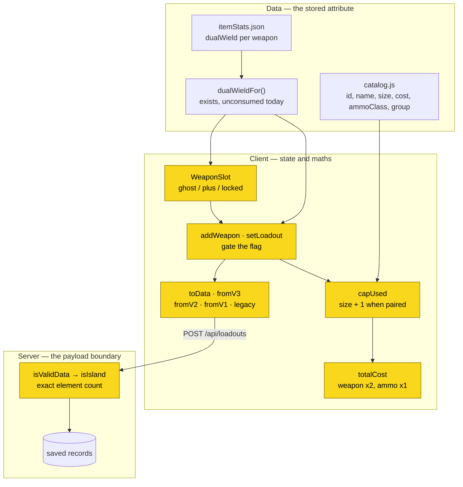
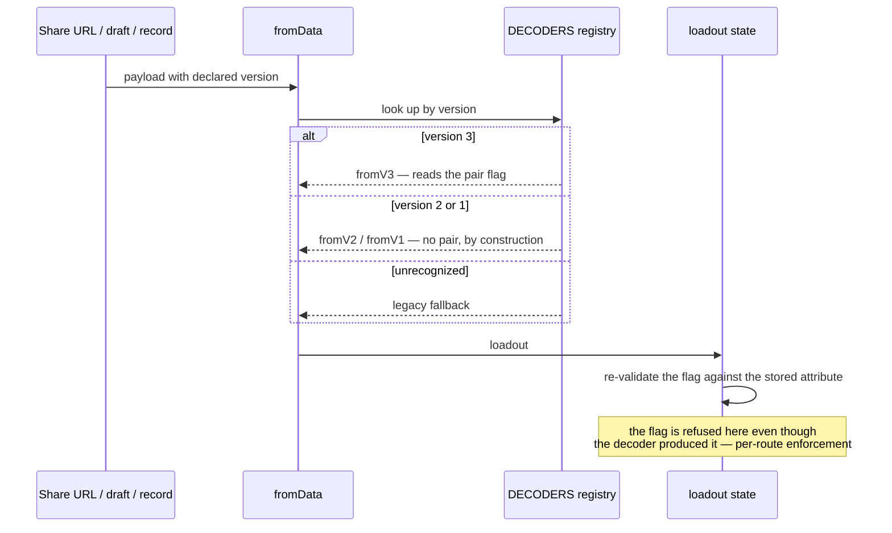

# Design: Weapon Slots and Dual-Wielded Pairs

## Context

SPEC-0009 does two jobs at once, and the seam between them is the most important thing to understand
before reading the requirements.

The first job is remedial. The weapon budget — five points, six with Quartermaster, summed across two
entries — is one of the oldest rules in the app and has never been specified. It was inherited from
the prototype and has been quietly correct ever since, which is exactly why nobody wrote it down. The
cost of that shows up the moment something tries to modify it: there is no requirement to amend, no
scenario to extend, and no place for `/sdd:check` to notice drift.

The second job is the feature. [ADR-0023](../../../adrs/ADR-0023-dual-wielded-pistol-pairs.md)
decided how a dual-wielded pistol pair is modelled. Users have wanted this for a while — there is a
saved list in the production database named "The Turncoat - Dual Dolches", built with the only
workaround available, which is putting the same pistol in both entries and losing the ability to
carry a rifle.

The two jobs are inseparable in practice. "A pair costs its weapon's size plus one" is not a
statement that can exist on its own; it modifies a rule, and that rule had to be written first.

**Prior art this design deliberately imitates.** ADR-0012's fifteen-trait cap established the pattern
of a bound enforced at *every* write path rather than at the interactive one, with clamping at decode
— and the reason it is a pattern rather than a preference is that the first attempt bounded only the
picker, and the generator walked straight past it. Part A's enforcement requirement and Part B's
flag-refusal requirement are both written in that shape, and for that reason.

**Related work that is not this.** ADR-0014 replaces the ammo model with stable ids and two slots per
weapon. It is accepted, unimplemented, unspecced, and owes its own format bump. It is not a dependency
of this capability, and the sequencing question it raises is answered in the Decisions below rather
than left implicit.

## Goals / Non-Goals

### Goals

- State the weapon slot model normatively, so the rule dual-wielding modifies exists in spec form.
- Make "a pair plus a second weapon" representable — the loadout the workaround cannot express.
- Keep the two-entry weapon array intact, so no existing consumer needs revisiting.
- Keep dual-wieldability correctable by editing data, because the underlying game rule is not ours.
- Make an impermissible pair unrepresentable by every route, not merely refused by the UI.

### Non-Goals

- **Implementing ADR-0014's ammo model.** Version 4 is that work, and this capability neither blocks
  nor performs it.
- **Modelling `hands` as a weapon attribute.** It may prove to be the better discriminator; the spec
  is written so that adopting it later is a data change rather than a requirement change.
- **Rescraping the catalog.** The stored attribute already exists. Its quality is an open question,
  not a deliverable here.
- **Variant subpages, weapon sizes, or ammo pricing corrections.** Adjacent and separately tracked.
- **A general "quantity" field on weapon entries.** A pair is two of one weapon, but generalising to
  N of anything invents a capability the game does not have.

## Decisions

### Codify Part A rather than specify only the new behaviour

**Choice**: Write the existing weapon budget as normative requirements in the same spec that adds
pairs, visibly marked as codification.

**Rationale**: A requirement that says "a pair costs size plus one" is meaningless without a
requirement that says what a size costs. Splitting them across two documents — or worse, leaving the
base rule unwritten — would leave the new rule dangling off an implicit premise. Marking Part A as
codification keeps a reader from mistaking shipped behaviour for a work item, which is the only real
risk of combining them.

**Alternatives considered**:
- *Specify only pairs, cite the code for the base rule*: rejected. A spec that cites an implementation
  as its normative source has the dependency backwards.
- *A separate spec for the weapon budget first*: rejected as ceremony. The two would be written in the
  same sitting by the same person from the same evidence, and the split would make the pair rule
  harder to read, not easier.

### A flag on one weapon entry, not a third entry or a synthetic catalog row

**Choice**: A pair is one weapon entry carrying a flag.

**Rationale**: The two-entry invariant is assumed by the reducer, the picker, the client shape
validator, and the server payload validator. A flag leaves all four untouched. It also keeps the pair
a single thing — one entry, one ammo selection, one price line — which is what makes the ammo and
cost rules state cleanly.

**Alternatives considered**: fully argued in ADR-0023. Briefly: a third weapon entry makes "two
pistols and a rifle" structurally representable and so requires a new invariant to forbid what the old
shape forbade for free; a synthetic `dolch-96-dual` catalog row duplicates every future per-weapon
attribute across two rows that will drift, and makes the ghosted-twin affordance impossible to express
because switching to a pair becomes switching weapons.

### Spend a second format version rather than share ADR-0014's

**Choice**: Bump to version 3 now for the pair flag. ADR-0014's ammo model takes version 4 later.

**Rationale**: ADR-0014 already owes a bump and states so. Sharing it would be one migration instead
of two — but it would sequence dual-wielding behind ADR-0014's entire scope: a compatibility scrape,
stable ammo ids, retiring the ammo class as a rules input, and repricing scarce rounds. The cost of
not sharing is bounded and known: one more widening of the server validator, one more migration over
the same records, in a decoder registry built to hold several versions.

Worth recording that the repo has been here before and chose the other way. Issue #179 argued that
dual-wielding and the equipment grid should share one version-2 bump; version 2 was then spent on the
grid alone, and dual-wielding waited anyway. The precedent for sharing is weaker than it reads.

**Alternatives considered**:
- *Append the flag as a third element under version 2*: rejected. An older client would read the pair
  as a single weapon and undercount the budget silently. A declared version fails visibly instead, and
  quietly-wrong arithmetic is the worse failure — it is the class of defect this project has had to fix
  more than once.
- *Make the weapon entry an object so future fields cost no version*: a real option, and the honest
  answer is that the positional tuple is on a path toward wanting it. Rejected here because the wire
  format is deliberately compact and the change would touch every decoder at once, for a benefit that
  is speculative until a fourth weapon attribute appears.

### The affordance belongs to the slot, not the picker

**Choice**: The pair control renders on the equipped weapon's own slot as a ghosted second pistol,
in available / locked / paired states.

**Rationale**: The picker's job is choosing *which* weapon. Pairing is a property of a weapon already
chosen, and it depends on the remaining budget — state the picker does not naturally show. Putting the
control on the slot also makes the design self-evidently correct on the point that matters most: the
second weapon entry is visibly untouched, so "pair plus rifle" is legal by construction rather than by
arithmetic nobody can see.

This supersedes the picker-toggle sketch in issue #179, which predates the decision.

**Alternatives considered**:
- *A toggle in the picker row*: rejected. It would have to disable itself based on budget the picker
  does not display, and it separates the control from the thing it modifies.
- *An implicit rule — equipping the same pistol twice becomes a pair*: rejected. It overloads a
  deliberate action with a second meaning and gives the user no way to express the workaround they may
  still want.

### Refuse the flag per route rather than at one chokepoint

**Choice**: Every write path validates the flag against the stored attribute independently.

**Rationale**: This is ADR-0012's lesson applied. The paths are genuinely independent — the reducer's
interactive add, a bulk set from a decoded payload, and the generator do not funnel through one
another — so a single guard is a guard on one of them. The failure mode is not theoretical: a
hand-edited share URL is trivially constructed, and the consequence is a loadout charging a slot point
for a pair the UI will not render.

## Architecture

Three layers, and the pair flag crosses all of them. What changes is narrow; what it touches is not.

Highlighted nodes change. The data layer does not: the attribute and its reader already exist, which
is why this capability is the first consumer of a seam that has had none (#256).

The decode path is where the version work concentrates:

The final step is the one worth noticing. The decoder is not trusted to have validated the flag,
because the decoder's job is to read the format, not to know the catalog. Validation happens where the
loadout enters state, and it happens again for every other route that writes one.

## Risks / Trade-offs

- **The size-2 pair cost is unverified.** The rule yields 3 points for an Uppercut or Dolch pair and
  no source confirms it. → Written as an open question rather than as a confirmed figure; a correction
  is a one-line change to a rule stated in exactly one place, not a hunt through call sites.
- **The stored attribute cannot distinguish "not permitted" from "never read".** Enforcement is
  therefore conservative against rows the scrape may never have resolved. → Recorded as an open
  question. Conservative is the right direction to fail: a missing affordance is visible and
  reportable, where a wrongly-permitted pair would quietly mis-cost a build.
- **Two migrations over the same records.** Version 3 now, version 4 with ADR-0014. → Accepted
  deliberately, and the reasoning is recorded above so a later reader does not mistake it for an
  oversight.
- **A stale client mangles a version-3 record.** → Chosen over the alternative of silently
  undercounting the budget. Visible breakage is recoverable by reloading; wrong arithmetic is not
  noticed at all.
- **A new interaction pattern with no precedent in the app.** The ghosted twin is unlike any existing
  control. → The accessibility requirements are written as requirements rather than left to
  implementation, and the three states are named so they cannot be collapsed into two.
- **Part A could be misread as new work.** → Marked as codification in the spec's overview, in the
  part heading, and in the implementation mapping, which shows the functions that already satisfy it.

## Migration Plan

Not greenfield: records exist at versions 2, 1, and unversioned legacy.

1. **Server first.** Widen the weapon-entry element count to the version-3 shape, keeping it an
   equality check. This must land before any client can emit a version-3 payload, or every save
   fails. That is a constraint on MERGE ORDER, not a separate deployment step: client and server
   are packaged as one artifact, so a version-3 client and the validator that accepts it always
   ship from the same commit and cannot skew apart.
2. **Decoder next.** Add the version-3 decoder beside the existing registry entries. Existing decoders
   are untouched; a pre-version-3 record cannot express a pair, so it decodes with none.
3. **Encoder and maths together.** Raise the format version, teach capacity and cost about the flag,
   and gate the flag on the stored attribute at every write path. These land as one change because a
   flag that encodes but does not cost is a wrong loadout, and a flag that costs but does not encode
   is a loadout that changes when you reload it.
4. **Affordance last.** No user can create a pair until the slot control ships, which makes every step
   before it safely inert.

**Rollback.** Steps 2–4 revert cleanly: without an encoder, no version-3 record is written. Step 1
should not be reverted while version-3 records exist, or those records stop validating on their next
save. If a rollback past step 1 is needed, version-3 records must be migrated down first — which is
possible without loss, since dropping the flag yields a valid version-2 record of the single weapon.

**The ordering is load-bearing and the reason is recent.** SPEC-0003's derived-name work had a
sequencing constraint of exactly this shape, stated as a MUST, and it held. Shipping the client half
of a format change before the server accepts it produces failing saves for every user at once.

## Open Questions

- Are the seven scope-variant pistols two-handed? If so, `hands` derives dual-wieldability and the
  stored boolean becomes derived data. If not, the boolean is load-bearing and `hands` is at best
  explanatory. The spec holds either way, which is why this does not block.
- What does a size-2 pair actually cost? Needs in-game verification.
- Should the unresolved state of the stored attribute be recovered by a re-scrape, or by hand-curating
  the small number of rows that matter?
- When ADR-0014 lands, does the weapon entry stay a positional tuple? A fourth attribute would be the
  point at which an object shape stops being speculative.
