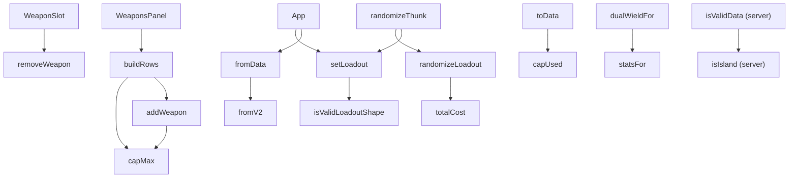

# SPEC-0009: Weapon Slots and Dual-Wielded Pairs

## Overview

This capability owns the **weapon** side of a loadout: how many weapons a hunter carries, what budget
they spend, and how a dual-wielded pistol pair is represented, costed, encoded, and offered. It
realizes [ADR-0023](../../../adrs/ADR-0023-dual-wielded-pistol-pairs.md).

It exists for two reasons, and they should not be confused with each other.

**The weapon budget was never specified.** `capMax` and `capUsed` (`client/src/utils/calc.js:21-27`)
have governed every build since the prototype, and no requirement anywhere states what they do.
SPEC-0006 REQ "Capacity Rules Are Stated Once and Preserved" reads as though it might, but it is
exclusively about the eight-cell **equipment** grid — the free-unblocked-cell predicate, one Tool per
loadout, four consumables per cap category. The weapon budget appears in the corpus only in passing:
a parenthetical in SPEC-0007 about the size column's range, and a design note in SPEC-0003. Part A
below closes that gap.

**Dual-wielded pairs cannot be expressed at all.** The only way to represent one today is to put the
same pistol in both entries, which prices it correctly and models it wrongly: it consumes the second
entry, so the player cannot also carry a rifle — which is the loadout the pair exists to enable.
Part B specifies pairs, and it is only writable because Part A states the rule it modifies.

**Read Part A as a description of shipped behaviour, not a work item.** Every requirement in it is
already implemented and already tested; it is written down so that Part B has something normative to
extend and so `/sdd:check` can see the rule. Part B is the new work.

## Requirements

### Part A — The Weapon Slot Model

*Codification of existing, shipped behaviour. No implementation work follows from Part A alone.*

### Requirement: A Loadout Holds Exactly Two Weapon Entries

A loadout's weapons SHALL be an array of exactly two entries. Each entry SHALL be either `null`,
meaning an empty slot, or an object carrying a catalog reference and an ammo selection. The array
length SHALL NOT vary with the loadout's contents, and an empty slot SHALL be represented by `null`
rather than by a shorter array.

Every writer and every validator SHALL enforce the length of exactly two. A payload whose weapons
array is any other length SHALL be rejected rather than padded, truncated, or merged.

#### Scenario: An empty loadout still has two entries

- **WHEN** a fresh loadout is created with no weapons chosen
- **THEN** its weapons array SHALL have length 2 and both entries SHALL be `null`

#### Scenario: A payload with one weapon entry is refused

- **WHEN** a bulk-set payload carries a weapons array of length 1
- **THEN** the write SHALL be rejected, and the loadout in the store SHALL be left unchanged

### Requirement: The Weapon Budget Is Five Points, Six With Quartermaster

A loadout's weapon capacity SHALL be 5 points. When the loadout carries the Quartermaster trait, the
capacity SHALL be 6. The capacity SHALL depend on nothing else — not on the equipment grid, not on
the upgrade-point budget, and not on any user-set toggle.

Unlike the upgrade-point ceiling, this bound SHALL be unconditional: it is a fact about the game
rather than an opt-in planning aid, so it MUST NOT be gated behind a user preference.

#### Scenario: Quartermaster raises the ceiling

- **WHEN** a loadout carrying weapons totalling 5 points gains the Quartermaster trait
- **THEN** its capacity SHALL become 6 and a further 1-point weapon SHALL be accepted

#### Scenario: Losing Quartermaster does not silently discard a weapon

- **WHEN** a loadout at 6 points of weapons loses the Quartermaster trait
- **THEN** the loadout SHALL remain over capacity and be reported as such, and no weapon SHALL be
  removed automatically

### Requirement: Occupied Capacity Is the Sum of Entry Sizes

Occupied weapon capacity SHALL be the sum, across both entries, of the size each entry occupies. A
`null` entry SHALL contribute zero. Size SHALL be read from the catalog rather than inferred from the
weapon's group, price, or ammo class.

Capacity SHALL be expressed as one definition that every caller consults — the reducer, the picker's
enabled state, and the generator SHALL NOT each re-derive it, so what the picker offers is always
what the reducer accepts.

#### Scenario: A single weapon occupies its own size

- **WHEN** a loadout holds one size-3 weapon and one empty slot
- **THEN** occupied capacity SHALL be 3

#### Scenario: The picker and the reducer agree

- **WHEN** the remaining capacity is 1 and the picker is asked whether a size-2 weapon is selectable
- **THEN** the picker SHALL report it as unavailable, and a direct write of that weapon SHALL also be
  refused

### Requirement: The Weapon Budget Is Enforced at Every Write Path

A weapon whose size would take occupied capacity above the loadout's capacity SHALL be refused. The
bound SHALL hold at **every** path that writes a weapon — the interactive add, a bulk set from a
decoded share URL or a loaded record, and the randomizer — and not only at the interactive one.

A refusal SHALL leave the loadout unchanged. The system MUST NOT partially apply a write, and MUST
NOT substitute a smaller weapon.

#### Scenario: The interactive add refuses an oversized weapon

- **WHEN** a loadout with 1 point remaining receives an add of a size-5 weapon
- **THEN** the add SHALL be refused and both weapon entries SHALL be unchanged

#### Scenario: The generator draws within the bound

- **WHEN** a random loadout is generated
- **THEN** its weapons SHALL total no more than the capacity its own traits grant

## Part B — Dual-Wielded Pairs

*New behaviour, per ADR-0023.*

### Requirement: Dual-Wieldability Is a Stored Attribute, Never Derived

Whether a weapon can be dual wielded SHALL be read from a stored per-weapon attribute. The system
MUST NOT derive it from the weapon's size, price, group, ammo class, or name.

This is an instance of the rule SPEC-0007 REQ "Budget-Affecting Attributes Are Stored, Never
Inferred" already states, and it applies here because a pair changes slot cost. Deriving from size is
additionally refuted by the data: Haymaker and Caldwell Conversion Uppercut are both size 2 and only
the Uppercut may be paired.

The attribute SHALL be correctable by editing data alone. A rule change from the game's publisher —
a trait that makes a two-handed pistol pairable, or a weapon losing the property — MUST NOT require a
code change.

#### Scenario: Two same-size weapons differ in pairability

- **WHEN** the dual-wield attribute is read for the Haymaker and for the Uppercut, which share a size
- **THEN** the two SHALL be permitted to differ, and the value SHALL come from the stored attribute
  rather than from the shared size

#### Scenario: A data correction changes behaviour with no code change

- **WHEN** a weapon's stored dual-wield attribute changes from not-permitted to permitted
- **THEN** the pair affordance SHALL become available for that weapon with no change to application
  code

### Requirement: A Pair Costs Its Weapon's Size Plus One

A dual-wielded pair SHALL occupy the weapon's own size plus one point. A pair of a size-1 pistol
SHALL therefore occupy 2 points, leaving 3 of the default 5 — enough for a second weapon, which is
the outcome this capability exists to make representable.

*The size-1 figure is confirmed against the game's published slot guidance. The size-2 figure that
this rule yields — 3 points for an Uppercut or Dolch 96 pair — is **not yet verified in game** and is
recorded as an open question below. The rule is normative; that one derived value is provisional.*

#### Scenario: A pair leaves room for a rifle

- **WHEN** a loadout takes a pair of a size-1 pistol in the first entry
- **THEN** occupied capacity SHALL be 2, and a size-3 weapon SHALL be accepted into the second entry

#### Scenario: A pair is refused when only its single cost fits

- **WHEN** a loadout has exactly 1 point remaining and the held weapon is a size-1 dual-wieldable
  pistol
- **THEN** the pair SHALL be refused, and the weapon SHALL remain equipped as a single

### Requirement: A Pair Carries One Weapon's Ammo and Doubles Only the Weapon Price

A pair SHALL carry exactly the ammo a single instance of that weapon carries. Both pistols fire the
same round; the system MUST NOT offer a separate ammo selection per pistol, and MUST NOT add or
double any ammo field. A pair SHALL retain every ammo slot the single weapon has — a pair of a
weapon able to load two rounds SHALL still load two.

The weapon's price SHALL count twice for a pair, because two weapons are bought. The ammo price
SHALL NOT double, because ammo is charged per slot and the pair's slot count is a single weapon's.

#### Scenario: Pairing a weapon leaves its ammo untouched

- **WHEN** a weapon with a chosen ammo selection is marked as a pair
- **THEN** the ammo selection SHALL be unchanged, and no additional ammo field SHALL appear

#### Scenario: A pair of a two-round weapon keeps both rounds

- **WHEN** a weapon able to load two ammo types is marked as a pair
- **THEN** both ammo slots SHALL remain available and independently selectable

#### Scenario: Only the weapon line doubles

- **WHEN** a weapon carrying priced ammo is marked as a pair
- **THEN** the weapon's contribution to total cost SHALL double and the ammo's contribution SHALL be
  unchanged

### Requirement: The Pair Flag Is Refused Wherever the Data Does Not Permit It

The pair flag SHALL NOT be settable on a weapon whose stored attribute does not permit dual wielding.
The refusal SHALL be enforced at **every** route that can write it — the slot affordance, a bulk set,
a decoded share URL, a loaded saved record, and the generator — and not at one chokepoint that the
others are assumed to pass through.

A payload carrying the flag on an impermissible weapon SHALL have the flag dropped or the payload
rejected; the system MUST NOT accept it and MUST NOT silently charge the extra slot point for a pair
it will not render.

#### Scenario: A hand-edited share URL cannot smuggle a pair

- **WHEN** a decoded share URL carries the pair flag on a weapon the data does not permit
- **THEN** the flag SHALL NOT reach loadout state, and occupied capacity SHALL reflect the single
  weapon only

#### Scenario: The generator never produces an impermissible pair

- **WHEN** a random loadout is generated
- **THEN** no weapon carrying the pair flag SHALL be one the stored attribute disallows

### Requirement: A Pair Never Consumes the Second Weapon Entry

A pair SHALL occupy one weapon entry. The second entry SHALL remain available for a different weapon
whenever the budget allows it. The system MUST NOT represent a pair as the same weapon written into
both entries.

#### Scenario: Pair plus rifle is a legal loadout

- **WHEN** a loadout holds a pair of a size-1 pistol and a size-3 rifle
- **THEN** the loadout SHALL be valid, SHALL total 5 points, and SHALL save and reload unchanged

#### Scenario: Marking a pair does not disturb the other entry

- **WHEN** a loadout holding a pistol and a rifle marks the pistol as a pair
- **THEN** the rifle SHALL remain in its entry, unchanged

### Requirement: Wire Format Version 3 Encodes the Pair Flag

The wire format version SHALL be incremented to 3, and a version-3 weapon entry SHALL carry the pair
flag alongside its existing catalog reference and ammo selection. The flag SHALL be written only
where it is set; a single weapon SHALL encode as it does today plus an unset flag.

The pair flag SHALL NOT be inferred at decode time from anything else in the payload.

#### Scenario: A pair survives a save and reload

- **WHEN** a loadout containing a pair is encoded and decoded
- **THEN** the decoded loadout SHALL carry the pair, and its occupied capacity SHALL be unchanged

#### Scenario: A share URL carries the pair

- **WHEN** a loadout containing a pair is encoded into a share URL and that URL is decoded
- **THEN** the decoded loadout SHALL carry the pair

### Requirement: Version 2 and Version 1 Records Continue to Decode

Records written at versions 2 and 1, and unversioned legacy records, SHALL continue to decode. A
record predating version 3 SHALL decode with no weapon marked as a pair, because it could not have
expressed one.

Decoding SHALL be selected by the record's declared version rather than by inspecting its shape. An
unrecognized version SHALL be handled by the documented fallback rather than by guessing.

#### Scenario: A version 2 record decodes with no pairs

- **WHEN** a version-2 record holding two weapons is decoded
- **THEN** both weapons SHALL decode, neither SHALL be marked as a pair, and occupied capacity SHALL
  match what version 2 computed

#### Scenario: Migration is lossless in the fields version 2 defined

- **WHEN** a version-2 record is decoded and re-encoded at version 3
- **THEN** every field version 2 defined SHALL survive unchanged

## Security Requirements

This capability changes what the saved-loadout write endpoint accepts, so the payload-boundary rules
below are normative. The endpoint's other protections are owned by SPEC-0003 and are unchanged by
this spec; they are named here so that the coverage is explicit rather than assumed.

### Requirement: The Weapon Entry Is Validated at an Exact Element Count

Server-side validation of a weapon entry SHALL accept exactly the element count the wire format
defines and no other. The check SHALL remain an equality test and MUST NOT be relaxed to a minimum.

This is load-bearing rather than stylistic. The equality check exists because a floor with no ceiling
once accepted a weapon slot carrying unbounded trailing content, which was then stored — the same
unbounded-growth hole as an unknown key, wearing the shape of a field the format does define. Adding
the pair flag widens the accepted count by exactly one; it MUST NOT convert the bound into a floor.

A payload whose weapon entry carries more or fewer elements than the format defines SHALL be rejected
with a client error naming the offending field, and SHALL NOT be persisted in whole or in part.

#### Scenario: A weapon entry with trailing content is rejected

- **WHEN** a write carries a weapon entry with more elements than the format defines
- **THEN** the write SHALL be rejected and nothing SHALL be persisted

#### Scenario: A pre-version-3 payload is still accepted

- **WHEN** a write carries a weapon entry at the element count an earlier version defined, with that
  version declared
- **THEN** the write SHALL be accepted and validated against that version's rules

### Requirement: Existing Endpoint Protections Continue to Apply

The saved-loadout endpoints' authentication, per-owner and per-IP rate limiting, request body size
cap, allowlist of storable keys, per-owner record ceiling, and forwarded-origin trust boundary SHALL
continue to apply unchanged to writes carrying version-3 payloads. This spec adds no endpoint, no
authentication path, and no redirect, and it MUST NOT be read as relaxing any of them.

| Method | Path | Auth | Description |
|--------|------|------|-------------|
| POST | `/api/loadouts` | Required | Create or update a saved loadout; validates the version-3 payload |
| GET | `/api/loadouts` | Required | List the owner's saved loadouts |

#### Scenario: A version-3 write is rate limited like any other

- **WHEN** an owner exceeds the write budget using version-3 payloads
- **THEN** the request SHALL be limited exactly as an earlier-version write would be

#### Scenario: The pair flag is not a storable unknown key

- **WHEN** a version-3 payload is persisted
- **THEN** only keys the wire format defines SHALL be stored, and no client-only state SHALL be
  written to the record

## Accessibility Requirements

The pair affordance is an interactive control, so the WCAG 2.1 AA baseline SPEC-0001 establishes
applies to it in full. The requirements below are the parts specific to this control.

### Requirement: The Pair Affordance Lives on the Weapon Slot

A weapon that may be dual wielded SHALL present its pair affordance on that weapon's own slot, not in
the item picker. The affordance SHALL render a representation of the second pistol in one of three
states:

- **Available** — the budget has room for the extra point, and activating the affordance SHALL mark
  the pair.
- **Locked** — the budget has no room, and activating the affordance SHALL do nothing.
- **Paired** — the pair is marked, and activating the affordance SHALL return the weapon to a single.

The affordance SHALL NOT be rendered for a weapon the stored attribute does not permit.

#### Scenario: The affordance appears on equipping a pairable weapon

- **WHEN** a dual-wieldable pistol is equipped into a weapon slot with budget to spare
- **THEN** the slot SHALL present the pair affordance in its available state

#### Scenario: The affordance locks when the budget is full

- **WHEN** the remaining budget falls below the extra point while a pairable weapon is equipped
- **THEN** the affordance SHALL move to its locked state and SHALL NOT mark a pair if activated

#### Scenario: No affordance for a weapon that cannot pair

- **WHEN** a weapon the data does not mark dual-wieldable is equipped
- **THEN** no pair affordance SHALL be rendered in that slot

### Requirement: The Pair Affordance Is Operable and Named in Every State

The affordance SHALL be a real button, reachable in the tab order, and operable by Enter and Space.
It MUST NOT be a click-handled non-interactive element.

It SHALL carry an accessible name that distinguishes its three states, so that a screen reader user
can tell an available affordance from a locked one without seeing it. A locked affordance SHALL
communicate its disabled state programmatically and SHALL remain discoverable rather than being
removed from the accessibility tree.

Marking or unmarking a pair changes the capacity readout, which SHALL be announced through a live
region rather than only rendered.

#### Scenario: Keyboard operation marks the pair

- **WHEN** a user tabs to an available pair affordance and presses Enter
- **THEN** the pair SHALL be marked, exactly as a pointer activation would

#### Scenario: The locked state is conveyed non-visually

- **WHEN** a screen reader reaches a locked pair affordance
- **THEN** its name SHALL convey that pairing is unavailable, and its disabled state SHALL be exposed
  programmatically

#### Scenario: The capacity change is announced

- **WHEN** a pair is marked and occupied capacity rises by one point
- **THEN** the change SHALL be announced through a live region

## Implementation

> Call graphs generated from the current codebase, before any Part B work. Re-run
> `/sdd:spec --update SPEC-0009` after implementation to refresh.

### Requirement-to-Function Mapping

Part A requirements map onto code that already exists — that is what makes them codification:

**REQ "A Loadout Holds Exactly Two Weapon Entries"**: functions `setLoadout()` → `isValidLoadoutShape()`; server-side `isValidData()` → `isIsland()` → `isRef()`

**REQ "The Weapon Budget Is Five Points, Six With Quartermaster"**: function `capMax()`

**REQ "Occupied Capacity Is the Sum of Entry Sizes"**: function `capUsed()`

**REQ "The Weapon Budget Is Enforced at Every Write Path"**: functions `buildRows()` → `capMax()`; `addWeapon()` → `capMax()`; `randomizeThunk()` → `randomizeLoadout()` → `totalCost()`

Part B requirements have no implementation yet; the functions listed are the ones the work will
change:

**REQ "Dual-Wieldability Is a Stored Attribute, Never Derived"**: `dualWieldFor()` → `statsFor()` — exists and is currently unconsumed (#256)

**REQ "A Pair Costs Its Weapon's Size Plus One"**: `capUsed()`

**REQ "A Pair Carries One Weapon's Ammo and Doubles Only the Weapon Price"**: `totalCost()`

**REQ "Wire Format Version 3 Encodes the Pair Flag"**: `toData()`, and a new `fromV3()` beside `fromV2()`

**REQ "Version 2 and Version 1 Records Continue to Decode"**: `fromData()` → `fromV2()` / `fromV1()` / `fromLegacy()` → `promoteToWeaponSlots()`

**REQ "The Weapon Entry Is Validated at an Exact Element Count"**: `isValidData()` → `isIsland()`

**REQ "The Pair Affordance Lives on the Weapon Slot"**: `WeaponSlot()`, `buildRows()`

### Call Graph

<!-- Call graph: capMax|capUsed|addWeapon|removeWeapon|setLoadout|isValidLoadoutShape|toData|fromData|fromV2|dualWieldFor|totalCost|isValidData|isIsland|randomizeLoadout|WeaponSlot|WeaponsPanel, generated 2026-08-13. Filtered, 20-node cap. -->

Two honest caveats about this graph. `capUsed` has no inbound edge that the filter caught — it is
consumed through selectors and React components, and the generator reports no entry rules for
function components, so the readouts that call it are invisible here. And `toData --> capUsed` is
drawn to show the encode path's dependency on capacity rather than a resolved static call. The graph
is a map of the affected surface, not a proof of reachability.

## Cross-Spec Changes This Capability Requires

Three changes fall outside this spec's own files and are listed here rather than made silently:

1. **SPEC-0003 REQ "A Write Stores Only What the Wire Format Defines"** — its scenario reading "a
   weapon slot or an equipment entry with more elements than the format defines" is written against
   the two-element weapon entry. It MUST be amended to the version-3 count so the two specs do not
   contradict each other about what the server accepts.
2. **SPEC-0006 REQ "Wire Format Version 2 Encodes Cell Position"**, REQ "Version 1 Records Migrate
   Losslessly", and REQ "Saved-Loadout Payloads Are Validated at Both Versions" — "both versions"
   becomes three. SPEC-0006 owns the version model; this spec extends it and does not replace it.
3. **SPEC-0007** — the catalog dataset requirements SHOULD name dual-wieldability as a
   budget-affecting stored attribute, so REQ "Budget-Affecting Attributes Are Stored, Never Inferred"
   visibly covers it rather than covering it only by inference.

## Open Questions

1. **Are the scope-variant pistols two-handed?** Eight catalog Pistols are marked as not
   dual-wieldable: the Haymaker plus seven scope or marksman variants. If those seven are two-handed,
   a `hands` attribute would derive dual-wieldability cleanly and the stored boolean could become
   derived data. If they are one-handed and merely scoped, the stored attribute is load-bearing and
   `hands` is explanatory only. This spec is written to hold either way.
2. **What does a size-2 pair actually cost?** The size-plus-one rule yields 3 points for an Uppercut
   or Dolch 96 pair. That value is not attested in any source found and needs in-game confirmation
   before the figure is trusted.
3. **The stored attribute's unresolved state has collapsed.** The dataset distinguishes permitted
   from not-permitted but no longer distinguishes not-permitted from not-read, though the reader
   documents three values and warns that the negative is an inference from absence. Resolving this
   means either a re-scrape that preserves the unread state or hand-curating the small number of rows
   that matter. Until then, REQ "The Pair Flag Is Refused Wherever the Data Does Not Permit It" is
   enforced against data that may be conservatively wrong for a weapon whose page was never read.
